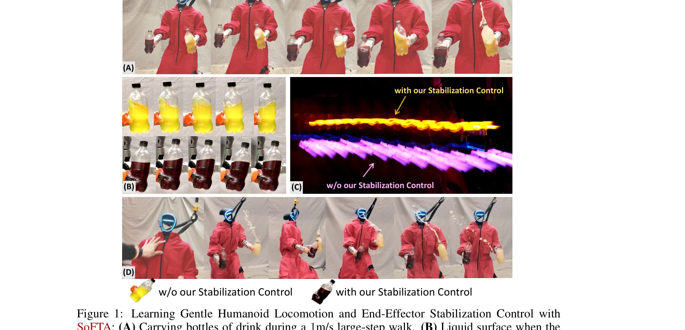
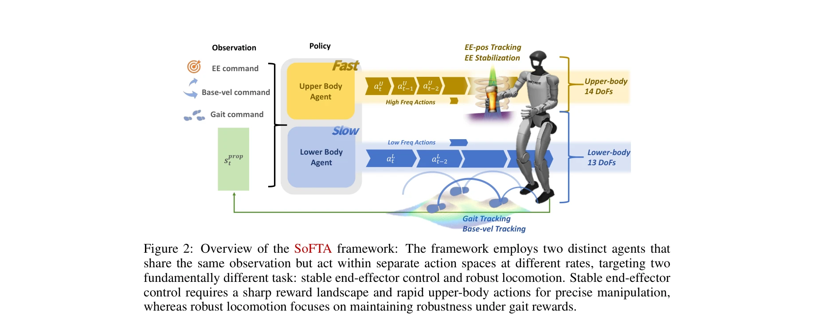

# Hold My Beer: Learning Gentle Humanoid Locomotion and End-Effector Stabilization Control

> **저자**: Yitang Li, Yuanhang Zhang, Wenli Xiao, Chaoyi Pan, Haoyang Weng, Guanqi He, Tairan He, Guanya Shi | **날짜**: 2025-05-30 | **URL**: [https://arxiv.org/abs/2505.24198](https://arxiv.org/abs/2505.24198)

---

## Essence

*Figure 1: Learning Gentle Humanoid Locomotion and End-Effector Stabilization Control with*

휴머노이드 로봇이 음료를 들고 걸을 때 흘리지 않도록 상체와 하체를 분리된 에이전트로 제어하는 SoFTA 프레임워크를 제안하여, 느린 보행 제어와 빠른 end-effector 안정화를 동시에 달성한다.

## Motivation

- **Known**: 휴머노이드 로봇의 보행 제어와 조작 능력은 크게 발전했으나, 보행 중 물체를 안정적으로 들고 있는 fine-grained end-effector 제어는 여전히 미해결 과제이다. 기존 방법들은 상체와 하체를 단일 정책으로 제어하려 시도했으나 서로 다른 task 특성 때문에 어려움을 겪고 있다.
- **Gap**: 보행(느린 timescale, 이산 접촉 동역학, robustness 중심)과 end-effector 안정화(빠른 timescale, 연속 제어, 고정밀도 중심) 사이의 근본적인 task 특성 불일치로 인해, 단일 에이전트 정책은 두 목표를 동시에 만족하기 어렵다.
- **Why**: 휴머노이드 로봇이 음료 전달, 영상 촬영 등 실제 환경에서 정밀한 조작 작업을 수행하려면 보행과 end-effector 안정화를 모두 해결해야 하며, 이는 로봇의 실용성과 안전성을 크게 향상시킨다.
- **Approach**: 상체(14 DoF)와 하체(13 DoF)를 서로 다른 주파수와 reward structure를 가진 두 개의 독립적인 에이전트로 제어하는 Slow-Fast Two-Agent (SoFTA) 프레임워크를 제안한다. 상체는 100 Hz에서 정밀한 EE 제어를, 하체는 50 Hz에서 robust gait을 담당한다.

## Achievement

*Figure 1: Learning Gentle Humanoid Locomotion and End-Effector Stabilization Control with*

- **End-effector 가속도 감소**: 기존 방법 대비 2-5배 end-effector 가속도 감소를 달성하여 거의 인간 수준의 안정성 달성
- **실세계 배포 성공**: Unitree G1과 Booster T1 휴머노이드에서 음료 운반, 안정적인 1인칭 영상 촬영, disturbance 거부 등 실제 작업 수행
- **Emergent 보정 행동**: 상체가 자동으로 보행 진동을 보상하는 행동을 학습하여 조정적 whole-body 동작 달성
- **광범위한 검증**: 시뮬레이션과 실세계 실험을 통해 다양한 보행 조건에서 EE 안정화 효과 입증

## How

*Figure 2: Overview of the SoFTA framework: The framework employs two distinct agents that*

- **Decoupled Action Space**: 상체 14 DoF와 하체 13 DoF를 독립적인 action space로 분리하여 policy interference 완화
- **Frequency Separation**: 상체는 100 Hz(정밀 제어), 하체는 50 Hz(robust 보행)의 서로 다른 제어 주파수 설정
- **Task-specific Reward Design**: 상체는 end-effector 가속도 페널티(racc, rang-acc, rzero-acc), 중력 보정(rgrav-xy) 등의 reward; 하체는 보행 tracking 중심의 reward 구성
- **Shared Observation**: 두 에이전트가 동일한 proprioceptive 및 goal 관찰값을 공유하여 whole-body 조정 가능
- **PPO Training**: PPO 알고리즘을 사용하여 각 에이전트를 독립적으로 학습하되 공유 observation을 통해 암묵적 조정
- **Domain Randomization & Sim-to-Real Transfer**: 시뮬레이션에서 다양한 환경 조건으로 학습 후 실세계 배포

## Originality

- **처음으로 빈도 분리 기반 접근**: 보행과 end-effector 제어의 서로 다른 task dynamics를 정확히 분석하고, 이를 해결하기 위해 상체와 하체에 다른 제어 주파수를 할당한 혁신적 설계
- **다중 에이전트 humanoid 제어의 새로운 해석**: 기존 multi-agent 분해 방법들과 달리, task characteristic의 근본적인 차이(objective level과 dynamics level)를 기반으로 프레임워크 설계
- **End-effector 특화 reward 함수**: 가속도 페널티, exponential decay 형태의 rzero-acc, 중력 틸트 페널티 등 end-effector 안정화에 특화된 reward 집합 개발
- **실세계 humanoid 배포**: 단순한 시뮬레이션 결과가 아닌 Unitree G1, Booster T1 등 실제 휴머노이드에서 음료 운반, 영상 촬영 등 실질적 작업 달성

## Limitation & Further Study

- **두 에이전트 간 명시적 조정 메커니즘 부재**: Shared observation을 통한 암묵적 조정만 존재하며, 명시적 상하체 coordination 메커니즘이 명확하지 않음
- **고정 주파수 비율의 한계**: 상체 100 Hz, 하체 50 Hz의 2:1 비율이 최적인지, 다른 task에서는 다른 주파수가 필요한지에 대한 분석 부족
- **확장성 문제**: 양팔 제어 또는 3개 이상의 end-effector가 있는 경우 프레임워크의 확장성이 불명확함
- **sim-to-real gap의 완전한 해결 미흡**: 높은 제어 주파수로 인한 sim-to-real 민감성을 부분적으로만 해결하며, 환경 변화에 대한 robustness 평가가 제한적
- **후속 연구 방향**: (1) 다중 목표 task(여러 end-effector 동시 제어)에 대한 확장, (2) 적응형 주파수 조정 메커니즘 개발, (3) 불확실성 기반 robust control 통합, (4) 더 복잡한 manipulation task(biped 로봇이 구체적 물체를 조작하는 경우) 탐구

## Evaluation

- Novelty: 4/5
- Technical Soundness: 3/5
- Significance: 4/5
- Clarity: 4/5
- Overall: 4/5

**총평**: 이 논문은 휴머노이드의 보행 중 end-effector 안정화라는 중요하면서도 미해결 문제를 frequency separation과 decoupled control로 우아하게 해결한 창의적 접근법을 제시하며, 실세계 배포로 실용성을 입증한 뛰어난 연구이다.

## Related Papers

- 🔄 다른 접근: [[papers/1694_SteadyTray_Learning_Object_Balancing_Tasks_in_Humanoid_Tray/review]] — 물체 안정화 제어를 Hold My Beer는 음료 운반에, SteadyTray는 트레이 균형에 각각 특화하여 접근한다.
- 🏛 기반 연구: [[papers/1986_HuB_Learning_Extreme_Humanoid_Balance/review]] — HuB의 극도 균형 제어 기술이 Hold My Beer의 음료를 흘리지 않는 정밀한 end-effector 안정화의 토대가 된다.
- 🔗 후속 연구: [[papers/1657_Robust_Humanoid_Walking_on_Compliant_and_Uneven_Terrain_with/review]] — compliant하고 불균등한 지형에서의 강건한 보행을 부드러운 물체 운반 상황으로 확장한 형태다.
- 🧪 응용 사례: [[papers/1684_SoftMimic_Learning_Compliant_Whole-body_Control_from_Example/review]] — 순응적 전신 제어 기술을 실제 음료 운반과 같은 섬세한 조작 작업에 적용하여 부드러운 이동과 종단점 제어를 달성했다.
- 🏛 기반 연구: [[papers/1694_SteadyTray_Learning_Object_Balancing_Tasks_in_Humanoid_Tray/review]] — Hold My Beer의 부드러운 운반 제어가 SteadyTray의 불안정한 물체 균형에 필요한 제어 기술을 제공한다
- 🧪 응용 사례: [[papers/1623_Preference-Conditioned_Multi-Objective_RL_for_Integrated_Com/review]] — Hold My Beer의 부드러운 locomotion과 end-effector 제어가 본 논문의 추적-순응 trade-off 프레임워크의 실제 적용 사례임
- 🧪 응용 사례: [[papers/1929_FLAM_Foundation_Model-Based_Body_Stabilization_for_Humanoid/review]] — FLAM의 신체 안정화 기법이 Hold My Beer의 gentle locomotion과 end-effector tracking에 직접 적용될 수 있습니다.
- 🏛 기반 연구: [[papers/2036_Kinematics-Aware_Multi-Policy_Reinforcement_Learning_for_For/review]] — 부드러운 힘 제어와 end-effector 정밀도가 고부하 산업 작업에서의 안전하고 정확한 조작을 위한 기본 원리를 제공한다.
- 🔗 후속 연구: [[papers/2085_Load-Aware_Locomotion_Control_for_Humanoid_Robots_in_Industr/review]] — Load-Aware Locomotion Control의 하중 인식 보행을 Hold My Beer의 부드러운 end-effector 제어와 결합하여 더 안정적인 물체 운반이 가능하다.
- 🔗 후속 연구: [[papers/2149_TOP_Time_Optimization_Policy_for_Stable_and_Accurate_Standin/review]] — Hold My Beer의 gentle locomotion and end-effector control이 TOP의 안정적인 standing manipulation을 이동하면서도 수행할 수 있도록 확장한 형태입니다.
