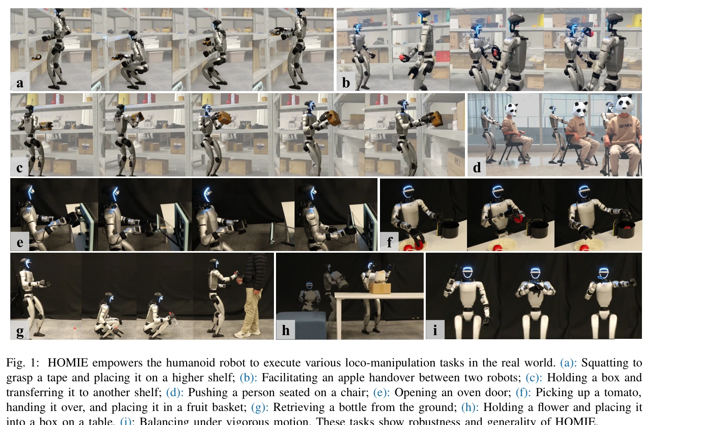
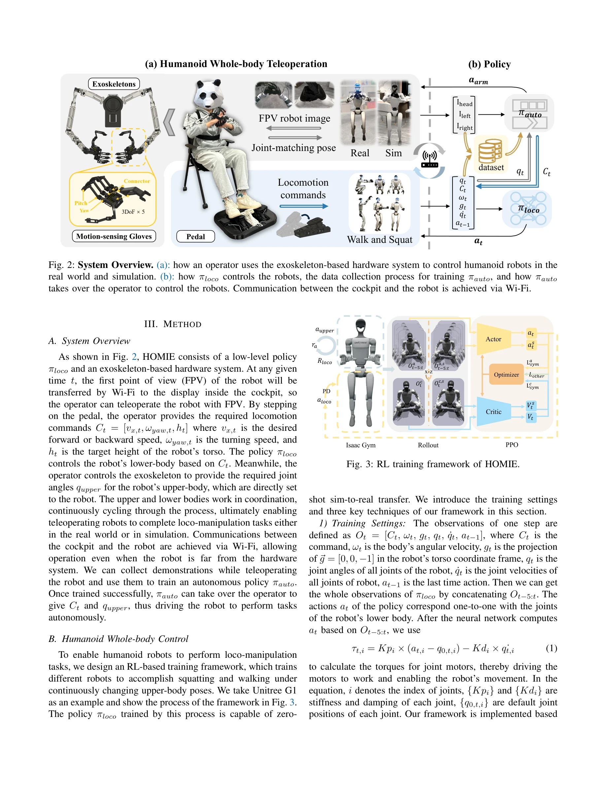

# HOMIE: Humanoid Loco-Manipulation with Isomorphic Exoskeleton Cockpit

> **저자**: Qingwei Ben, Feiyu Jia, Jia Zeng, Junting Dong, Dahua Lin, Jiangmiao Pang | **날짜**: 2025-02-18 | **URL**: [https://arxiv.org/abs/2502.13013](https://arxiv.org/abs/2502.13013)

---

## Essence

*Fig. 2: System Overview. (a): how an operator uses the exoskeleton-based hardware system to control humanoid robots in t*

HOMIE는 강화학습 기반 신체 제어, 동형 외골격 팔, 모션센싱 장갑을 통합한 반자율 원격조종 시스템으로, 단일 작업자가 휴머노이드 로봇의 전신 보행-조작 작업을 정밀하게 제어할 수 있게 함

## Motivation

- **Known**: 휴머노이드 로봇의 원격조종 시스템은 역운동학(IK) 기반 시각 추적이나 고가의 모션캡처(MoCap)를 사용하거나, RL 기반 보행 정책이 정밀한 조작을 지원하지 못하는 한계가 있음
- **Gap**: 기존 시스템은 보행 능력과 정밀 조작 능력의 통합이 부족하며, 동형 외골격과 고DoF 모션센싱 장갑을 결합하여 저비용으로 고속·고정확 전신 제어를 동시에 달성한 사례가 없음
- **Why**: 휴머노이드 로봇이 일상 작업을 자율적으로 수행하기 위해서는 보행 중 작업 공간 적응, 정밀한 객체 조작, 비용 효율성이 동시에 필요하며, 이는 데이터 수집 파이프라인 구축에도 필수적임
- **Approach**: 상체 자세 교과서(curriculum), 높이 추적 보상, 대칭성 활용으로 RL 정책을 훈련하고, 동형 외골격 팔(IK 불필요), Hall센서 기반 고DoF 장갑(15+DoF), 페달 인터페이스를 통합하여 정밀하고 빠른 전신 제어를 실현

## Achievement

*Fig. 1: HOMIE empowers the humanoid robot to execute various loco-manipulation tasks in the real world. (a): Squatting t*

- **RL 기반 동적 보행-스쿼팅**: 모션캡처 데이터 없이 임의의 상체 자세에 적응하며 정밀한 높이로 스쿼팅 가능
- **200% 향상된 제어 성능**: 기존 시스템 대비 절반의 시간에 작업 완료, 높이 추적 정확도와 반응속도 대폭 개선
- **저비용 하드웨어**: 총 $500으로 MoCap($13k+), Mobile-ALOHA($32k) 등 기존 시스템 대비 30-60배 저렴
- **높은 확장성**: 동일한 장갑으로 다양한 디덱스트러스 핸드 제어 가능, 다양한 로봇 모델에 정책 이전 가능
- **현장 검증**: 다양한 loco-manipulation 작업(집기, 문열기, 물건옮기기 등) 안정적 수행 및 모방학습 데이터 수집 가능성 확인

## How

*Fig. 3: RL training framework of HOMIE.*

- **RL 훈련 프레임워크**: 상체 자세에 대한 커리큘럼 학습으로 동적 균형 유지, 높이 추적 보상으로 정확한 스쿼팅, 대칭성 활용으로 액션 정규화 및 데이터 증강
- **동형 외골격 팔**: 로봇과 동일한 운동학 구조로 외골격 센서값을 직접 로봇 관절 위치에 매핑하여 IK 계산 제거, FK 기반 엔드-이펙터 추적보다 정확하고 빠름
- **모션센싱 장갑**: Hall센서 기반으로 15DoF 이상 구현, 서보 모터 불필요하여 소형·경량화, 다양한 손 모델과 호환성 확보
- **페달 인터페이스**: 보행 명령 수집용 페달로 작업자의 상체를 해제하여 동시에 상체 자세 및 손 제어 입력 가능
- **절제 연구(Ablation)**: 각 훈련 기법의 효과 검증 및 다양한 로봇에 대한 정책 일반화 능력 실증
- **시뮬레이션-현실 이전**: VR 환경과 실제 환경 모두에서 원격조종 가능하며 수집된 데이터를 모방학습에 활용

## Originality

- **첫 번째 teleoperation 호환 humanoid loco-manipulation**: MoCap 데이터 없이 동적 스쿼팅을 포함한 전신 제어 구현
- **동형 외골격-고DoF 장갑 통합**: 기존 외골격 시스템은 그리퍼만 지원했으나, 본 연구는 15+DoF 모션센싱 장갑을 결합하여 정교한 조작 가능
- **상체 자세 교과서 학습**: RL 훈련 중 상체 자세 복잡도를 점진적으로 증가시켜 동적 균형 학습 효율성 향상
- **대칭성 기반 액션 정규화**: 로봇의 좌우 대칭 특성을 활용한 새로운 정규화 및 데이터 증강 기법
- **비용-성능 최적화**: 동형 구조로 IK 제거, Hall센서로 서보 불필요 → $500 저비용 달성

## Limitation & Further Study

- **로봇 모델 의존성**: 훈련된 정책이 특정 로봇 형태에 최적화되어 있으며, 다른 로봇으로의 일반화는 추가 훈련 필요 가능
- **외골격 무게 및 피로**: 장시간 원격조종 시 작업자의 팔 피로 증가, 외골격 무게가 조종 난이도에 영향
- **페달 기반 보행 제어의 한계**: 보행 속도·방향 세밀 제어에 제약이 있을 수 있으며, 복잡한 보행 패턴 입력 어려움
- **현장 작업 확대 필요**: 다양한 물체와 환경에서의 일반화 능력, 슬립(slip) 처리, 매우 정교한 조작 작업 성능 추가 검증 필요
- **후속 연구 방향**: (1) 시각 피드백 통합으로 원격조종 직관성 향상, (2) 다중 로봇 협력 제어, (3) 자율 loco-manipulation을 위한 IL 성능 최적화

## Evaluation

- Novelty: 4/5
- Technical Soundness: 3/5
- Significance: 4/5
- Clarity: 4/5
- Overall: 4/5

**총평**: HOMIE는 RL 기반 적응형 보행 제어와 저비용 동형 하드웨어를 혁신적으로 결합하여 휴머노이드 로봇의 전신 원격조종을 현실화한 획기적 시스템으로, 비용 효율성과 성능에서 기존 솔루션을 크게 초월하며 실용적 가치가 높음

## Related Papers

- 🔄 다른 접근: [[papers/1984_HoRD_Robust_Humanoid_Control_via_History-Conditioned_Reinfor/review]] — HOMIE의 isomorphic exoskeleton 방식과 HoRD의 history-conditioned RL은 humanoid 제어의 서로 다른 인터페이스 접근법이다.
- 🔗 후속 연구: [[papers/2008_HumanoidExo_Scalable_Whole-Body_Humanoid_Manipulation_via_We/review]] — HumanoidExo의 wearable exoskeleton 데이터 수집 방법이 HOMIE의 원격조종 시스템에서 학습 데이터 확보를 위해 활용될 수 있다.
- 🏛 기반 연구: [[papers/1786_ACE_A_Cross-Platform_Visual-Exoskeletons_System_for_Low-Cost/review]] — ACE의 cross-platform visual-exoskeleton system이 HOMIE의 isomorphic exoskeleton 설계를 위한 기술적 기초를 제공한다.
- 🏛 기반 연구: [[papers/1756_Whole-Body_Bilateral_Teleoperation_with_Multi-Stage_Object_P/review]] — Whole-body bilateral teleoperation이 HOMIE의 loco-manipulation 통합 제어의 기반이 됩니다.
- 🔗 후속 연구: [[papers/1997_Humanoid_Manipulation_Interface_Humanoid_Whole-Body_Manipula/review]] — HuMI의 휴대용 전신 조작이 HOMIE의 반자율 원격조종 시스템을 확장합니다.
- 🔄 다른 접근: [[papers/1839_CLONE_Closed-Loop_Whole-Body_Humanoid_Teleoperation_for_Long/review]] — 원격조종 시스템을 HOMIE는 외골격 기반으로, CLONE는 closed-loop 기반으로 각각 접근한다.
- 🔗 후속 연구: [[papers/2164_TWIST2_Scalable_Portable_and_Holistic_Humanoid_Data_Collecti/review]] — TWIST2의 확장 가능한 데이터 수집을 실시간 외골격 원격조종 시스템으로 발전시킨 HOMIE의 확장 버전이다.
- 🏛 기반 연구: [[papers/1921_ExtremControl_Low-Latency_Humanoid_Teleoperation_with_Direct/review]] — ExtremControl의 저지연 원격조종 기술이 HOMIE의 실시간 전신 보행-조작 제어의 핵심 기반이 된다.
- 🧪 응용 사례: [[papers/1690_Stability-Aware_Retargeting_for_Humanoid_Multi-Contact_Teleo/review]] — 안정성 인식 retargeting 기술을 외골격 기반 로코-조작이라는 구체적 응용으로 확장하여 안전한 인간-로봇 협업을 실현했다.
- 🔄 다른 접근: [[papers/1652_Robot_Trains_Robot_Automatic_Real-World_Policy_Adaptation_an/review]] — 두 논문 모두 휴머노이드 학습에서 외부 지원을 다루지만 RTR은 로봇 팔 teacher에, HOMIE는 isomorphic exoskeleton에 집중한다
- 🔗 후속 연구: [[papers/1835_CHILD_Controller_for_Humanoid_Imitation_and_Live_Demonstrati/review]] — CHILD의 컴팩트한 텔레오퍼레이션 개념이 HOMIE의 아이소모픽 엑소스켈레톤으로 발전하여 더 정밀한 전신 제어를 구현한다.
- 🔄 다른 접근: [[papers/1997_Humanoid_Manipulation_Interface_Humanoid_Whole-Body_Manipula/review]] — HOMIE의 isomorphic exoskeleton이 HuMI의 휴대용 하드웨어와 다른 방식으로 전신 동작을 수집합니다.
- 🔗 후속 연구: [[papers/2008_HumanoidExo_Scalable_Whole-Body_Humanoid_Manipulation_via_We/review]] — HOMIE의 isomorphic exoskeleton teleoperation을 HumanoidExo가 scalable data collection을 위한 wearable system으로 발전시켰다.
- 🔗 후속 연구: [[papers/2018_HYPERmotion_Learning_Hybrid_Behavior_Planning_for_Autonomous/review]] — 동형 외골격을 통한 로코-조작이 자율적 로코-조작 학습의 확장된 구현이다.
- 🏛 기반 연구: [[papers/2082_LHM-Humanoid_Learning_a_Unified_Policy_for_Long-Horizon_Huma/review]] — 동형 외골격을 통한 휴머노이드 운동-조작의 이론적 기반을 제공한다.
- 🔗 후속 연구: [[papers/2113_NuExo_A_Wearable_Exoskeleton_Covering_all_Upper_Limb_ROM_for/review]] — NuExo의 경량 웨어러블 외골격을 HOMIE의 isomorphic exoskeleton과 결합하여 더 자연스러운 전신 휴머노이드 조작이 가능하다.
- 🔄 다른 접근: [[papers/2147_TeleGate_Whole-Body_Humanoid_Teleoperation_via_Gated_Expert/review]] — TeleGate는 expert selection을 통한 텔레오퍼레이션을 제안하고 HOMIE는 isomorphic exoskeleton을 사용하는 서로 다른 전신 제어 접근법입니다.
