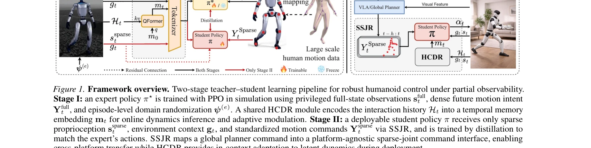
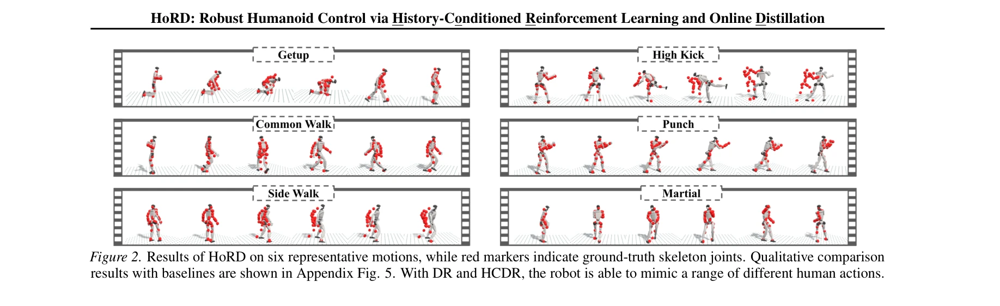

# HoRD: Robust Humanoid Control via History-Conditioned Reinforcement Learning and Online Distillation

> **저자**: Puyue Wang, Jiawei Hu, Yan Gao, Junyan Wang, Yu Zhang, Gillian Dobbie, Tao Gu, Wafa Johal, Ting Dang, Hong Jia | **날짜**: 2026-02-04 | **URL**: [https://arxiv.org/abs/2602.04412](https://arxiv.org/abs/2602.04412)

---

## Essence

*Figure 1. Framework overview. Two-stage teacher–student learning pipeline for robust humanoid control under partial obse*

HoRD는 history-conditioned reinforcement learning과 online distillation을 결합한 두 단계 학습 프레임워크로, 휴머노이드 로봇이 도메인 시프트 상황에서 강건한 제어를 수행하도록 한다.

## Motivation

- **Known**: 기존 물리 기반 제어 정책은 고정된 dynamics 파라미터를 가진 단일 시뮬레이터에서 학습되며, 도메인 시프트(물리 엔진 변경, 동역학 변화 등)에서 심각한 성능 저하를 겪는다.
- **Gap**: 현재 방법들은 희소한 모션 명령(sparse keypoint trajectories)으로부터 토크 레벨 제어까지의 통일된 강건한 표현을 제공하지 못하며, 테스트 시간의 미관찰 동역학 변화에 온라인으로 적응하지 못한다.
- **Why**: 휴머노이드 로봇이 현실 세계에 배포되려면 다양한 환경과 동역학 변화에 견딜 수 있어야 하며, 실시간 온라인 적응 능력이 장기간 안정적인 제어를 위해 필수적이다.
- **Approach**: HoRD는 (1) HCDR이라는 history-기반 모듈을 통해 최근 state-action 궤적에서 잠재 동역학 맥락을 추론하는 teacher 정책을 RL로 학습하고, (2) 이를 sparse keypoint 명령을 처리하는 transformer 기반 student로 distill한다.

## Achievement

*Figure 2. Results of HoRD on six representative motions, while red markers indicate ground-truth skeleton joints. Qualit*

- **History-Conditioned Dynamics Representation (HCDR)**: 최근 궤적으로부터 온라인 동역학 적응을 가능하게 하여 미관찰 도메인에 대한 zero-shot 전이 성능 향상
- **Standardized Sparse-Joint Representation (SSJR)**: 서로 다른 skeleton 정의와 시간 해상도를 가진 이질적인 모션 데이터 소스를 통합하는 표준화된 인터페이스
- **강건성 개선**: 도메인 시프트 상황에서 최대 14.2% 높은 성공률 달성 및 IsaacLab에서 Genesis로의 cross-physics-engine 전이에서 신뢰할 수 있는 성능 유지
- **대규모 데이터셋**: 100+ 시간의 7,000+ 다양한 휴머노이드 모션 궤적 데이터셋 공개

## How

*Figure 1. Framework overview. Two-stage teacher–student learning pipeline for robust humanoid control under partial obse*

- Stage I: 특권화된 full-state 관찰과 dense future motion intent를 활용하여 PPO로 teacher 정책 π* 학습, 도메인 randomization ψ(e)를 적용하여 다양한 동역학 커버
- Stage II: 희소한 proprioception과 sparse motion 명령만 받는 student 정책 학습, HCDR 모듈이 teacher와 student 모두에서 interaction history Ht를 temporal memory embedding mt으로 인코딩
- Teacher-student distillation: teacher의 강건한 제어 능력을 배포 가능한 경량의 student 정책으로 전이
- 온라인 적응: HCDR을 통해 배포 시간에 latent dynamics에 대한 in-context 적응 수행

## Originality

- History-based dynamics inference를 통한 온라인 적응 메커니즘이 domain randomization과 달리 테스트 시간의 미관찰 동역학 변화에 실시간으로 대응
- Sparse keypoint 명령 처리를 위한 표준화된 표현(SSJR)으로 데이터 단편화 문제 해결 및 cross-platform 전이 가능
- Two-stage teacher-student 파이프라인에서 고성능 teacher 학습과 배포 가능한 student 추출의 균형 달성
- Physics engine 간 전이(IsaacLab → Genesis)의 신뢰성 있는 달성으로 방법의 실용성 입증

## Limitation & Further Study

- HCDR 모듈의 history window 크기가 고정되어 있어 극단적으로 빠른 동역학 변화에 적응하지 못할 수 있음
- Student 정책이 sparse keypoint에만 의존하므로 복잡한 손 조작이나 미세한 모션 제어에 제한이 있을 수 있음
- 대규모 데이터셋 기반 학습으로 인한 높은 계산 비용이 소형 기관의 재현성을 해칠 수 있음
- 실제 로봇 하드웨어에서의 검증이 부재하여 sim-to-real gap의 실질적 영향 미상
- 후속 연구: (1) adaptive history window 메커니즘 개발, (2) 실제 로봇 플랫폼에서의 검증, (3) 더 고차원적인 모션 명령 처리 능력 확장

## Evaluation

- Novelty: 4/5
- Technical Soundness: 4/5
- Significance: 4/5
- Clarity: 4/5
- Overall: 4/5

**총평**: HoRD는 history-conditioned 동역학 추론과 sparse 명령 처리라는 두 가지 핵심 혁신을 통해 휴머노이드 제어의 강건성과 일반화 문제를 효과적으로 해결하며, 광범위한 실험 검증과 데이터셋 공개로 실용적 가치를 입증한다.

## Related Papers

- 🔄 다른 접근: [[papers/1971_Heracles_Bridging_Precise_Tracking_and_Generative_Synthesis/review]] — Heracles의 diffusion-based 접근법과 달리 HoRD는 history-conditioned RL을 통해 도메인 시프트 문제를 해결한다.
- 🔗 후속 연구: [[papers/2151_Toward_Reliable_Sim-to-Real_Predictability_for_MoE-based_Rob/review]] — MoE-based robot의 sim-to-real predictability 향상 방법이 HoRD의 online distillation 단계에서 강건성을 더욱 개선할 수 있다.
- 🏛 기반 연구: [[papers/1843_CMR_Contractive_Mapping_Embeddings_for_Robust_Humanoid_Locom/review]] — CMR의 contractive mapping embeddings가 HoRD의 history-conditioned learning에서 robust representation을 위한 이론적 기반을 제공한다.
- 🏛 기반 연구: [[papers/1850_Contrastive_Representation_Learning_for_Robust_Sim-to-Real_T/review]] — robust sim-to-real transfer를 위한 대조 표현 학습이 HoRD의 도메인 시프트 상황에서의 강건한 제어 기반을 제공합니다.
- 🔗 후속 연구: [[papers/1696_Success_in_Humanoid_Reinforcement_Learning_under_Partial_Obs/review]] — HoRD의 history-conditioned 방법론이 부분 관찰 문제 해결에 더 정교한 접근을 제공합니다.
- 🔄 다른 접근: [[papers/1613_PhysHSI_Towards_a_Real-World_Generalizable_and_Natural_Human/review]] — PhysHSI는 LiDAR-camera 기반 객체 인식에, HoRD는 history-conditioned 접근법에 의존하여 휴머노이드 환경 상호작용을 다르게 해결함
- 🔄 다른 접근: [[papers/1617_PILOT_A_Perceptive_Integrated_Low-level_Controller_for_Loco-/review]] — PILOT는 지각 기반 통합 제어를, HoRD는 이력 조건부 강화학습을 사용하여 휴머노이드 loco-manipulation을 다르게 해결함
- 🔄 다른 접근: [[papers/1627_PvP_Data-Efficient_Humanoid_Robot_Learning_with_Propriocepti/review]] — PvP는 고유감각-특권상태 대조학습을, HoRD는 history-conditioned 접근을 통해 휴머노이드 전신 제어의 샘플 효율성을 다르게 향상시킴
- 🔗 후속 연구: [[papers/1953_GentleHumanoid_Learning_Upper-body_Compliance_for_Contact-ri/review]] — History-conditioned reinforcement learning이 contact-rich 환경에서의 compliance 제어를 더욱 발전시킵니다.
- 🔄 다른 접근: [[papers/1929_FLAM_Foundation_Model-Based_Body_Stabilization_for_Humanoid/review]] — 둘 다 humanoid 제어의 안정성을 추구하지만, FLAM은 foundation model 기반 보상 설계를, HoRD는 history-conditioned 강화학습을 사용합니다.
- 🔄 다른 접근: [[papers/1971_Heracles_Bridging_Precise_Tracking_and_Generative_Synthesis/review]] — HoRD의 history-conditioned RL과 Heracles의 state-conditioned diffusion은 모두 외부 교란에 대한 강건성을 추구하는 상반된 접근법이다.
- 🔗 후속 연구: [[papers/1981_HMC_Learning_Heterogeneous_Meta-Control_for_Contact-Rich_Loc/review]] — HoRD의 강건한 제어를 접촉이 풍부한 조작 상황에서의 heterogeneous meta-control로 확장한 발전된 형태다.
- 🔄 다른 접근: [[papers/1983_HOMIE_Humanoid_Loco-Manipulation_with_Isomorphic_Exoskeleton/review]] — HOMIE의 isomorphic exoskeleton 방식과 HoRD의 history-conditioned RL은 humanoid 제어의 서로 다른 인터페이스 접근법이다.
