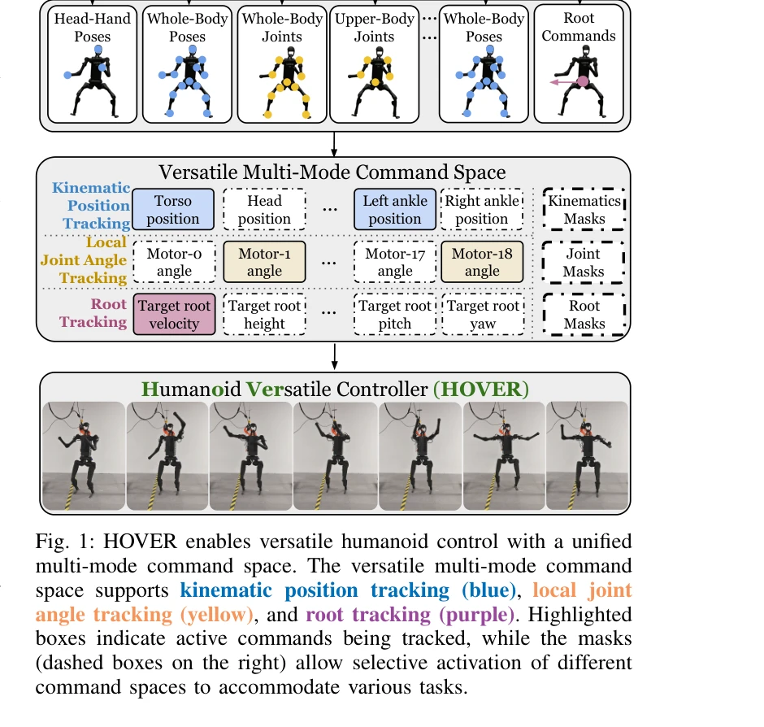
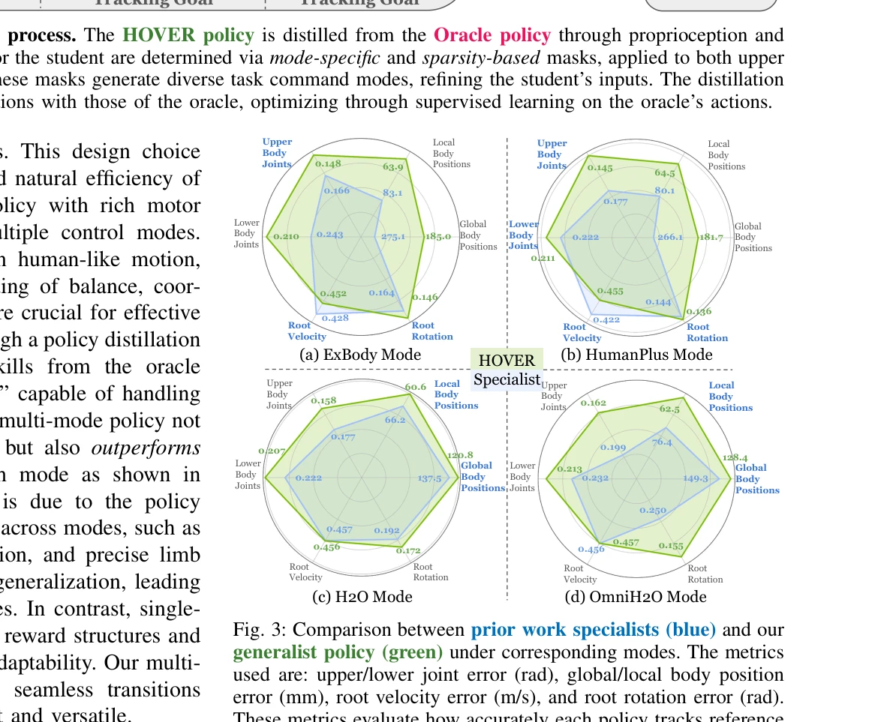
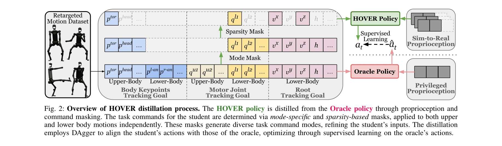

# HOVER: Versatile Neural Whole-Body Controller for Humanoid Robots

> **저자**: Tairan He, Wenli Xiao, Toru Lin, Zhengyi Luo, Zhenjia Xu, Zhenyu Jiang, Jan Kautz, Changliu Liu, Guanya Shi, Xiaolong Wang, Linxi Fan, Yuke Zhu | **날짜**: 2024-10-28 | **URL**: [https://arxiv.org/abs/2410.21229](https://arxiv.org/abs/2410.21229)

---

## Essence

*Fig. 1: HOVER enables versatile humanoid control with a unified*

HOVER는 키네매틱 위치 추적, 조인트 각도 추적, 루트 추적을 포함한 15개 이상의 제어 모드를 지원하는 통합 신경망 제어기로, 정책 증류를 통해 다양한 제어 모드를 단일 정책으로 통합하여 휴머노이드 로봇의 다목적 전신 제어를 실현한다.

## Motivation

- **Known**: 휴머노이드 로봇은 네비게이션, 로코-조작, 탁상 조작 등 다양한 작업을 수행해야 하며, 기존 연구들은 루트 속도 추적, 조인트 각도 추적, 키포인트 추적 등 작업별 특화된 제어 모드를 별도로 개발해왔다.
- **Gap**: 기존 방식들은 각 제어 모드마다 개별 정책을 학습하므로 모드 간 전이가 어렵고 개발 효율이 낮으며, 이를 해결할 통합된 다중 모드 제어기가 부재하다.
- **Why**: 휴머노이드 로봇의 실용성 향상을 위해 정책 재학습 없이 모드 간 원활한 전환이 가능한 통합 제어기가 필수적이며, 이는 향후 휴머노이드 응용의 효율성과 유연성을 크게 향상시킬 수 있다.
- **Approach**: 전신 키네매틱 모션 모방을 모든 제어 모드의 공통 추상화로 삼아 MoCap 데이터로 학습한 Oracle 정책에서 정책 증류(policy distillation)를 통해 다중 모드를 지원하는 통합 정책을 생성한다.

## Achievement

*Fig. 3: Comparison between prior work specialists (blue) and our*

- **통합 다중 모드 제어기**: 루트 추적, 조인트 각도 추적, 키네매틱 위치 추적을 포함한 15개 이상의 제어 모드를 단일 정책으로 지원
- **성능 향상**: 개별 학습된 전문가 정책들보다 다중 모드 generalist 정책이 모든 제어 모드에서 우수한 성능을 달성
- **원활한 모드 전환**: 제어 모드 간 실시간 전환이 가능하며 안정적인 제어 유지
- **시뮬레이션 및 실제 로봇 검증**: ExBody, HumanPlus, H2O, OmniH2O 등 다양한 로봇 플랫폼에서 유효성 입증

## How

*Fig. 2: Overview of HOVER distillation process. The HOVER policy is distilled from the Oracle policy through propriocept*

- Goal-conditioned RL 프레임워크로 Oracle 정책을 MoCap 인간 모션 데이터에 대해 학습
- Mode mask와 sparsity mask를 통해 상체와 하체의 제어 목표를 독립적으로 활성화
- DAgger 기반 정책 증류로 Oracle의 행동에 student 정책을 정렬하여 supervised learning 수행
- Proprioception masking을 통해 심-투-리얼 갭을 최소화하고 실제 로봇 전개 가능성 확보
- PPO 알고리즘으로 누적 할인 보상을 최대화하는 정책 최적화

## Originality

- 전신 키네매틱 모션 모방을 통합 제어 추상화로 제시한 새로운 관점
- Mode mask와 sparsity mask의 조합으로 유연한 다중 모드 제어 기법 개발
- 정책 증류를 통해 단일 정책이 개별 전문가 정책보다 우수한 성능을 달성하는 counter-intuitive 결과 도출
- 15개 이상의 제어 모드를 통합하는 포괄적 명령 공간 설계

## Limitation & Further Study

- MoCap 데이터 의존성: Oracle 정책의 성능과 다양성이 학습 데이터의 품질에 크게 영향을 받을 가능성
- 실제 로봇 환경의 제약: 논문에서 제시된 실제 로봇 실험의 범위와 복잡도가 시뮬레이션에 비해 제한적일 수 있음
- 계산 복잡도: 다중 모드 정책의 실시간 추론 비용 및 하드웨어 요구사항에 대한 상세 분석 부재
- 후속 연구 방향: 더 복잡한 상호작용 기술(bimanual manipulation, object pushing), 불안정한 환경(soft terrain), 새로운 작업에 대한 few-shot 적응 능력 개선 필요

## Evaluation

- Novelty: 4/5
- Technical Soundness: 3/5
- Significance: 4/5
- Clarity: 4/5
- Overall: 4/5

**총평**: HOVER는 휴머노이드 전신 제어의 다중 모드 통합이라는 실질적이고 중요한 문제를 정책 증류 기반의 우아한 해결책으로 제시하며, 시뮬레이션과 실제 로봇에서 모두 검증된 견고한 성과를 보여준다. 다만 실제 환경의 복잡한 작업에 대한 적응성과 계산 효율성에 대한 심화 분석이 더해지면 완성도가 높아질 수 있다.

## Related Papers

- 🔗 후속 연구: [[papers/1975_Hierarchical_visuomotor_control_of_humanoids/review]] — hierarchical visuomotor control의 sub-policy 개념을 HOVER가 15개 제어 모드로 확장하여 더 포괄적인 통합 제어기를 구현했다.
- 🔄 다른 접근: [[papers/2165_ULC_A_Unified_and_Fine-Grained_Controller_for_Humanoid_Loco-/review]] — ULC의 unified controller와 HOVER는 모두 다목적 humanoid 제어를 목표로 하지만 서로 다른 통합 방식을 사용한다.
- 🏛 기반 연구: [[papers/1934_From_Experts_to_a_Generalist_Toward_General_Whole-Body_Contr/review]] — experts to generalist의 whole-body control 일반화 방법론이 HOVER의 정책 증류를 통한 제어 모드 통합 기법의 기초를 제공한다.
- 🔄 다른 접근: [[papers/1955_GMT_General_Motion_Tracking_for_Humanoid_Whole-Body_Control/review]] — HOVER의 정책 증류 기반 통합과 GMT의 Mixture-of-Experts는 모두 다양한 제어 모드를 단일 정책으로 통합하는 서로 다른 아키텍처 접근법입니다.
- 🔄 다른 접근: [[papers/1784_A_Unified_and_General_Humanoid_Whole-Body_Controller_for_Ver/review]] — 통합 전신 제어를 HOVER는 15개 제어 모드로, Unified and General Controller는 일반적 접근으로 해결한다.
- 🏛 기반 연구: [[papers/1665_Scalable_and_General_Whole-Body_Control_for_Cross-Humanoid_L/review]] — 교차 휴머노이드 학습의 확장 가능한 전신 제어가 HOVER의 다목적 제어기 개발의 이론적 토대가 된다.
- 🔗 후속 연구: [[papers/1820_BeyondMimic_From_Motion_Tracking_to_Versatile_Humanoid_Contr/review]] — BeyondMimic의 동작 추적을 넘어서는 다목적 제어로 HOVER가 발전시킨 확장된 형태다.
- 🔄 다른 접근: [[papers/1799_AMO_Adaptive_Motion_Optimization_for_Hyper-Dexterous_Humanoi/review]] — 둘 다 versatile neural whole-body control을 제공하지만 AMO는 trajectory optimization 결합, HOVER는 순수 neural 접근법을 사용합니다.
- 🔄 다른 접근: [[papers/1955_GMT_General_Motion_Tracking_for_Humanoid_Whole-Body_Control/review]] — GMT의 통합 정책과 HOVER의 다목적 제어기는 모두 단일 모델로 다양한 휴머노이드 제어 모드를 지원하는 접근법을 제시합니다.
- 🔗 후속 연구: [[papers/1975_Hierarchical_visuomotor_control_of_humanoids/review]] — HOVER의 15개 제어 모드 통합 방식이 hierarchical visuomotor control의 sub-policy 선택 메커니즘을 확장한 발전된 형태이다.
- 🔄 다른 접근: [[papers/1980_HiWET_Hierarchical_World-Frame_End-Effector_Tracking_for_Lon/review]] — 다목적 전신 제어를 HiWET는 장기 조작에, HOVER는 다양한 제어 모드에 각각 특화하여 접근한다.
- 🏛 기반 연구: [[papers/2158_Track_Any_Motions_under_Any_Disturbances/review]] — HOVER의 versatile neural controller가 Any2Track의 다양한 동작 추적과 환경 교란 적응을 위한 기반 제어 기술을 제공합니다.
