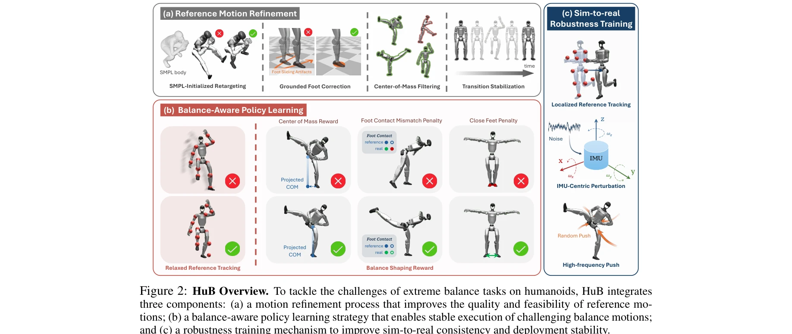
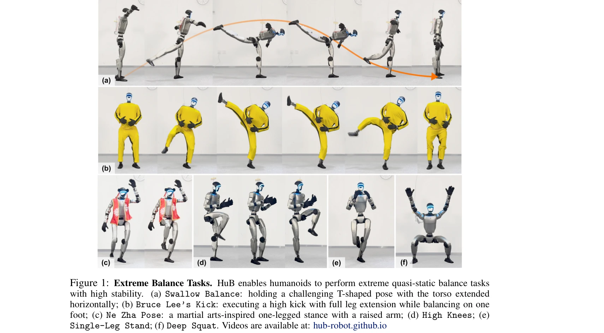

# HuB: Learning Extreme Humanoid Balance

> **저자**: Tong Zhang, Boyuan Zheng, Ruiqian Nai, Yingdong Hu, Yen-Jen Wang, Geng Chen, Fanqi Lin, Jiongye Li, Chuye Hong, Koushil Sreenath, Yang Gao | **날짜**: 2025-05-12 | **URL**: [https://arxiv.org/abs/2505.07294](https://arxiv.org/abs/2505.07294)

---

## Essence

*Figure 2: HuB Overview. To tackle the challenges of extreme balance tasks on humanoids, HuB integrates*

HuB는 휴머노이드 로봇이 제한된 한 발로 서기나 높은 킥과 같은 극도의 준정적 균형 작업을 수행할 수 있도록 하는 통합 프레임워크이며, 참조 동작 정제, 균형 인식 정책 학습, sim-to-real 강건성 훈련의 세 가지 구성 요소로 이루어져 있다.

## Motivation

- **Known**: 최근 휴머노이드 제어 연구는 RL을 이용하여 인간의 동작을 추적하는 방식으로 기술 습득을 추진하고 있으며, 일반적인 파이프라인은 모션 캡처 데이터를 수집하고 이를 휴머노이드용으로 재타겟팅한 후 정책을 훈련하고 배포한다.
- **Gap**: 균형 중심의 극도의 작업에 대해 기존 추적 기반 방법들은 참조 동작 오류로 인한 불안정성, 형태학적 불일치로 인한 학습 어려움, 센서 노이즈와 모델링 오류로 인한 sim-to-real 갭 등 세 가지 핵심 문제를 해결하지 못하고 있다.
- **Why**: 균형 유지는 휴머노이드 로봇이 복잡하고 비구조적인 환경에서 운동 능력을 발휘하기 위한 필수 기능이며, 준정적 극한 균형 작업은 전신 조정, 무게 중심의 정밀 제어, 외부 교란에 대한 강건성을 동시에 요구하는 도전적인 문제이다.
- **Approach**: HuB는 참조 동작의 품질 향상을 위해 SMPL 기반 초기화와 후처리 기법을 적용하고, 균형 인식 정책 학습을 위해 추적 목표를 완화하며 균형 형성 보상을 도입하고, sim-to-real 강건성을 위해 IMU 중심 섭동, 국소화된 참조 추적, 고주파 외부 충격을 활용한다.

## Achievement

*Figure 1: Extreme Balance Tasks. HuB enables humanoids to perform extreme quasi-static balance tasks*

- **극한 균형 작업 실현**: Swallow Balance(수평 확장 자세), Bruce Lee's Kick(1.5m 이상의 높은 발차기), Ne Zha Pose 등 준정적 극한 자세들을 Unitree G1 휴머노이드 로봇에서 안정적으로 수행", '**강건한 외부 교란 내성**: 강력한 축구공 충격 등의 물리적 교란에도 정책이 안정적으로 유지되며 10번의 연속 수행을 단일 롤아웃 내에서 성공
- **기준선 대비 우수한 성능**: 추적 기반 baseline 방법들이 균형 상실로 낙하하거나 한 발 동작을 포기하는 반면, HuB는 이러한 극한 작업들을 완수

## How

*Figure 2: HuB Overview. To tackle the challenges of extreme balance tasks on humanoids, HuB integrates*

- **참조 동작 정제**: SMPL 신체 모델 기반 초기화를 통한 수렴 가속화, 발 슬라이딩 제거를 위한 착지 발 보정, 무게 중심 필터링 및 전환 안정화로 물리적 타당성 향상
- **균형 인식 정책 학습**: 완벽한 추적 대신 참조 궤적 근처에서의 탐색을 허용하는 완화된 추적, 무게 중심 위치, 발 접촉 불일치, 발 근접도 등에 대한 형성 보상 도입
- **Sim-to-real 강건성 훈련**: IMU를 중심으로 한 관측 섭동으로 현실적 센서 노이즈 모델링, VIO 의존성 제거를 위한 국소화된 참조 추적, 현실 세계의 진동 효과를 근사하는 고주파 외부 충격 적용
- **MDP 기반 formulation**: 상태-행동-전이-보상-할인율로 구성된 Markov Decision Process로 문제 모델화 및 RL 프레임워크 적용

## Originality

- 극한 준정적 균형 작업을 위한 통합 프레임워크로, 기존 동적 안정화 중심 연구와 달리 지속적인 극한 균형 유지에 초점
- 형태학적 불일치를 고려한 완화된 추적 목표와 균형 중심 형성 보상의 조합으로 정책 학습 개선
- 센서 노이즈, 접촉 모델링, 진동 효과를 구체적으로 모델링하는 균형 작업 특화의 sim-to-real 전이 전략
- SMPL 기반 초기화와 다단계 후처리를 통한 체계적인 참조 동작 정제 파이프라인

## Limitation & Further Study

- Unitree G1 단일 플랫폼에서만 검증되어 다양한 휴머노이드 로봇에 대한 일반화 가능성 미확인
- 극한 균형 작업으로 제한되어 동적 로봇 이동(예: 달리기, 점프)과의 통합 가능성 미탐색
- 참조 동작의 품질이 여전히 중요한 요소이므로 저품질 모션 캡처에 대한 강건성 한계
- 장기 연속 운동이나 복합 작업 시퀀스에 대한 성능 평가 부재
- 후속 연구로 다중 휴머노이드 플랫폼 적용, 동적 작업과의 결합, 저품질 입력 데이터에 대한 강건성 강화 필요

## Evaluation

- Novelty: 4/5
- Technical Soundness: 3/5
- Significance: 4/5
- Clarity: 4/5
- Overall: 4/5

**총평**: HuB는 휴머노이드의 극한 균형 제어라는 도전적 문제에 대해 참조 정제, 정책 학습, sim-to-real 전이의 세 가지 핵심 요소를 체계적으로 통합한 포괄적 솔루션을 제시하며, 실제 하드웨어에서 인상적인 성능을 달성하여 로봇 제어 분야에 의미 있는 기여를 한다.

## Related Papers

- 🔄 다른 접근: [[papers/1987_HuBE_Cross-Embodiment_Human-like_Behavior_Execution_for_Huma/review]] — HuBE의 cross-embodiment adaptation과 HuB의 extreme balance는 모두 humanoid의 한계 상황 대응이지만 서로 다른 측면에 집중한다.
- 🔗 후속 연구: [[papers/1661_SafeFall_Learning_Protective_Control_for_Humanoid_Robots/review]] — SafeFall의 protective control 기법이 HuB의 extreme balance 학습에서 안전한 넘어짐 동작을 추가로 제공할 수 있다.
- 🏛 기반 연구: [[papers/1954_Geometry-Aware_Predictive_Safety_Filters_on_Humanoids_From_P/review]] — geometry-aware predictive safety filters가 HuB의 극도의 준정적 균형 작업에서 안전성 보장을 위한 기초 이론을 제공한다.
- 🏛 기반 연구: [[papers/1656_Robust_and_Versatile_Bipedal_Jumping_Control_through_Reinfor/review]] — 강화학습을 통한 강건하고 다목적인 이족 점프 제어가 HuB의 극도 균형 작업 수행의 핵심 토대가 된다.
- 🔄 다른 접근: [[papers/1920_Explosive_Output_to_Enhance_Jumping_Ability_A_Variable_Reduc/review]] — 극단적 동작 능력을 HuB는 균형에, Explosive Output은 점프 능력에 각각 특화하여 접근한다.
- 🏛 기반 연구: [[papers/1834_Chasing_Stability_Humanoid_Running_via_Control_Lyapunov_Func/review]] — 제어 Lyapunov 함수를 통한 안정성 추구가 HuB의 극도 준정적 균형 작업의 이론적 기반이 된다.
- 🔗 후속 연구: [[papers/1905_Embedding_Classical_Balance_Control_Principles_in_Reinforcem/review]] — HuB의 extreme humanoid balance 학습이 고전적 균형 제어 원리를 더 극한 상황으로 확장하여 포괄적인 균형 제어를 실현한다.
- 🏛 기반 연구: [[papers/1982_Hold_My_Beer_Learning_Gentle_Humanoid_Locomotion_and_End-Eff/review]] — HuB의 극도 균형 제어 기술이 Hold My Beer의 음료를 흘리지 않는 정밀한 end-effector 안정화의 토대가 된다.
- 🔄 다른 접근: [[papers/1987_HuBE_Cross-Embodiment_Human-like_Behavior_Execution_for_Huma/review]] — HuB의 extreme balance와 달리 HuBE는 cross-embodiment 적응을 통한 human-like behavior 실현에 초점을 맞춘다.
