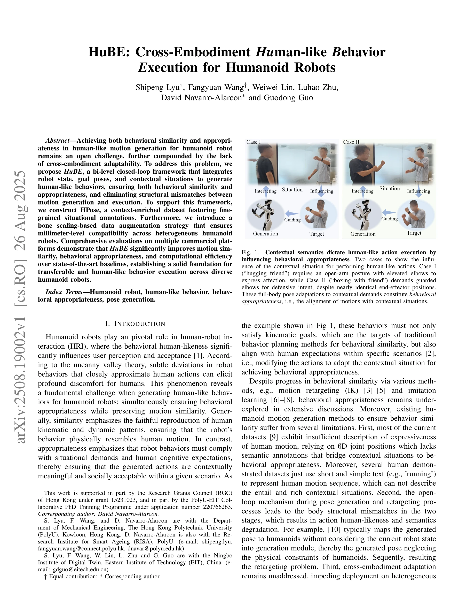
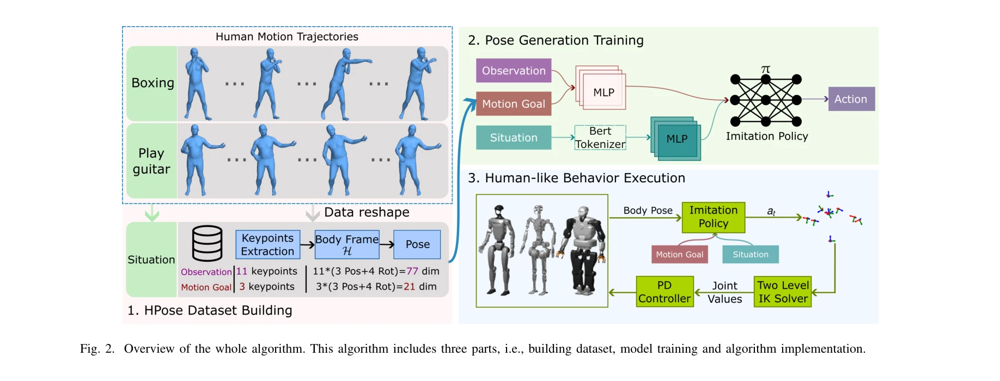
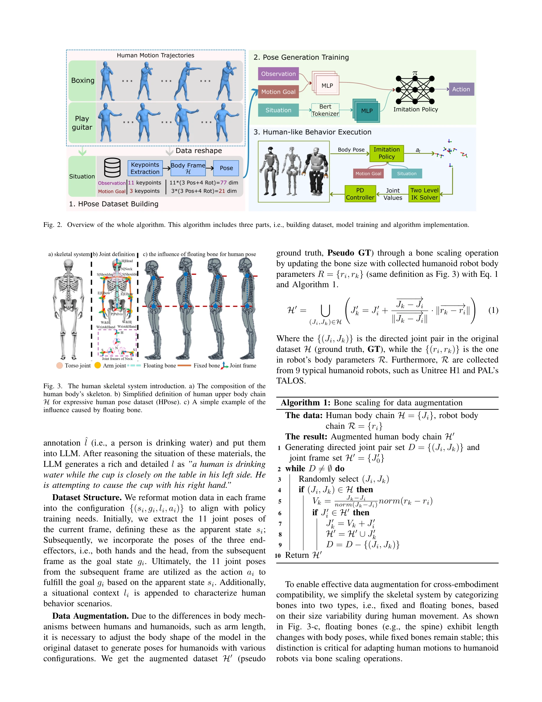

# HuBE: Cross-Embodiment Human-like Behavior Execution for Humanoid Robots

> **저자**: Shipeng Lyu, Fangyuan Wang, Weiwei Lin, Luhao Zhu, David Navarro-Alarcon, Guodong Guo | **날짜**: 2025-08-26 | **DOI**: [10.48550/arXiv.2508.19002](https://doi.org/10.48550/arXiv.2508.19002)

---

## Essence

*Fig. 1.*

HuBE는 인간 행동의 유사성(similarity)과 적절성(appropriateness)을 모두 만족하는 이족 로봇용 양단계 폐루프 프레임워크를 제안하며, 뼈 스케일링 기반 데이터 증강을 통해 이기종 로봇 간 교차-구현체(cross-embodiment) 적응을 실현한다.

## Motivation

- **Known**: Motion retargeting, IK, imitation learning 등을 통해 행동 유사성은 어느 정도 달성되었으나, 맥락적 상황을 고려한 행동 적절성은 인간-로봇 상호작용에서 미흡하게 다루어지고 있다. 또한 기존 방법들은 개방 루프 구조로 인해 모션 생성과 실행 단계 사이의 신체 구조 불일치 문제가 있다.
- **Gap**: 행동 유사성과 적절성을 동시에 보장하는 통합 프레임워크의 부재, 맥락 정보를 포함한 세밀한 주석이 달린 데이터셋의 부족, 그리고 이기종 로봇 플랫폼 간 일관된 적응 방법의 부재가 주요 갭이다.
- **Why**: Uncanny valley 이론에 따르면 인간과 유사하지만 미묘하게 다른 로봇 행동은 불편감을 유발하므로, 맥락에 맞는 자연스러운 인간형 행동 생성은 로봇의 사용자 수용도와 상호작용 품질을 크게 향상시킬 수 있다.
- **Approach**: HPose 데이터셋을 구축하여 세밀한 상황 주석을 포함시키고, 로봇 상태, 목표 포즈, 맥락 상황을 통합하는 폐루프 구조의 양단계 프레임워크를 설계하며, bone scaling 기반 데이터 증강을 통해 이기종 로봇 간 호환성을 확보한다.

## Achievement

*Fig. 2. Overview of the whole algorithm. This algorithm includes three parts, i.e., building dataset, model training and*

- **HPose 데이터셋**: KIT, AMASS, Motion-X를 기반으로 LLM(GPT-4o)을 사용하여 세밀한 상황 설명(예: '상자 밑부분을 양손으로 잡고 머리 위로 들어올린다')을 추가한 컨텍스트 풍부 데이터셋 구축", '**행동 유사성과 적절성 동시 달성**: 폐루프 메커니즘과 암시적 스켈레탈 파라미터 적응을 통해 모션 생성과 로봇 제어의 통합적 연결로 구조 불일치 제거
- **교차-구현체 적응**: Bone scaling 연산을 데이터 증강에 적용하여 밀리미터 수준의 정확도로 이기종 상용 로봇 플랫폼 간 배포 가능성 확보
- **성능 개선**: 다중 상용 플랫폼 평가에서 모션 유사성, 행동 적절성, 계산 효율성 모두에서 기존 최첨단 방법 대비 현저한 개선

## How

*Fig. 3. The human skeletal system introduction. a) The composition of the*

- HPose 데이터셋: 기존 오픈소스 모션 데이터셋(KIT, AMASS, Motion-X)에 LLM 기반 세밀한 상황 설명(long-form natural language annotation) 추가
- 양단계 폐루프 프레임워크: (1) Behavior generation 모듈—모션 상황, 로봇 관측, 목표 포즈를 입력으로 하여 인간형 포즈 생성, (2) Behavior execution 모듈—생성된 포즈를 로봇의 물리적 특성에 맞게 매핑
- 암시적 스켈레탈 파라미터 적응: 로봇 상태를 생성 모듈에 피드백하여 개방 루프 구조의 한계 극복
- Bone scaling 데이터 증강: 모션 데이터에 뼈 길이 스케일링 변환을 적용하여 상용 인간형 로봇의 형태 분포 시뮬레이션 및 일반화 능력 향상
- 11개 주요 관절 단순화: 손 위치를 손목과 동일하게, 회전 데이터는 quaternion 표현으로 통일하여 처리 효율성 제고

## Originality

- **행동 적절성(Behavioral Appropriateness) 개념 도입**: 기존 연구가 행동 유사성에만 집중한 반면, 맥락 상황에 따른 사회적·인지적 기대를 만족하는 행동 적절성을 명시적으로 정의하고 모션 생성에 통합
- **폐루프 아키텍처**: 모션 생성과 로봇 실행 단계 사이의 구조 불일치 문제를 로봇 상태 피드백을 통해 해결하는 새로운 설계 철학
- **Bone scaling 기반 교차-구현체 적응**: 단순한 IK 맵핑을 벗어나 스켈레탈 파라미터 변환을 데이터 증강 단계에 적용하여 밀리미터 수준의 호환성 달성
- **LLM 활용 세밀한 주석**: 모션 시퀀스에 대해 GPT-4o를 사용해 맥락을 설명하는 자연언어 주석을 자동 생성하여 의미론적 풍부성 확보

## Limitation & Further Study

- **데이터셋 범위**: HPose가 KIT, AMASS, Motion-X 기반이므로 포함되지 않은 특수 작업이나 문화적 맥락의 행동에 대한 일반화 능력은 검증되지 않음
- **LLM 주석의 신뢰성**: GPT-4o 생성 주석의 정확성과 인간 주석과의 일치도에 대한 정량적 평가 부재
- **실시간 성능**: 계산 효율성 개선이 언급되나 구체적인 지연시간(latency) 및 처리 속도 메트릭이 논문 발췌에 제시되지 않음
- **후속 연구**: (1) 더 다양한 상용 로봇 플랫폼에서의 검증, (2) 사용자 연구를 통한 행동 적절성 평가의 객관화, (3) 미세한 손가락 움직임 등 더 세밀한 관절 표현 확장 필요

## Evaluation

- Novelty: 4/5
- Technical Soundness: 3/5
- Significance: 4/5
- Clarity: 4/5
- Overall: 4/5

**총평**: HuBE는 인간형 로봇 행동 생성에 행동 적절성 개념을 처음 체계적으로 도입하고, 폐루프 아키텍처와 bone scaling 기반 교차-구현체 적응을 통해 실무적 가치 높은 솔루션을 제시한다. 다만 LLM 주석 신뢰성 검증과 더 광범위한 플랫폼 실험이 진행된다면 영향력이 한층 강화될 것으로 예상된다.

## Related Papers

- 🔄 다른 접근: [[papers/1986_HuB_Learning_Extreme_Humanoid_Balance/review]] — HuB의 extreme balance와 달리 HuBE는 cross-embodiment 적응을 통한 human-like behavior 실현에 초점을 맞춘다.
- 🔗 후속 연구: [[papers/1989_Human-Humanoid_Robots_Cross-Embodiment_Behavior-Skill_Transf/review]] — UDH 모델의 cross-embodiment skill transfer 방법이 HuBE의 bone scaling 기반 데이터 증강을 더욱 정교화할 수 있다.
- 🏛 기반 연구: [[papers/2120_OmniRetarget_Interaction-Preserving_Data_Generation_for_Huma/review]] — OmniRetarget의 interaction-preserving data generation이 HuBE의 cross-embodiment adaptation을 위한 데이터 생성 기법의 기초를 제공한다.
- 🔄 다른 접근: [[papers/1962_H-Zero_Cross-Humanoid_Locomotion_Pretraining_Enables_Few-sho/review]] — HuBE의 인간-유사 행동 실행과 H-Zero의 locomotion 중심 접근법은 cross-embodiment 전이에서 서로 다른 행동 범위를 다룹니다.
- 🏛 기반 연구: [[papers/1665_Scalable_and_General_Whole-Body_Control_for_Cross-Humanoid_L/review]] — Cross-humanoid scalable control이 HuBE의 cross-embodiment adaptation의 기반이 됩니다.
- 🔄 다른 접근: [[papers/1962_H-Zero_Cross-Humanoid_Locomotion_Pretraining_Enables_Few-sho/review]] — H-Zero의 cross-humanoid locomotion과 HuBE의 cross-embodiment behavior는 모두 서로 다른 로봇 간 기술 전이를 다루되 초점이 다릅니다.
- 🔄 다른 접근: [[papers/1986_HuB_Learning_Extreme_Humanoid_Balance/review]] — HuBE의 cross-embodiment adaptation과 HuB의 extreme balance는 모두 humanoid의 한계 상황 대응이지만 서로 다른 측면에 집중한다.
- 🔗 후속 연구: [[papers/1989_Human-Humanoid_Robots_Cross-Embodiment_Behavior-Skill_Transf/review]] — HuBE의 cross-embodiment adaptation을 UDH 모델과 adversarial imitation learning으로 더욱 발전시킨 확장된 접근법이다.
- 🏛 기반 연구: [[papers/2159_TrajBooster_Boosting_Humanoid_Whole-Body_Manipulation_via_Tr/review]] — 교차 구현체 인간-유사 행동 실행 기법이 휠드 휴머노이드에서 이족 휴머노이드로의 궤적 전이 방법론의 기반이 됩니다.
