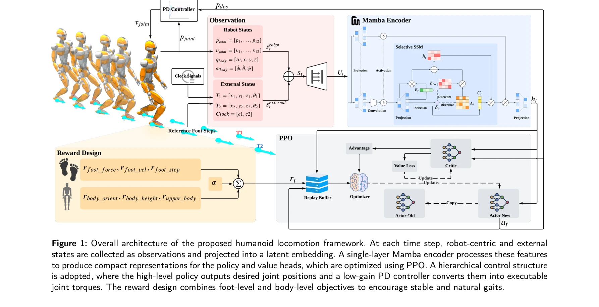
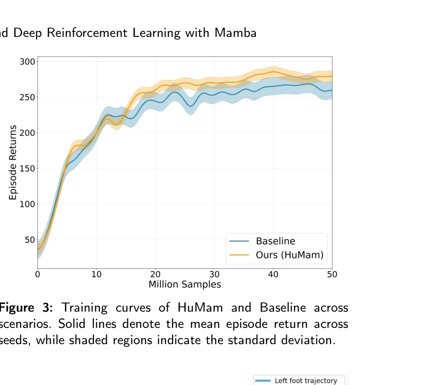

# HuMam: Humanoid Motion Control via End-to-End Deep Reinforcement Learning with Mamba

> **저자**: Yinuo Wang, Yuanyang Qi, Jinzhao Zhou, Pengxiang Meng, Xiaowen Tao | **날짜**: 2025-09-22 | **URL**: [https://arxiv.org/abs/2509.18046](https://arxiv.org/abs/2509.18046)

---

## Essence

*Figure 1: Overall architecture of the proposed humanoid locomotion framework. At each time step, robot-centric and exter*

HuMam은 Mamba 인코더를 백본으로 사용하는 end-to-end 강화학습 기반 휴머노이드 로봇 보행 제어 프레임워크로, 로봇 중심 상태와 목표 발걸음을 효율적으로 융합하여 안정적이고 에너지 효율적인 제어를 실현한다.

## Motivation

- **Known**: End-to-end RL은 compact perception-action 매핑으로 매력적이나 훈련 불안정성과 비효율적 특징 융합 문제가 있다. Quadruped 로봇의 RL 기반 제어는 성공사례가 많으나 휴머노이드는 높은 중심의 무게와 복잡한 동역학으로 인해 더 어렵다.
- **Gap**: 기존 feedforward 백본은 보행 위상(gait phase)과 방향성 발걸음(oriented footsteps) 같은 구조를 충분히 활용하지 못하며, 무거운 sequence 모델은 계산 효율성 문제가 있다. 휴머노이드 RL 제어에 Mamba를 적용한 사례가 없다.
- **Why**: 휴머노이드 로봇의 실제 배포는 안정적이고 에너지 효율적인 보행 제어가 필수적이며, 더 나은 특징 융합과 학습 효율성은 실용적 적용 가능성을 크게 높인다.
- **Approach**: 단일 레이어 Mamba 인코더를 사용하여 로봇 중심 상태(관절 위치/속도, 자세)와 외부 유도 신호(목표 발걸음, 연속 시계 신호)를 융합한 후, PPO로 최적화된 정책이 관절 위치 목표를 출력하고 저수준 PD 제어기가 추적하도록 설계했다.

## Achievement

*Figure 3: Training curves of HuMam and Baseline across*

- **첫 Mamba 기반 휴머노이드 RL 제어기**: 단일 Mamba 레이어만으로 순수 상태-중심 설정에서 강력한 성능을 달성한 최초 사례
- **학습 효율성 및 안정성 개선**: Feedforward 베이스라인 대비 더 빠른 학습, 향상된 샘플 효율성, 낮은 교차-시드 변동성으로 더 높은 최종 수익 달성
- **에너지 효율적 보행 제어**: 6-항 보상 함수가 접촉 품질, 스윙 부드러움, 발 배치, 자세, 동체 안정성의 균형을 맞춰 토크 피크와 전력 소비 감소
- **광범위한 실증 검증**: JVRC-1 휴머노이드에서 전진, 후진, 곡선, 횡단, 정지 작업 모두에서 일관된 성능 향상 확인

## How

*Figure 1: Overall architecture of the proposed humanoid locomotion framework. At each time step, robot-centric and exter*

- Mamba 인코더의 상태-공간 동역학을 활용하여 이질적 입력(로봇 상태 + 외부 가이던스)의 경량 융합 수행
- 6-항 보상 설계: contact quality (r_c), swing smoothness (r_s), foot placement (r_p), body orientation (r_o), torso height (r_h), upper-body stability (r_b)
- 단일 레이어 Mamba로 계산 효율성 유지하면서 sequence 모델의 이점 확보
- 저수준 PD 루프로 위치 목표 추적하여 smooth 토크 생성 및 학습 안정성 확보
- PPO 알고리즘으로 정책 최적화

## Originality

- Humanoid locomotion RL에 Mamba를 최초 적용한 원신적 기여
- 상태-중심 관찰 공간에서 oriented footsteps과 continuous phase clock을 명시적으로 포함하는 설계
- 6-항 보상 함수로 안정성과 에너지 효율을 동시에 최적화하는 체계적 접근
- Mamba의 선형 시간 복잡성을 활용하여 RNN/Transformer 대비 효율성 개선

## Limitation & Further Study

- MC-MuJoCo 시뮬레이션 환경에서만 검증되었으며 실제 하드웨어 배포 데이터 부재
- JVRC-1 단일 모델에만 적용 - 다양한 휴머노이드 플랫폼에 대한 일반화 가능성 미확인
- 동적 장애물 회피나 복잡한 지형(계단 등) 같은 고급 작업은 포함되지 않음
- Mamba와 다른 sequence 모델(Transformer, LSTM)에 대한 직접 비교 분석 부족
- 후속 연구: 실제 휴머노이드 로봇으로 sim-to-real 전이 검증, 복잡한 지형/작업 확장, 분산 강화학습과 결합

## Evaluation

- Novelty: 4/5
- Technical Soundness: 3/5
- Significance: 4/5
- Clarity: 4/5
- Overall: 4/5

**총평**: HuMam은 Mamba를 활용한 휴머노이드 보행 제어의 첫 성공 사례로, 학습 효율성과 에너지 효율성을 동시에 개선하는 실질적 기여를 한다. 다만 시뮬레이션 기반 결과와 단일 플랫폼 검증의 제약이 있어 실제 응용 가능성 입증을 위한 추가 연구가 필요하다.

## Related Papers

- 🔄 다른 접근: [[papers/1996_Humanoid_Locomotion_as_Next_Token_Prediction/review]] — Mamba 인코더 기반 강화학습과 transformer 기반 next token prediction으로 보행 제어 접근법이 다르다.
- 🧪 응용 사례: [[papers/2048_Learning_Bipedal_Locomotion_on_Gear-Driven_Humanoid_Robot_Us/review]] — HuMam의 에너지 효율적 제어가 기어 구동 로봇의 발목 IMU 기반 학습에 적용될 수 있다.
- 🧪 응용 사례: [[papers/2006_Humanoid-Gym_Reinforcement_Learning_for_Humanoid_Robot_with/review]] — Humanoid-Gym의 RL framework가 HuMam의 end-to-end learning 방식을 실제 humanoid 보행 훈련에 적용할 수 있는 플랫폼을 제공한다.
- 🏛 기반 연구: [[papers/1896_EGM_Efficiently_Learning_General_Motion_Tracking_Policy_for/review]] — EGM의 efficient general motion tracking이 HuMam의 end-to-end learning에서 motion tracking 부분의 기초 방법론을 제공한다.
- 🔄 다른 접근: [[papers/1988_HuMam_Humanoid_Motion_Control_via_End-to-End_Deep_Reinforcem/review]] — End-to-end 강화학습과 Mamba encoder 조합이 전통적인 계층적 제어와 다른 접근법을 제시합니다.
- 🔗 후속 연구: [[papers/1944_General_Humanoid_Whole-Body_Control_via_Pretraining_and_Fast/review]] — General humanoid whole-body control이 HuMam의 효율적인 보행 제어를 일반화합니다.
- 🧪 응용 사례: [[papers/1775_A_Closed-Form_Geometric_Retargeting_Solver_for_Upper_Body_Hu/review]] — end-to-end 심층 강화학습에서 상체 제어를 위한 실시간 관절각 변환 솔루션을 제공합니다.
- 🧪 응용 사례: [[papers/1923_FAME_Force-Adaptive_RL_for_Expanding_the_Manipulation_Envelo/review]] — HuMam의 end-to-end 심층 강화학습 기반 휴머노이드 동작 제어가 FAME의 양팔 상호작용 힘 학습을 실제 시스템에 적용하는 구체적인 방법을 제공한다.
- 🔄 다른 접근: [[papers/1996_Humanoid_Locomotion_as_Next_Token_Prediction/review]] — transformer 기반 토큰 예측과 Mamba 기반 강화학습으로 휴머노이드 제어의 서로 다른 패러다임을 제시한다.
- 🏛 기반 연구: [[papers/2006_Humanoid-Gym_Reinforcement_Learning_for_Humanoid_Robot_with/review]] — Humanoid-Gym의 강화학습 프레임워크가 HuMam의 end-to-end 학습 환경을 제공한다.
- 🏛 기반 연구: [[papers/2048_Learning_Bipedal_Locomotion_on_Gear-Driven_Humanoid_Robot_Us/review]] — 발목 IMU 기반 학습이 HuMam의 로봇 중심 상태 융합에 필요한 센서 데이터를 제공한다.
- 🔗 후속 연구: [[papers/2165_ULC_A_Unified_and_Fine-Grained_Controller_for_Humanoid_Loco-/review]] — 종단간 심층 강화학습을 통한 휴머노이드 동작 제어가 ULC의 보행-조작 통합 접근법을 더욱 자연스러운 인간-수준 제어로 발전시킬 수 있습니다.
