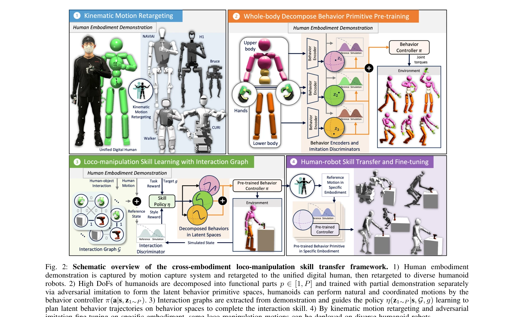
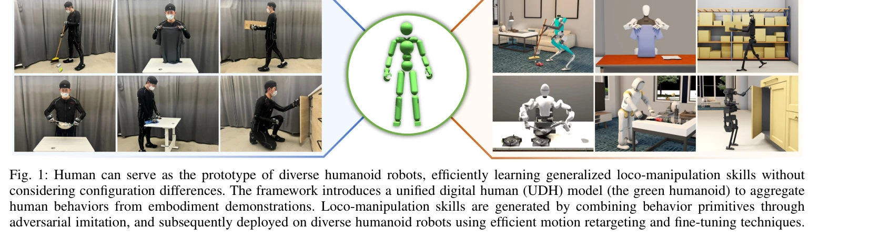

# Human-Humanoid Robots Cross-Embodiment Behavior-Skill Transfer Using Decomposed Adversarial Learning from Demonstration

> **저자**: Junjia Liu, Zhuo Li, Minghao Yu, Zhipeng Dong, Sylvain Calinon, Darwin Caldwell, Fei Chen | **날짜**: 2024-12-19 | **URL**: [https://arxiv.org/abs/2412.15166](https://arxiv.org/abs/2412.15166)

---

## Essence

*Fig. 2: Schematic overview of the cross-embodiment loco-manipulation skill transfer framework. 1) Human embodiment*

Unified Digital Human (UDH) 모델을 공통 프로토타입으로 사용하여 인간 시연에서 행동 원시 요소를 학습하고, 분해된 adversarial imitation learning과 kinematic motion retargeting을 통해 다양한 휴머노이드 로봇 플랫폼으로 로코-매니퓰레이션 스킬을 효율적으로 전이한다.

## Motivation

- **Known**: 학습 기반 방법과 adversarial imitation learning이 로봇 스킬 획득에 효과적이며, 교차 embodiment 스킬 전이는 단순 테이블탑 로봇 팔 작업에 주로 적용되었다.
- **Gap**: 기존 방법들은 높은 DoF, 동적 균형, 전신 협응이 필요한 휴머노이드 로봇의 고유한 challenges를 충분히 다루지 못하며, 매번 새로운 로봇 플랫폼 도입 시 재학습이 필요하다.
- **Why**: 휴머노이드 로봇 플랫폼의 다양화로 인해 새로운 로봇마다 광범위한 재학습 없이 스킬을 전이할 수 있는 프레임워크가 필수적이며, 이를 통해 데이터 수집 병목을 완화할 수 있다.
- **Approach**: UDH를 인간 시연의 공통 프로토타입으로 사용하여 embodiment 독립적인 행동 원시 요소를 추출하고, 복잡한 제어 문제를 functional components로 분해하여 독립적으로 adversarial imitation learning으로 학습한 뒤, human-object interaction graph를 활용해 이들을 동적으로 조율하며, kinematic motion retargeting과 embodiment 특화 fine-tuning으로 다양한 휴머노이드에 전이한다.

## Achievement

*Fig. 1: Human can serve as the prototype of diverse humanoid robots, efficiently learning generalized loco-manipulation *

- **다중 플랫폼 검증**: 5개의 서로 다른 구성의 휴머노이드 로봇에서 안정적인 로코-매니퓰레이션 능력을 입증
- **데이터 효율성**: Unified Digital Human 모델을 통해 데이터 병목을 감소시키고 새 로봇 플랫폼마다 재학습할 필요성을 제거
- **스킬 일반화**: Human-object interaction graph를 통해 작업 일반화를 달성하고 교차 플랫폼 전이 효율성 증대
- **전신 협응**: 분해된 functional components의 동적 조율로 높은 DoF 휴머노이드의 복잡한 전신 운동 생성

## How

*Fig. 2: Schematic overview of the cross-embodiment loco-manipulation skill transfer framework. 1) Human embodiment*

- Motion capture 시스템으로 인간 시연을 캡처하여 UDH에 retarget하고 다양한 휴머노이드에 재-retarget
- 휴머노이드의 높은 DoF를 functional parts (다리, 팔, 손 등)로 분해하여 각각 partial demonstration으로 adversarial imitation learning 학습
- 각 functional part에서 학습된 latent behavior primitive spaces를 behavior controller π(a|s, z₁~P)로 통합
- Human-object interaction graph를 추출하여 policy η(z₁~P|s, G, g)가 interaction 스킬 완료를 위한 latent behavior 궤적을 계획하도록 가이드
- Kinematic motion retargeting으로 각 joint을 부분 inverse kinematics를 통해 해결하고 embodiment 특화 fine-tuning으로 동역학 적응

## Originality

- Unified Digital Human을 교차 embodiment 학습의 공통 프로토타입으로 처음 도입하여 embodiment 독립적인 행동 원시 요소 추출
- 휴머노이드의 복잡한 제어 문제를 functional components로 분해하는 방식은 기존 전체 정책 학습과 구별되는 새로운 접근
- Human-object interaction graph를 behavior primitive 계획에 명시적으로 활용하는 통합 프레임워크로 높은 DoF 로코-매니퓰레이션 작업 처리
- Kinematic motion retargeting과 adversarial imitation fine-tuning의 조합으로 다양한 동역학 특성을 가진 로봇 플랫폼으로의 실질적 전이 달성

## Limitation & Further Study

- Kinematic motion retargeting이 실제 동역학을 고려하지 않으므로 대폭적인 embodiment 차이가 있는 로봇으로의 전이에서 성능 저하 가능성
- UDH 모델이 특정 신체 구조(예: 인간 형태)에 기반하므로 매우 이형의 로봇 형태(예: 사족 로봇)로의 일반화 한계
- Human-object interaction graph의 추출 및 정의가 작업 특화적일 수 있어 완전히 새로운 작업 유형으로의 확장성 제약
- 후속 연구는 동역학을 고려한 advanced motion retargeting 기법, 더 다양한 embodiment 형태 지원, 자동화된 interaction graph 추출 방법 개발이 필요

## Evaluation

- Novelty: 4/5
- Technical Soundness: 3/5
- Significance: 4/5
- Clarity: 4/5
- Overall: 4/5

**총평**: 본 논문은 UDH를 중심으로 한 창의적인 교차 embodiment 프레임워크를 제시하며, functional decomposition과 adversarial imitation learning의 결합, 그리고 interaction graph 기반 계획을 통해 휴머노이드 로봇의 로코-매니퓰레이션 스킬 전이 문제를 실질적으로 해결하는 중요한 기여를 한다.

## Related Papers

- 🔗 후속 연구: [[papers/1987_HuBE_Cross-Embodiment_Human-like_Behavior_Execution_for_Huma/review]] — HuBE의 cross-embodiment adaptation을 UDH 모델과 adversarial imitation learning으로 더욱 발전시킨 확장된 접근법이다.
- 🔄 다른 접근: [[papers/2000_Humanoid_Policy__Human_Policy/review]] — HAT의 unified state-action space와 UDH의 common prototype은 human-humanoid skill transfer를 위한 서로 다른 통합 방식이다.
- 🏛 기반 연구: [[papers/1917_Example-based_Motion_Synthesis_via_Generative_Motion_Matchin/review]] — generative motion matching의 motion synthesis 기법이 UDH 모델의 behavior primitive 학습을 위한 기초 방법론을 제공한다.
- 🔗 후속 연구: [[papers/2126_Opt2Skill_Imitating_Dynamically-feasible_Whole-Body_Trajecto/review]] — dynamically-feasible trajectory imitation이 UDH 모델의 cross-embodiment skill transfer를 물리적으로 실현 가능한 동작으로 확장합니다.
- 🏛 기반 연구: [[papers/1646_RoboMirror_Understand_Before_You_Imitate_for_Video_to_Humano/review]] — RoboMirror의 비디오-휴머노이드 모방 기술이 UDH 모델 기반 교차 구현체 스킬 전이의 핵심 토대가 된다.
- 🔄 다른 접근: [[papers/2120_OmniRetarget_Interaction-Preserving_Data_Generation_for_Huma/review]] — 교차 구현체 전이를 이 논문은 UDH 모델로, OmniRetarget은 상호작용 보존으로 접근한다.
- 🔗 후속 연구: [[papers/1812_Behavior_Foundation_Model_for_Humanoid_Robots/review]] — Behavior Foundation Model의 기초 개념을 다양한 휴머노이드 플랫폼 간 스킬 전이로 확장한 발전된 형태다.
- 🔗 후속 연구: [[papers/1901_EgoHumanoid_Unlocking_In-the-Wild_Loco-Manipulation_with_Rob/review]] — 인간-휴머노이드 교차 embodiment 행동 기술 전이가 EgoHumanoid의 로봇 없는 학습을 더욱 일반화한 접근법입니다.
- 🔗 후속 연구: [[papers/1987_HuBE_Cross-Embodiment_Human-like_Behavior_Execution_for_Huma/review]] — UDH 모델의 cross-embodiment skill transfer 방법이 HuBE의 bone scaling 기반 데이터 증강을 더욱 정교화할 수 있다.
- 🔄 다른 접근: [[papers/2000_Humanoid_Policy__Human_Policy/review]] — UDH의 common prototype 방식과 달리 HAT는 unified state-action space에서 human과 robot을 직접적으로 통합 모델링한다.
- 🏛 기반 연구: [[papers/2076_Learning_Whole-Body_Human-Humanoid_Interaction_from_Human-Hu/review]] — 인간-휴머노이드 교차 구현 행동-기술 전이의 이론적 기반을 제공한다.
