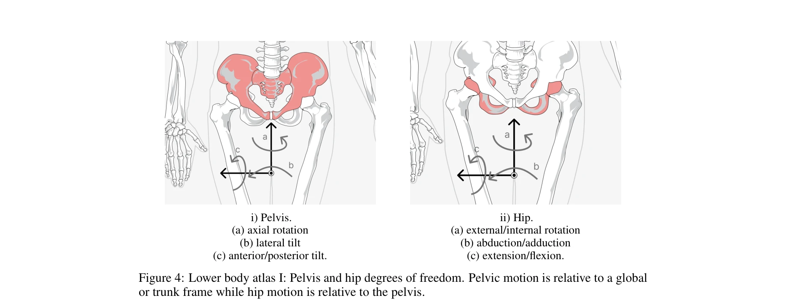

# Human-Level Actuation for Humanoids

> **저자**: MD-Nazmus Sunbeam | **날짜**: 2025-11-10 | **URL**: [https://arxiv.org/abs/2511.06796](https://arxiv.org/abs/2511.06796)

---

## Essence

*Figure 4: Lower body atlas I: Pelvis and hip degrees of freedom. Pelvic motion is relative to a global*

휴머노이드 로봇의 '인간 수준' 구동을 정량화하고 비교 가능하게 하기 위해 생체역학 기반의 포괄적 평가 프레임워크를 제시하고, DoF atlas, Human-Equivalence Envelopes (HEE), Human-Level Actuation Score (HLAS)의 세 가지 핵심 요소로 구성된다.

## Motivation

- **Known**: 휴머노이드 로봇들이 '인간 수준' 구동력을 갖춘다고 주장하지만, 피크 토크나 속도 사양만으로는 실제 작업 관련 자세와 속도에서 토크, 전력, 지구력의 적절한 조합을 전달할 수 있는지 알 수 없다.
- **Gap**: 기존 사양은 특정 자세에서의 측정값과 지속 가능성 정보를 제공하지 않으며, 인간과 로봇 관절을 동일한 참조 틀에서 비교할 표준화된 방법이 부족하다.
- **Why**: 휴머노이드 로봇 개발과 성능 평가를 위해 인간 수준의 구동력을 명확하고 재현 가능하게 정의하는 것이 필수적이며, 이는 설계 사양과 벤치마킹 표준으로 기능할 수 있다.
- **Approach**: ISB 기반 좌표계로 관절을 표준화하고, 작업별 토크-전력 포락선을 측정하며, 작업공간, 효율성, 열 지속 가능성 등 6가지 물리적 기반 요소를 종합하는 HLAS 점수를 개발하였다.

## Achievement

- **DoF atlas**: ISB 기반 규약을 사용하여 상체(어깨, 팔꿈치, 손목), 척추, 하체(고관절, 무릎, 발목)의 모든 주요 관절의 좌표계, 회전축 방향, 기능적 운동 범위를 표준화
- **Human-Equivalence Envelopes (HEE)**: 동일 관절각도 및 각속도(q, ω)에서 인간의 토크와 전력을 동시에 만족하는 요구사항을 정의하되, 걷기, 계단 오르기, 들기, 도달, 손 동작 등 작업별 양의 기계적 일로 가중치를 부여
- **Human-Level Actuation Score (HLAS)**: 작업공간 커버리지, HEE 커버리지, torque-mode bandwidth, 효율성, 열 지속성의 6가지 요소를 집계하여 구동기 설계의 트레이드오프(예: 기어비 vs 대역폭)를 명시적으로 노출
- **측정 프로토콜**: dynamometry, 전력 모니터링, 열 테스트를 이용한 재현 가능한 실험 절차를 제시하여 모든 HLAS 입력값 도출 방법 정의
- **작업 기반 동작 대역**: 인간이 실제로 양의 기계적 일을 수행하는 자세-속도 조합(예: 발목 푸시오프 밴드)으로 평가 영역을 제한하여 부적절한 동작점에서의 과장된 성능 주장 방지

## How

- 75 kg, 1.75 m 기준 성인 남성을 참조 대상으로 설정하고, de Leva 인체측정법으로 정규화된 생체역학 데이터(Nm/kg, W/kg)를 절대값으로 변환
- ISB 관절 좌표계 권장사항과 Grood-Suntay, Cappozzo 등 기존 규약을 채택하여 모든 관절에 통일된 축 방향과 기호 정의
- Walking, stairs, lifting, reaching, hand actions 등 각 작업에서 관절 모멘트, 전력, 각속도 궤적을 정준 생체역학 연구에서 추출
- 관절각도 q와 각속도 ω의 함수로서 지속적 안전 성능 맵(continuous-safe performance maps)을 수집하되, 실제 열적·전기적 조건 반영(따뜻한 구간 작동, 전류 포화 없음, 온도 상승 < 0.5°C/s)
- Impedance control 및 haptics 이론에 기반하여 torque-mode bandwidth와 Z-width를 포함한 상호작용 품질 평가 메트릭 정의
- 다중 관절 휴머노이드의 HLAS 계산 예시를 제시하여 구동기 트레이드오프(기어비, 대역폭, 효율성)가 피크 토크 사양에서는 드러나지 않는 방식을 시연

## Originality

- 생체역학 문헌을 체계적으로 종합하여 정규화된 인간 데이터를 절대적 로봇 요구사항으로 전환하는 방법론이 신규
- 관절각도와 각속도 공간에서 작업별 토크-전력 포락선을 명시적으로 정의함으로써 기존의 단순 피크값 비교를 넘어선 차원의 평가 체계 제시
- 작업 기반 동작 대역(task-derived operating bands)을 도입하여 인간이 실제 사용하지 않는 자세 영역에서의 과장된 성능 주장 방지
- 구동기 설계의 근본적 트레이드오프(토크 밀도, 대역폭, 효율성, 열 용량)를 통합적으로 반영할 수 있는 점수 체계 개발
- ISB 기반 DoF atlas로 인간과 로봇 관절을 동일한 참조 프레임에서 비교 가능하게 표준화

## Limitation & Further Study

- 75 kg, 1.75 m 기준 신체를 기본으로 설정하였으나, 실제 로봇과 인간의 신체 크기 편차가 클 경우 스케일링의 정확도 문제 가능
- 생체역학 문헌의 데이터 편차(측정 방법, 피험자 집단, 속도 범위 등)가 존재하므로 인간 기준 범위의 불확실성이 남음
- 제시된 프로토콜이 구현되려면 고비용의 dynamometry 장비와 전문적 측정 역량이 요구되어 광범위한 도입에 장벽이 있을 수 있음
- Series elastic actuators, 준직접구동, 직접구동, 유압 방식 등 다양한 구동 기술에 대한 평가 사례가 종이에서는 제한적
- **후속 연구 방향**: (1) 다양한 신체 크기와 인구 집단에 대한 확장; (2) 여러 로봇 플랫폼에 HLAS 적용하여 실제 평가 결과 수집; (3) 센서 노이즈와 제어기 지연이 torque-mode bandwidth 추정에 미치는 영향 정량화; (4) 열 지속성과 피로 메커니즘에 대한 더 정교한 모델링

## Evaluation

- Novelty: 4/5
- Technical Soundness: 3/5
- Significance: 4/5
- Clarity: 4/5
- Overall: 4/5

**총평**: 이 논문은 휴머노이드 로봇의 '인간 수준' 구동력을 정량화하기 위한 학제적 프레임워크를 제시하며, 생체역학 기반의 엄격한 기준과 표준화된 측정 프로토콜을 결합하여 로봇 개발과 벤치마킹의 투명성과 재현성을 크게 향상시킨다. 구동기 설계 트레이드오프를 명시적으로 노출하고 작업 맥락에 맞춘 평가를 수행한다는 점에서 기존 피크값 기반 사양과 차별화되며, 휴머노이드 로봇 공학 분야에서 중요한 표준화 기여를 한다.
