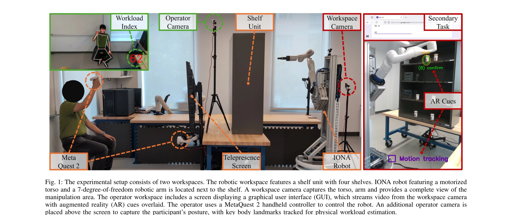
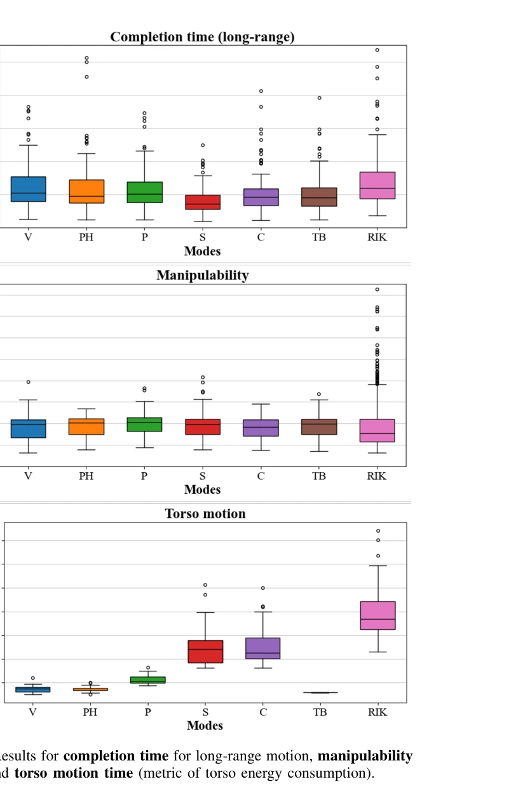

# Human-Robot Collaboration for the Remote Control of Mobile Humanoid Robots with Torso-Arm Coordination

> **저자**: Nikita Boguslavskii, Lorena Maria Genua, Zhi Li | **날짜**: 2025-05-09 | **URL**: [https://arxiv.org/abs/2505.05773](https://arxiv.org/abs/2505.05773)

---

## Essence

*Fig. 1: The experimental setup consists of two workspaces. The robotic workspace features a shelf unit with four shelves*

원격 제어되는 모바일 휴머노이드 로봇의 몸통-팔 협력 제어를 위해 인간-로봇 협업(HRC) 방법들을 제안하고, 사용자 연구(N=17)를 통해 자동 및 수동 제어 방식의 효과를 비교 평가한다.

## Motivation

- **Known**: 공중복도가 있는 로봇 팔의 운동학적 중복성은 도달성과 조작성을 향상시키지만, 몸통-팔의 협력 제어는 복잡한 도전 과제이다. 기존 연구는 주로 말단 이펙터 제어의 공유 자동성에 집중했으며, 움직이는 기저부를 가진 휴머노이드 로봇의 몸통-팔 협력은 충분히 다루어지지 않았다.
- **Gap**: 실시간 원격 조종 상황에서 인간 오퍼레이터는 몸통-팔 협력 조정에 개입할 기회가 제한적이며, 특히 로봇, 작업, 인간 성능에 영향을 미치는 다중의 상황적 고려사항을 비용 함수로 인코딩하기 어렵다.
- **Why**: 의료 및 요양 시설에서 원격 제어 휴머노이드 로봇의 배치가 증가하면서, 효율적인 시스템 성능과 작업 실행을 위해 자율성과 인간 입력의 균형을 맞추는 협력 제어 방법이 필수적이다.
- **Approach**: 인간이 몸통 움직임을 수동으로 제어하는 인간-주도 방식(Velocity Torso Control, Preset Heights)과 로봇이 도달성, 작업 목표, 인간 의도 추론에 기반하여 자율적으로 협력하는 로봇-주도 방식(Proximity, Scaling, Chasing)을 제안한다.

## Achievement

*Fig. 2: Results for completion time for long-range motion, manipulability*

- **HRC 방법론 개발**: Velocity Torso Control, Preset Heights, Proximity, Scaling, Chasing 등 5가지 서로 다른 몸통-팔 협력 제어 방식을 체계적으로 제안하고 구현
- **사용자 연구 기반 평가**: 17명의 참여자를 대상으로 작업 수행 시간, 조작성, 에너지 효율성, 사용자 선호도를 비교 분석
- **상황별 최적 방법 제시**: 사용자 경험 수준, 작업 특성, 로봇 시스템에 따라 선택할 수 있는 다양한 제어 전략 제공

## How

*Fig. 1: The experimental setup consists of two workspaces. The robotic workspace features a shelf unit with four shelves*

- **인간-주도 방식**: Velocity Torso Control은 조이스틱으로 연속적인 몸통 움직임 제어, Preset Heights는 미리 정의된 높이 위치(상/중/하) 사이의 이산적 전환
- **로봇-주도 방식 (반응형)**: Proximity 모드는 팔이 수직 범위 한계에 접근할 때만 몸통 이동 (에너지 효율), 보상 알고리즘으로 말단 이펙터 높이 유지
- **로봇-주도 방식 (지속형)**: Scaling 모드는 인간 팔 작업 공간을 로봇의 전체 수직 범위에 매핑, Chasing 모드는 최적 조작성 유지를 위해 몸통이 팔의 수직 움직임을 추종
- **평가 메트릭**: 작업 완료 시간, 조작성(manipulability), 에너지 소비량, 사용자 주관적 선호도 측정
- **실험 환경**: MetaQuest 2 컨트롤러 기반 원격 제어, 시각적 피드백을 위한 증강현실(AR) 단서, 신체 작업 부하 추정을 위한 자세 추적

## Originality

- 원격 조종 모바일 휴머노이드 로봇의 몸통-팔 협력을 위한 체계적인 HRC 방법론은 기존 연구에서 충분히 다루어지지 않은 영역
- Proximity 모드의 보상 알고리즘은 자율적 몸통 이동이 오퍼레이터의 조종 감각을 방해하지 않도록 설계한 창의적 솔루션
- 단순한 자동화가 아닌 인간 요인(시각적 폐색 회피, 작업 부하 감소, 제어 일관성)을 고려한 다층적 접근

## Limitation & Further Study

- 사용자 연구 표본 크기(N=17)가 상대적으로 작아 일반화 가능성 제한
- 제시된 5가지 방식 외 다른 하이브리드 접근법의 가능성 미탐색
- 실제 의료 환경에서의 장시간 운영 데이터와 성능 안정성 검증 부재
- 인간 의도 추론(inferred human intent) 메커니즘이 추상적이며 구체적 구현 세부사항 부족
- **후속 연구**: 더 많은 참여자와 다양한 작업 시나리오를 포함한 확대 연구, 머신러닝 기반의 적응형 제어 방식 개발, 실제 의료 환경에서의 임상 평가

## Evaluation

- Novelty: 4/5
- Technical Soundness: 3/5
- Significance: 4/5
- Clarity: 4/5
- Overall: 4/5

**총평**: 원격 조종 휴머노이드 로봇의 몸통-팔 협력 문제에 대한 체계적이고 실용적인 HRC 솔루션을 제시하며, 사용자 중심의 평가를 통해 상황별 최적 제어 방식을 제공하는 의의 있는 연구이다. 다만 표본 크기와 실제 환경 검증의 확대가 필요하다.
