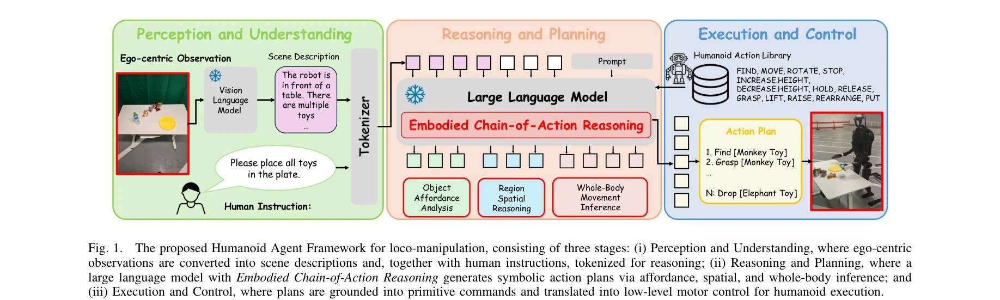

# Humanoid Agent via Embodied Chain-of-Action Reasoning with Multimodal Foundation Models for Zero-Shot Loco-Manipulation

> **저자**: Congcong Wen, Geeta Chandra Raju Bethala, Yu Hao, Niraj Pudasaini, Hao Huang, Shuaihang Yuan, Baoru Huang, Anh Nguyen, Mengyu Wang, Anthony Tzes, Yi Fang | **날짜**: 2025-04-13 | **URL**: [https://arxiv.org/abs/2504.09532](https://arxiv.org/abs/2504.09532)

---

## Essence

*Fig. 1.*

인형로봇의 전신 보행-조작을 위해 기초 모델의 추론 능력과 Embodied Chain-of-Action (CoA) 메커니즘을 통합한 제로샷 에이전트 프레임워크를 제시한다. 고수준 인간 지시를 affordance 분석, 공간 추론, 전신 동작 추론을 통해 체계적인 보행 및 조작 원시 동작 수열로 분해한다.

## Motivation

- **Known**: Foundation model은 로봇에서 전이 가능한 다중모달 표현과 추론 능력을 제공하며, SayCan, PaLM-E 같은 초기 연구는 자연어 지시를 로봇 affordance와 연결시켰다. 인형로봇 제어는 고차원 자유도와 동적 균형 유지의 도전을 가진다.
- **Gap**: 기존 foundation model 기반 연구는 주로 보행 또는 조작 중 하나에만 국한되어 있으며, 인형로봇의 고차원 전신 조율과 장지평선 비정형 환경에서의 일반화 능력이 부족하다. 자연어 지시를 물리적으로 실현 가능한 궤적으로 변환하는 추론 메커니즘이 미흡하다.
- **Why**: 인형로봇 보행-조작은 현실적 로봇 응용의 핵심 과제이며, 장지평선 복잡한 환경에서 인간 의도를 정확히 이해하고 실행할 수 있는 에이전트는 산업 및 서비스 로봇 자동화를 크게 향상시킬 수 있다.
- **Approach**: Perception-Reasoning-Action 패러다임에서 핵심 기여는 Reasoning 단계의 CoA 메커니즘으로, LLM을 통해 고수준 지시를 affordance 분석(객체 조작 가능성), 공간 추론(가려진 객체 위치 추정), 전신 동작 추론(운동학·동역학 실행 가능성)으로 구조화된 원시 동작 수열로 분해한다.

## Achievement

*Fig. 1.*

- **첫 인형로봇 보행-조작 프레임워크**: Foundation model 추론과 CoA Reasoning을 통합한 제로샷 자연어 지시 기반 인형로봇 에이전트의 첫 제안
- **강건한 일반화**: Unitree H1-2, G1 두 인형로봇에서 열린 환경 및 아파트 환경 포함 다양한 보행, 조작, 보행-조작 태스크에서 기저선을 크게 능가하는 성능 달성
- **장지평선·비정형 환경 적응**: 사전 정의된 태스크 템플릿 없이 해석 가능한 기호적 행동 계획을 통해 장지평선 비정형 시나리오에 강건하게 대응

## How

*Fig. 1.*

- Ego-centric 시각 입력을 Vision-Language Model으로 장면 설명으로 변환하고, 인간 지시와 함께 토큰화
- LLM에 object affordance analysis, region spatial reasoning, whole-body movement inference를 포함하는 구조화된 프롬프트 제공
- LLM이 FIND, MOVE, ROTATE, STOP, GRASP, LIFT, PUT 등의 원시 동작을 포함한 기호적 행동 계획 생성
- 생성된 행동 계획을 저수준 모터 제어 명령으로 grounding하여 인형로봇 실행
- Affordance 분석으로 객체 조작 가능성 파악, 공간 추론으로 시각적 폐색 시 숨겨진 객체 위치 추정, 전신 동작 추론으로 운동학·동역학 제약 만족 확인

## Originality

- **COA Reasoning 메커니즘**: Affordance 분석, 공간 추론, 전신 동작 추론을 통합하여 자연어를 물리적으로 실현 가능한 동작으로 변환하는 새로운 추론 구조
- **인형로봇 전신 조율의 통합 접근**: 기존의 보행/조작 분리 해결에서 벗어나 LLM 추론으로 전신 협조를 원시 동작 수열로 체계화
- **공간·affordance 추론 통합**: Vision-Language Model과 LLM을 결합하여 가려진 객체와 비정형 환경 적응

## Limitation & Further Study

- 실제 인형로봇(Unitree H1-2, G1)에서만 검증되었으므로 다양한 플랫폼의 일반화 범위 미확인
- LLM 추론 오류에 대한 견고성과 실패 복구 메커니즘이 제한적으로 보이며, 장시간 태스크 누적 오류에 대한 분석 부재
- 오프라인 foundation model 기반이므로 동적 환경 변화에 대한 온라인 적응 능력 제약
- **후속 연구**: 다양한 인형로봇 플랫폼에서의 일반화, 실패 감지 및 복구 메커니즘 강화, 온라인 학습을 통한 환경 적응 능력 개선

## Evaluation

- Novelty: 4/5
- Technical Soundness: 3/5
- Significance: 4/5
- Clarity: 4/5
- Overall: 4/5

**총평**: 본 논문은 Foundation model의 추론 능력을 인형로봇 보행-조작에 처음 통합한 의미 있는 기여이며, CoA Reasoning 메커니즘을 통해 자연어 지시를 물리적으로 실현 가능한 동작 수열로 변환하는 새로운 접근을 제시한다. 실제 인형로봇에서 강건한 제로샷 일반화를 입증한 점에서 높은 실용적 가치를 갖는다.

## Related Papers

- 🔗 후속 연구: [[papers/1960_Guided_Motion_Diffusion_for_Controllable_Human_Motion_Synthe/review]] — GMD의 텍스트 조건부 모션 생성을 humanoid agent가 multimodal reasoning과 결합하여 더 지능적인 전신 제어로 확장합니다.
- 🔄 다른 접근: [[papers/2161_Trinity_A_Modular_Humanoid_Robot_AI_System/review]] — Embodied Chain-of-Action과 Trinity의 modular AI system은 모두 고수준 추론을 humanoid 제어로 변환하는 서로 다른 아키텍처 접근법입니다.
- 🏛 기반 연구: [[papers/1847_Commanding_Humanoid_by_Free-form_Language_A_Large_Language_A/review]] — 자유형 언어로 humanoid 명령하기 위한 대형 언어 모델 활용이 Embodied Chain-of-Action reasoning의 기반 기술입니다.
- 🔄 다른 접근: [[papers/1974_Hierarchical_Vision-Language_Planning_for_Multi-Step_Humanoi/review]] — 3계층 hierarchical framework가 embodied chain-of-action reasoning과 다른 방식으로 다단계 조작을 해결합니다.
- 🏛 기반 연구: [[papers/1670_SENTINEL_A_Fully_End-to-End_Language-Action_Model_for_Humano/review]] — SENTINEL의 end-to-end language-action model이 embodied CoA reasoning의 기반이 됩니다.
- 🔄 다른 접근: [[papers/2018_HYPERmotion_Learning_Hybrid_Behavior_Planning_for_Autonomous/review]] — 자율 휴머노이드 계획을 이 논문은 CoA 추론으로, HYPERmotion은 하이브리드 행동 계획으로 접근한다.
- 🏛 기반 연구: [[papers/1960_Guided_Motion_Diffusion_for_Controllable_Human_Motion_Synthe/review]] — 자연어를 통한 모션 제어가 humanoid agent의 embodied reasoning과 결합되어 더 지능적인 전신 제어를 가능하게 합니다.
- 🏛 기반 연구: [[papers/1972_Hierarchical_Intention-Aware_Expressive_Motion_Generation_fo/review]] — 체화된 행동 추론이 계층적 의도 인식의 기반 메커니즘이다.
- 🔄 다른 접근: [[papers/1974_Hierarchical_Vision-Language_Planning_for_Multi-Step_Humanoi/review]] — Embodied chain-of-action reasoning이 3계층 hierarchical framework와 다른 방식으로 다단계 조작을 해결합니다.
- 🔄 다른 접근: [[papers/2018_HYPERmotion_Learning_Hybrid_Behavior_Planning_for_Autonomous/review]] — HYPERmotion의 RL+최적화 결합과 Embodied Chain-of-Action의 기초 모델 추론은 자연어 명령 처리를 위한 서로 다른 계층적 접근법입니다.
- 🔗 후속 연구: [[papers/2157_Towards_Proprioception-Aware_Embodied_Planning_for_Dual-Arm/review]] — 고유감각 인식 MLLM을 Humanoid Agent의 chain-of-action reasoning과 결합하면 더 정확한 embodied planning과 실행이 가능합니다.
