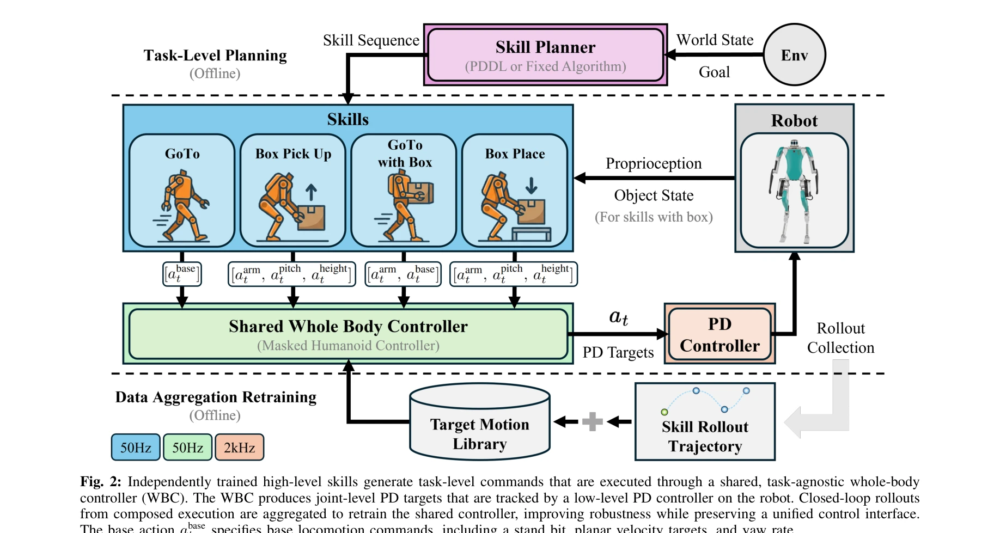
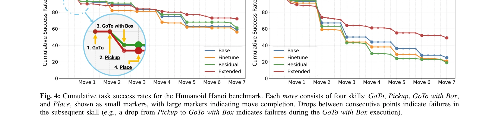

# Humanoid Hanoi: Investigating Shared Whole-Body Control for Skill-Based Box Rearrangement

> **저자**: Minku Kim, Kuan-Chia Chen, Aayam Shrestha, Li Fuxin, Stefan Lee, Alan Fern | **날짜**: 2026-02-23 | **DOI**: [10.48550/arXiv.2602.13850](https://doi.org/10.48550/arXiv.2602.13850)

---

## Essence

*Fig. 2: Independently trained high-level skills generate task-level commands that are executed through a shared, task-ag*

휴머노이드 로봇의 장기 박스 재배열 작업을 위해 공유된 task-agnostic WBC를 통해 재사용 가능한 스킬들을 조합하는 skill-based framework를 제안하고, 분포 이동으로 인한 강건성 저하를 데이터 집계를 통해 해결한다.

## Motivation

- **Known**: 휴머노이드 로봇의 loco-manipulation 작업은 학습 기반 접근법으로 진행되어 왔으나, 독립적으로 훈련된 스킬의 naive 조합은 brittleness 문제를 보이고 스킬 경계에서 동역학 변화로 인한 불안정성을 초래한다.
- **Gap**: 기존 학습 기반 휴머노이드 연구는 수십 번의 스킬 호출에 걸친 장기 robustness한 스킬 시퀀싱을 명확히 입증하지 못했으며, 스킬 유도 분포 변화 하에서 공유 제어기의 coverage를 체계적으로 확장하는 방법이 부족하다.
- **Why**: 장기 실행은 누적된 작은 오류를 복합적으로 드러내며, 정확한 배치 제약과 반복적 스킬 재사용을 요구하는 box rearrangement는 robustness한 composition의 필요성을 강조한다.
- **Approach**: 모든 스킬이 하나의 공유된 task-agnostic WBC를 통해 실행되도록 아키텍처를 설계하고, domain randomization 하에서 closed-loop 스킬 실행 롤아웃을 통한 데이터 집계로 WBC를 재훈련하여 distribution shift에 대응한다.

## Achievement

*Fig. 4: Cumulative task success rates for the Humanoid Hanoi benchmark. Each move consists of four skills: GoTo, Pickup,*

- **공유 WBC 스킬 조합 아키텍처**: 스킬별 별도 low-level 제어기 대신 하나의 unified WBC를 유지함으로써 스킬 경계에서의 동역학 변화를 제거하고 scalable composition을 실현
- **롤아웃 기반 데이터 집계**: closed-loop 스킬 실행 롤아웃으로 WBC 훈련을 확장하여 분포 이동으로 인한 성능 저하를 완화하고, 스킬별 residual 및 fine-tuning 기반 baseline을 능가
- **Humanoid Hanoi 벤치마크 도입**: Tower-of-Hanoi 스타일의 long-horizon 박스 재배열 벤치마크 제공, 누적 실행 오류로 인한 off-nominal 상태 노출 및 실패 모드 분석

## How

*Fig. 2: Independently trained high-level skills generate task-level commands that are executed through a shared, task-ag*

- High-level에서 GoTo (unloaded/with-box), Pickup, Place 스킬을 독립적으로 훈련하여 task-level 커맨드 생성
- 모든 스킬 커맨드를 항상 활성화된 shared WBC로 라우팅하여 proprioceptive state와 스킬 커맨드로부터 joint-level PD 타겟 출력
- Domain randomization 하에서 composed 스킬 실행의 closed-loop 롤아웃을 수집하여 shared WBC 훈련 데이터에 집계
- 원래 WBC 목적함수 하에서 데이터 집계된 데이터로 계속 최적화하여 스킬별 제어기 수정 없이 robustness 향상
- Tower-of-Hanoi 규칙을 따르는 시뮬레이션 및 Digit V3 하드웨어에서 장기 autonomous 박스 재배열 실행 및 평가

## Originality

- 휴머노이드 box loco-manipulation에서 공유 WBC의 체계적 탐색 및 demonstration: 기존 연구는 스킬별 별도 제어기를 사용하거나 task-specific end-to-end 정책을 훈련했으나, 본 연구는 unified WBC의 scalability와 robustness 이점을 입증
- Distribution shift 대응의 새로운 관점: 스킬별 residual 정책이나 per-skill fine-tuning 대신, WBC를 maintenance 문제로 재정의하고 closed-loop 롤아웃 기반 데이터 집계로 해결
- Humanoid Hanoi 벤치마크: Tower-of-Hanoi 제약을 실제 로봇 조작에 적용하여 정밀한 배치 및 반복 스킬 재사용을 요구하는 long-horizon 평가 프레임워크 제공

## Limitation & Further Study

- 스킬 선택 및 시퀀싱 전략: 논문은 high-level planning에 대해 미흡하며, 임의의 스킬 재시퀀싱 능력의 한계를 구체적으로 논의하지 않음
- WBC 재훈련의 계산 비용: 롤아웃 기반 데이터 집계와 재최적화의 computational complexity 및 scalability를 larger 스킬 라이브러리에서 평가하지 않음
- Sim-to-real transfer의 제한: 시뮬레이션과 하드웨어 결과의 성능 갭이 명시적으로 분석되지 않으며, domain randomization의 충분성 검증 부족
- Failure mode analysis 미흡: 실패 모드 분류는 제시되었으나, 근본 원인 규명 및 targeted 개선 방안이 충분히 구체화되지 않음
- 후속 연구 방향: 적응형 domain randomization, 더 큰 규모의 스킬 라이브러리에서의 composition, end-to-end learning과의 성능 비교 필요

## Evaluation

- Novelty: 4/5
- Technical Soundness: 3/5
- Significance: 4/5
- Clarity: 4/5
- Overall: 4/5

**총평**: 본 논문은 공유 WBC를 통한 모듈식 스킬 조합 아키텍처의 systematic exploration과 데이터 집계 기반 robustness 개선이라는 실용적 기여를 제시하며, Humanoid Hanoi 벤치마크를 통해 long-horizon 장기 자율 실행의 가능성을 입증한다. 다만 high-level planning, 계산 scalability, sim-to-real gap에 대한 심화 분석은 부족하다.
