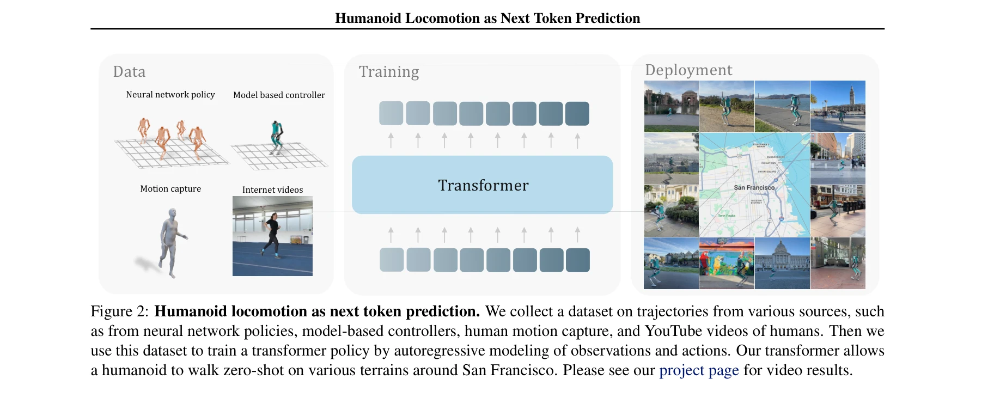
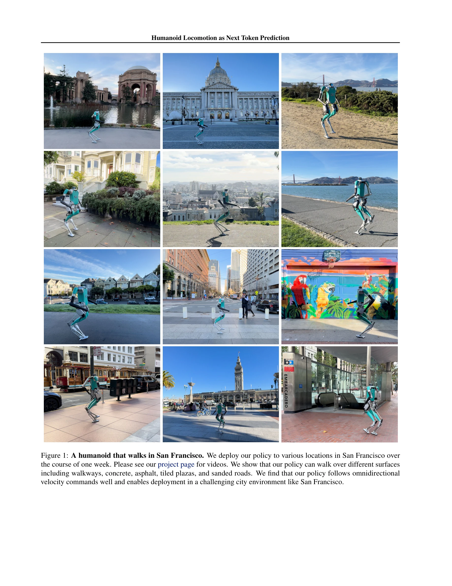

# Humanoid Locomotion as Next Token Prediction

> **저자**: Ilija Radosavovic, Bike Zhang, Baifeng Shi, Jathushan Rajasegaran, Sarthak Kamat, Trevor Darrell, Koushil Sreenath, Jitendra Malik | **날짜**: 2024-02-29 | **URL**: [https://arxiv.org/abs/2402.19469](https://arxiv.org/abs/2402.19469)

---

## Essence

*Figure 2: Humanoid locomotion as next token prediction. We collect a dataset on trajectories from various sources, such*

Humanoid 로봇 제어를 언어 모델의 next token prediction처럼 다루어, causal transformer를 통해 sensorimotor 궤적을 자동 회귀적으로 예측한다. 시뮬레이션, 모션캡처, 유튜브 영상 등 다양한 소스의 불완전한 데이터로 학습하여 실제 humanoid 로봇이 zero-shot으로 샌프란시스코에서 보행할 수 있게 한다.

## Motivation

- **Known**: Transformer 모델이 언어, 시각 데이터 등 다양한 모달리티에서 강력한 생성 능력을 보였으며, 최근 강화학습 기반 humanoid 제어도 성공적이다. 하지만 sensorimotor 표현 학습을 통한 실제 humanoid 제어는 거의 탐구되지 않았다.
- **Gap**: 기존 humanoid 제어는 강화학습이나 모델 기반 제어에 의존하며, 다양한 소스(특히 액션 정보가 없는 인간 영상)의 불완전한 데이터를 활용하는 방식이 부족하다. 생성 모델 기반의 sensorimotor 궤적 모델링이 실제 humanoid 제어에 효과적인지 검증되지 않았다.
- **Why**: 대규모 인터넷 데이터로부터 학습하는 언어 모델의 성공 사례를 로봇 제어에 확장할 수 있다면, 더 풍부한 데이터로부터 강인한 제어 정책을 학습할 수 있다. 이는 로봇 제어의 데이터 수집 비용을 감소시키고 일반화 능력을 향상시킬 수 있다.
- **Approach**: Sensorimotor 궤적을 토큰화하고 causal transformer를 통해 자동 회귀적으로 다음 토큰을 예측한다. 불완전한 데이터(액션이 없는 영상)를 mask token으로 처리하여 동일한 학습 프레임워크로 통합하고, 다양한 소스(정책, 제어기, 모션캡처, 유튜브)의 궤적으로 학습한다.

## Achievement

*Figure 1: A humanoid that walks in San Francisco. We deploy our policy to various locations in San Francisco over*

- **Zero-shot 실제 배포**: 학습하지 않은 환경인 샌프란시스코의 다양한 지형(보도, 콘크리트, 아스팔트 등)에서 실제 humanoid 로봇이 성공적으로 보행함을 시연했다.
- **극소량 데이터로의 전이학습**: 27시간의 보행 데이터만으로도 실제 환경에 전이 가능한 정책을 학습할 수 있음을 입증했다.
- **명령 일반화**: 학습 중 보지 못한 역방향 보행 등의 새로운 명령으로 일반화 가능함을 보였다.
- **불완전 데이터 활용**: 액션 정보가 없는 유튜브 인간 영상도 효과적으로 활용할 수 있으며, 시뮬레이션 기반 강화학습 기법과 동등한 성능을 달성했다.

## How

*Figure 2: Humanoid locomotion as next token prediction. We collect a dataset on trajectories from various sources, such*

- Sensorimotor 궤적을 토큰 시퀀스로 변환: T = (o₁, a₁, o₂, a₂, ..., oₜ, aₜ) → t = (t₁, t₂, ..., tₖ)
- Causal transformer를 통한 자동 회귀 예측: p(t) = ∏ₖ p(tₖ|tₖ₋₁, ..., t₁)
- Gaussian 분포 가정 하에 MSE 손실 최소화: L = (1/K)∑ₖ(t̂ₖ - tₖ)²
- Missing modality 처리: 액션이 없는 궤적에 mask token [M] 삽입하여 통일된 형식으로 변환 (o₁, [M], o₂, [M], ...)
- 다중 소스 데이터 통합: 신경망 정책, 모델 기반 제어기, 모션캡처, 유튜브 영상의 궤적을 inverse kinematics로 retarget하여 단일 dataset 구성
- Test time에서 자동 회귀적 액션 실행: 모델이 예측한 액션만 사용하고 sensory 예측은 무시

## Originality

- **Language modeling 패러다임의 확장**: 언어의 next token prediction을 humanoid 제어의 sensorimotor 궤적에 직접 적용한 새로운 관점
- **Missing modality 처리의 우아한 해법**: Mask token을 통해 불완전한 데이터(특히 인터넷 영상)를 자연스럽게 학습 프레임워크에 통합
- **다양한 이질적 데이터 소스의 통합**: 강화학습 정책, 전통 제어기, 인간 모션캡처, 유튜브 영상을 단일 framework로 통합하여 학습
- **Joint distribution 모델링**: 조건부 액션 분포가 아닌 전체 sensorimotor 결합 분포를 모델링하여 더 풍부한 세계 모델 학습

## Limitation & Further Study

- **데이터 소스의 제한성**: 주로 시뮬레이션 데이터와 제한된 인간 영상에 기반하며, 더 다양한 실제 환경 데이터의 확보 필요
- **일반화 범위**: 샌프란시스코 환경에서의 보행만 시연되었으며, 다른 도시나 극한 환경, 계단/경사로 등 복잡한 지형에서의 성능 미평가
- **토큰화 방식의 단순성**: 단순 회귀 방식을 사용하여 quantization이나 vector quantization 등 더 고급 토큰화의 효과 미탐색
- **비교 실험의 제한**: 주로 시뮬레이션에서의 비교 분석이며, 실제 환경에서의 다른 최신 기법(예: 다른 강화학습 방식)과의 직접 비교 부족
- **Scaling 특성의 미흡한 분석**: Transformer의 scaling law가 sensorimotor 도메인에서 어떻게 작동하는지 제한적으로만 분석
- **후속연구 방향**: (1) 더 큰 규모의 인터넷 인간 영상 데이터 활용, (2) 다른 humanoid 로봇 플랫폼으로의 전이, (3) 조작(manipulation) 등 다른 로봇 과제로의 확장, (4) 모달리티 간 정렬 전략의 개선

## Evaluation

- Novelty: 4/5
- Technical Soundness: 3/5
- Significance: 4/5
- Clarity: 4/5
- Overall: 4/5

**총평**: 본 논문은 언어 모델의 next token prediction 패러다임을 humanoid 제어에 창의적으로 적용하여, 불완전한 다중 소스 데이터로 학습한 모델이 실제 환경에서 zero-shot 보행을 가능하게 함을 입증했다. 생성 모델 기반의 로봇 제어 학습에 대한 유망한 방향을 제시하며, 실제 배포 결과는 매우 인상적이다.

## Related Papers

- 🔄 다른 접근: [[papers/1988_HuMam_Humanoid_Motion_Control_via_End-to-End_Deep_Reinforcem/review]] — transformer 기반 토큰 예측과 Mamba 기반 강화학습으로 휴머노이드 제어의 서로 다른 패러다임을 제시한다.
- 🏛 기반 연구: [[papers/2050_Learning_from_Massive_Human_Videos_for_Universal_Humanoid_Po/review]] — 대규모 인간 비디오 학습이 next token prediction 방식의 데이터 기반을 제공한다.
- 🔗 후속 연구: [[papers/2005_Humanoid_World_Models_Open_World_Foundation_Models_for_Human/review]] — HWM의 egocentric video prediction이 next token prediction의 multimodal data 활용을 video world model로 확장한 발전된 형태이다.
- 🏛 기반 연구: [[papers/1666_Scaling_Large_Motion_Models_with_Million-Level_Human_Motions/review]] — large motion model의 million-level human motion data scaling이 next token prediction의 대규모 데이터 학습을 위한 기초를 제공한다.
- 🔗 후속 연구: [[papers/1968_Harmon_Whole-Body_Motion_Generation_of_Humanoid_Robots_from/review]] — Harmon의 language-driven motion generation이 next token prediction 방식을 언어 입력으로 확장합니다.
- 🏛 기반 연구: [[papers/1683_SoccerDiffusion_Toward_Learning_End-to-End_Humanoid_Robot_So/review]] — 휴머노이드 보행을 next token prediction으로 모델링하는 기초적인 접근법을 제공한다.
- 🔄 다른 접근: [[papers/1643_RL_from_Physical_Feedback_Aligning_Large_Motion_Models_with/review]] — Physical feedback 대신 next token prediction으로 motion generation을 해결
- 🔄 다른 접근: [[papers/1789_Adapting_Humanoid_Locomotion_over_Challenging_Terrain_via_Tw/review]] — terrain 적응을 위해 하나는 transformer sequence modeling, 다른 하나는 next token prediction을 사용합니다.
- 🔄 다른 접근: [[papers/1935_From_Language_to_Locomotion_Retargeting-free_Humanoid_Contro/review]] — 언어에서 로코모션으로의 직접 변환과 다음 토큰 예측 방식의 휴머노이드 보행은 서로 다른 언어 처리 패러다임을 사용한다.
- 🏛 기반 연구: [[papers/1968_Harmon_Whole-Body_Motion_Generation_of_Humanoid_Robots_from/review]] — Next token prediction 방식의 humanoid control이 Harmon의 language-driven motion generation 기반이 됩니다.
- 🔄 다른 접근: [[papers/1988_HuMam_Humanoid_Motion_Control_via_End-to-End_Deep_Reinforcem/review]] — Mamba 인코더 기반 강화학습과 transformer 기반 next token prediction으로 보행 제어 접근법이 다르다.
- 🔄 다른 접근: [[papers/1994_Humanoid_Goalkeeper_Learning_from_Position_Conditioned_Task-/review]] — next token prediction 방식과 달리 goalkeeper는 position-conditioned task-motion constraints 학습을 통한 특화된 접근법을 사용한다.
- 🔗 후속 연구: [[papers/2005_Humanoid_World_Models_Open_World_Foundation_Models_for_Human/review]] — next token prediction의 transformer 기반 접근법을 HWM이 egocentric video prediction과 world modeling으로 확장한 발전된 형태이다.
- 🏛 기반 연구: [[papers/2035_Kimodo_Scaling_Controllable_Human_Motion_Generation/review]] — Next Token Prediction 기반 휴머노이드 로코모션이 Kimodo의 텍스트 조건부 모션 생성에 언어 모델 기반 아키텍처 제공
- 🏛 기반 연구: [[papers/2050_Learning_from_Massive_Human_Videos_for_Universal_Humanoid_Po/review]] — 다음 토큰 예측 방식의 locomotion 학습 원리가 UH-1 모델의 텍스트-제어 변환 메커니즘에 대한 이론적 기반을 제공한다.
- 🔗 후속 연구: [[papers/2053_Learning_Human-Like_Badminton_Skills_for_Humanoid_Robots/review]] — 배드민턴 기술의 점진적 학습이 next token prediction을 통한 더 일반적인 운동 생성으로 확장될 수 있다.
- 🔄 다른 접근: [[papers/2057_Learning_Humanoid_Navigation_from_Human_Data/review]] — 휴머노이드 내비게이션에서 diffusion model 기반 접근법 대신 다음 토큰 예측을 통한 locomotion 방법을 제시한다.
- 🔄 다른 접근: [[papers/2156_Towards_Motion_Turing_Test_Evaluating_Human-Likeness_in_Huma/review]] — Motion Turing Test는 관찰자 기반 인간다움 평가를 제안하고 Humanoid Locomotion as Next Token Prediction은 언어 모델 기반 접근법을 사용하는 서로 다른 평가 방식입니다.
- 🔄 다른 접근: [[papers/2136_PHUMA_Physically-Grounded_Humanoid_Locomotion_Dataset/review]] — PHUMA는 인터넷 비디오에서 physics-constrained retargeting을 사용하는 반면 이 논문은 next token prediction 접근법을 사용함
