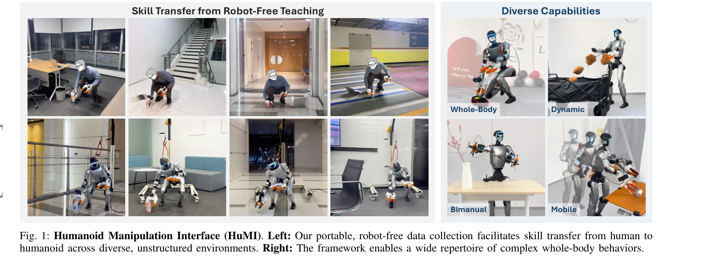
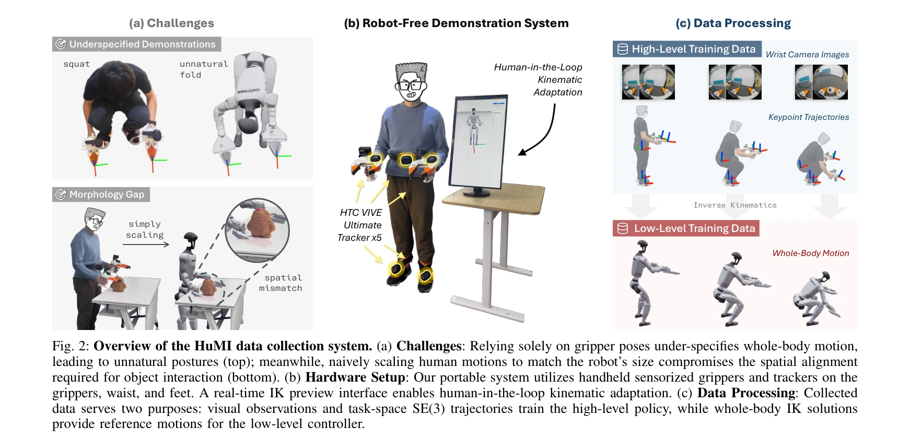

# Humanoid Manipulation Interface: Humanoid Whole-Body Manipulation from Robot-Free Demonstrations

> **저자**: Ruiqian Nai, Boyuan Zheng, Junming Zhao, Haodong Zhu, Sicong Dai, Zunhao Chen, Yihang Hu, Yingdong Hu, Tong Zhang, Chuan Wen, Yang Gao | **날짜**: 2026-02-12 | **DOI**: [10.48550/arXiv.2602.06643](https://doi.org/10.48550/arXiv.2602.06643)

---

## Essence

*Fig. 1: Humanoid Manipulation Interface (HuMI). Left: Our portable, robot-free data collection facilitates skill transfe*

HuMI는 로봇 없이 휴대용 하드웨어로 수집한 인간 전신 동작 데이터를 이용해 인형형 로봇에게 다양한 전신 조작 기술을 학습시키는 프레임워크이다. 계층적 학습 파이프라인과 IK 기반 적응을 통해 인간-로봇 간 신체형 차이를 극복하고 70% 성공률을 달성한다.

## Motivation

- **Known**: 현재 인형형 로봇 전신 조작은 주로 원격조종(teleoperation) 또는 시뮬레이션-투-실제 RL에 의존하며, 이러한 방법들은 하드웨어 로지스틱과 복잡한 보상 공학으로 인해 제한된 환경에서만 제한된 기술을 시연한다.
- **Gap**: 기존 로봇 없는 데이터 수집 시스템은 엔드이펙터 궤적만 기록하지만, 전신 조작은 몸통, 다리, 발의 움직임이 중요하고, 인간-로봇 신체형 불일치와 추적 오류로 인한 실현 불가능성 문제가 해결되지 않았다.
- **Why**: 전신 조작 기술이 필요한 인형형 로봇의 다양한 작업(쪼그려앉기, 무릎 꿇기, 이동 등)을 자율적으로 수행하려면 효율적인 데이터 수집과 신체형 차이 극복이 필수적이며, 이는 로봇 조작의 실용성을 크게 향상시킨다.
- **Approach**: HTC Vive Ultimate Tracker를 이용한 골반, 손, 발 5지점의 전신 추적으로 인간 동작을 수집하고, 실시간 IK 미리보기 인터페이스로 타당성을 검증한 후, Diffusion Policy 기반 고수준 정책과 조작 중심의 저수준 컨트롤러를 계층적으로 학습시킨다.

## Achievement

*Fig. 1: Humanoid Manipulation Interface (HuMI). Left: Our portable, robot-free data collection facilitates skill transfe*

- **3배 향상된 데이터 수집 효율**: 원격조종 대비 3배 높은 데이터 수집 처리량 달성
- **로봇 없는 휴대용 시스템**: 백팩 하나에 들어가는 휴대용 하드웨어로 다양한 환경에서 데이터 수집 가능
- **다양한 전신 작업 지원**: 무릎 꿇기, 쪼그려앉기, 던지기, 걷기, 양팔 조작 등 5가지 작업 성공
- **미지 환경에서의 강한 일반화**: 미지 물체 및 환경에서 70% 성공률 달성
- **신체형 차이 극복**: IK 적응과 조작 중심 컨트롤러로 인간-로봇 간 신체형 불일치 해결

## How

*Fig. 2: Overview of the HuMI data collection system. (a) Challenges: Relying solely on gripper poses under-specifies who*

- 5지점 전신 추적(pelvis, hands, feet)을 통해 그리퍼 궤적만으로는 부족한 전신 동작 정보 수집
- HTC Vive Ultimate Tracker 기반 base-station-free 독립형 추적으로 다양한 환경에서의 휴대성 확보
- 실시간 IK 미리보기 인터페이스를 통한 인간-인-더-루프 kinematic adaptation으로 타당성 검증
- 역기구학(IK)을 이용해 그리퍼, 골반, 발 궤적을 전체 로봇 자유도로 증강
- Diffusion Policy를 고수준 정책으로 사용하여 이미지 관측에서 목표 키포인트 궤적으로 매핑
- 조작 중심의 저수준 컨트롤러로 목표 궤적 추적 시 높은 정밀도와 안정성 유지
- 고수준 정책과 저수준 컨트롤러 간의 통합을 위해 action chunking 경계에서의 불연속성 완화

## Originality

- 인형형 로봇 전신 조작을 위한 최초의 로봇 없는 시연 시스템 제시
- 전신 추적 기반 다중 지점(pelvis, hands, feet) 데이터 수집으로 기존 단순 그리퍼 기반 시스템 확장
- 실시간 IK 미리보기 인터페이스를 통한 새로운 human-in-the-loop kinematic adaptation 방식
- 조작 중심의 저수준 컨트롤러 설계로 action chunking 경계의 불연속성 문제 해결
- 인간-로봇 신체형 차이 극복을 위한 체계적 접근법 제시(IK 기반 적응, 공간 정렬 유지)

## Limitation & Further Study

- HTC Vive Ultimate Tracker의 추적 지연시간(latency)과 노이즈가 정밀한 조작에 영향을 미칠 수 있음
- IK 기반 적응이 모든 신체형 불일치를 해결하지 못하며, 특히 팔 길이 차이가 큰 경우 도달 실패 가능
- 5가지 작업만 평가했으며, 더 복잡하거나 동적인 작업에 대한 확장성 미검증
- 미지 환경에서의 70% 성공률은 여전히 실제 배포에는 낮을 수 있음
- 저수준 컨트롤러의 4-6cm 추적 오류가 미세한 조작(정밀 그리핑 등)에 영향
- 후속연구: 더 정밀한 독립형 추적 시스템 개발, 더 다양한 신체형에 대한 적응 메커니즘 강화, 실시간 환경 피드백 기반 적응 학습

## Evaluation

- Novelty: 4/5
- Technical Soundness: 3/5
- Significance: 4/5
- Clarity: 4/5
- Overall: 4/5

**총평**: HuMI는 로봇 없는 휴대용 데이터 수집과 계층적 학습을 결합하여 인형형 로봇의 전신 조작을 효율적으로 학습시키는 혁신적인 프레임워크이다. 3배 높은 데이터 수집 효율과 미지 환경에서의 강한 일반화는 로봇 학습의 실용성을 크게 향상시키며, 신체형 차이 극복을 위한 체계적 접근법이 학문적 기여도 크다.
