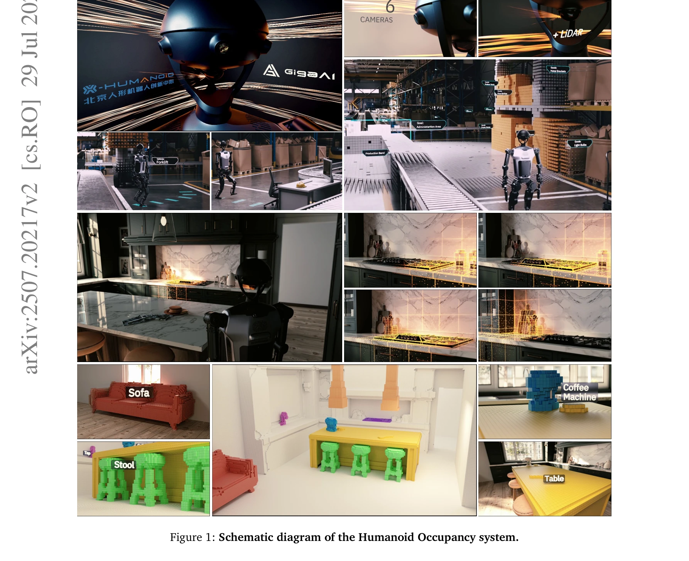
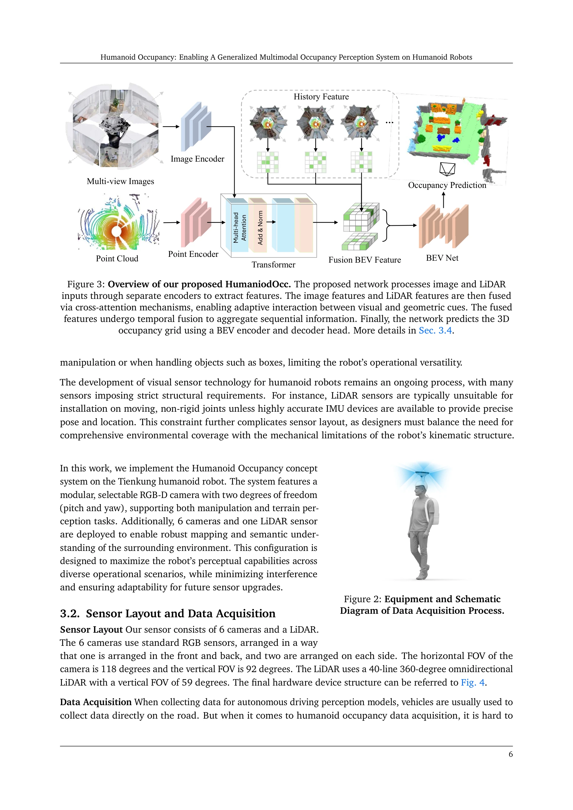
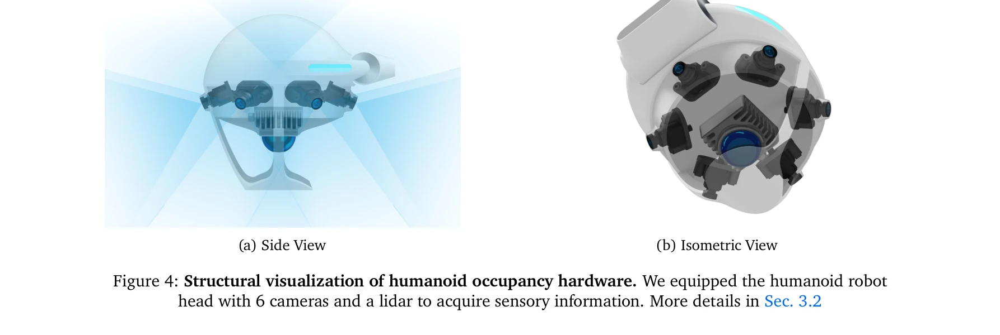

# Humanoid Occupancy: Enabling A Generalized Multimodal Occupancy Perception System on Humanoid Robots

> **저자**: Wei Cui, Haoyu Wang, Wenkang Qin, Yijie Guo, Gang Han, Wen Zhao, Jiahang Cao, Zhang Zhang, Jiaru Zhong, Jingkai Sun, Pihai Sun, Shuai Shi, Botuo Jiang, Jiahao Ma, Jiaxu Wang, Hao Cheng, Zhichao Liu, Yang Wang, Zheng Zhu, Guan Huang, Jian Tang, Qiang Zhang | **날짜**: 2025-07-27 | **URL**: [https://arxiv.org/abs/2507.20217](https://arxiv.org/abs/2507.20217)

---

## Essence

*Figure 1: Schematic diagram of the Humanoid Occupancy system.*

휴머노이드 로봇을 위한 일반화된 다중모달 occupancy 인식 시스템을 제시하며, 하드웨어 설계, 데이터셋 구축, 다중모달 fusion 네트워크를 통합한 완전한 환경 인식 프레임워크를 제공한다.

## Motivation

- **Known**: 휴머노이드 로봇은 다양한 시각 인식 모듈을 필요로 하며, RGB-D 카메라, LiDAR, 파노라마 카메라 등의 다중 센서 기술이 활용되고 있다. Occupancy 기반 표현은 3D 기하학적 정보와 의미론적 정보를 함께 제공할 수 있다.
- **Gap**: 휴머노이드 로봇의 운동학적 간섭(kinematic interference), 폐색(occlusion) 문제를 해결하기 위한 체계적인 센서 배치 전략이 부족하며, 휴머노이드 로봇 특화 panoramic occupancy 데이터셋이 존재하지 않는다.
- **Why**: 휴머노이드 로봇의 manipulation, locomotion, navigation 등 다양한 작업을 효과적으로 지원하기 위해서는 통일된 환경 인식 능력이 필수적이며, 이는 복잡한 실제 환경에서의 배포를 가능하게 한다.
- **Approach**: 표준 3단계 시각 시스템 아키텍처(하드웨어 설계, 데이터셋 구축, 다중모달 fusion 네트워크)를 통해 occupancy 기반 표현을 활용하며, 휴머노이드 로봇의 구조적 특성을 고려한 센서 배치 전략과 temporal 정보 통합을 적용한다.

## Achievement

*Figure 2: Equipment and Schematic*

- **첫 번째 휴머노이드 로봇 특화 Panoramic Occupancy 데이터셋**: 휴머노이드 로봇을 위한 벤치마크 자원을 제공하여 향후 연구의 기초를 마련했다.
- **다중모달 Fusion 기술**: RGB, depth, LiDAR 등 이질적인 센서 정보를 통합하여 grid 기반의 occupancy 출력(occupancy 상태 및 의미론적 레이블 인코딩)을 생성한다.
- **센서 배치 전략**: 휴머노이드 로봇의 운동학적 간섭과 폐색 문제를 효과적으로 완화하는 혁신적인 센서 레이아웃 전략을 개발했다.
- **시스템 통합 검증**: Tienkung 휴머노이드 로봇 플랫폼에 통합 및 테스트하여 복잡한 환경에서의 우수한 환경 인식 및 네비게이션 성능을 입증했다.

## How

*Figure 4: Structural visualization of humanoid occupancy hardware. We equipped the humanoid robot*

- 표준화된 하드웨어 컴포넌트 설계를 통해 다양한 센서(RGB, depth, LiDAR, panoramic camera)를 휴머노이드 로봇에 최적으로 배치
- Occupancy grid 표현을 기반으로 multi-modal feature fusion을 수행하여 의미론적 및 기하학적 정보를 통합
- Temporal information integration을 통해 동적 장면 변화를 반영하고 robust perception 구현
- 전용 annotation pipeline을 통해 panoramic occupancy 데이터셋을 체계적으로 구축
- Path planning, obstacle avoidance, manipulation 등 downstream task를 직접 지원하는 dense spatial distribution 출력 생성

## Originality

- 휴머노이드 로봇의 운동학적 간섭과 폐색 문제를 체계적으로 분석하고 이를 해결하는 센서 배치 전략을 처음으로 제시
- Occupancy 기반 표현을 manipulation, locomotion, navigation의 다양한 작업에 통일적으로 적용하는 통합 프레임워크 제안
- 휴머노이드 로봇 특화 첫 번째 panoramic occupancy 데이터셋 구축으로 표준화된 벤치마크 제공
- Bird's Eye View(BEV)의 한계를 극복하는 voxel/grid 기반 occupancy 표현으로 수직 구조 및 고차원 의미 정보 포함

## Limitation & Further Study

- 실제 배포 환경의 다양성(실내/실외, 동적/정적 장면)에 대한 추가 평가 필요
- 시스템의 computational cost와 실시간 처리 성능에 대한 상세한 분석 부족
- 다른 humanoid robot 플랫폼으로의 cross-platform 일반화 가능성 검증 필요
- 다른 spatial representation 방법(3DGS, NeRF)과의 성능 비교 연구 추가 필요
- 센서 개수 및 해상도 변화에 따른 성능 민감도 분석 필요

## Evaluation

- Novelty: 4/5
- Technical Soundness: 3/5
- Significance: 4/5
- Clarity: 4/5
- Overall: 4/5

**총평**: 본 논문은 휴머노이드 로봇의 독특한 구조적 도전과제를 해결하는 실질적이고 포괄적인 occupancy 기반 인식 시스템을 제시하며, 첫 번째 휴머노이드 로봇 특화 데이터셋 제공으로 해당 분야에 중요한 기여를 한다.
