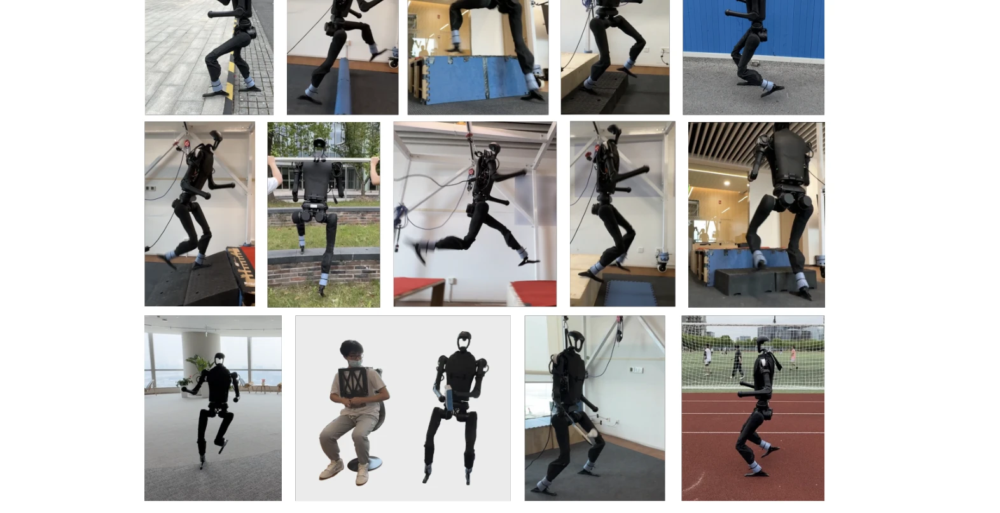
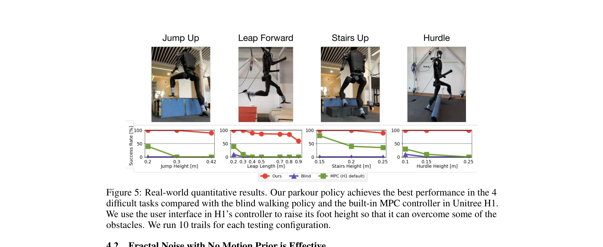
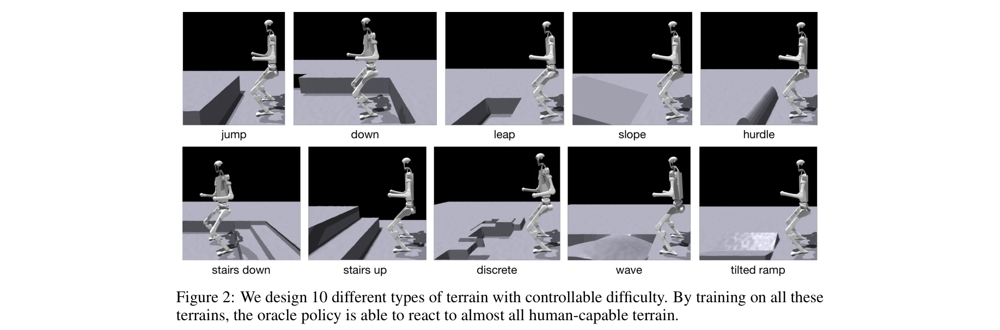

# Humanoid Parkour Learning

> **저자**: Ziwen Zhuang, Shenzhe Yao, Hang Zhao | **날짜**: 2024-06-15 | **URL**: [https://arxiv.org/abs/2406.10759](https://arxiv.org/abs/2406.10759)

---

## Essence

*Figure 1: We present a single vision-based end-to-end whole-body-control parkour policy for humanoid robots*

본 논문은 시각 기반 end-to-end 제어 정책을 통해 인간형 로봇이 모션 프리어 없이 다양한 파쿠르 기술(점프, 허들 뛰기, 갭 넘기 등)을 수행할 수 있도록 학습하는 통합 프레임워크를 제시한다.

## Motivation

- **Known**: 기존 인간형 로봇 이동 방법은 단일 파쿠르 트랙에 대한 궤적 최적화이거나 대량의 모션 참고자료가 필요한 강화학습에 한정되어 있다. 사족 로봇은 최근 심도 센싱을 통해 민첩한 이동을 달성했지만 인간형 로봇의 파쿠르 학습은 아직 미개척 분야이다.
- **Gap**: 인간형 로봇 강화학습은 평면 이동에만 제한되어 있으며, 다양한 파쿠르 기술을 통합적으로 학습하면서 모션 프리어를 제거하고 실제 로봇에 배포 가능한 방법이 부재하다. 또한 복잡한 보상 엔지니어링(발 들기 장려 등)의 의존도를 줄이는 방법이 필요하다.
- **Why**: 파쿠르는 인간 수준의 운동 능력을 요구하는 복합적 과제로, 이를 해결하는 것은 위험한 환경에서의 인간 대체 작업이나 일상적 인간 활동 수행을 위한 구체화된 지능 시스템 개발에 중요하며, 로봇 학습의 경계를 확장하는 의미 있는 벤치마크이다.
- **Approach**: 3단계 학습 파이프라인을 통해 (1) fractal noise를 활용한 평면 보행 정책 사전학습, (2) 자동 커리큘럼과 10가지 지형을 통한 파쿠르 정책 학습, (3) DAgger를 이용한 깊이 센서 기반 비전 정책 증류를 수행하며, PPO 알고리즘과 GRU 기반 신경망 아키텍처를 활용한다.

## Achievement

*Figure 5: Real-world quantitative results. Our parkour policy achieves the best performance in the 4*

- **파쿠르 성능**: 0.42m 플랫폼 점프, 허들 뛰기, 0.8m 갭 넘기, 1.8m/s 주행 속도 달성
- **모션 프리어 제거**: 기존 방법과 달리 인간 또는 동물 모션 참고자료 없이 다양한 파쿠르 기술 학습
- **제로샷 sim-to-real 전이**: 시뮬레이션에서 학습한 정책이 실제 로봇에 추가 학습 없이 직접 배포 가능
- **통합 시스템**: 조이스틱 회전 명령에 따라 자율적으로 파쿠르 기술을 선택하고 다양한 지형에서 견고한 동작 수행
- **이동 조작 전이**: 암(팔) 액션을 무시할 수 있게 함으로써 인간형 모바일 조작 작업으로의 용이한 전이 가능성 입증

## How

*Figure 2: We design 10 different types of terrain with controllable difficulty. By training on all these*

- **Fractal noise 기반 지형 학습**: 보상 항에서 발 들기를 명시적으로 장려하지 않으면서도, fractal noise가 추가된 높이장 지형을 통해 자연스러운 보행 동작 유도
- **다중 지형 설계**: 10가지 상이한 파쿠르 관련 지형(점프 업/다운, 허들, 갭, 계단 등)을 구현하고 점진적 난이도 조절
- **Scandots 기반 인식**: 높이장 정보를 GPU 메모리에서 직접 활용하는 scandots를 통해 효율적인 지형 인식
- **자동 커리큘럼**: 로봇의 학습 진행 상황에 따라 지형 난이도를 자동으로 조정
- **GRU 기반 아키텍처**: 본체 선형 속도 추정을 위해 GRU와 MLP를 결합하여 시간적 맥락 캡처
- **DAgger 증류**: 지면 진실 scandots 정보를 가진 oracle 정책을 Intel RealSense D435i 깊이 카메라 노이즈를 시뮬레이션하여 배포 가능한 비전 정책으로 증류
- **PPO 학습**: Proximal Policy Optimization을 통한 정책 최적화로 안정적인 학습 달성
- **도메인 랜더마이제이션**: 실제 로봇 환경 변화에 대한 강건성 확보

## Originality

- **모션 프리어 제거**: 기존 인간형 로봇 강화학습의 모션 참고자료 의존성을 타파하고 fractal noise만으로 다양한 파쿠르 기술 유도
- **통합 파쿠르 프레임워크**: 별도의 스킬 엔지니어링 없이 10가지 이상의 인간 수준 파쿠르 동작을 단일 정책으로 수행
- **비전 기반 배포**: 높이장 기반 oracle 정책에서 실제 깊이 센서 기반 정책으로의 효율적 증류 방법론
- **Zero-shot sim-to-real**: 추가적인 실제 로봇 학습 없이 직접 배포 가능한 시뮬레이션 정책 개발

## Limitation & Further Study

- **직선 트랙 제약**: 훈련 중 직선형 파쿠르 트랙 사용으로 인한 설계 선택의 경제성과 회전 능력 사전학습 필요성
- **지형 일반화**: 학습된 10가지 지형 패턴에 포함되지 않은 예측 불가능한 장애물이나 지형에 대한 성능 검증 부족
- **전력 제약**: 배터리 기반 전동 모터의 전력 처리량 한계로 인한 액션 부드러움 제약과 하드웨어 손상 방지 필요
- **센싱 지연**: 고유수용감과 외부수용감 처리 지연이 시스템 응답 성능에 미치는 영향에 대한 상세 분석 부재
- **후속 연구**: 실시간 환경 적응, 복잡한 실내 장애물 환경 일반화, 팔 조작과 파쿠르의 통합 최적화, 장시간 자율 운영 시 안정성 개선 필요

## Evaluation

- Novelty: 4/5
- Technical Soundness: 3/5
- Significance: 4/5
- Clarity: 4/5
- Overall: 4/5

**총평**: 본 논문은 모션 프리어 없이 인간형 로봇이 다양한 파쿠르 기술을 통합적으로 학습하고 실제 배포할 수 있게 하는 혁신적 프레임워크를 제시하며, fractal noise를 통한 자연스러운 보행 유도와 효율적인 vision 정책 증류 기법으로 로봇 운동 능력의 경계를 의미 있게 확장한다.
