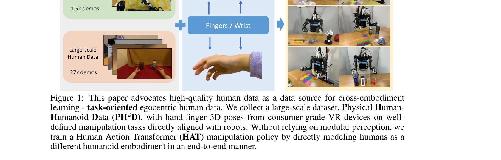

# Humanoid Policy ~ Human Policy

> **저자**: Ri-Zhao Qiu, Shiqi Yang, Xuxin Cheng, Chaitanya Chawla, Jialong Li, Tairan He, Ge Yan, David J. Yoon, Ryan Hoque, Lars Paulsen, Ge Yang, Jian Zhang, Sha Yi, Guanya Shi, Xiaolong Wang | **날짜**: 2025-03-17 | **URL**: [https://arxiv.org/abs/2503.13441](https://arxiv.org/abs/2503.13441)

---

## Essence

*Figure 1: This paper advocates high-quality human data as a data source for cross-embodiment*

휴머노이드 로봇 조작 정책 학습을 위해 대규모 자아중심 인간 데모를 cross-embodiment 학습 데이터로 활용하고, Human Action Transformer (HAT)를 통해 인간과 로봇을 통합된 상태-행동 공간에서 다양한 embodiment으로 모델링한다.

## Motivation

- **Known**: 로봇 조작 정책 학습은 시뮬레이션과 실제 로봇 데모 활용으로 진전이 있었으나, 대규모 고품질 로봇 데이터 수집은 여전히 노동집약적이고 비용이 높다.
- **Gap**: 기존 cross-embodiment 학습은 주로 로봇 데이터 간 전이에 중점을 두었으며, 대규모 인간 데이터를 직접 로봇 조작 학습에 활용할 때 embodiment 간극을 효과적으로 해소하는 방법이 부족하다.
- **Why**: 인간 데모는 로봇보다 수집 비용이 낮고 확장성이 높으므로, 이를 효과적으로 활용하면 로봇 정책의 일반화 능력과 강건성을 크게 향상시킬 수 있다.
- **Approach**: 소비자급 VR 기기를 활용하여 task-oriented 자아중심 인간 데이터(PH2D)를 대규모로 수집하고, 통합된 인간-휴머노이드 상태-행동 공간을 설계한 HAT를 소규모 로봇 데이터와 co-train하여 embodiment 간극을 해소한다.

## Achievement

*Figure 1: This paper advocates high-quality human data as a data source for cross-embodiment*

- **PH2D 데이터셋**: 27,000개의 인간 데모와 1,500개의 로봇 데모를 포함한 대규모 task-oriented egocentric 데이터셋으로, 정확한 3D 손-손가락 포즈와 언어 주석을 제공
- **HAT 모델**: 인간과 휴머노이드를 서로 다른 embodiment으로 직접 모델링하는 unified state-action space 기반 행동 정책으로, 추가 감독 없이 end-to-end 학습 가능
- **성능 향상**: 인간 데이터와의 co-training이 공간 분포 변화 및 배경 섭동에 대한 강건성과 일반화 능력을 크게 향상시키며 데이터 수집 효율을 획기적으로 개선

## How

- 소비자급 VR 기기(Meta Quest)를 자아중심 카메라와 손 추적 센서로 활용하여 인간 조작 동작 캡처
- 동일한 VR 기기를 통해 휴머노이드 로봇 원격 조종(teleoperation)을 수행하여 데이터 수집 환경 정렬
- 인간의 손 포즈를 직접 상태로, 손가락-손목 궤적을 행동으로 사용하는 통합 표현 공간 설계
- Transformer 기반 아키텍처를 통해 미래 손-손가락 궤적 예측
- Inverse kinematics와 hand retargeting을 적용하여 학습된 인간 행동을 로봇 행동으로 differentiably 변환
- 인간 데이터와 로봇 데이터를 co-training하여 embodiment 간 도메인 갭 최소화

## Originality

- 기존 affordance나 keypoint 같은 중간 표현을 사용하지 않고, 인간 pose를 직접 정책 state로 사용하는 end-to-end 접근
- 소비자급 VR 기기를 task-oriented 데이터 수집과 로봇 원격 조종 양쪽에 활용하여 hardware alignment 자동화
- 인간과 로봇을 동일한 unified state-action space에서 학습하되 각각을 다른 embodiment으로 모델링하는 새로운 co-training 전략
- 기존 EgoMimic보다 훨씬 큰 규모(27,000 vs 2,150)의 task-oriented 인간 데이터셋 구축

## Limitation & Further Study

- VR 기기 기반 hand tracking의 정확도가 고비용 전문 장비(glove 등)에 비해 제한적일 수 있음
- 현재 평가가 특정 로봇 플랫폼(Unitree H1)과 제한된 수의 조작 task에만 수행됨
- 인간의 신체 치수와 로봇의 물리적 제약 간 차이를 완전히 해소하지 못할 수 있으며, 손가락 개수 차이 등 구조적 차이에 대한 체계적 분석 부족
- 학습된 정책이 인간 데이터에서 관찰되지 않은 새로운 환경으로의 generalization 한계
- 후속 연구로는 다양한 휴머노이드 로봇 플랫폼으로의 cross-platform transfer 검증, 더 복잡한 조작 task로의 확대, reinforcement learning을 통한 정책 개선 필요

## Evaluation

- Novelty: 4/5
- Technical Soundness: 3/5
- Significance: 4/5
- Clarity: 4/5
- Overall: 4/5

**총평**: 로봇 조작 학습에서 대규모 인간 데이터 활용의 실질적 가치를 입증한 의미 있는 연구로, 통합된 state-action space와 체계적인 co-training 전략을 통해 embodiment 간극을 효과적으로 해소했으며, PH2D 데이터셋과 HAT 모델의 공개를 통해 cross-embodiment 학습 커뮤니티에 중요한 기여를 할 것으로 기대된다.

## Related Papers

- 🔄 다른 접근: [[papers/1989_Human-Humanoid_Robots_Cross-Embodiment_Behavior-Skill_Transf/review]] — UDH의 common prototype 방식과 달리 HAT는 unified state-action space에서 human과 robot을 직접적으로 통합 모델링한다.
- 🔗 후속 연구: [[papers/1903_EgoMimic_Scaling_Imitation_Learning_via_Egocentric_Video/review]] — EgoMimic의 large-scale egocentric video imitation이 HAT의 cross-embodiment learning을 더 큰 규모의 데이터로 확장할 수 있다.
- 🔄 다른 접근: [[papers/1961_H-RDT_Human_Manipulation_Enhanced_Bimanual_Robotic_Manipulat/review]] — HAT 기반 통합 상태-행동 공간과 H-RDT의 diffusion transformer는 대규모 인간 데이터 활용을 위한 서로 다른 아키텍처 접근법입니다.
- 🏛 기반 연구: [[papers/1966_Hand-Eye_Autonomous_Delivery_Learning_Humanoid_Navigation_Lo/review]] — egocentric 인간 데모를 cross-embodiment 학습에 활용하는 공통 기반 위에서 서로 다른 humanoid 기능에 특화된 접근법을 제시합니다.
- 🔗 후속 연구: [[papers/2164_TWIST2_Scalable_Portable_and_Holistic_Humanoid_Data_Collecti/review]] — TWIST2의 scalable humanoid 데이터 수집이 대규모 자아중심 인간 데모 활용을 실제 로봇 플랫폼에서 구현 가능하게 확장합니다.
- 🏛 기반 연구: [[papers/1681_SMAP_Self-supervised_Motion_Adaptation_for_Physically_Plausi/review]] — 인간 모션의 물리적 타당성 확보가 humanoid-human policy alignment의 기초입니다.
- 🏛 기반 연구: [[papers/1758_Whole-body_Humanoid_Robot_Locomotion_with_Human_Reference/review]] — Humanoid Policy와 Human Policy의 일치성 연구가 Adam의 인간 수준 보행 성능 달성의 이론적 기반이 된다.
- 🔄 다른 접근: [[papers/1826_Biomechanical_Comparisons_Reveal_Divergence_of_Human_and_Hum/review]] — 인간과 휴머노이드의 정책 비교라는 같은 목표를 생체역학적 분석과 행동 정책 분석이라는 다른 방법으로 접근한다
- 🔄 다른 접근: [[papers/1888_DreamZero_World_Action_Models_are_Zero-shot_Policies/review]] — 인간 정책을 휴머노이드로 전이하는 다른 접근 방식으로, 제로샷 정책 생성에 대한 대안적 관점을 제시한다.
- 🏛 기반 연구: [[papers/1957_GraspDreamer_생성형_인간_시연_기반_기능적_파지_모방_학습/review]] — 대규모 자아중심 인간 데모 활용이라는 공통 데이터 소스를 기반으로 서로 다른 cross-embodiment 학습 방법론을 제시합니다.
- 🔄 다른 접근: [[papers/1961_H-RDT_Human_Manipulation_Enhanced_Bimanual_Robotic_Manipulat/review]] — H-RDT와 Humanoid Policy는 모두 대규모 인간 데이터로 사전학습하되, diffusion transformer와 HAT라는 서로 다른 아키텍처를 사용합니다.
- 🏛 기반 연구: [[papers/1966_Hand-Eye_Autonomous_Delivery_Learning_Humanoid_Navigation_Lo/review]] — 대규모 egocentric 인간 데이터 활용이라는 공통 기반 위에서 HEAD는 navigation-locomotion-reaching을, Humanoid Policy는 manipulation을 중심으로 합니다.
- 🔄 다른 접근: [[papers/1989_Human-Humanoid_Robots_Cross-Embodiment_Behavior-Skill_Transf/review]] — HAT의 unified state-action space와 UDH의 common prototype은 human-humanoid skill transfer를 위한 서로 다른 통합 방식이다.
- 🔗 후속 연구: [[papers/2156_Towards_Motion_Turing_Test_Evaluating_Human-Likeness_in_Huma/review]] — Motion Turing Test의 인간다움 평가 기준을 Humanoid Policy ~ Human Policy의 정책 유사성 측정과 결합하면 더 포괄적인 휴머노이드 성능 평가가 가능합니다.
- 🔗 후속 연구: [[papers/2135_Perpetual_Humanoid_Control_for_Real-time_Simulated_Avatars/review]] — Humanoid Policy의 human-like behavior learning이 PHC의 10,000개 motion clips 학습을 더 human-centric한 정책 설계로 확장한 형태입니다.
