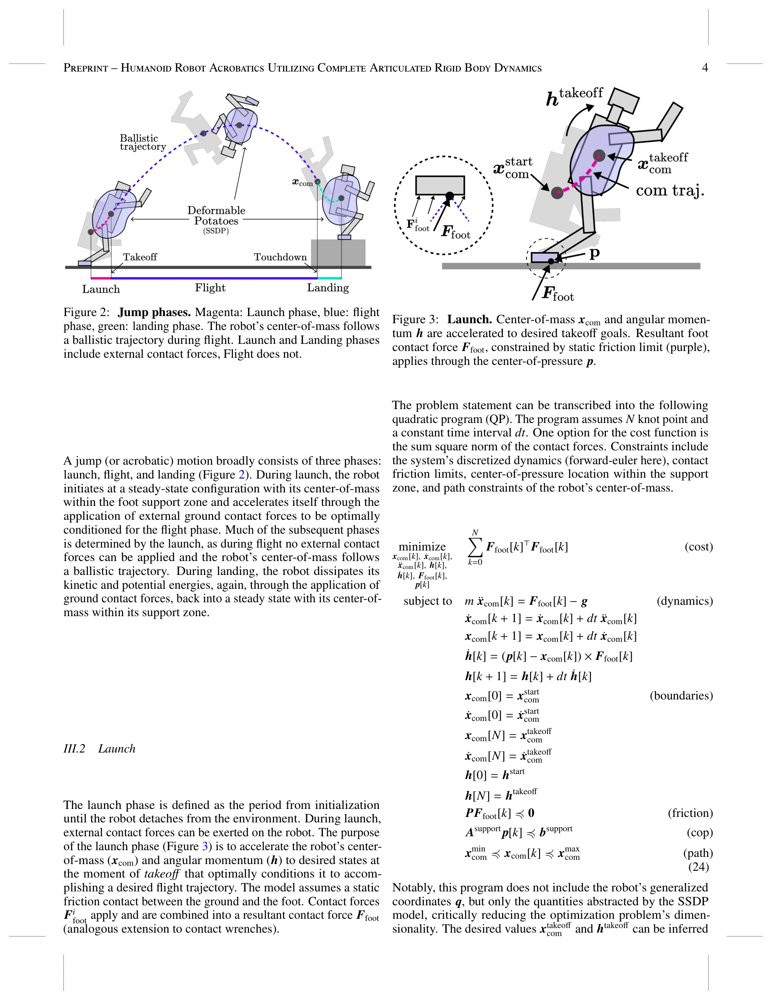
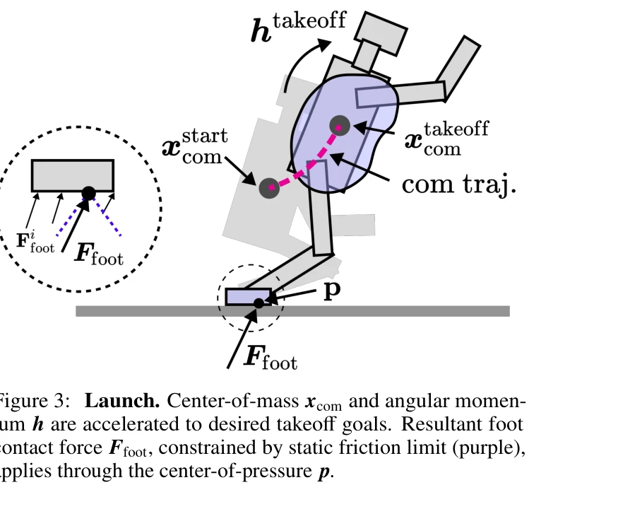
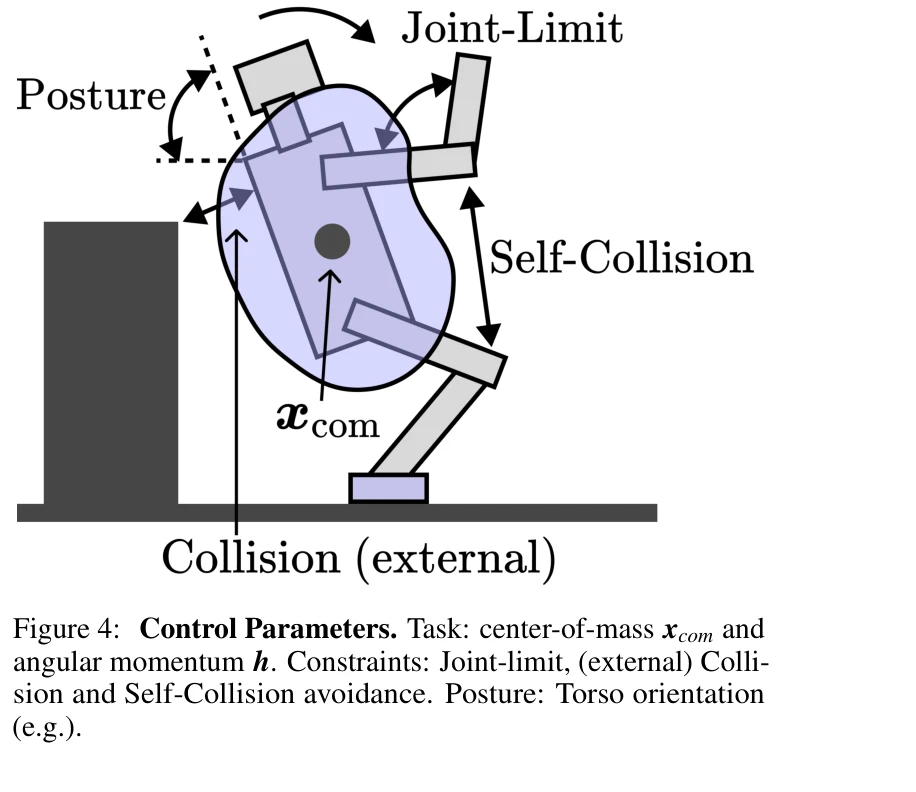

# Humanoid Robot Acrobatics Utilizing Complete Articulated Rigid Body Dynamics

> **저자**: Gerald Brantner | **날짜**: 2025-07-17 | **URL**: [https://arxiv.org/abs/2508.08258](https://arxiv.org/abs/2508.08258)

---

## Essence

*Figure 2: Jump phases. Magenta: Launch phase, blue: flight*

고도화된 동적 동작을 수행하는 휴머노이드 로봇을 위해 완전한 articulated rigid body dynamics를 기반으로 하는 제어 아키텍처를 제시하며, trajectory optimization과 whole-body control을 model abstraction으로 중개하여 아크로바틱 동작을 실현한다.

## Motivation

- **Known**: 휴머노이드 로봇의 보행 제어에 대한 ZMP 방법과 SLIP 모델 등 기초적 연구들이 존재하며, Boston Dynamics 등에서 고도의 동적 제어를 구현했으나 기술 세부사항이 공개되지 않았다.
- **Gap**: 높은 자유도를 가진 휴머노이드 로봇에서 선형화나 모델 근사를 사용하지 않고 완전한 dynamics equations를 기반으로 acrobatic 동작을 수행하는 통합 제어 아키텍처가 부재하다.
- **Why**: 휴머노이드 로봇이 인간 수준의 아크로바틱을 수행할 수 있다면 인간 환경에 배치 가능하며, 이는 보행·주행·균형 유지 등 다양한 동작의 일반화로 작용할 수 있다.
- **Approach**: Operational-space based whole-body control (OPWBC)를 기반으로 centroidal dynamics를 활용하여 trajectory optimization과 실시간 제어를 분리하되, 두 계층 사이에 일치하는 model abstraction을 중개함으로써 계산 복잡성을 해결하면서 완전한 dynamics를 유지한다.

## Achievement

*Figure 3: Launch. Center-of-mass xcom and angular momen-*

- **완전한 Dynamics 기반 제어**: 선형화나 모델 근사 없이 articulated rigid body dynamics의 완전한 equations of motion을 활용하여 trajectory optimization과 whole-body control을 통합
- **다층 제어 구조**: 제약 조건(constraint), 작업(task), 자세(posture) 제어를 hierarchical하게 조직하되 dynamically consistent null-space projection으로 서로 독립적이고 간섭 없는 제어 구현
- **고도의 동적 동작 실현**: launch, flight, landing 단계를 포함하는 아크로바틱 동작(도약, 회전, 트위스트 점프)을 시뮬레이션에서 성공적으로 수행
- **Centroidal Momentum 기반 제어**: center-of-mass, angular momentum 및 그 부분공간에 대한 제어를 통해 고도의 동적 안정성 확보

## How

*Figure 4: Control Parameters. Task: center-of-mass xcom and*

- Operational-space 기반 whole-body control 프레임워크로 M(q), centrifugal/Coriolis, gravitational 항을 명시적으로 계산하여 dynamically decoupled 제어 실현
- Centroidal Momentum Matrix를 이용하여 multi-body dynamics를 single rigid body equivalent로 축약하되, 세부 dynamics 정보는 보존
- SVD 분해를 통해 constraint-aware task-consistent posture jacobian 계산 및 null-space 제어로 posture 목표 달성
- Model abstraction 계층에서 trajectory optimization (긴 시간 지평)과 whole-body controller (단시간 실행)를 연결하여 계산 복잡성 감소
- Joint limits, collision avoidance 등 제약 조건을 최상위 우선순위로 두고 계층적 제어로 통합
- Support Jacobian과 dynamically consistent generalized inverse를 통해 지면 접촉력 제약 처리

## Originality

- 기존의 centroidal dynamics 근사나 single rigid body 모델 대신 **완전한 articulated rigid body dynamics**를 trajectory optimization과 제어에 직접 사용하는 통합 아키텍처 제시
- Model abstraction을 trajectory optimization과 whole-body control 사이에 명시적으로 도입하여 계산 복잡성과 정확성 간 trade-off를 구조적으로 해결
- OPWBC에서 multiple task layers (constraint, task, posture)를 dynamically consistent null-space projection으로 cleanly 조직하고 decoupling하는 방식이 체계적
- 고자유도 underactuated 시스템에서 inertia-shaping 기반 angular momentum 제어를 explicitly 포함

## Limitation & Further Study

- **시뮬레이션 검증만 존재**: 논문에서 분석이 simulation에 한정되며 실제 로봇 하드웨어에서의 성능, 모델-시뮬레이션 gap, 센서 노이즈 영향 등이 미검증
- **Trajectory Optimization 세부 미흡**: model abstraction 후 실제 optimization 문제의 수식화, solver 선택, 계산 시간 분석이 불충분하게 기술됨
- **Robustness 분석 부족**: 모델 파라미터 오차, 외부 장애, 지면 조건 변화 등에 대한 제어 안정성 및 강인성 분석 부재
- **후속 연구**: 실제 로봇 플랫폼에서의 구현 및 검증, model-based learning과의 결합을 통한 추적 오차 감소, 계산 시간 최적화 및 MPC 통합

## Evaluation

- Novelty: 4/5
- Technical Soundness: 3/5
- Significance: 4/5
- Clarity: 3/5
- Overall: 4/5

**총평**: 휴머노이드 로봇의 고도 동적 제어에 대한 개념적·이론적 기여도가 높고 control architecture가 체계적이나, 시뮬레이션 검증에 한정되고 optimization 방법론 세부사항이 부족하여 실질적 영향력에는 제약이 있다.
