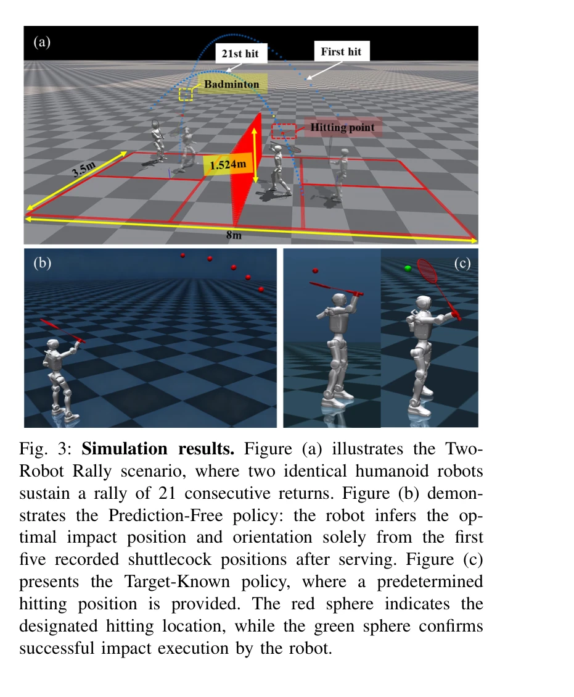

# Humanoid Whole-Body Badminton via Multi-Stage Reinforcement Learning

> **저자**: Chenhao Liu, Leyun Jiang, Yibo Wang, Kairan Yao, Jinchen Fu, Xiaoyu Ren | **날짜**: 2025-12-09 | **DOI**: [10.48550/arXiv.2511.11218](https://doi.org/10.48550/arXiv.2511.11218)

---

## Essence

*Fig. 2: System overview. (a) Training: PPO learns a single policy πWBC using Privileged Critic Obs together with Actor*

이 논문은 다단계 강화학습 커리큘럼을 통해 휴머노이드 로봇이 배드민턴을 하도록 학습하는 통합 전신 제어기를 제시하며, 시뮬레이션과 실제 로봇 모두에서 1초 이내의 반응 시간으로 19.1 m/s의 셔틀콕 속도를 달성했다.

## Motivation

- **Known**: 휴머노이드 로봇은 정적 환경에서의 이동 및 조작 능력을 보였고, 탁구와 같은 라켓 스포츠를 수행하는 작업들이 일부 연구되었다. 강화학습 기반 통합 제어는 다양한 로코-조작 작업에서 효과적임이 알려져 있다.
- **Gap**: 배드민턴은 탁구보다 공기역학적 불확실성, 빠른 반응 윈도우(0.6초), 3D 공간에서의 방향성 있는 타격, 그리고 큰 진폭의 스윙으로 인한 균형 유지 문제를 야기하며, 기존 연구에서는 하체 풋워크와 상체 스트라이킹의 조율이 부족했다.
- **Why**: 휴머노이드가 배드민턴을 수행하면 인간 중심의 환경에서 동적 상호작용 능력의 중요한 이정표가 되며, 이는 더 일반화된 동적 작업으로 확장 가능한 기술 기반이 된다.
- **Approach**: PPO 알고리즘을 사용한 3단계 커리큘럼 학습(풋워크 습득 → 정밀 라켓 스윙 생성 → 작업 중심 정제)과 배포 시 EKF 기반 셔틀콕 궤적 예측을 결합한 방식이다. 또한 명시적 예측이 없는 변형 방식도 제시한다.

## Achievement

*Fig. 3: Simulation results. Figure (a) illustrates the Two-*

- **첫 실제 휴머노이드 배드민턴**: 기계가 서빙한 셔틀콕을 자율적으로 반환하는 기능을 1.28m 크기의 21-DoF 휴머노이드에서 달성
- **뛰어난 성능 지표**: 5.3 m/s 스윙 속도, 최대 19.1 m/s 아웃고잉 셔틀콕 속도, 평균 4m 착지 거리
- **시뮬레이션 래리**: 두 로봇이 21연속 타격을 유지하며 예측 기반과 예측 없는 변형 모두 유사한 성능 달성
- **제어 정확성**: EKF 예측 모듈이 높은 정확도를 보였으며 0.8~1.0초 서브-초 반응 시간 내 완료
- **Zero-shot 실제 배포**: 시뮬레이션에서만 학습된 정책이 시스템 식별 및 수동 매개변수 조정 없이 실제 로봇에서 작동

## How

*Fig. 2: System overview. (a) Training: PPO learns a single policy πWBC using Privileged Critic Obs together with Actor*

- 3단계 RL 커리큘럼: (1) 발 스윙 시간과 높이 정규화를 포함한 목표 영역으로의 풋워크 습득, (2) 타이밍과 위치/방향 정확도 스케줄링을 통한 정밀 스윙 생성, (3) 로코모션 정규화 제거를 통한 최종 정제
- 약 20k 개의 사전 생성된 셔틀콕 궤적으로부터 각 롤아웃 시 목표 튜플(hit time, 절편 위치, 목표 라켓 방향) 샘플링
- Privileged Critic Observation과 Actor Observation의 분리로 가치 함수 학습 향상
- 배포 시 EKF를 통한 온라인 셔틀콕 궤적 예측 및 저수준 PD 제어기(500 Hz) 위의 정책 실행(50 Hz)
- 예측 기반 정책과 예측 없는 변형(과거 5 프레임의 즉각적 셔틀콕 자세 기반) 모두 구현 및 비교
- 중간 정도의 domain randomization을 사용하여 시뮬레이션에서만 학습

## Originality

- 모션 프라이어나 전문가 시연 없이 RL만으로 에너지 효율적인 스윙 발견
- 풋워크-스트라이킹 동시 진화 강제: 하체 동작이 단순 베이스 위치 조정이 아닌 타격 정확도 결정에 참여
- 배드민턴의 3D 공간 방향 인식 타격 요구사항을 탁구의 2D 가상 평면 단순화 없이 처리
- 예측 없는 변형(end-to-end RL로 타이밍과 타격 목표를 암묵적 추론)으로 추가 예측 모듈 튜닝 제거
- 실제 하드웨어에서 처음으로 배드민턴 수행 증명

## Limitation & Further Study

- 현재 실제 실험은 기계가 서빙한 셔틀콕과 모션캡처 아레나에 제한되어 있으며, 로봇-인간 래리로 확장 필요
- 예측 없는 변형이 시뮬레이션 기반 증거만 제공하며 실제 로봇 검증 부족
- Domain randomization 수준이 중간 정도로, 공기역학적 변동성(flip regime 등)에 대한 강건성 한계 가능
- 셔틀콕 궤적 예측에 EKF 의존으로 센서 오류 또는 모션캡처 신호 손실에 취약할 가능성
- 단일 휴머노이드 플랫폼에 대한 검증이므로 다른 폼 팩터로의 일반화 불명확

## Evaluation

- Novelty: 4/5
- Technical Soundness: 3/5
- Significance: 4/5
- Clarity: 4/5
- Overall: 4/5

**총평**: 이 논문은 휴머노이드 로봇의 고속 동적 상호작용 능력을 크게 진전시키며, 잘 설계된 3단계 커리큘럼과 실제 배포 성공이 인상적이다. 다만 예측 없는 변형의 실제 검증 부족과 현재 제한된 시험 환경이 향후 개선 과제이다.

## Related Papers

- 🔄 다른 접근: [[papers/2053_Learning_Human-Like_Badminton_Skills_for_Humanoid_Robots/review]] — badminton과 유사한 라켓 스포츠이지만 humanoid whole-body control과 human-like skill learning의 서로 다른 접근 방식을 사용한다.
- 🔗 후속 연구: [[papers/1979_HITTER_A_HumanoId_Table_TEnnis_Robot_via_Hierarchical_Planni/review]] — HITTER의 hierarchical planning for table tennis가 badminton의 multi-stage RL curriculum을 다른 라켓 스포츠로 확장한 연구이다.
- 🔗 후속 연구: [[papers/1940_Gait-Conditioned_Reinforcement_Learning_with_Multi-Phase_Cur/review]] — Gait-Conditioned의 다단계 커리큘럼을 배드민턴 특화 전신 제어로 확장한 발전된 형태다.
- 🏛 기반 연구: [[papers/1682_SMASH_Mastering_Scalable_Whole-Body_Skills_for_Humanoid_Ping/review]] — 휴머노이드 전신 배드민턴의 다단계 강화학습이 SMASH의 탁구 시스템에 유사한 라켓 스포츠 제어 방법론을 제공한다
- 🔄 다른 접근: [[papers/1650_Robot_Drummer_Learning_Rhythmic_Skills_for_Humanoid_Drumming/review]] — Robot Drummer는 MIDI 기반 드럼 연주를, Humanoid Whole-Body Badminton은 배드민턴 기술을 통해 리듬감 있는 휴머노이드 제어를 다르게 구현함
- 🔄 다른 접근: [[papers/1757_Whole-body_Multi-contact_Motion_Control_for_Humanoid_Robots/review]] — 두 연구 모두 전신 동역학을 활용하지만 하나는 투척에, 다른 하나는 배드민턴이라는 서로 다른 동적 작업에 적용합니다.
- 🧪 응용 사례: [[papers/1778_A_Hierarchical_Model-Based_System_for_High-Performance_Human/review]] — multi-stage 강화학습을 통한 배드민턴 기술이 축구 시스템의 복잡한 동적 움직임 계획에 적용될 수 있다.
- 🔗 후속 연구: [[papers/1860_Deep_Imitation_Learning_for_Humanoid_Loco-manipulation_throu/review]] — TRILL의 whole-body control 기반 계층적 정책이 다단계 강화학습을 통한 휴머노이드 배드민턴으로 확장되어 더 동적인 전신 스포츠 기술을 학습한다.
- 🔄 다른 접근: [[papers/1979_HITTER_A_HumanoId_Table_TEnnis_Robot_via_Hierarchical_Planni/review]] — 라켓 스포츠 제어를 HITTER는 탁구에, Humanoid Whole-Body Badminton은 배드민턴에 각각 특화하여 접근한다.
- 🔗 후속 연구: [[papers/1994_Humanoid_Goalkeeper_Learning_from_Position_Conditioned_Task-/review]] — 골키퍼 기술이 배드민턴의 다단계 강화학습으로 확장되어 더 복잡한 스포츠 동작을 학습할 수 있다.
- 🔗 후속 연구: [[papers/2046_Learning_Agile_Striker_Skills_for_Humanoid_Soccer_Robots_fro/review]] — Learning Agile Striker의 강건한 볼 킥킹 기술이 배드민턴 전신 제어의 다단계 학습과 결합되어 더 다양한 스포츠 기술 달성 가능
- 🔗 후속 연구: [[papers/2047_Learning_Athletic_Humanoid_Tennis_Skills_from_Imperfect_Huma/review]] — LATENT 시스템을 다단계 강화학습과 결합하여 더 정교하고 다양한 배드민턴 기술을 습득할 수 있다.
- 🔗 후속 연구: [[papers/2053_Learning_Human-Like_Badminton_Skills_for_Humanoid_Robots/review]] — Imitation-to-Interaction 학습을 다단계 강화학습으로 확장하여 더 복잡하고 다양한 배드민턴 전략을 습득할 수 있다.
- 🔗 후속 연구: [[papers/2066_Learning_to_Ball_Composing_Policies_for_Long-Horizon_Basketb/review]] — 다단계 강화학습을 통한 휴머노이드 배드민턴으로 스포츠 스킬의 확장된 적용을 보여준다.
- 🔗 후속 연구: [[papers/2131_PACE_Physics_Augmentation_for_Coordinated_End-to-end_Reinfor/review]] — Humanoid Whole-Body Badminton의 다단계 강화학습을 탁구라는 더 빠른 반응이 필요한 스포츠로 확장하여 물리 증강 학습을 적용한 연구이다.
