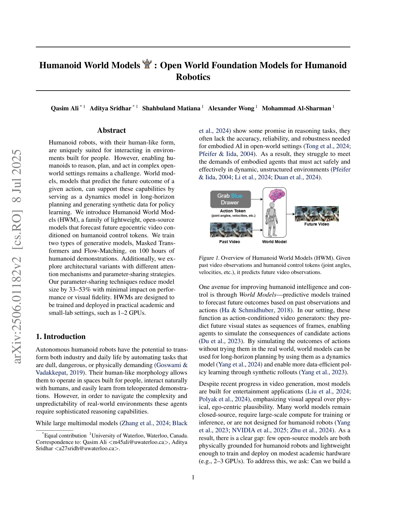
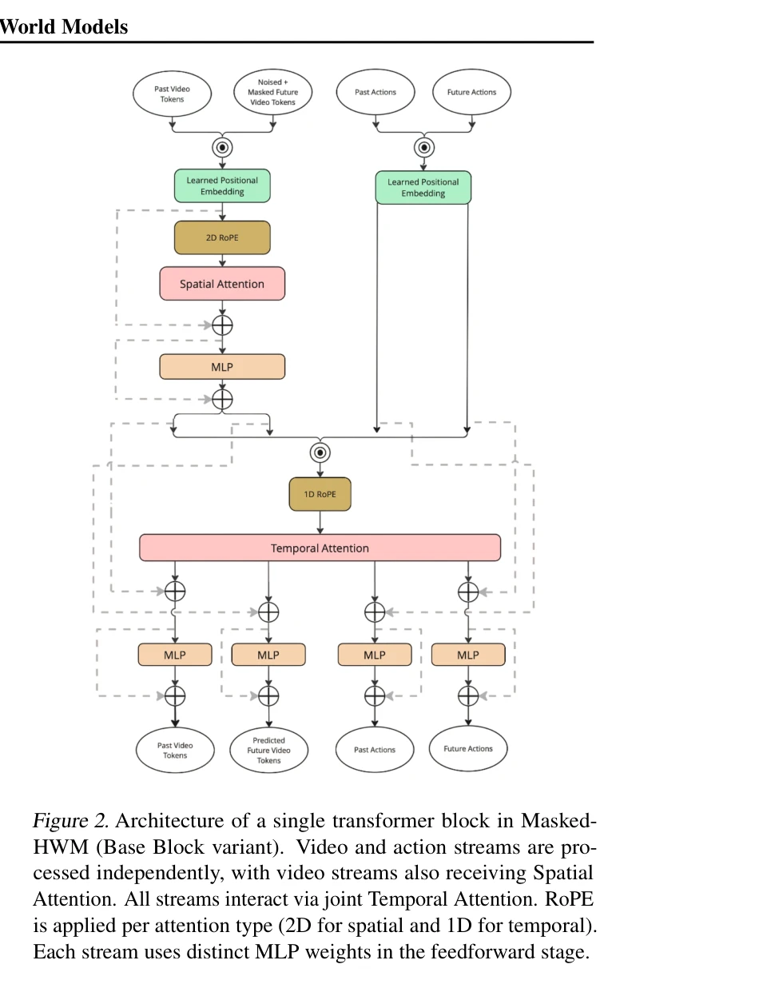

# Humanoid World Models: Open World Foundation Models for Humanoid Robotics

> **저자**: Muhammad Qasim Ali, Aditya Sridhar, Shahbuland Matiana, Alex Wong, Mohammad Al-Sharman | **날짜**: 2025-06-01 | **URL**: [https://arxiv.org/abs/2506.01182](https://arxiv.org/abs/2506.01182)

---

## Essence

*Figure 1. Overview of Humanoid World Models (HWM). Given*

Humanoid World Models (HWM)는 100시간의 humanoid 시연 데이터로 학습된 경량 오픈소스 모델로, egocentric 비디오를 humanoid control token으로 조건화하여 미래 프레임을 예측한다. Masked Transformer와 Flow-Matching 두 가지 생성 모델을 탐색하며 parameter-sharing 기법으로 33-53% 크기 감소를 달성했다.

## Motivation

- **Known**: Video generation 모델은 최근 diffusion과 masked transformer 기반 접근으로 발전했으며, world model은 robotics에서 장기 계획과 정책 학습을 지원할 수 있다. 하지만 대부분의 모델은 entertainment 중심이거나 폐쇄 소스이며 대규모 계산 자원을 요구한다.
- **Gap**: Humanoid 로봇을 위한 물리적으로 그럴듯한 world model 중 오픈소스이면서 학술 및 소규모 연구실(1-2 GPU) 환경에서 학습/배포 가능한 모델이 부족하다.
- **Why**: Humanoid 로봇이 인간 환경에서 추론, 계획, 실행 능력을 갖추려면 dynamics model로서 작동하고 synthetic data를 생성할 수 있는 world model이 필수적이며, 접근성 있는 구현이 연구 확산을 촉진한다.
- **Approach**: Masked Transformer와 Flow-Matching 두 가지 generative model 패밀리를 비교 연구하며, joint/cross-attention과 parameter-sharing 전략 등 아키텍처 변형을 체계적으로 탐색한다. VQ-VAE 기반 토큰화를 통해 효율적 비디오 생성을 구현한다.

## Achievement

*Figure 4. Four sample videos from the Base Block Variant of*

- **Masked Transformer 우수성**: 동일 데이터셋과 계산 제약 조건에서 Flow-Matching 모델을 지속적으로 능가, joint attention 변형이 최고 성능 달성
- **Parameter-sharing 효율성**: 성능 저하 최소화하면서 모델 크기를 33-53% 감소시켜 계산 요구사항 대폭 낮춤
- **아키텍처 최적화**: 8가지 모델 변형(각 프레임워크당 4개) 비교로 attention mechanism과 parameter 공유 전략의 효율성 규명
- **실용적 접근성**: 1-2 GPU 환경에서 학습·배포 가능한 오픈소스 humanoid-specific world model 제공

## How

*Figure 2. Architecture of a single transformer block in Masked-*

- VQ-VAE 기반 이산 latent space에서 토큰화된 비디오로 표현
- Masked Transformer: MaskGIT 기반 non-autoregressive 디코딩으로 병렬 샘플링 구현
- Flow-Matching: diffusion보다 단순한 학습과 빠른 샘플링을 위해 적용
- Joint vs. cross-attention 메커니즘 비교 (text-to-image 문헌에서 영감)
- Shared vs. separate parameters across token streams의 두 가지 parameter 구조 탐색
- 100시간 humanoid 데모 데이터로 학습, egocentric 시점에서 과거 비디오와 action token(관절각, 속도 등) 입력받아 미래 프레임 예측

## Originality

- Humanoid 로봇 특화 world model의 첫 체계적 비교 연구 (Masked Transformer vs. Flow-Matching)
- Parameter-sharing 전략이 robotic video generation에 미치는 영향을 정량화한 최초 분석
- Entertainment 중심 large-scale text-to-video 모델(Sora, CogVideoX)과 달리, 과거 비디오 조건화와 humanoid 신체 동역학을 명시적으로 모델링
- 2-3 GPU 수준 academic 하드웨어에서 실행 가능한 경량 설계로 접근성 혁신

## Limitation & Further Study

- 100시간 humanoid 시연 데이터 규모 제약으로 다양한 환경과 task 범위 제한 가능성
- 평가가 주로 시각적 품질과 fidelity 중심인 것으로 보이며, 실제 planning이나 policy learning 성능에 대한 downstream task 평가 부재
- Flow-Matching이 더 많은 parameter와 학습 시간에도 불구하고 Masked Transformer에 뒤처지는 원인에 대한 심층 분석 부족
- Cross-embodiment 일반화(다른 humanoid 플랫폼이나 로봇 형태)에 대한 평가 미포함
- 후속 연구로 실제 humanoid 플랫폼에서의 planning 및 control 성능 검증, 더 큰 규모 데이터셋 확보, multi-modal conditioning (언어, 의도) 통합 필요

## Evaluation

- Novelty: 4/5
- Technical Soundness: 3/5
- Significance: 4/5
- Clarity: 4/5
- Overall: 4/5

**총평**: 이 논문은 humanoid 로봇을 위한 경량의 접근 가능한 world model이라는 명확한 필요를 직면하고, Masked Transformer와 Flow-Matching 두 패러다임을 체계적으로 비교하며 parameter-sharing 효율성을 입증한 실질적 기여를 한다. 다만 downstream task 평가와 실제 로봇 실험을 통한 효과 검증이 추가되면 영향력이 더욱 커질 것으로 예상된다.

## Related Papers

- 🔗 후속 연구: [[papers/1996_Humanoid_Locomotion_as_Next_Token_Prediction/review]] — next token prediction의 transformer 기반 접근법을 HWM이 egocentric video prediction과 world modeling으로 확장한 발전된 형태이다.
- 🔄 다른 접근: [[papers/1949_Generative_World_Modelling_for_Humanoids_1X_World_Model_Chal/review]] — 1X World Model의 generative world modeling과 HWM은 모두 humanoid world model을 다루지만 서로 다른 생성 모델 구조를 사용한다.
- 🏛 기반 연구: [[papers/1904_EgoVLA_Learning_Vision-Language-Action_Models_from_Egocentri/review]] — EgoVLA의 vision-language-action learning이 HWM의 egocentric video to control token 변환을 위한 기초 방법론을 제공한다.
- 🏛 기반 연구: [[papers/2013_HumanX_Toward_Agile_and_Generalizable_Humanoid_Interaction_S/review]] — 100시간의 humanoid 시연 데이터로 학습된 world model이 HumanX의 일반화 가능한 상호작용 스킬 학습을 위한 기반 모델을 제공합니다.
- 🔗 후속 연구: [[papers/1888_DreamZero_World_Action_Models_are_Zero-shot_Policies/review]] — DreamZero의 world action model을 HWM이 humanoid 특화 egocentric 조건화로 확장하여 더 구체적인 제어 토큰 예측을 달성합니다.
- 🔄 다른 접근: [[papers/1761_Zero-Shot_Whole-Body_Humanoid_Control_via_Behavioral_Foundat/review]] — 둘 다 foundation model 기반 휴머노이드 제어를 다루지만 하나는 behavior regularization에, 다른 하나는 world model에 중점을 둔다.
- 🔗 후속 연구: [[papers/1782_A_Survey_of_Behavior_Foundation_Model_Next-Generation_Whole-/review]] — Humanoid World Models의 구체적인 구현이 BFM survey에서 제시하는 차세대 전신 제어 시스템의 실현 가능성을 보여준다.
- 🔗 후속 연구: [[papers/1897_Ego-Vision_World_Model_for_Humanoid_Contact_Planning/review]] — Ego-Vision World Model의 접촉 계획 프레임워크가 Humanoid World Models의 open world foundation으로 확장되어 더 일반적인 휴머노이드 AI를 구축할 수 있다.
- 🔄 다른 접근: [[papers/1936_From_Motion_to_Behavior_Hierarchical_Modeling_of_Humanoid_Ge/review]] — 계층적 행동 모델링과 휴머노이드 월드 모델은 모두 장기간 행동 생성을 다루지만 서로 다른 모델링 접근법을 사용한다.
- 🔗 후속 연구: [[papers/1949_Generative_World_Modelling_for_Humanoids_1X_World_Model_Chal/review]] — 1X World Model Challenge의 video 예측 기술을 Humanoid World Models의 open world foundation과 결합하면 더 포괄적인 세계 모델이 가능하다.
- 🔗 후속 연구: [[papers/1996_Humanoid_Locomotion_as_Next_Token_Prediction/review]] — HWM의 egocentric video prediction이 next token prediction의 multimodal data 활용을 video world model로 확장한 발전된 형태이다.
- 🔗 후속 연구: [[papers/2013_HumanX_Toward_Agile_and_Generalizable_Humanoid_Interaction_S/review]] — HWM의 기본 world model을 HumanX가 XGen 데이터 생성과 XMimic 학습으로 확장하여 실제 상호작용 스킬을 습득합니다.
- 🔗 후속 연구: [[papers/2136_PHUMA_Physically-Grounded_Humanoid_Locomotion_Dataset/review]] — Humanoid World Models의 open world foundation이 PHUMA의 physics-grounded 데이터셋을 더 포괄적인 world modeling으로 확장한 형태입니다.
- 🏛 기반 연구: [[papers/2153_Towards_Adaptive_Humanoid_Control_via_Multi-Behavior_Distill/review]] — Humanoid World Models의 개방형 세계 기반 모델이 다중행동 학습을 위한 환경 이해와 적응형 제어기 개발의 기반을 제공합니다.
