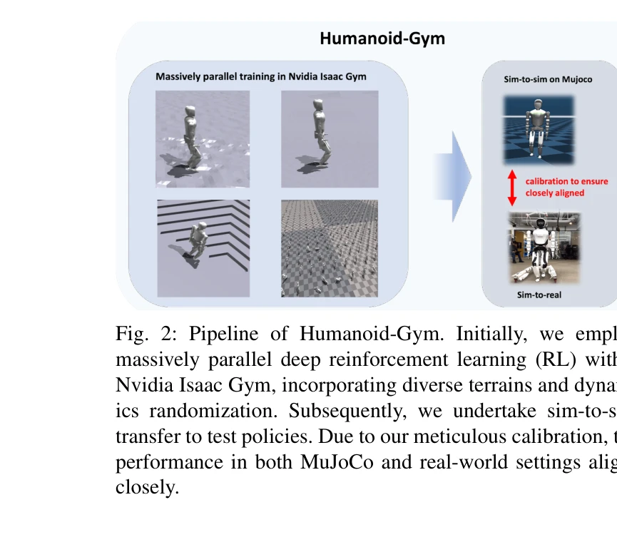
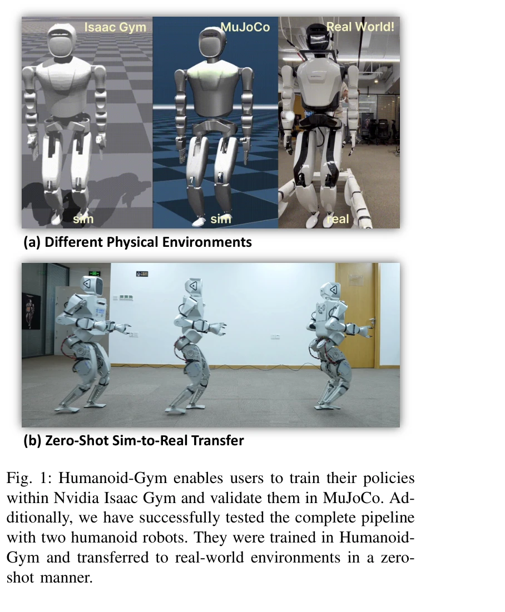

# Humanoid-Gym: Reinforcement Learning for Humanoid Robot with Zero-Shot Sim2Real Transfer

> **저자**: Xinyang Gu, Yen-Jen Wang, Jianyu Chen | **날짜**: 2024-04-08 | **URL**: [https://arxiv.org/abs/2404.05695](https://arxiv.org/abs/2404.05695)

---

## Essence

*Fig. 2: Pipeline of Humanoid-Gym. Initially, we employ*

Humanoid-Gym은 Nvidia Isaac Gym 기반의 강화학습 프레임워크로, 인간형 로봇의 보행 기술을 훈련하고 zero-shot sim-to-real 전이를 통해 실제 환경으로 직접 배포할 수 있도록 설계되었다.

## Motivation

- **Known**: 강화학습을 통한 로봇 보행 제어는 이미 사족 로봇과 Cassie 같은 이족 로봇에서 입증되었으나, 인간형 로봇의 복잡한 구조로 인한 sim-to-real 갭은 여전히 해결되지 않은 과제이며 공개 프레임워크가 부족하다.
- **Gap**: 인간형 로봇의 복잡한 골격 구조로 인해 sim-to-real 전이 갭이 사족 로봇보다 크며, 이를 체계적으로 해결하고 다양한 크기의 로봇에서 검증된 오픈소스 프레임워크가 없다.
- **Why**: 인간형 로봇은 인간 중심 환경에 최적화되어 있어 실용적이지만, zero-shot sim-to-real 전이를 통한 실제 배포 방법 정립은 로봇 학습 커뮤니티의 중요한 과제이다.
- **Approach**: Humanoid-Gym은 Isaac Gym에서 domain randomization과 특화된 보상 설계로 정책을 훈련하고, MuJoCo로 sim-to-sim 검증한 후, 고도로 보정된 환경 매개변수를 통해 실제 로봇에 zero-shot 전이한다.

## Achievement

*Fig. 1: Humanoid-Gym enables users to train their policies*

- **Zero-shot Sim-to-Real 전이 성공**: XBot-S(1.2m)와 XBot-L(1.65m) 두 크기의 인간형 로봇에서 실제 환경에서의 zero-shot 전이를 검증하였다.
- **Sim-to-Sim 검증 도구**: Isaac Gym과 MuJoCo 간 동적 특성 비교를 통해 정책의 강건성과 일반화 가능성을 사전에 검증할 수 있는 프레임워크를 제공한다.
- **오픈소스 프레임워크**: 완전한 시스템 설계, 사려 깊은 보상 함수, 도메인 랜덤화 설정을 포함한 접근 가능한 공개 라이브러리를 제공한다.
- **다양한 지형 대응**: 평탄한 지형뿐 아니라 훈련 시나리오와 크게 다른 불규칙한 지형에서도 성공적인 보행을 달성한다.

## How

*Fig. 2: Pipeline of Humanoid-Gym. Initially, we employ*

- Nvidia Isaac Gym에서 PPO와 Asymmetric Actor Critic 방법을 사용하여 대규모 병렬 강화학습 수행
- 특화된 4가지 보상 성분(속도 추적, 보행 보상, 정규화항)으로 구성된 다목적 보상 함수 설계
- 마찰력, 질량, 접촉 역학 등 다양한 도메인 랜덤화 항을 적용하여 sim-to-real 갭 최소화
- 주기적 스탠스 마스크와 foot contact detection을 통한 gait phase 기반 제어
- 100Hz 정책 제어와 1000Hz 내부 PD 컨트롤러로 고주파 정밀 제어 구현
- MuJoCo의 고정확 동역학을 활용하여 정책 성능을 실세계와 비교하고 보정
- 부분 관측 가능성(POMDP) 설정으로 훈련(privileged information 사용)과 배포(부분 관측) 간 모순 해결

## Originality

- 인간형 로봇의 zero-shot sim-to-real 전이를 다양한 크기의 실제 로봇에서 검증한 첫 공개 프레임워크이다.
- Isaac Gym의 고속 병렬 시뮬레이션과 MuJoCo의 고정확 동역학을 결합한 hybrid sim-to-sim 검증 파이프라인을 제안한다.
- 주기적 스탠스 마스크를 통해 gait phase를 명시적으로 제어하는 방법은 인간형 보행 제어에 적합한 설계이다.
- 메타큰 대규모 도메인 랜덤화와 특화된 보상 구성을 체계적으로 통합하여 실제 환경 전이를 가능하게 했다.

## Limitation & Further Study

- 현재 flat과 uneven terrain에 대한 평가만 제시되었으며, 계단, 경사, 동적 장애물 등 더 복잡한 환경에서의 성능 평가가 필요하다.
- 두 개의 RobotEra 제품에만 검증되었으므로, 다른 제조사의 인간형 로봇이나 크기 범위에 대한 일반화 가능성 확인이 필요하다.
- 상체 제어와 조작 작업은 미포함되었으며, 향후 종합적인 인간형 로봇 제어로의 확장이 필요하다.
- MuJoCo 보정 과정의 세부 알고리즘과 자동화 방법론이 미흡하므로, 다른 환경 구성에 대한 재현성 및 확장성 개선이 필요하다.

## Evaluation

- Novelty: 4/5
- Technical Soundness: 3/5
- Significance: 4/5
- Clarity: 4/5
- Overall: 4/5

**총평**: Humanoid-Gym은 인간형 로봇의 zero-shot sim-to-real 전이를 체계적으로 구현한 최초의 공개 프레임워크로, 실제 로봇에서 입증된 높은 실용성과 함께 로봇 학습 커뮤니티에 중요한 기여를 제공한다. 다만 평가 환경과 로봇 종류의 다양성 확대를 통해 결과의 보편성을 강화할 필요가 있다.

## Related Papers

- 🏛 기반 연구: [[papers/1988_HuMam_Humanoid_Motion_Control_via_End-to-End_Deep_Reinforcem/review]] — Humanoid-Gym의 강화학습 프레임워크가 HuMam의 end-to-end 학습 환경을 제공한다.
- 🔗 후속 연구: [[papers/2125_Opening_the_Sim-to-Real_Door_for_Humanoid_Pixel-to-Action_Po/review]] — 시뮬레이션 기반 학습이 pixel-to-action 정책의 sim-to-real 전이로 확장될 수 있다.
- 🔗 후속 연구: [[papers/2007_HumanoidBench_Simulated_Humanoid_Benchmark_for_Whole-Body_Lo/review]] — HumanoidBench의 comprehensive benchmark가 Humanoid-Gym의 기본적인 locomotion training을 whole-body manipulation까지 확장한다.
- 🏛 기반 연구: [[papers/1828_Booster_Gym_An_End-to-End_Reinforcement_Learning_Framework_f/review]] — Booster Gym의 end-to-end RL framework가 Humanoid-Gym의 강화학습 기반 humanoid training 시스템 구축 기초를 제공한다.
- 🏛 기반 연구: [[papers/1942_GaussGym_An_open-source_real-to-sim_framework_for_learning_l/review]] — GaussGym의 real-to-sim 프레임워크가 Humanoid-Gym의 zero-shot sim-to-real 전이의 이론적 토대가 된다.
- 🏛 기반 연구: [[papers/1715_ToddlerBot_Open-Source_ML-Compatible_Humanoid_Platform_for_L/review]] — 시뮬레이션 기반 강화학습 환경을 제공하여 ToddlerBot의 ML 호환성을 지원하는 기반 환경입니다.
- 🏛 기반 연구: [[papers/1818_Berkeley_Humanoid_A_Research_Platform_for_Learning-based_Con/review]] — Humanoid-Gym 환경이 Berkeley Humanoid의 학습 기반 제어 알고리즘 개발과 테스트에 필요한 표준화된 플랫폼을 제공한다
- 🔄 다른 접근: [[papers/1828_Booster_Gym_An_End-to-End_Reinforcement_Learning_Framework_f/review]] — end-to-end 휴머노이드 RL 프레임워크로 Booster Gym vs Humanoid-Gym이라는 서로 다른 구현 접근법을 비교할 수 있다
- 🔗 후속 연구: [[papers/1784_A_Unified_and_General_Humanoid_Whole-Body_Controller_for_Ver/review]] — Humanoid-Gym의 다양한 환경에서 HugWBC의 통일된 정책을 효과적으로 훈련하고 평가할 수 있다
- 🏛 기반 연구: [[papers/1951_Genie_Sim_30__A_High-Fidelity_Comprehensive_Simulation_Platf/review]] — 강화학습용 휴머노이드 짐이 종합적인 시뮬레이션 플랫폼의 기반을 제공한다.
- 🧪 응용 사례: [[papers/1988_HuMam_Humanoid_Motion_Control_via_End-to-End_Deep_Reinforcem/review]] — Humanoid-Gym의 RL framework가 HuMam의 end-to-end learning 방식을 실제 humanoid 보행 훈련에 적용할 수 있는 플랫폼을 제공한다.
- 🔗 후속 연구: [[papers/2007_HumanoidBench_Simulated_Humanoid_Benchmark_for_Whole-Body_Lo/review]] — Humanoid-Gym의 locomotion-focused training을 HumanoidBench가 whole-body manipulation과 27개 challenging task로 확장한다.
- 🔗 후속 연구: [[papers/2077_Learning_with_pyCub_A_Simulation_and_Exercise_Framework_for/review]] — 강화학습 기반 휴머노이드 훈련 환경을 교육용으로 확장하여 접근성을 높인 발전된 형태이다.
- 🔄 다른 접근: [[papers/2084_LiPS_Large-Scale_Humanoid_Robot_Reinforcement_Learning_with/review]] — 강화학습 기반 휴머노이드 훈련이라는 같은 목표를 다른 시뮬레이션 환경과 병렬화 방식으로 구현한 대안이다.
