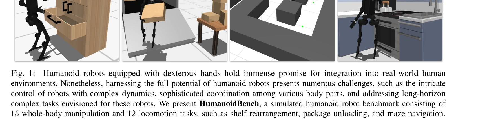
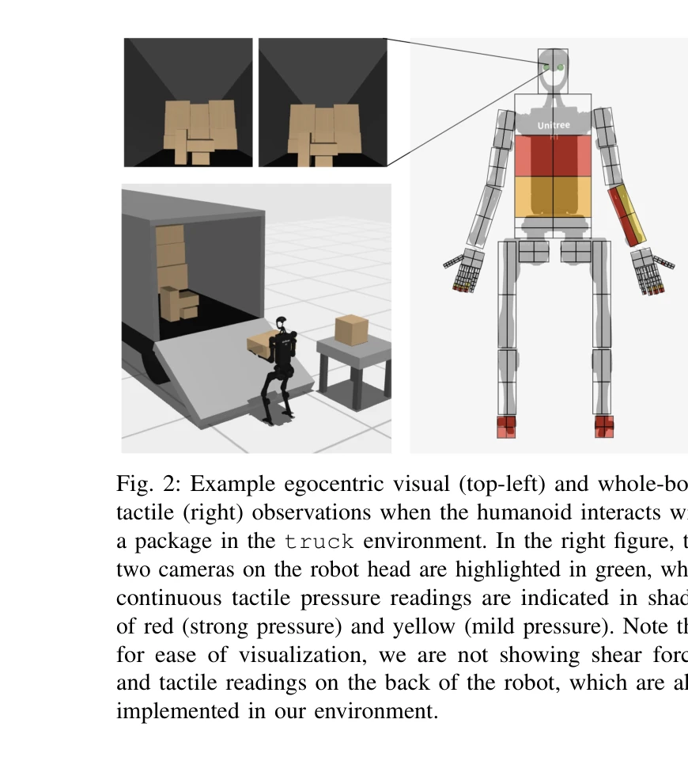

# HumanoidBench: Simulated Humanoid Benchmark for Whole-Body Locomotion and Manipulation

> **저자**: Carmelo Sferrazza, Dun-Ming Huang, Xingyu Lin, Youngwoon Lee, Pieter Abbeel | **날짜**: 2024-03-15 | **URL**: [https://arxiv.org/abs/2403.10506](https://arxiv.org/abs/2403.10506)

---

## Essence

*Fig. 1:*

HumanoidBench는 이족 로봇의 전신 조작과 이동 능력을 평가하기 위한 시뮬레이션 벤치마크로, 손가락이 있는 손과 다양한 27개의 도전적인 작업을 포함한다.

## Motivation

- **Known**: 로봇 학습은 조작과 이동 분야에서 진전을 보였으나, 실제 이족 로봇 연구는 비용이 많이 들고 위험한 하드웨어 설정으로 인해 병목이 생겼다.
- **Gap**: 기존 벤치마크들은 단일 팔의 조작이나 이동 중 하나에만 초점을 맞추었으며, 이족 로봇의 복잡한 전신 조정 문제와 고차원 행동 공간을 다루는 포괄적인 벤치마크가 부재하다.
- **Why**: 이족 로봇은 인간의 일상 환경에 배치될 수 있는 고유한 잠재력을 가지고 있으며, 안전하고 저렴한 시뮬레이션 벤치마크는 알고리즘 연구를 가속화할 수 있다.
- **Approach**: MuJoCo 기반의 시뮬레이션 환경에서 Unitree H1 이족 로봇과 두 개의 Shadow Hand를 사용하여 15개의 조작 작업과 12개의 이동 작업을 포함한 벤치마크를 구축하고, 최신 RL 알고리즘과 계층적 학습 방식을 평가한다.

## Achievement

*Fig. 3: HumanoidBench manipulation task suite. We devise 15 benchmarking whole-body manipulation tasks that cover a*

- **포괄적인 벤치마크 환경**: 61차원 행동 공간과 75 DoF를 가진 고차원 이족 로봇의 전신 조작과 이동 작업을 통합한 첫 번째 벤치마크 제공
- **다양한 작업 스위트**: 패키지 언로딩, 선반 재정렬, 미로 탐색 등 15개의 조작 작업과 12개의 이동 작업으로 로봇의 종합적인 능력을 평가
- **알고리즘 평가 및 인사이트**: 최신 RL 알고리즘이 대부분의 작업에서 어려움을 겪는 반면, 강력한 저수준 정책(보행, 도달)으로 지원되는 계층적 학습이 우수한 성능을 달성함을 실증
- **공개 소스 및 확장성**: 여러 이족 로봇 모델(Unitree H1, G1, Agility Robotics Digit)과 다양한 엔드 이펙터를 지원하는 개방형 플랫폼 제공

## How

*Fig. 2: Example egocentric visual (top-left) and whole-body*

- MuJoCo 물리 엔진을 사용하여 정확한 역학 시뮬레이션 구현
- Unitree H1 모델을 기본으로 하고 Shadow Hand 2개를 부착하여 높은 DoF의 시스템 구성
- pick-and-place, push, insert, reach, pose, in-hand re-orientation, hold, lift, rotate, locomotion, whole-body manipulation, stabilization 등 다양한 스킬을 포함한 27개 작업 설계
- egocentric visual observation과 전신 tactile sensing을 포함한 다중 모달 관찰 공간 제공
- 상태-of-the-art RL 알고리즘(PPO, TRPO 등)과 계층적 RL(HRL) 방식을 벤치마킹하여 비교 분석
- 저수준 정책(걷기, 도달)을 먼저 학습한 후 고수준 작업을 학습하는 계층적 접근법 적용

## Originality

- **처음의 포괄적 이족 로봇 벤치마크**: 조작과 이동을 통합하고 dexterous hand를 갖춘 첫 벤치마크
- **높은 차원성**: 75 DoF와 61차원 행동 공간으로 기존 벤치마크보다 훨씬 복잡한 시스템
- **장기 지평 작업**: 500-1000 스텝의 장기 작업으로 기존의 단기 스킬 학습을 넘어선 문제 제시
- **계층적 학습의 효과성 입증**: 저수준 정책의 중요성을 실증적으로 증명하고 HRL 패러다임의 가치 제시
- **다중 로봇 지원**: Unitree H1, G1, Digit 등 다양한 이족 로봇 모델을 통일된 프레임워크에서 지원

## Limitation & Further Study

- **시뮬레이션-현실 간격**: 시뮬레이션 환경에서의 학습 결과가 실제 하드웨어에서의 성능을 보장하지 않음
- **RL 알고리즘의 한계**: 제시된 결과가 현재의 state-of-the-art RL 알고리즘이 대부분의 작업에서 어려움을 겪음을 보여주므로, 더 나은 알고리즘 개발이 필요
- **계층적 학습의 수동 설계**: 저수준 정책(보행, 도달)을 수동으로 설계하거나 미리 학습해야 하며, 이를 자동화하는 방법 필요
- **작업 다양성 확장**: 추가 조작 전략(assembly, 정밀한 in-hand manipulation)이나 협력 작업을 포함하는 후속 연구 기회
- **관찰 공간 제약**: visual과 tactile sensing 외의 proprioceptive signal의 통합이나 다른 센서 모달리티 탐색 필요

## Evaluation

- Novelty: 4/5
- Technical Soundness: 3/5
- Significance: 4/5
- Clarity: 4/5
- Overall: 4/5

**총평**: HumanoidBench는 이족 로봇의 전신 제어 문제를 포괄적으로 다루는 첫 번째 벤치마크로서, 로봇 학습 커뮤니티에 중요한 평가 플랫폼을 제공하며, 계층적 학습 접근법의 효과성을 입증하여 향후 이족 로봇 알고리즘 연구의 방향을 제시한다.

## Related Papers

- 🔗 후속 연구: [[papers/2006_Humanoid-Gym_Reinforcement_Learning_for_Humanoid_Robot_with/review]] — Humanoid-Gym의 locomotion-focused training을 HumanoidBench가 whole-body manipulation과 27개 challenging task로 확장한다.
- 🔄 다른 접근: [[papers/2089_ManiSkill-HAB_A_Benchmark_for_Low-Level_Manipulation_in_Home/review]] — ManiSkill-HAB의 home manipulation과 달리 HumanoidBench는 general whole-body locomotion과 manipulation을 포괄적으로 벤치마킹한다.
- 🏛 기반 연구: [[papers/1824_BiGym_A_Demo-Driven_Mobile_Bi-Manual_Manipulation_Benchmark/review]] — BiGym의 demo-driven mobile manipulation benchmark가 HumanoidBench의 humanoid manipulation task 설계 기초를 제공한다.
- 🔄 다른 접근: [[papers/1706_TeleOpBench_A_Simulator-Centric_Benchmark_for_Dual-Arm_Dexte/review]] — TeleOpBench의 dual-arm dexterous 벤치마크가 HumanoidBench와 다른 관점에서 조작을 평가합니다.
- 🏛 기반 연구: [[papers/1647_RoboPlayground_구조화된_물리_도메인을_통한_로봇_평가_민주화/review]] — RoboPlayground의 구조화된 평가 도메인이 HumanoidBench의 시뮬레이션 벤치마크 기반이 됩니다.
- 🏛 기반 연구: [[papers/1627_PvP_Data-Efficient_Humanoid_Robot_Learning_with_Propriocepti/review]] — PvP의 고유수용감각 기반 학습 방법이 HumanoidBench의 전신 로코모션 평가에 핵심적인 기반 기술
- 🏛 기반 연구: [[papers/1647_RoboPlayground_구조화된_물리_도메인을_통한_로봇_평가_민주화/review]] — HumanoidBench의 전신 로코-조작 벤치마크가 RoboPlayground의 구조화된 물리 도메인 평가 방법론의 기반이 된다
- 🔗 후속 연구: [[papers/1816_Benchmarking_Humanoid_Imitation_Learning_with_Motion_Difficu/review]] — HumanoidBench와 함께 humanoid 학습 평가의 표준화를 위한 complementary한 벤치마킹 프레임워크를 구성한다.
- 🏛 기반 연구: [[papers/1824_BiGym_A_Demo-Driven_Mobile_Bi-Manual_Manipulation_Benchmark/review]] — HumanoidBench가 제공하는 전신 로코-매니퓰레이션 벤치마크 프레임워크가 BiGym의 이족 조작 작업 설계에 기초가 된다.
- 🏛 기반 연구: [[papers/1828_Booster_Gym_An_End-to-End_Reinforcement_Learning_Framework_f/review]] — end-to-end RL 프레임워크의 기초가 되는 simulated humanoid benchmark를 제공하여 표준화된 평가를 가능하게 한다.
- 🔗 후속 연구: [[papers/1794_AGILE_A_Comprehensive_Workflow_for_Humanoid_Loco-Manipulatio/review]] — HumanoidBench의 시뮬레이션 벤치마크가 AGILE의 통합 평가와 표준화된 학습 파이프라인을 보완하고 확장할 수 있다.
- 🔗 후속 연구: [[papers/2006_Humanoid-Gym_Reinforcement_Learning_for_Humanoid_Robot_with/review]] — HumanoidBench의 comprehensive benchmark가 Humanoid-Gym의 기본적인 locomotion training을 whole-body manipulation까지 확장한다.
- 🔄 다른 접근: [[papers/2100_Mimicking-Bench_A_Benchmark_for_Generalizable_Humanoid-Scene/review]] — 둘 다 humanoid benchmark이지만 Mimicking-Bench는 scene interaction에, HumanoidBench는 whole-body locomotion에 특화되어 있다
