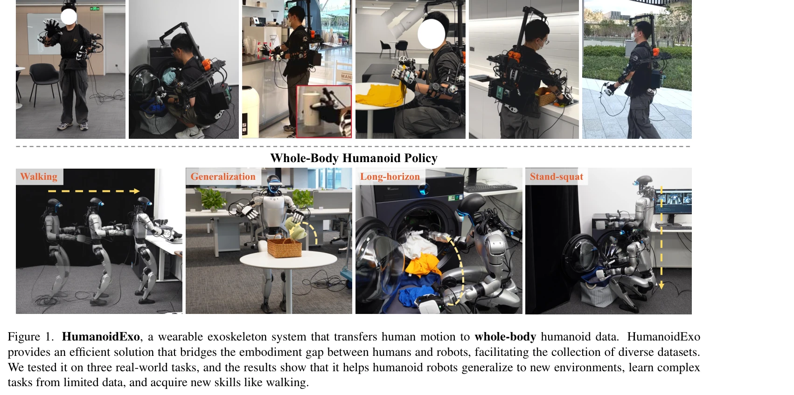
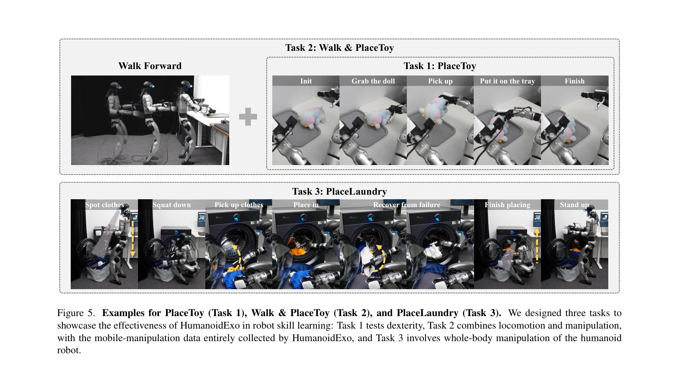
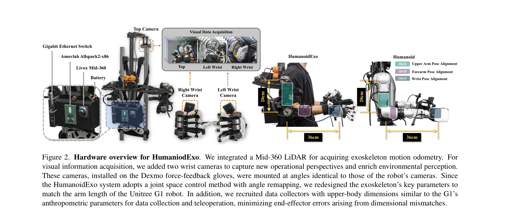

# HumanoidExo: Scalable Whole-Body Humanoid Manipulation via Wearable Exoskeleton

> **저자**: Rui Zhong, Yizhe Sun, Junjie Wen, Jinming Li, Chuang Cheng, Wei Dai, Zhiwen Zeng, Huimin Lu, Yichen Zhu, Yi Xu | **날짜**: 2025-10-03 | **DOI**: [10.48550/arXiv.2510.03022](https://doi.org/10.48550/arXiv.2510.03022)

---

## Essence

*Figure 1. HumanoidExo, a wearable exoskeleton system that transfers human motion to whole-body humanoid data. HumanoidEx*

웨어러블 외골격(exoskeleton)을 통해 인간의 전신 동작을 휴머노이드 로봇 데이터로 변환하는 HumanoidExo 시스템을 제안하여, 휴머노이드 정책 학습을 위한 대규모 다양한 데이터셋 수집의 병목을 해결한다.

## Motivation

- **Known**: 휴머노이드 로봇 정책 학습은 teleoperation, sim-to-real 전이, 웹 규모 비디오 학습 등 여러 데이터 수집 방법이 연구되어 왔으나, 시뮬레이션과 실제 로봇 간의 embodiment gap, 텔레연산의 높은 비용과 확장성 부족이 지속적인 문제이다.
- **Gap**: 기존 방법들(DexCap, AirExo, UMI 등)은 상지 조작에만 집중하거나 일반 로봇팔을 대상으로 하며, 휴머노이드의 전신 조작(walking, squatting 포함)을 위한 대규모 데이터 수집 시스템이 부재하다.
- **Why**: 휴머노이드 로봇이 복잡한 전신 제어 태스크를 수행하려면 대규모의 다양한 학습 데이터가 필수적이며, 효율적인 데이터 수집 시스템은 실제 휴머노이드 로봇의 실용화와 능력 향상에 직결되어 있다.
- **Approach**: 인간 몸의 7 DoF 팔과 정렬된 외골격 장치와 백마운트 LiDAR을 통해 전신 동작을 캡처하고, motion retargeting 파이프라인으로 embodiment gap을 최소화한 후, HE-VLA(Vision-Language-Action 모델)에 imitation learning과 reinforcement learning을 결합하여 안정적인 정책을 학습한다.

## Achievement

*Figure 5. Examples for PlaceToy (Task 1), Walk & PlaceToy (Task 2), and PlaceLaundry (Task 3). We designed three tasks t*

- **일반화 능력**: HumanoidExo 데이터를 통합하면 학습된 정책이 새로운 장면과 환경으로의 일반화가 효과적으로 이루어진다.
- **데이터 효율성**: 단 5개의 실제 로봇 시연만으로도 복잡한 전신 제어 태스크를 학습할 수 있다.
- **신규 기능 습득**: 실제 로봇 시연 없이 외골격 데이터만으로 walking과 같은 완전히 새로운 기능을 습득할 수 있다.

## How

*Figure 2. Hardware overview for HumaniodExo. We integrated a Mid-360 LiDAR for acquiring exoskeleton motion odometry. Fo*

- **외골격 하드웨어 설계**: 인간의 7개 팔 관절과 정렬된 isomorphic 외골격을 설계하고 글레노휴머럼 관절에 2개 추가 DoF 추가
- **상지 포즈 정렬**: Denavit-Hartenberg (DH) 파라미터와 forward kinematics를 이용하여 외골격 관절을 로봇 관절로 매핑
- **하지 동역학 추적**: 백마운트 Mid-360 LiDAR을 통해 사용자의 몸통 6D 포즈를 추적하여 walking, squatting 등의 기저 이동 기록
- **Motion retargeting**: 외골격과 LiDAR 데이터를 융합하여 kinematically feasible한 전신 궤적 생성
- **HE-VLA 모델**: Vision-Language-Action 기반 정책 모델에 imitation learning 기초 위에 reinforcement learning(actor-critic)을 통해 균형 및 안정성 확보
- **하이브리드 학습**: 외골격 데이터(대규모)와 실제 로봇 데이터(소규모)를 결합하여 효율적이고 안정적인 정책 학습

## Originality

- **처음의 전신 휴머노이드 시스템**: 기존 DexCap, AirExo, UMI 등은 상지 또는 특정 부위에만 집중한 반면, HumanoidExo는 최초로 외골격을 통한 전신(상지+하지+기저 이동) 휴머노이드 데이터 수집 시스템을 제시
- **Joint space 직접 매핑**: Cartesian 공간 제어의 한계를 극복하고 역기구학 다해 문제를 해결하기 위해 외골격 관절을 로봇 관절에 직접 매핑하는 embodiment gap 최소화 전략
- **LiDAR 기반 베이스 추적**: 백마운트 LiDAR을 통한 6D 토르소 포즈 추적으로 walking, squatting 등 복잡한 기저 동작 캡처
- **Hybrid imitation-RL 학습**: 외골격 데이터 기반 학습에 reinforcement learning을 결합하여 실제 로봇의 안정성 확보

## Limitation & Further Study

- **외골격 착용 제약**: 외골격은 사용자에게 물리적 부담을 주며, 장시간 착용에 따른 피로가 데이터 수집 효율성을 제한할 수 있음
- **Embodiment gap 완전 해결 미흡**: 인간과 휴머노이드 간의 신체 비율 및 운동 특성 차이가 완전히 해소되지 않아 retargeting 과정에서 손실 가능성
- **LiDAR 기반 추적의 한계**: 복잡한 실내 환경이나 반사 표면에서 LiDAR 정확도 저하 가능성, 동적 장애물 환경에서의 견고성 미검증
- **특정 로봇 플랫폼 의존성**: 실험이 특정 휴머노이드 플랫폼에서만 수행되었으므로 다른 형태의 휴머노이드로의 일반화 가능성 미확인
- **후속 연구 방향**: 더 가벼운 외골격 설계, 더 정교한 손가락 제어 메커니즘 개발, 다양한 휴머노이드 형태에 대한 적응형 motion retargeting 알고리즘 연구가 필요

## Evaluation

- Novelty: 4/5
- Technical Soundness: 3/5
- Significance: 4/5
- Clarity: 4/5
- Overall: 4/5

**총평**: HumanoidExo는 웨어러블 외골격을 통한 전신 휴머노이드 데이터 수집의 첫 성공적 사례로, 기존 방법의 상지 집중 문제를 극복하고 embodiment gap을 최소화한 혁신적 접근이다. 실험 결과가 제한적이고 기술적 깊이가 다소 부족하지만, 휴머노이드 정책 학습의 데이터 병목 문제 해결이라는 실질적 기여와 높은 실용성으로 인해 로보틱스 분야에 의미 있는 진전을 제시한다.
