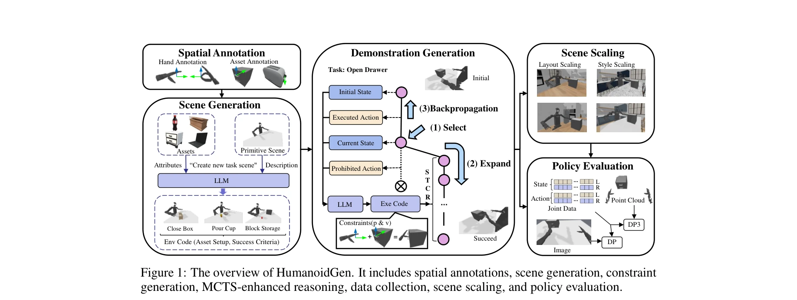

# HumanoidGen: Data Generation for Bimanual Dexterous Manipulation via LLM Reasoning

> **저자**: Zhi Jing, Siyuan Yang, Jicong Ao, Ting Xiao, Yu-Gang Jiang, Chenjia Bai | **날짜**: 2025-07-01 | **URL**: [https://arxiv.org/abs/2507.00833](https://arxiv.org/abs/2507.00833)

---

## Essence

*Figure 1: The overview of HumanoidGen. It includes spatial annotations, scene generation, constraint*

HumanoidGen은 LLM 추론과 원자적 손 동작을 활용하여 휴머노이드 로봇의 양손 정교한 조작을 위한 시뮬레이션 데이터와 시연을 자동으로 생성하는 프레임워크이다. MCTS 기반 추론 강화를 통해 장시간 작업과 불충분한 주석에서의 계획 능력을 개선한다.

## Motivation

- **Known**: 기존 로보틱 데이터셋과 벤치마크는 주로 단일 팔 로봇 플랫폼에 집중되어 있으며, 휴머노이드 로봇의 양손 정교한 조작을 위한 고품질 시뮬레이션 작업과 시연이 부족하다. VR 텔레조작과 강화학습 기반 데이터 수집 방식은 비용이 크고 확장성이 제한적이다.
- **Gap**: 양손 정교한 조작의 복잡성으로 인해 자동화된 데이터 생성과 스케일 가능한 시연 수집을 위한 효율적인 방법론이 결여되어 있다. 특히 긴 시간대의 작업과 부분적 공간 주석 상황에서 LLM의 계획 능력을 강화하는 기술이 필요하다.
- **Why**: 휴머노이드 로봇이 인간 수준의 조작 능력을 달성하려면 양손 협력 작업을 위한 대규모 고품질 데이터셋이 필수적이며, 자동화된 생성 기술은 데이터 수집 비용을 획기적으로 줄이면서 작업 다양성을 확보할 수 있다.
- **Approach**: 공간 주석(키포인트와 키축)을 기반으로 LLM 플래너가 공간 제약 조건을 생성하고, MCTS 기반 내성적 탐색(introspective exploration)으로 LLM 추론을 강화하며, 제약 최적화 솔버를 통해 실행 가능한 궤적을 생성한다. 시뮬레이션에서 수집한 데이터로 diffusion policy를 학습하여 성능 향상을 검증한다.

## Achievement

*Figure 1: The overview of HumanoidGen. It includes spatial annotations, scene generation, constraint*

- **자동화된 작업 생성 및 시연 수집**: LLM 기반 코드 생성을 통해 환경 설정과 성공 기준을 자동으로 작성하고, 공간 제약 기반 계획으로 양손 정교한 조작의 시연을 대규모로 수집
- **원자적 손 동작 기반 계획**: grasp, pinch, press 등 원자적 동작의 공간 주석을 정의하여 복합 작업을 체계적으로 분해하고 실행 가능한 제약 조건을 생성
- **MCTS 강화 추론**: Monte Carlo tree search 변형을 활용하여 장시간 작업과 불충분한 주석 상황에서 LLM의 계획 능력을 유의미하게 향상
- **HGen-Bench 벤치마크 구축**: 20개 난이도별 양손 정교한 조작 작업으로 구성된 포괄적 벤치마크 개발 및 공개
- **스케일 기반 성능 향상**: 생성된 데이터셋 규모 증가에 따라 2D/3D diffusion policy의 성능이 지속적으로 향상됨을 실증

## How

*Figure 1: The overview of HumanoidGen. It includes spatial annotations, scene generation, constraint*

- 공간 주석 설계: 자산과 손에 대한 키포인트(grasp point, pinch point 등)와 키축(approach axis, attach axis, parallel axis)을 정의하여 LLM이 기하학적 관계를 이해하도록 지원
- LLM 기반 장면 생성: 자산, 장면, 작업 설명을 입력하여 LLM이 환경 설정과 성공 기준을 코드 형태로 생성
- 제약 기반 계획: LLM이 공간 관계를 기반으로 팔 움직임과 손 동작의 제약 조건 체인을 생성
- MCTS 기반 추론 강화: 내성적 탐색 기능을 포함한 MCTS 변형으로 장시간 작업에서 LLM의 탐색 공간을 효율적으로 관리
- 제약 최적화 해결: 생성된 제약 조건을 오프더셀프 궤적 최적화기로 해결하여 팔과 손의 이동을 생성
- 시나리오 증강 수집: 무작위화된 장면 구성으로 시뮬레이션 실행 후 성공한 궤적을 시연으로 저장
- 정책 학습 및 평가: 수집한 시연으로 diffusion policy를 학습하고 데이터 규모 확장에 따른 성능 향상 검증

## Originality

- 원자적 손 동작과 공간 주석의 결합: 손의 복잡한 동작을 grasp, pinch, press 등 원자적 단위로 분해하고 각각에 대한 공간 주석을 정의하여 LLM이 체계적으로 이해하도록 한 점이 기존 방식과 차별화
- LLM 기반 코드 생성을 통한 완전 자동화: 자연어 기반 계획을 직접 실행 가능한 Python 코드로 변환하는 접근법으로, 로봇 시뮬레이션의 자동화 수준을 높임
- MCTS 기반 LLM 추론 강화: 단순 LLM 호출이 아니라 MCTS의 트리 탐색 구조로 LLM의 장시간 계획 능력을 체계적으로 개선
- 양손 정교한 조작의 전문화된 벤치마크: 휴머노이드 로봇의 양손 협력과 손가락 정교함을 동시에 요구하는 작업 중심 벤치마크 개발로 기존 단일 팔 벤치마크의 한계 극복

## Limitation & Further Study

- 공간 주석의 수동 작성 부담: 각 자산과 손 동작에 대한 키포인트와 키축을 수동으로 정의해야 하며, 이는 새로운 자산 추가 시 확장성 문제 야기 (저자도 Stable Diffusion 활용 가능성 언급)
- 시뮬레이션 환경 의존성: SAPIEN 시뮬레이션 엔진에서의 성공이 반드시 실제 로봇 환경으로의 전이를 보장하지 않으며, sim-to-real gap 분석 부재
- 제약 최적화 실패 처리: 생성된 제약 조건이 해를 갖지 않는 경우에 대한 폴백 메커니즘이 명확하지 않음
- 벤치마크 작업의 제한성: 20개 작업으로 구성된 벤치마크는 상대적으로 규모가 작으며, 더욱 다양한 현실 세계 작업의 포함 필요
- 후속 연구 방향: (1) 자동 주석 도구 개발로 확장성 개선, (2) 실제 로봇 플랫폼에서의 검증 및 sim-to-real 연구, (3) 동적 장면과 상호작용하는 객체 처리 기술 강화, (4) 더욱 복잡한 다단계 협력 작업 포함으로 벤치마크 확대

## Evaluation

- Novelty: 4/5
- Technical Soundness: 3/5
- Significance: 4/5
- Clarity: 4/5
- Overall: 4/5

**총평**: HumanoidGen은 LLM 기반 자동화, 원자적 손 동작 설계, MCTS 강화 추론의 조합으로 휴머노이드 로봇의 양손 정교한 조작 데이터 생성에 새로운 접근법을 제시하며, HGen-Bench 벤치마크와 함께 데이터 스케일링의 성능 향상을 실증하여 실무적 가치가 높다. 다만 공간 주석의 수동 작성 부담과 sim-to-real 검증 부재가 확장성을 제한한다.

## Related Papers

- 🔄 다른 접근: [[papers/1869_DexMimicGen_Automated_Data_Generation_for_Bimanual_Dexterous/review]] — LLM 기반 양손 데이터 생성과 자동화된 양손 정교 조작 데이터 생성은 유사한 목표를 서로 다른 접근법으로 달성한다.
- 🔗 후속 연구: [[papers/1824_BiGym_A_Demo-Driven_Mobile_Bi-Manual_Manipulation_Benchmark/review]] — 양손 조작 벤치마크가 휴머노이드 양손 데이터 생성의 평가 확장이다.
- 🏛 기반 연구: [[papers/1967_HandX_Scaling_Bimanual_Motion_and_Interaction_Generation/review]] — 양손 모션 및 상호작용 생성 확장이 휴머노이드 데이터 생성의 기반 기술이다.
- 🧪 응용 사례: [[papers/2114_Object-Centric_Dexterous_Manipulation_from_Human_Motion_Data/review]] — object-centric dexterous manipulation이 HumanoidGen의 원자적 손 동작과 LLM 추론을 실제 조작 작업에 적용하는 구체적 사례를 제시합니다.
- 🔗 후속 연구: [[papers/2115_OKAMI_Teaching_Humanoid_Robots_Manipulation_Skills_through_S/review]] — HumanoidGen의 자동 데이터 생성이 OKAMI의 인간 시연 기반 조작 학습과 결합되어 더 효율적인 학습 파이프라인 구성 가능
- 🏛 기반 연구: [[papers/1412_GR00T_N1_An_Open_Foundation_Model_for_Generalist_Humanoid_Ro/review]] — GR00T의 범용 휴머노이드 모델이 HumanoidGen의 양손 조작 데이터 생성 프레임워크의 기반이 될 수 있음
- 🔗 후속 연구: [[papers/1644_RoboCasa_Large-Scale_Simulation_of_Everyday_Tasks_for_Genera/review]] — HumanoidGen의 양손 정교 조작 데이터 생성이 RoboCasa의 kitchen task 중심 synthetic trajectory를 확장함
- 🔗 후속 연구: [[papers/1869_DexMimicGen_Automated_Data_Generation_for_Bimanual_Dexterous/review]] — HumanoidGen이 bimanual dexterous manipulation 데이터 생성을 humanoid 전체로 확장하여 DexMimicGen의 응용 범위를 넓힌다.
- 🔗 후속 연구: [[papers/1967_HandX_Scaling_Bimanual_Motion_and_Interaction_Generation/review]] — HandX의 bimanual motion dataset을 HumanoidGen이 LLM 추론과 결합하여 자동화된 양손 조작 데이터 생성으로 확장합니다.
