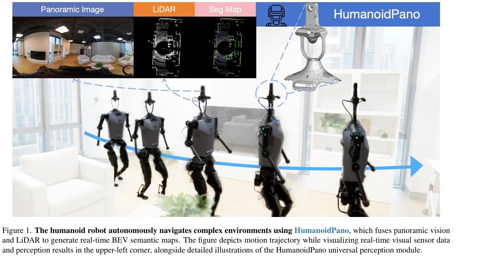
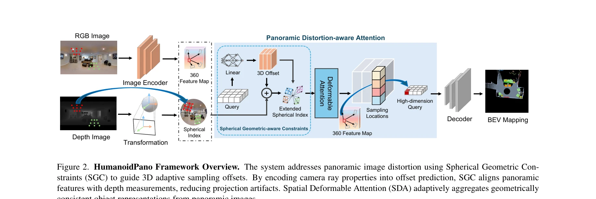

# HumanoidPano: Hybrid Spherical Panoramic-LiDAR Cross-Modal Perception for Humanoid Robots

> **저자**: Qiang Zhang, Zhang Zhang, Wei Cui, Jingkai Sun, Jiahang Cao, Yijie Guo, Gang Han, Wen Zhao, Jiaxu Wang, Chenghao Sun, Lingfeng Zhang, Hao Cheng, Yujie Chen, Lin Wang, Jian Tang, Renjing Xu | **날짜**: 2025-03-12 | **URL**: [https://arxiv.org/abs/2503.09010](https://arxiv.org/abs/2503.09010)

---

## Essence

*Figure 1. The humanoid robot autonomously navigates complex environments using HumanoidPano, which fuses panoramic visio*

인간형 로봇의 자아-폐색 및 제한된 시야 문제를 해결하기 위해 파노라마 비전과 LiDAR를 융합하는 HumanoidPano 프레임워크를 제안하며, Spherical Geometry-aware Constraints와 Spatial Deformable Attention을 통해 기하학적으로 정렬된 크로스모달 인식을 구현한다.

## Motivation

- **Known**: 자동차 자율주행과 산업용 로봇은 견고한 센서 배치로 완전한 360도 인식을 달성하나, 인간형 로봇의 생체모방 구조는 팔다리 자아-폐색으로 인해 심각한 시야 제한을 야기한다. 파노라마 비전은 FOV 문제를 해결하지만 spherical projection 하에서 구조적 단편화, 스케일 불일치, 깊이 인식 저하 문제가 발생한다.
- **Gap**: 기존 panoramic-LiDAR 융합 방법들은 spherical projection과 point cloud 간의 기하학적 비호환성을 해결하지 못하며, 동적 관절 운동으로 인한 크로스모달 정렬 드리프트와 panoramic-BEV 통합 표현의 기하학적 정보 부족 문제를 다루지 않는다.
- **Why**: 인간형 로봇의 자율 네비게이션과 환경 조작은 정확한 3D 장면 이해와 실시간 BEV 시맨틱 맵 생성이 필수적이며, 로봇의 구조적 제약을 인식 알고리즘 설계에 반영할 필요가 있다.
- **Approach**: panoramic 이미지에서 추출한 ray 특성을 활용한 Spherical Geometry-aware Constraints로 distortion-aware 크로스모달 정렬을 수행하고, Spatial Deformable Attention을 통해 360°-to-BEV 융합을 효율적으로 처리하며, cross-view metric consistency를 보존하는 Panoramic Augmentation으로 학습 데이터의 기하학적 정보 부족을 보완한다.

## Achievement

*Figure 1. The humanoid robot autonomously navigates complex environments using HumanoidPano, which fuses panoramic visio*

- **Universal Humanoid Perception Framework**: 인간형 로봇의 생체역학적 제약을 고려한 일반 목적 인식 시스템으로 panoramic vision과 LiDAR를 구조적으로 융합
- **State-of-the-art Performance**: 360BEV-Matterport 데이터셋에서 기존 방법들을 능가하는 panoramic BEV 장면 이해 성능 달성
- **Real-world Validation**: 실제 인간형 로봇 플랫폼에 배포되어 정확한 BEV 시맨틱 맵 생성 및 복잡한 환경에서의 네비게이션 작업 수행 입증

## How

*Figure 2. HumanoidPano Framework Overview. The system addresses panoramic image distortion using Spherical Geometric Con*

- **Spherical Geometry-aware Constraints (SGC)**: panoramic camera의 ray 특성에서 유도된 기하학적 제약을 통해 distortion-regularized sampling offset을 안내하여 기하학적 정렬 수행
- **Spatial Deformable Attention (SDA)**: spherical offset을 통해 계층적 3D 특성을 집계하여 기하학적으로 완전한 객체 표현을 갖춘 360°-to-BEV 융합 실현
- **Panoramic Augmentation (AUG)**: cross-view 변환과 시맨틱 정렬을 결합하여 데이터 증강 시 BEV-panoramic 특성 일관성 강화
- **Hierarchical Processing Pipeline**: pixel-level 시맨틱 특성 추출 → geometry-aware 깊이 프로파일링 → 크로스모달 특성 융합의 3단계 구조

## Originality

- 인간형 로봇의 구조적 자아-폐색 문제를 인식 알고리즘 설계의 핵심 고려사항으로 첫 적용
- Spherical projection의 ray 기하학을 명시적으로 모델링하여 panoramic-LiDAR 크로스모달 정렬 문제를 해결하는 기하학적 제약 메커니즘 개발
- Panoramic 이미지와 BEV 공간 변환을 통합하는 새로운 데이터 증강 방식으로 cross-view metric consistency 보존
- 인간형 로봇 플랫폼에서 실제 작동 가능한 통합 perception 시스템으로 처음 구현 및 검증

## Limitation & Further Study

- 실험이 360BEV-Matterport 벤치마크에 제한되어 다양한 실내 환경에 대한 일반화 성능 평가 부족
- 동적 관절 운동으로 인한 실시간 정렬 드리프트 문제에 대한 온라인 적응 메커니즘 미흡
- 파노라마 카메라와 LiDAR의 시간 동기화 오차 및 센서 calibration 오차에 대한 robustness 분석 제한
- 후속 연구로 다중 인간형 로봇 플랫폼 간 모델 전이 가능성, 동적 환경에서의 적응적 정렬 알고리즘, 에너지 효율성 최적화 필요

## Evaluation

- Novelty: 4/5
- Technical Soundness: 4/5
- Significance: 4/5
- Clarity: 4/5
- Overall: 4/5

**총평**: HumanoidPano는 인간형 로봇의 고유한 구조적 제약을 심층적으로 고려하여 panoramic vision과 LiDAR를 기하학적으로 정렬하는 혁신적인 프레임워크로, 실제 로봇 플랫폼에서의 검증과 state-of-the-art 성능으로 embodied AI 분야에 새로운 패러다임을 제시한다.
