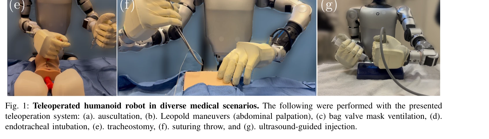

# Humanoids in Hospitals: A Technical Study of Humanoid Robot Surrogates for Dexterous Medical Interventions

> **저자**: Soofiyan Atar, Xiao Liang, Calvin Joyce, Florian Richter, Wood Ricardo, Charles Goldberg, Preetham Suresh, Michael Yip | **날짜**: 2025-03-17 | **URL**: [https://arxiv.org/abs/2503.12725](https://arxiv.org/abs/2503.12725)

---

## Essence

*Fig. 1: Teleoperated humanoid robot in diverse medical scenarios. The following were performed with the presented*

본 연구는 Unitree G1 인간형 로봇에 대한 원격조종 시스템을 개발하여 7가지 의료 시술(신체검진, 응급 개입, 정밀 바늘 작업)을 수행할 수 있는 가능성을 탐색적으로 검증했다.

## Motivation

- **Known**: 의료 로봇은 복강경 수술, 정형외과, 기관지경 검사 등 특정 작업에만 특화되어 있으며, 인간형 로봇의 유연성을 활용한 병원 통합 연구는 제한적이다.
- **Gap**: 기존 의료 로봇은 형태학적으로 특화되어 있어 다양한 임상 작업을 수행할 수 없으며, 인간형 로봇이 직접 의료 시술을 수행할 수 있는지에 대한 체계적 평가가 부족하다.
- **Why**: 인구 고령화와 의료 인력 부족이 심화되고 있는 상황에서, 인간형 로봇의 손재주(dexterity)와 적응성을 활용하면 의료 업무 부담을 완화할 수 있을 것으로 기대된다.
- **Approach**: HTC Vive tracker, WiLoR 손 자세 추적, impedance controller를 통합한 양팔 원격조종 시스템을 개발하고, 이를 7가지 의료 시술에 적용하여 성능을 평가했다.

## Achievement

*Fig. 1: Teleoperated humanoid robot in diverse medical scenarios. The following were performed with the presented*

- **양팔 원격조종 시스템 개발**: HTC Vive tracker와 multi-camera hand pose tracking을 결합하여 고충실도의 이중 팔 제어 인터페이스 구현
- **의료 시술 수행 검증**: 청진, Leopold maneuver, bag-valve-mask ventilation, 기관내 삽관, 기관절개술, 봉합, 초음파 유도 주사 등 7가지 다양한 임상 작업 성공적 수행
- **Impedance control 기반 안전 조작**: 접촉 중심 작업에서 힘 규제를 통해 안전하고 정밀한 의료 도구 조작 실현
- **정량적 성능 입증**: ventilation과 ultrasound-guided task에서 유망한 정량적 성능 달성

## How

- HTC Vive tracker를 이용한 손 위치/자세 추적 및 foot pedal을 통한 clutching 제어
- WiLoR 모델로 다중 카메라에서 인간 손 keypoint 감지 및 cosine-based reliability factor를 통한 robust 3D 자세 추정
- Kinematic re-targeting을 통해 인간 손 자세를 로봇 관절 각도로 변환 (식 1)
- 상대 손 운동을 기반으로 end-effector 구동하는 relative motion mapping (식 4-5)
- Joint torque로부터 Jacobian을 이용해 Cartesian end-effector force 추정 및 impedance control 적용 (식 6)
- Virtual spring-damper mechanism으로 양팔 운동을 동기화하고 협력 작업에서 힘 공유

## Originality

- 인간형 로봇으로 다양한 임상 작업을 직접 수행하는 첫 번째 체계적 탐색 연구
- HTC Vive tracker + WiLoR + foot pedal을 결합한 novel teleoperation interface로 다중 grasping configuration 지원
- Impedance control 기반의 힘 조절을 통해 접촉 중심 의료 시술에 적합한 안전 메커니즘 구현
- Relative motion mapping과 virtual spring-damper를 활용한 직관적이고 안정적인 양팔 협력 제어

## Limitation & Further Study

- **힘 출력 제한**: 고강도가 필요한 시술(예: 강한 압력이 필요한 검사)에서 로봇의 힘 출력 부족
- **센서 민감도 문제**: 임상 정확도에 영향을 미치는 센서 감도 한계
- **원격조종 의존성**: 자율 시스템이 아닌 원격조종 기반이므로 실시간 통신 지연에 취약
- **후속연구 필요**: 자율 제어 알고리즘 개발, force feedback 시스템 개선, 임상 실제 환경에서의 검증 필요

## Evaluation

- Novelty: 4/5
- Technical Soundness: 3/5
- Significance: 4/5
- Clarity: 4/5
- Overall: 4/5

**총평**: 본 연구는 인간형 로봇의 의료 활용 가능성을 처음으로 체계적으로 탐색한 획기적인 연구로, innovative teleoperation 시스템과 실제 임상 작업 검증을 통해 향후 의료 로봇 통합의 토대를 마련했다. 다만 힘 출력과 센서 한계로 인한 현실적 과제 해결이 임상 배포를 위한 핵심 과제이다.
