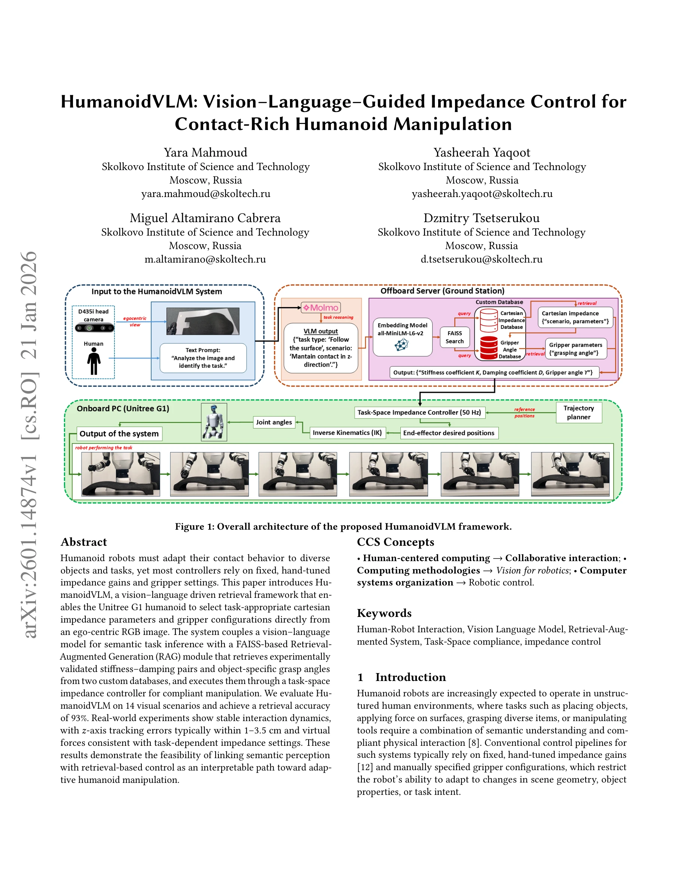

# HumanoidVLM: Vision-Language-Guided Impedance Control for Contact-Rich Humanoid Manipulation

> **저자**: Yara Mahmoud, Yasheerah Yaqoot, Miguel Altamirano Cabrera, Dzmitry Tsetserukou | **날짜**: 2026-01-21 | **URL**: [https://arxiv.org/abs/2601.14874](https://arxiv.org/abs/2601.14874)

---

## Essence

*Figure 1: Overall architecture of the proposed HumanoidVLM framework.*

HumanoidVLM은 vision-language model과 retrieval-augmented generation을 결합하여 휴머노이드 로봇이 egocentric 이미지로부터 task-specific impedance parameters와 gripper configuration을 자동으로 선택하는 적응형 조작 프레임워크이다.

## Motivation

- **Known**: 기존 휴머노이드 로봇 제어는 고정된 hand-tuned impedance gains와 gripper settings에 의존하며, VLM은 높은 semantic understanding 능력을 보유하고 있다.
- **Gap**: VLM의 우수한 semantic reasoning 능력이 실제 로봇의 저수준 contact manipulation 제어 파라미터와 연결되지 못하고 있으며, 현재 시스템들은 task-dependent impedance 설정을 자동화하지 못한다.
- **Why**: Contact-rich manipulation에서 stiffness, damping, grasping configuration을 올바르게 선택하는 것이 안전하고 안정적인 실행에 필수적이므로, semantic perception과 physical control의 통합이 중요하다.
- **Approach**: Molmo-7B-O VLM으로 task inference를 수행하고, FAISS 기반 RAG 모듈이 실험으로 검증된 impedance parameters와 gripper angles를 custom databases에서 retrieval한 후, task-space cartesian impedance controller로 실행한다.

## Achievement

*Figure 3: Retrieval accuracy of the VLM–RAG system across*

- **Retrieval 정확도**: 14개 visual scenarios에서 93% retrieval accuracy 달성
- **Position tracking**: z-axis tracking errors가 일반적으로 1-3.5 cm 범위 내에서 안정적인 상호작용 동역학 구현
- **Virtual forces**: task-dependent impedance settings과 일치하는 virtual force 측정
- **해석성**: semantic perception과 retrieval 기반 제어의 연결을 통해 인간이 이해 가능한 적응형 조작 경로 제시

## How

*Figure 1: Overall architecture of the proposed HumanoidVLM framework.*

- VLM이 structured sequential yes/no queries를 통해 ego-centric image에서 task와 object context 추론
- Visual output을 all-MiniLM-L6-v2 sentence-transformer로 embedding하여 벡터 공간에서 semantic retrieval 가능하게 구성
- Impedance database에서 task-specific K=[Kx, Ky, Kz]와 D=[Dx, Dy, Dz] 계수 retrieval
- Gripper database에서 object type별 최적 closing angle γa retrieval
- 6-DoF homogeneous mass-spring-damper model을 task space에서 구현: Ma¨ea + Da·ea + Kaea = 0
- Retrieved parameters를 onboard PC에서 50 Hz로 실행되는 task-space controller에 전달
- 가상 force Fvirt_a = Kaea + Da·ea로 contact force 대리 측정 (wrist force-torque sensor 미구비 극복)
- Inverse kinematics로 desired virtual poses를 joint targets로 변환하여 robot's built-in position controllers로 실행

## Originality

- Humanoid embodiment에 최적화된 VLM-RAG 기반 impedance control: 기존 OmniVIC는 industrial arms, ImpedanceGPT는 humanoid 조작의 full stack integration 부재
- Egocentric visual perception으로부터 직접 task-appropriate compliance settings 자동 결정
- 두 개의 custom experimental databases (impedance + gripper)를 통한 실제 로봇 데이터 기반 retrieval
- Force-torque sensor 없이도 virtual force proxy로 interaction dynamics 정량화하는 방식
- Semantic task inference와 low-level manipulation parameters의 직접 연결

## Limitation & Further Study

- Database가 9개의 사전정의된 manipulation tasks만 포함하여 out-of-distribution scenarios에 대한 generalization 능력 부족
- Z-axis tracking error 1-3.5 cm는 정밀 manipulation 작업에 제한적일 수 있음
- Wrist force-torque sensor 미탑재로 인한 virtual force proxy의 신뢰성 한계
- Single-DoF gripper는 복잡한 grasping scenarios를 지원하지 못함
- 외부 GPU workstation (RTX 4090) 의존으로 실제 on-board deployment의 실시간성 미검증
- 후속 연구: in-context learning을 통한 새로운 task에 대한 dynamic database expansion, 실제 contact forces를 위한 tactile sensing 통합, multi-DoF adaptive gripper 개발

## Evaluation

- Novelty: 4/5
- Technical Soundness: 3/5
- Significance: 4/5
- Clarity: 4/5
- Overall: 4/5

**총평**: 본 논문은 VLM과 RAG를 humanoid manipulation에 효과적으로 적용하여 semantic perception과 compliant control을 처음 체계적으로 연결했으며, 높은 retrieval 정확도와 실제 로봇 실험을 통해 타당성을 입증했다. 다만 고정된 database 규모와 sensor 제약이 향후 확장성을 제한하는 점이 개선 대상이다.

## Related Papers

- 🔄 다른 접근: [[papers/1663_SafeHumanoid_VLM-RAG-driven_Control_of_Upper_Body_Impedance/review]] — SafeHumanoid의 VLM-RAG driven control이 HumanoidVLM과 다른 방식으로 vision-language 기반 제어를 구현합니다.
- 🏛 기반 연구: [[papers/1904_EgoVLA_Learning_Vision-Language-Action_Models_from_Egocentri/review]] — EgoVLA의 vision-language-action learning이 HumanoidVLM의 adaptive manipulation framework 기반이 됩니다.
- 🔗 후속 연구: [[papers/1923_FAME_Force-Adaptive_RL_for_Expanding_the_Manipulation_Envelo/review]] — FAME의 force-adaptive RL이 HumanoidVLM의 impedance parameter 선택을 강화학습으로 확장합니다.
- 🔄 다른 접근: [[papers/1663_SafeHumanoid_VLM-RAG-driven_Control_of_Upper_Body_Impedance/review]] — 두 논문 모두 VLM을 활용한 휴머노이드 제어를 다루지만, 안전성 중심과 일반적인 임피던스 제어라는 다른 관점을 가진다.
- 🔗 후속 연구: [[papers/1915_Endowing_GPT-4_with_a_Humanoid_Body_Building_the_Bridge_Betw/review]] — 비전-언어 가이드 임피던스 제어가 off-the-shelf VLM을 물리적 제어로 연결하는 확장된 구현이다.
