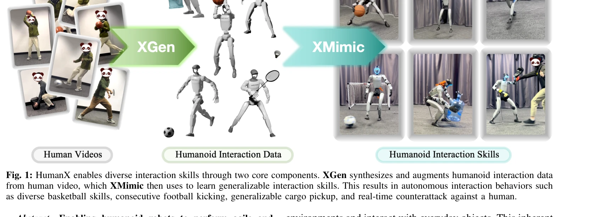

# HumanX: Toward Agile and Generalizable Humanoid Interaction Skills from Human Videos

> **저자**: Yinhuai Wang, Qihan Zhao, Yuen Fui Lau, Runyi Yu, Hok Wai Tsui, Qifeng Chen, Jingbo Wang, Jiangmiao Pang, Ping Tan | **날짜**: 2026-02-02 | **DOI**: [10.48550/arXiv.2602.02473](https://doi.org/10.48550/arXiv.2602.02473)

---

## Essence

*Fig. 1: HumanX enables diverse interaction skills through two core components. XGen synthesizes and augments humanoid in*

HumanX는 인간 비디오로부터 휴머노이드 로봇의 상호작용 스킬을 학습하는 전체 스택 프레임워크로, XGen 데이터 생성 파이프라인과 XMimic 모방 학습 프레임워크의 두 가지 핵심 컴포넌트를 통합하여 과제별 보상 설계 없이 일반화 가능한 현실 세계 스킬을 습득한다.

## Motivation

- **Known**: 행동 복제(BC)는 대규모 텔레옵 데모에 의존하고, 강화학습(RL)은 과제별 보상 함수 설계가 필요하여 확장성이 제한된다. 인간 동작을 휴머노이드에 재타겟팅하고 시뮬레이션에서 모방 학습을 적용하는 연구는 진행 중이지만, 현실 세계 배포 시 물리적 타당성과 일반화 문제가 존재한다.
- **Gap**: 단일 비디오로부터 현실 세계 휴머노이드에 대한 정확하고 자연스러운 인간-물체 상호작용(HOI) 스킬 배포는 어려우며, 특히 가려짐(occlusion)과 깊이 모호성으로 인한 물리적 비타당성과 과적합으로 인한 낮은 일반화 능력이 문제이다.
- **Why**: 휴머노이드 로봇이 인간 환경에서 다양한 일상적 물체와 상호작용할 수 있는 능력은 로보틱스의 핵심 과제이며, 확장 가능하고 과제-불가지론적인 방식으로 현실 세계 상호작용 스킬을 습득하는 것은 로봇의 실용적 적용을 크게 향상시킬 수 있다.
- **Approach**: XGen은 물리 시뮬레이션과 접촉 기반 정제를 통해 비디오로부터 물리적으로 타당한 휴머노이드-물체 상호작용 궤적을 합성하고, 물체 기하학 스케일링 및 궤적 변화를 통한 데이터 증강을 지원한다. XMimic은 통합된 보상 스킴, 유연한 지각 메커니즘, 교란된 초기화를 통한 일반화 우선 학습, 그리고 교사-학생 이단계 프레임워크를 통해 일반화 가능한 상호작용 스킬을 학습한다.

## Achievement

*Fig. 1: HumanX enables diverse interaction skills through two core components. XGen synthesizes and augments humanoid in*

- **다양한 도메인 지원**: 농구, 축구, 배드민턴, 화물 픽업, 반응형 격투 등 5개 도메인에서 10가지 서로 다른 스킬 습득
- **높은 일반화 성공률**: 이전 방법 대비 8배 이상 높은 일반화 성공률 달성
- **단일 비디오 학습**: 각 스킬을 단 하나의 비디오 시연으로부터 학습
- **복잡한 동작 수행**: 외부 지각 없이 펌프페이크 터라운드 페이드어웨이 점프샷과 같은 복잡한 동작 실행
- **연속 상호작용**: 10회 이상 연속적인 인간-로봇 농구 패싱 시퀀스 달성
- **적응형 행동**: 물체 제거/재배치 시 자율적으로 걸어가 재파지하기, 펀트와 실제 공격 구분 등 적응형 거동 시연
- **현실 세계 배포**: Unitree G1 휴머노이드에 제로샷 전이 성공

## How

*Fig. 2: Overview of XGen. The pipeline begins by estimating SMPL-based human motion from video and retargeting it to the*

- **XGen 파이프라인**: (1) 모노큘러 비디오로부터 SMPL 기반 인간 동작 추정 및 로봇 모폴로지로 재타겟팅, (2) 접촉 단계와 비접촉 단계 분할, (3) 접촉 단계에서 사전정의된 앵커(예: 두 손바닥 중점)를 기준으로 물체 메시 및 상대 포즈 추정, (4) 힘-폐합(force-closure) 최적화를 통한 로봇 포즈 정제
- **물리 기반 합성**: 비접촉 단계에서 시뮬레이션을 통해 물리적으로 타당한 물체 궤적 생성, 단계 연결 및 매끄로운 보간으로 완전한 상호작용 궤적 획득
- **데이터 증강**: 물체 메시 스케일, 기하학, 궤적 변화를 통해 단일 비디오로부터 다양하고 광범위한 상호작용 데이터 생성
- **XMimic 학습**: 통합 보상 스킴으로 다양한 복잡한 상호작용 행동의 정확한 모방 실현
- **유연한 지각**: 외부 센싱 없음 또는 MoCap 시스템을 통한 물체 센싱에 적응 가능한 지각 메커니즘
- **교란된 초기화**: 로봇 상태의 작은 섭동으로 시작하는 일반화 우선 학습
- **상호작용 우선화**: 상호작용 품질을 우선하는 학습 순서 설정
- **교사-학생 프레임워크**: 이단계 학습으로 원본 시연을 초과하는 일반화 정책 달성

## Originality

- **물리 중심의 패러다임 전환**: 광도 기반 재구성 정확성보다 물리적 타당성을 우선하는 새로운 접근법으로, 단순한 독립적 추정 결합의 한계(가려짐, 깊이 모호성) 극복
- **힘-폐합 최적화 기반 정제**: 접촉 단계에서 로봇 포즈를 물리 제약 하에서 정제하는 기법
- **효율적 데이터 증강**: 물체 스케일링 및 궤적 변화로 단일 비디오로부터 대규모 다양한 훈련 데이터 생성
- **통합 보상 스킴**: HOI의 복잡성을 단일 보상으로 다루며 다양한 상호작용 행동에 적용 가능
- **과제-불가지론적 프레임워크**: 과제별 보상 설계 없이도 다양한 도메인에 확장 가능한 일반적 방법론 제시

## Limitation & Further Study

- **초기 조건 의존성**: 현재 방법은 정확한 인간 동작 추정과 물체 메시 초기화에 의존하며, 이러한 입력의 정확도가 최종 성능에 영향
- **센싱 요구사항**: 연속 상호작용(예: 패싱)은 MoCap 같은 외부 센싱 시스템 필요 (스탠드얼론 배포 제약)
- **단일 비디오 학습의 한계**: 1개 비디오로부터의 학습이 모든 변동성을 포괄하기 어려울 수 있으며, 복잡한 상황에 대한 추가 데이터 필요 가능성
- **시뮬레이션-현실 격차**: 물체 동역학 모델링의 근사치로 인한 sim-to-real 격차 여전히 존재 가능
- **후속 연구 방향**: (1) 비디오로부터의 자동 물체 메시 및 동역학 추정 개선, (2) 모노큘러 비디오만으로 폐루프 상호작용 가능하게 하는 온보드 지각 시스템 개발, (3) 복잡한 다중 물체 상호작용으로 확장, (4) 인간-로봇 협력 작업 확대

## Evaluation

- Novelty: 4/5
- Technical Soundness: 3/5
- Significance: 4/5
- Clarity: 4/5
- Overall: 4/5

**총평**: HumanX는 물리 기반 데이터 합성과 일반화 우선 모방 학습을 결합하여 단일 비디오로부터 현실 세계 휴머노이드 로봇의 다양한 상호작용 스킬을 효율적으로 습득하는 획기적인 방법론을 제시하며, 8배 이상의 일반화 성능 향상과 적응형 행동 시연으로 로보틱스 분야에 상당한 기여를 한다.
