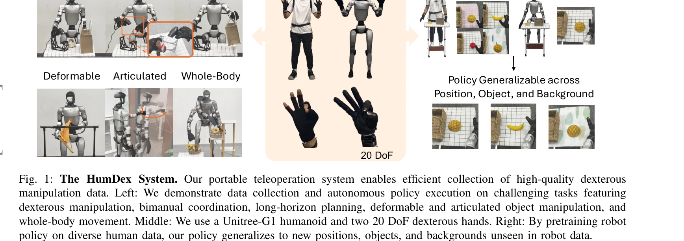
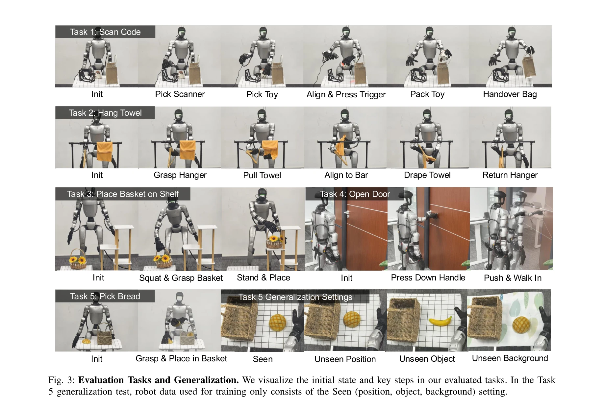
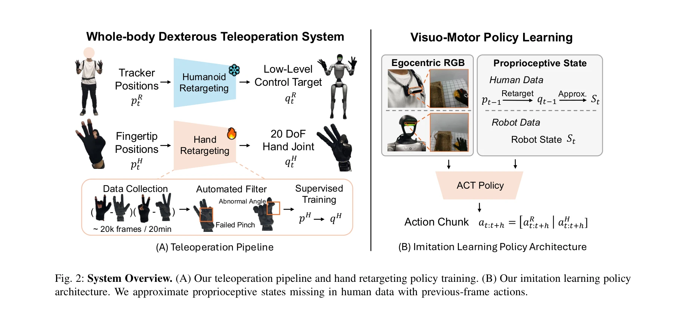

# HumDex: Humanoid Dexterous Manipulation Made Easy

> **저자**: Liang Heng, Yihe Tang, Jiajun Xu, Henghui Bao, Di Huang, Yue Wang | **날짜**: 2026-03-12 | **URL**: [https://arxiv.org/abs/2603.12260](https://arxiv.org/abs/2603.12260)

---

## Essence

*Fig. 1: The HumDex System. Our portable teleoperation system enables efficient collection of high-quality dexterous*

IMU 기반 모션 트래킹을 활용한 휴머노이드 전신 손재주 조작 텔레오퍼레이션 시스템으로, learning-based hand retargeting과 human 데이터 사전학습을 통해 최소 데이터로 높은 일반화 성능을 달성한다.

## Motivation

- **Known**: 기존 모션 캡처 시스템은 정확도가 높으나 이동성이 제한적이고, VR 기반 시스템은 이동성이 우수하나 폐색 문제가 있다. Optimization-based hand retargeting은 수동 파라미터 튜닝이 필요하다.
- **Gap**: 휴머노이드 전신 손재주 조작 데이터 수집의 병목: 기존 시스템들은 이동성-정확도 trade-off를 제대로 해결하지 못했으며, 특히 20 DoF 손으로 손재주 제어를 하면서 전신 움직임을 동시에 지원하는 시스템이 부족하다.
- **Why**: 휴머노이드 로봇이 복잡한 실제 환경에서 장기간 조작 작업을 수행하려면 고품질의 시연 데이터가 필수적이며, 효율적 데이터 수집 시스템은 imitation learning 기반 로봇 학습을 크게 가속화할 수 있다.
- **Approach**: IMU 15개를 착용하여 이동성과 정확성을 동시에 확보하는 teleoperation 시스템을 구축하고, learning-based MLP regressor로 손가락 끝 위치에서 20 DoF 손 관절각을 직접 예측한다. Human 데이터(diverse 환경)로 사전학습 후 robot 데이터(단일 환경)로 fine-tuning하는 두 단계 imitation learning framework를 적용한다.

## Achievement

*Fig. 3: Evaluation Tasks and Generalization. We visualize the initial state and key steps in our evaluated tasks. In the*

- **휴대용 고정밀 텔레오퍼레이션 시스템**: IMU 기반 추적으로 포트폴리오와 정밀도의 trade-off를 해결하여 20분에 약 20k 프레임 수집 가능
- **Learning-based hand retargeting**: Optimization-based 방식 대비 실제 배포에서 현저히 우수한 성능, 수동 파라미터 튜닝 불필요
- **일반화 성능 향상**: Human 데이터 사전학습 + robot 데이터 fine-tuning으로 새로운 객체 위치, 카테고리, 배경에 대한 일반화 달성
- **다양한 손재주 작업 지원**: 양손 협력, 장기 계획, 변형/관절형 객체 조작 등 복합 작업 실연 및 자동 실행 가능
- **완전 재현 가능**: 전체 시스템과 코드 공개 소스로 제공

## How

*Fig. 2: System Overview. (A) Our teleoperation pipeline and hand retargeting policy training. (B) Our imitation learning*

- IMU 센서 15개 착용으로 전신 골격 추적: mocap보다 이동성 우수, VR보다 폐색 문제 적음
- 손가락 끝 위치(5개)에서 20 DoF 손 관절각으로 매핑하는 lightweight MLP regressor 학습
- Automated filter: failed pinch, abnormal angle 등의 불량 프레임 자동 제거
- Human 데이터 수집 시 retargeting 결과를 joint target으로 사용, 이전 프레임 action으로 proprioceptive state 근사
- Two-stage 학습: (1) diverse 환경의 human 데이터로 사전학습, (2) single 환경의 robot teleoperation 데이터로 fine-tuning
- ACT (Action Chunking Transformer) 기반 visuo-motor policy: egocentric RGB와 proprioceptive state를 입력받아 action chunk 예측

## Originality

- IMU 기반 추적을 humanoid 전신 손재주 조작에 처음 적용하여 이동성-정확도 균형 달성
- Dexterous hand control에서 optimization-based에서 learning-based retargeting으로의 패러다임 전환 및 성공적 실증
- Humanoid 손재주 조작에서 embodiment gap을 극복하기 위해 human 데이터 사전학습을 체계적으로 활용하는 two-stage framework 제안
- Retargeting 결과를 직접 robot 관절 target으로 사용하면서 동시에 human motion의 일반적 prior를 학습하는 설계

## Limitation & Further Study

- 현재는 특정 Unitree-G1 humanoid와 20 DoF 손에 특화된 시스템으로, 다른 로봇 형태로의 확장성 검증 필요
- Human 데이터와 robot 데이터의 embodiment gap을 두 단계 fine-tuning으로 해결하나, 근본적 불일치 시 성능 하락 가능성
- Retargeting 시 손가락 5개 끝 위치만 사용하므로 손 내부 구조 복잡한 조작은 제약 가능
- Proprioceptive state를 이전 action으로만 근사하는 방식은 human 데이터의 정확한 센서 정보 부재를 완전히 해결하지 못함
- 후속연구: 다양한 humanoid 형태, 더 많은 DoF 손, 시뮬레이션-실제 gap 감소 등 필요

## Evaluation

- Novelty: 4/5
- Technical Soundness: 3/5
- Significance: 4/5
- Clarity: 4/5
- Overall: 4/5

**총평**: IMU 기반 휴대용 텔레오퍼레이션과 learning-based hand retargeting, human 데이터 활용의 three-pronged 접근으로 humanoid 손재주 조작 데이터 수집의 오래된 병목을 효과적으로 해결한 높은 수준의 시스템 논문이다. 재현성 높은 설계와 충분한 실험 검증으로 실제 영향력이 클 것으로 예상된다.

## Related Papers

- 🔄 다른 접근: [[papers/2008_HumanoidExo_Scalable_Whole-Body_Humanoid_Manipulation_via_We/review]] — HumanoidExo의 full-body exoskeleton과 달리 HumDex는 IMU-based tracking에 집중한 경량화된 teleoperation 방식을 제안한다.
- 🔗 후속 연구: [[papers/1873_Dexterous_Teleoperation_of_20-DoF_ByteDexter_Hand_via_Human/review]] — ByteDexter Hand의 20-DoF dexterous teleoperation이 HumDex의 humanoid hand manipulation을 더 정교한 multi-finger control로 확장할 수 있다.
- 🏛 기반 연구: [[papers/1870_DexterCap_An_Affordable_and_Automated_System_for_Capturing_D/review]] — DexterCap의 affordable mocap system이 HumDex의 learning-based hand retargeting을 위한 데이터 수집 기초 기술을 제공한다.
- 🔄 다른 접근: [[papers/1997_Humanoid_Manipulation_Interface_Humanoid_Whole-Body_Manipula/review]] — HuMI의 휴대용 하드웨어가 HumDex의 IMU 기반 시스템과 다른 방식으로 전신 조작 데이터를 수집합니다.
- 🔄 다른 접근: [[papers/1830_Bunny-VisionPro_Real-Time_Bimanual_Dexterous_Teleoperation_f/review]] — 둘 다 실시간 양손 조작 텔레오퍼레이션이지만 HumDex는 IMU 기반, Bunny-VisionPro는 비전 기반
- 🔗 후속 연구: [[papers/2164_TWIST2_Scalable_Portable_and_Holistic_Humanoid_Data_Collecti/review]] — HumDex의 IMU 기반 모션 트래킹이 TWIST2의 홀리스틱 데이터 수집 시스템과 결합되어 더 포괄적인 텔레오퍼레이션 플랫폼 구축 가능
- 🏛 기반 연구: [[papers/2130_OSMO_Open-Source_Tactile_Glove_for_Human-to-Robot_Skill_Tran/review]] — OSMO의 촉각 글러브 기술이 HumDex의 손재주 조작에 촉각 피드백을 추가하여 성능 향상 가능
- 🔗 후속 연구: [[papers/1876_DIAL_Distilling_Intent-Aware_Latents_for_Vision-Language-Act/review]] — HumDex의 dexterous manipulation 간편화가 SoftHand Model-W의 underactuated 구조를 더욱 효과적으로 활용할 수 있는 제어 방법을 제공한다
- 🔗 후속 연구: [[papers/1997_Humanoid_Manipulation_Interface_Humanoid_Whole-Body_Manipula/review]] — HumDex의 IMU 기반 dexterous manipulation이 HuMI의 전신 조작을 손재주 제어로 확장합니다.
- 🔄 다른 접근: [[papers/2008_HumanoidExo_Scalable_Whole-Body_Humanoid_Manipulation_via_We/review]] — HumDex의 IMU-based tracking과 달리 HumanoidExo는 full-body exoskeleton을 통한 comprehensive motion capture 방식을 사용한다.
- 🔄 다른 접근: [[papers/2159_TrajBooster_Boosting_Humanoid_Whole-Body_Manipulation_via_Tr/review]] — 궤적 기반 전이학습 대신 직접적인 휴머노이드 손재주 조작을 쉽게 만드는 접근법이다.
- 🔗 후속 연구: [[papers/2169_UniDex_A_Robot_Foundation_Suite_for_Universal_Dexterous_Hand/review]] — 단일 휴머노이드 손재주를 8종 로봇 핸드에 대한 범용 제어로 확장한 발전된 파운데이션 스위트이다.
