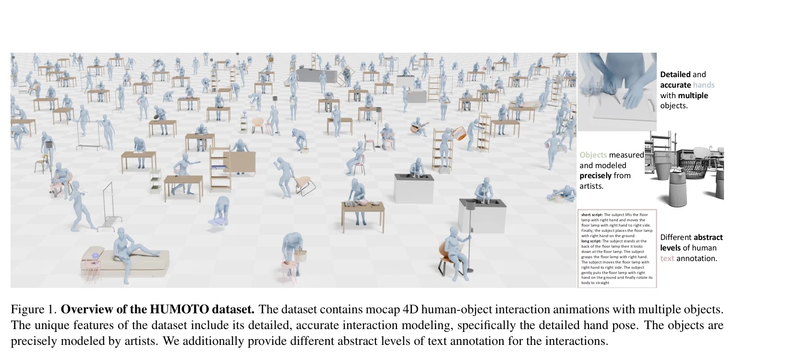
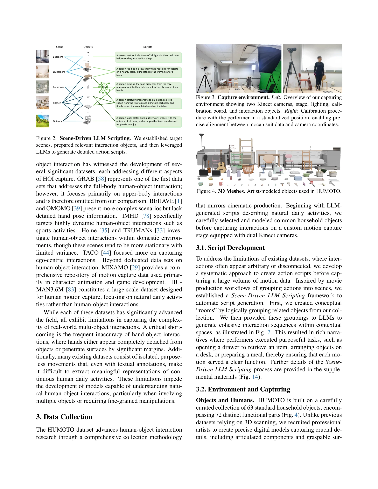

# HUMOTO: A 4D Dataset of Mocap Human Object Interactions

> **저자**: Jiaxin Lu, Chun-Hao Paul Huang, Uttaran Bhattacharya, Qixing Huang, Yi Zhou | **날짜**: 2025-04-14 | **URL**: [https://arxiv.org/abs/2504.10414](https://arxiv.org/abs/2504.10414)

---

## Essence

*Figure 1. Overview of the HUMOTO dataset. The dataset contains mocap 4D human-object interaction animations with multipl*

HUMOTO는 735개 시퀀스(7,875초)의 고충실도 모션캡처 4D 인간-객체 상호작용 데이터셋으로, 63개의 정밀 모델링 객체와 상세한 손 동작을 포함하며 LLM 기반 스크립팅과 다중센서 캡처로 복잡한 다중-객체 상호작용을 정확히 기록한다.

## Motivation

- **Known**: 기존 인간-객체 상호작용 데이터셋들(GRAB, BEHAVE, OMOMO, Home 등)은 단일 객체 상호작용, 불정확한 손-객체 접촉, 고립된 동작, 제한된 다중-객체 시나리오 등의 한계를 가지고 있다.
- **Gap**: 현실적인 다중-객체 상호작용, 정밀한 손 동작, 목적 있는 작업 진행, 폐색(occlusion) 상황에서의 정확한 포즈 추정을 모두 포함하는 고품질 데이터셋이 부족하다.
- **Why**: motion generation, robotics, computer vision, embodied AI 등 다양한 분야에서 현실적인 인간-객체 상호작용 모델링의 발전이 필수적이며, 특히 다중-객체 조작과 세밀한 손 움직임을 학습하기 위한 고품질 학습 데이터가 필요하다.
- **Approach**: Scene-Driven LLM Scripting으로 의미 있는 작업 시나리오를 생성하고, motion capture suit와 dual-Kinect RGB-D 센서의 다중센서 시스템으로 폐색 상황에서도 인간과 객체 포즈를 동시에 추적하며, 전문 아티스트가 수작업으로 각 시퀀스를 검증 및 정제한다.

## Achievement

*Figure 1. Overview of the HUMOTO dataset. The dataset contains mocap 4D human-object interaction animations with multipl*

- **735개 고충실도 시퀀스**: 7,875초(30 fps)의 다양한 일상 활동(요리, 정리, 야외 활동 등)을 포함한 인간-객체 상호작용 데이터 구축
- **정밀 객체 모델링**: 63개 객체와 72개 articulated parts를 현실 측정값 기반으로 아티스트가 정밀 모델링
- **상세한 손 동작 캡처**: 다중 객체와의 상호작용에서 손 포즈의 정확성을 보장하여 기존 데이터셋의 손-객체 침투/분리 문제 해결
- **LLM 기반 스크립팅**: Scene-Driven LLM Scripting으로 단순 스크립트부터 상세 스크립트까지 다양한 추상화 수준의 텍스트 주석 제공
- **폐색 강건성**: EMF 기반 mocap suit와 RGB-D 센서 조합으로 폐색 상황에서도 신뢰할 수 있는 포즈 추정
- **품질 메트릭 및 벤치마크**: 인간 동작, 객체 동작, 상호작용 품질을 평가하는 정량적 메트릭 체계 제시

## How

*Figure 2. Scene-Driven LLM Scripting. We established target*

- Scene-Driven LLM Scripting: 목표 scene 설정 → 관련 객체 준비 → LLM을 통한 계층적 스크립트 생성(짧은 스크립트→상세 스크립트)
- 다중센서 캡처 시스템: electromagnetic field mocap suit + glove(인간 전신 및 손 추적) + dual-Kinect RGB-D sensor(객체 포즈 추적)
- 수작업 정제 및 검증: 전문 아티스트가 각 시퀀스에서 foot sliding, object penetration 등을 제거하여 자연스러운 동작 보존
- 텍스트 주석: 다양한 추상화 수준(short script, long script)의 인간-객체 상호작용 설명 제공
- 독립적 품질 검증: 별도의 전문 아티스트 그룹이 전체 데이터셋의 품질을 평가

## Originality

- 최초의 정밀한 **다중-객체 상호작용** 데이터셋으로, 기존 데이터셋들의 단일 객체 중심 한계 극복
- **Scene-Driven LLM Scripting** 방법론으로 자동화된 스크립트 생성과 의미 있는 작업 진행을 결합
- **EMF mocap + RGB-D 듀얼 센서** 조합으로 폐색 상황에서도 정확한 인간-객체 포즈 동시 추적
- **상세한 손 동작 정확성**: 손-객체 상호작용의 침투/분리 문제를 해결하기 위한 엄격한 아티스트 검증 프로세스
- **정량적 HOI 평가 메트릭** 체계 도입으로 다양한 데이터셋 간 비교 가능성 제시

## Limitation & Further Study

- 데이터 수집의 높은 비용과 복잡성으로 인한 규모 제한(735개 시퀀스)- 대규모 딥러닝 모델 학습에는 여전히 제한적일 수 있음
- 실제 환경(in-the-wild)이 아닌 제어된 스튜디오 환경에서 캡처되어 환경 변동성 부족
- mocap suit 착용 필요로 인한 비용 및 물리적 제약 - 일반 사용자가 데이터 확장 어려움
- 후속 연구: 자동 포즈 추정 기술 개선으로 수작업 정제 비용 감소, synthetic 데이터 생성 기법 개발, 동적 객체(변형 가능한 객체, 액체 등) 포함 확장

## Evaluation

- Novelty: 4/5
- Technical Soundness: 4/5
- Significance: 4/5
- Clarity: 4/5
- Overall: 4/5

**총평**: HUMOTO는 고충실도 다중-객체 인간-객체 상호작용 데이터셋으로서, Scene-Driven LLM Scripting과 다중센서 캡처 기술의 창의적 결합을 통해 기존 데이터셋의 한계를 효과적으로 해결하였으며, 정량적 평가 메트릭 도입으로 HOI 데이터셋 분야에 기여한 가치 있는 자산이다.

## Related Papers

- 🔗 후속 연구: [[papers/1967_HandX_Scaling_Bimanual_Motion_and_Interaction_Generation/review]] — HandX의 bimanual motion과 interaction 생성을 HUMOTO가 고충실도 4D 모션캡처로 확장하여 더 정확한 인간-객체 상호작용 데이터를 제공합니다.
- 🔄 다른 접근: [[papers/2148_TokenHSI_Unified_Synthesis_of_Physical_Human-Scene_Interacti/review]] — HUMOTO의 모션캡처 기반 접근법과 TokenHSI의 unified synthesis는 human-scene interaction을 위한 서로 다른 데이터 수집과 합성 방법론입니다.
- 🏛 기반 연구: [[papers/1907_EmbodMocap_In-the-Wild_4D_Human-Scene_Reconstruction_for_Emb/review]] — in-the-wild 4D human-scene reconstruction이 HUMOTO의 복잡한 다중-객체 상호작용 기록을 위한 기반 캡처 기술을 제공합니다.
- 🔄 다른 접근: [[papers/1779_A_Humanoid_Visual-Tactile-Action_Dataset_for_Contact-Rich_Ma/review]] — 인간-객체 상호작용 데이터셋 구축에서 HUMOTO는 모션캡처 기반, A Humanoid Visual-Tactile-Action Dataset은 시각-촉각 기반으로 서로 다른 센서 모달리티를 활용한다.
- 🧪 응용 사례: [[papers/1887_DreamGen_Unlocking_Generalization_in_Robot_Learning_through/review]] — HUMOTO의 고품질 인간-객체 상호작용 데이터가 DreamGen의 일반화 가능한 로봇 학습 정책 훈련에 활용될 수 있다.
- 🔄 다른 접근: [[papers/1758_Whole-body_Humanoid_Robot_Locomotion_with_Human_Reference/review]] — 둘 다 인간-객체 상호작용 데이터셋이지만 HUMOTO는 모션캡처 기반, WHOLE은 에고센트릭 비디오 기반
- 🔗 후속 연구: [[papers/1901_EgoHumanoid_Unlocking_In-the-Wild_Loco-Manipulation_with_Rob/review]] — HUMOTO의 고충실도 모션캡처 데이터가 EgoHumanoid의 야생환경 로코-조작 학습에 정확한 참조 데이터 제공 가능
- 🧪 응용 사례: [[papers/1838_ClimbingCap_Multi-Modal_Dataset_and_Method_for_Rock_Climbing/review]] — multi-modal climbing motion dataset이 4D mocap human object interaction 데이터셋의 특수한 케이스로 활용된다.
- 🔗 후속 연구: [[papers/1867_DexCap_Scalable_and_Portable_Mocap_Data_Collection_System_fo/review]] — HUMOTO 4D 데이터셋이 DexCap의 손동작 데이터를 물체 상호작용까지 확장하여 더 풍부한 학습 데이터를 제공한다.
- 🏛 기반 연구: [[papers/1967_HandX_Scaling_Bimanual_Motion_and_Interaction_Generation/review]] — HUMOTO의 고충실도 인간-객체 상호작용 데이터가 HandX의 양손 섬세한 움직임과 상호작용 생성을 위한 기반 데이터를 제공합니다.
