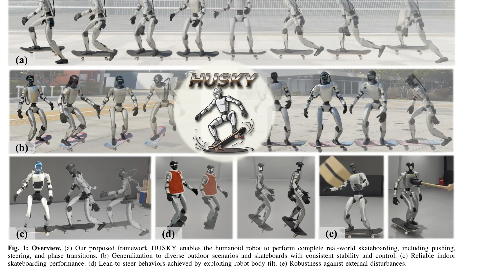
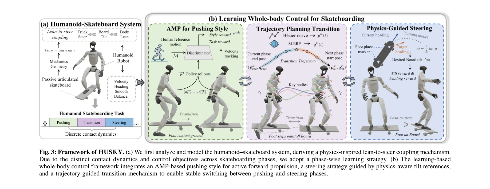

# HUSKY: Humanoid Skateboarding System via Physics-Aware Whole-Body Control

> **저자**: Jinrui Han, Dewei Wang, Chenyun Zhang, Xinzhe Liu, Ping Luo, Chenjia Bai, Xuelong Li | **날짜**: 2026-02-03 | **DOI**: [10.48550/arXiv.2602.03205](https://doi.org/10.48550/arXiv.2602.03205)

---

## Essence

*Fig. 1: Overview. (a) Our proposed framework HUSKY enables the humanoid robot to perform complete real-world skateboardi*

HUSKY는 humanoid 로봇이 skateboard 위에서 안정적으로 skating을 수행하기 위한 physics-aware whole-body control 프레임워크이며, lean-to-steer 제약과 hybrid contact dynamics를 명시적으로 모델링하여 AMP 기반 pushing과 physics-guided steering을 통합한다.

## Motivation

- **Known**: 최근 humanoid robots는 complex terrains에서의 locomotion, dancing, loco-manipulation 등 다양한 whole-body control 태스크를 수행할 수 있으나, underactuated wheeled platform 위에서의 skateboarding은 non-holonomic constraints와 tightly coupled human-object interactions로 인해 매우 도전적이다.
- **Gap**: 기존 RL 기반 접근법들은 high-dimensional humanoid state/action space와 dynamic skateboard 간의 tight coupling으로 인한 instability와 sim-to-real gap을 해결하지 못하고 있으며, skateboarding의 hybrid contact dynamics와 phase transitions를 체계적으로 다루지 않는다.
- **Why**: Humanoid skateboarding은 real-world robotics의 복잡한 동역학과 로봇-환경 상호작용을 다루는 중요한 벤치마크 태스크이며, 성공적인 구현은 underactuated systems에서의 robust whole-body control 능력을 입증한다.
- **Approach**: HUSKY는 board tilt과 truck steering angle 간의 kinematic coupling (tan σ = tan λ sin γ) 을 명시적으로 모델링하고, hybrid dynamical system 프레임워크에서 AMP를 통한 human-like pushing 학습과 physics-guided lean-to-steer 전략, 그리고 trajectory planning 기반 phase transition mechanism을 통합한다.

## Achievement

*Fig. 1: Overview. (a) Our proposed framework HUSKY enables the humanoid robot to perform complete real-world skateboardi*

- **Physics-informed System Modeling**: Board tilt과 truck steering angle의 coupling relationship을 수식적으로 유도하여 non-holonomic skateboard dynamics를 tractable하게 분석
- **Hybrid Control Framework**: Pushing과 steering 두 개의 distinct contact phases를 명시적으로 구성하여 각 phase의 역학과 제어 목표를 독립적으로 다룸
- **Real-world Skateboarding Demonstration**: Unitree G1 humanoid robot에서 diverse outdoor scenarios와 indoor environments에서 안정적이고 민첩한 skateboarding maneuvers 구현
- **Robustness and Generalization**: 외부 disturbances에 대한 robustness와 다양한 skateboard types에 대한 generalization capability 입증

## How

*Fig. 3: Framework of HUSKY. (a) We first analyze and model the humanoid–skateboard system, deriving a physics-inspired l*

- Skateboard geometry를 분석하여 board tilt angle γ와 truck steering angle σ 간의 kinematic constraint equation (Eq. 1) 유도
- Humanoid skateboarding을 hybrid dynamical system으로 형식화하고, pushing phase (한 발은 skateboard에 접촉하여 balance 유지, 다른 발은 ground에 intermittent 접촉하여 propulsion 생성)와 steering phase (양발이 skateboard에 접촉하여 passive gliding 중 body lean으로 tilt 제어) 분리
- DRL을 사용하여 humanoid policy를 학습하되, Adversarial Motion Priors (AMP)를 leverage하여 pushing motions을 human-like하게 유도
- Physics-guided strategy로 lean angle과 board tilt 간의 관계를 활용하여 steering을 구현하고, heading-oriented objective로 directional control 달성
- Trajectory planning mechanism으로 pushing과 steering 사이의 smooth transitions를 보장하며, phase 간 dynamics discontinuity를 완화
- Dense reward function으로 skateboarding performance를 평가하고 agent exploration을 guide

## Originality

- Skateboard의 lean-to-steer coupling을 명시적 kinematic constraint로 모델링하여 physics-aware learning을 가능하게 한 점이 혁신적
- Humanoid skateboarding을 hybrid dynamical system으로 형식화하여 pushing/steering phases를 구조적으로 분리한 접근이 novel
- AMP와 physics-guided strategy를 결합하여 human-like propulsion과 natural steering behaviors를 동시에 달성
- Trajectory planning을 통한 smooth phase transitions 메커니즘이 기존 whole-body control과 구별되는 특징
- Underactuated wheeled platform에서의 humanoid control은 robot skateboarding 분야에서 미개척 영역

## Limitation & Further Study

- Simplified kinematic skateboard model은 suspension의 full dynamics (compliance, damping)를 완전히 capture하지 못할 수 있으며, 실제 skateboard의 mechanical characteristics 변화에 따른 adaptation 가능성 미검토
- DRL 학습이 simulation에서 수행되므로 sim-to-real gap의 완전한 해결이 아직 과제이며, real-world에서의 generalization에 대한 systematic analysis 부족
- Humanoid의 23 DoF 중 wrist 3 DoF를 제외한 설정이 특정 hardware에 종속적이므로, 다른 humanoid platforms에 대한 adaptability 불명확
- Outdoor environments의 terrain variations (slope, surface friction 등)에 대한 robustness 평가가 제한적
- High-speed maneuvers에서의 control stability 한계나 extreme scenarios (급격한 turn, high-speed obstacle avoidance)에 대한 분석 필요
- **향후 연구**: Active suspension 모델 통합, multi-task learning으로 diverse skateboard designs 대응, 더 aggressive maneuvers의 exploration, long-horizon planning과의 결합 등이 필요

## Evaluation

- Novelty: 4/5
- Technical Soundness: 4/5
- Significance: 4/5
- Clarity: 4/5
- Overall: 4/5

**총평**: HUSKY는 humanoid skateboarding이라는 도전적인 문제를 physics-aware modeling과 hybrid control framework를 통해 창의적으로 해결한 고품질 연구이며, explicit system modeling과 DRL의 결합으로 real-world에서의 stable skateboarding을 실현한 점에서 significant contribution을 제시한다.

## Related Papers

- 🔄 다른 접근: [[papers/1680_SLAC_Simulation-Pretrained_Latent_Action_Space_for_Whole-Bod/review]] — 스케이트보드 제어와 전신 잠재 액션 스페이스로 physics-aware 제어의 다른 적용 분야를 보여준다.
- 🏛 기반 연구: [[papers/2072_Learning_to_Walk_and_Fly_with_Adversarial_Motion_Priors/review]] — 적대적 모션 프라이어를 통한 비행 학습이 스케이트보드의 lean-to-steer 제약 모델링에 기초가 된다.
- 🏛 기반 연구: [[papers/2028_iRonCub_3_The_Jet-Powered_Flying_Humanoid_Robot/review]] — HUSKY의 physics-aware whole-body control 프레임워크가 iRonCub 3의 제트 추진 비행 제어 시스템의 기초 이론을 제공한다.
- 🔄 다른 접근: [[papers/1999_Humanoid_Parkour_Learning/review]] — 스케이트보드와 파쿠어는 모두 동적 균형이 필요한 스포츠지만, HUSKY는 lean-to-steer 제약을, Humanoid Parkour Learning은 복잡한 장애물 회피를 중점적으로 다룬다.
- 🔗 후속 연구: [[papers/1889_Dribble_Master_Learning_Agile_Humanoid_Dribbling_through_Leg/review]] — HUSKY의 hybrid contact dynamics 모델링이 Dribble Master의 축구공 드리블링에서 발생하는 복잡한 접촉 상황 처리에 적용될 수 있다.
- 🔄 다른 접근: [[papers/1674_Sim-to-Real_Learning_for_Humanoid_Box_Loco-Manipulation/review]] — 둘 다 특수한 환경에서의 휴머노이드 제어이지만 HUSKY는 스케이트보드, Sim-to-Real은 박스 조작에 특화
- 🔗 후속 연구: [[papers/2066_Learning_to_Ball_Composing_Policies_for_Long-Horizon_Basketb/review]] — HUSKY의 physics-aware 제어 프레임워크가 농구 기술 학습의 동적 균형 제어에 응용 가능
- 🏛 기반 연구: [[papers/1849_Contact-Aided_Invariant_Extended_Kalman_Filtering_for_Robot/review]] — 접촉 기반 불변 확장 칼만 필터가 HUSKY의 하이브리드 접촉 다이내믹스 모델링에 핵심적인 상태 추정 기반 제공
- 🔗 후속 연구: [[papers/2001_Humanoid_Robot_Acrobatics_Utilizing_Complete_Articulated_Rig/review]] — HUSKY의 physics-aware whole-body control이 acrobatic dynamics를 스케이트보딩으로 확장합니다.
