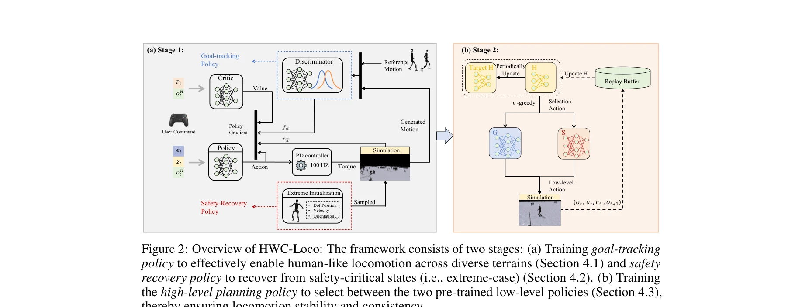

# HWC-Loco: A Hierarchical Whole-Body Control Approach to Robust Humanoid Locomotion

> **저자**: Sixu Lin, Guanren Qiao, Yunxin Tai, Ang Li, Kui Jia, Guiliang Liu | **날짜**: 2025-03-02 | **URL**: [https://arxiv.org/abs/2503.00923](https://arxiv.org/abs/2503.00923)

---

## Essence

HWC-Loco는 휴머노이드 로봇의 견고한 이동을 위해 계층적 정책 구조로 목표 추적과 안전 복구 간의 trade-off를 동적으로 해결하는 강화학습 기반 전신 제어 알고리즘이다.

## Motivation

- **Known**: 기존 학습 기반 접근법은 시뮬레이션과 실제 환경의 불일치로 인해 일반화 성능이 낮고, 모델 기반 최적화는 정확한 모델링이 필요하며 확장성이 제한된다.
- **Gap**: 기존의 robust optimization은 worst-case 제어에 초점을 맞춰 보수적인 정책을 학습하는 반면, 실제로는 작업 완료 성능과 안전성 간의 동적 균형이 필요하다.
- **Why**: 휴머노이드 로봇이 현실의 다양한 작업 환경에서 안전하고 효과적으로 작동하려면 배포 환경의 불확실성에 적응하면서도 과도하게 보수적이지 않은 제어 정책이 필수적이다.
- **Approach**: HWC-Loco는 goal-tracking policy와 safety-recovery policy를 계층적으로 구성하고, high-level planning policy가 상황에 따라 두 정책 간을 동적으로 전환하며, Zero Moment Point 기반 동적 제약과 인간 행동 모방을 통합한다.

## Achievement

*Figure 2: Overview of HWC-Loco: The framework consists of two stages: (a) Training goal-tracking*

- **계층적 정책 구조**: Goal-tracking과 safety-recovery를 분리하고 high-level planning으로 동적 선택 메커니즘 도입
- **Robust optimization 공식화**: 환경 동역학 불일치 하에서의 정책 학습을 명시적 robust optimization 문제로 재정의
- **인간 행동 정렬**: Distributional alignment를 통해 학습된 정책을 인간 모션 선호도에 맞춤
- **광범위한 검증**: 다양한 지형, 로봇 구조, 외부 교란 상황에서 시뮬레이션 및 실제 환경 모두에서 성능 입증

## How

*Figure 2: Overview of HWC-Loco: The framework consists of two stages: (a) Training goal-tracking*

- POMDP 기반 학습 환경 정의: 속도 명령, 고유감각, 특권 정보(기저 속도, 지형 높이, 외부 교란, ZMP)를 포함
- Reward 함수 설계: Task reward (rT), penalty reward (rP), regularization reward (rR)를 가중 결합
- Goal-tracking policy: 속도 추적 및 접촉 관리 중심으로 학습, 제약 조건 없이 작업 성능 최적화
- Safety-recovery policy: 극단적 시나리오 추정 메커니즘으로 uncertainty set 구성, ZMP 기반 동적 제약으로 안정성 보장
- High-level planning policy: 현재 상태의 위험도를 감지하여 두 정책 간의 전환 결정
- Distributional alignment: 인간 모션 데이터와의 KL divergence를 최소화하여 자연스러운 행동 유도

## Originality

- 기존 robust optimization의 worst-case 보수성을 극복하기 위해 계층적 다중 정책 구조를 처음 도입
- 극단적 시나리오 추정 메커니즘을 통한 구조화된 불확실성 집합 구성 (기존의 비구조적 domain randomization 개선)
- ZMP 기반 동적 제약과 distributional alignment를 결합한 통합적 접근
- High-level planning policy의 동적 전환 메커니즘으로 task performance와 safety의 실시간 trade-off 해결

## Limitation & Further Study

- 극단적 시나리오 추정 메커니즘의 설계 원리와 범위에 대한 이론적 분석 부족
- High-level planning policy의 전환 기준이 명시적으로 정의되지 않아 재현성과 해석가능성 제한
- 실제 로봇 실험이 제한적일 수 있으며, 더 다양한 휴머노이드 플랫폼과 작업에 대한 검증 필요
- Distributional alignment가 데이터 부족 상황에서의 성능, 분포 외(out-of-distribution) 시나리오에서의 효과에 대한 분석 필요
- 계산 복잡성과 실시간 실행 가능성에 대한 논의 부족

## Evaluation

- Novelty: 4/5
- Technical Soundness: 3/5
- Significance: 4/5
- Clarity: 4/5
- Overall: 4/5

**총평**: HWC-Loco는 휴머노이드 로봇 제어의 현실적 과제인 sim2real gap과 안전성 대 성능의 trade-off를 효과적으로 해결하는 혁신적인 계층적 제어 프레임워크이며, 광범위한 실험 검증을 통해 실용적 가치를 입증했다.
