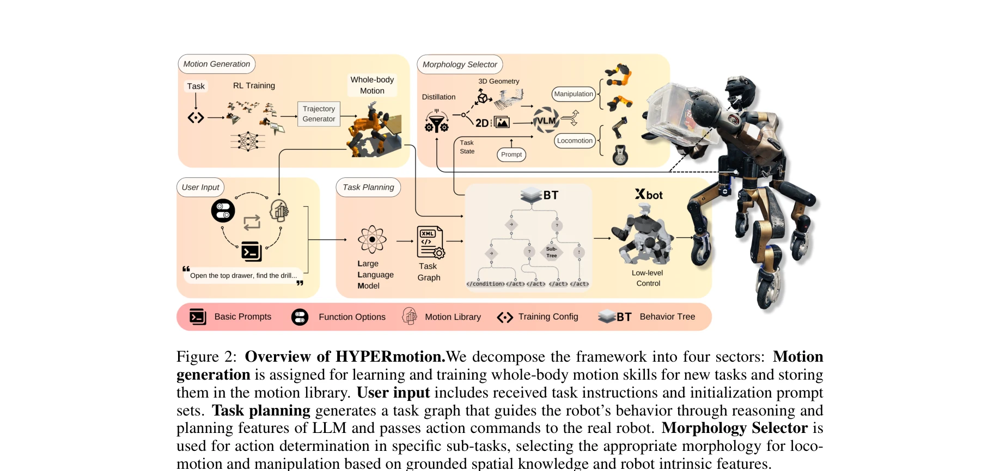
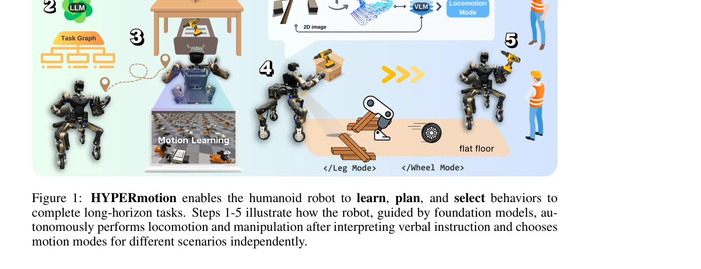

# HYPERmotion: Learning Hybrid Behavior Planning for Autonomous Loco-manipulation

> **저자**: Jin Wang, Rui Dai, Weijie Wang, Luca Rossini, Francesco Ruscelli, Nikos Tsagarakis | **날짜**: 2024-06-20 | **URL**: [https://arxiv.org/abs/2406.14655](https://arxiv.org/abs/2406.14655)

---

## Essence

*Figure 2: Overview of HYPERmotion.We decompose the framework into four sectors: Motion*

HYPERmotion은 강화학습과 최적화를 결합하여 휴머노이드 로봇이 자연어 명령으로부터 복잡한 로코-조작 작업을 자율적으로 수행할 수 있도록 하는 계층적 행동 계획 프레임워크이다. LLM과 VLM을 활용하여 의미론적 지시를 원시 행동 기술로 변환하고 동적 환경에서 형태론적 선택을 수행한다.

## Motivation

- **Known**: 최근 휴머노이드 로봇의 전신 제어 기술이 발전했으나, 새로운 작업으로의 적응성과 다양성이 부족하다. LLM은 로봇 계획에서 우수한 추론 능력을 보여주지만 고자유도 시스템의 복잡한 전신 동작 제어에는 제한이 있다.
- **Gap**: 기존 연구는 고정형 팔이나 사족 로봇에 집중하며, 휴머노이드 로봇의 복합적인 동역학과 부분 간 정밀한 조화를 고려한 언어 모델 기반 로코-조작은 미흡하다. 또한 시뮬레이션 기반 연구가 대부분이며 실제 로봇 배포 사례가 제한적이다.
- **Why**: 일상적인 물질 운반, 가사 지원 등의 장기 수평 작업을 자율적으로 수행하는 휴머노이드 로봇의 구현은 로봇공학과 실용적 가치 측면에서 중요하며, 이는 자연어 기반의 적응적이고 다양한 행동 수행 능력을 요구한다.
- **Approach**: 논문은 (1) RL과 whole-body 최적화를 통한 모션 기술 학습, (2) 학습된 기술을 motion library에 저장, (3) LLM을 활용한 의미론적 작업 분해 및 hierarchical task graph 생성, (4) VLM과 공간 기하학 정보를 결합한 robotic morphology selector 개발의 네 가지 주요 방법을 제시한다.

## Achievement

*Figure 1: HYPERmotion enables the humanoid robot to learn, plan, and select behaviors to*

- **Motion Generation 및 Library 구축**: 38개의 구동 관절을 제어하는 RL 정책을 학습하고 whole-body 최적화를 통해 37도 이상의 자유도를 가진 휴머노이드 로봇의 다양한 모션 기술을 자동 생성·저장
- **Hierarchical Task Planning**: LLM을 활용하여 자연어 명령을 작업 그래프로 변환하고 이를 Behavior Tree로 해석하여 장기 작업 수행 가능
- **Morphology Selection**: VLM과 distilled spatial geometry를 결합하여 단일팔/양팔, 다리/바퀴 로코모션 중 적절한 행동 모드를 상황에 맞게 자동 선택
- **Zero-shot 적응성**: 학습되지 않은 새로운 작업에 대해 기학습된 모션 조합으로 효율적으로 적응하는 능력 시연
- **실제 로봇 배포**: 시뮬레이션뿐 아니라 실제 wheeled-leg 휴머노이드 로봇에서 온라인 계획과 자율적 실행 실증

## How

*Figure 2: Overview of HYPERmotion.We decompose the framework into four sectors: Motion*

- **분해된 학습 전략 (Decomposed Training)**: 작업별로 관련 구동 부분을 선택적으로 학습한 후 저차원 궤적을 전신 공간에 프로젝션하는 통합 모션 생성기 사용으로 학습 효율성 향상
- **Motion Library**: RL을 통해 학습된 원시 행동(primitive behaviors)을 기술 단위로 저장하고 관리
- **LLM 기반 Task Decomposition**: 사용자 입력, 기능 옵션, motion library 정보를 포함한 텍스트를 LLM에 입력하여 복잡한 의미론적 지시를 sub-task 기반의 hierarchical task graph로 변환
- **Behavior Tree 해석**: 생성된 task graph를 Behavior Tree로 해석하여 로봇 실행을 가이드
- **Robotic Morphology Selector**: 2D 이미지와 깊이 데이터에서 추출한 3D 특징, VLM, 로봇의 내재적 특성(affordance)을 결합하여 각 상황의 최적 행동 모드 선택
- **Whole-body Optimization (MPC 기반)**: RL의 저차원 궤적을 참조로 하여 최적화 기반 제어기를 통해 안전성과 제약 조건 준수 보장

## Originality

- **휴머노이드 로코-조작의 통합 학습**: 고자유도 휴머노이드 로봇의 이동과 조작을 동시에 다루는 전신 제어 학습은 기존 연구(주로 사족 로봇이나 고정형 팔)와 차별화됨
- **VLM + Spatial Geometry 기반 morphology selection**: 순수 언어 모델에서 벗어나 다중 모달 정보(시각-언어-공간)를 통합하여 로봇의 신체 형태와 환경에 기반한 행동 선택 메커니즘은 새로운 접근
- **Sim-to-real deployment의 실증**: 대부분의 LLM 기반 로봇 연구가 시뮬레이션에 머물렀던 점에서 실제 wheeled-leg 휴머노이드에서의 배포와 온라인 계획 실현
- **분해된 학습 전략의 확장성**: 작업별 부분 제어 학습과 통합 모션 생성기를 결합한 방식은 매우 고자유도 시스템에 대한 학습 확장성 문제를 부분적으로 해결

## Limitation & Further Study

- **계산 복잡도 및 온라인 계획의 지연**: LLM 추론과 VLM 처리, 최적화 계산의 누적으로 인한 실시간 계획 지연 정량화 부재
- **Motion library 확장성**: 새로운 유형의 작업에 대한 모션 기술 추가 시 추가 RL 학습 필요로, 완전한 자동성 한계
- **환경 적응의 한계**: 훈련된 환경과 매우 다른 동적 환경(극단적 요철지형 등)에서의 실패 케이스 미분석
- **LLM의 신뢰성**: LLM의 hallucination이나 부정확한 작업 분해로 인한 실패 상황에 대한 안전 장치 및 복구 메커니즘 미흡
- **후속 연구**: 더 큰 규모의 motion library 자동 생성, 시뮬레이션 기반 사전학습 데이터 확대, 동적 환경에서의 적응 강화, LLM 피드백 루프를 통한 온라인 학습 메커니즘 개발 필요

## Evaluation

- Novelty: 4/5
- Technical Soundness: 3/5
- Significance: 4/5
- Clarity: 4/5
- Overall: 4/5

**총평**: HYPERmotion은 고자유도 휴머노이드 로봇의 자율적 로코-조작을 자연어 명령으로부터 수행하는 포괄적이고 실용적인 프레임워크를 제시하며, 특히 LLM/VLM과 로봇 제어의 통합, 실제 로봇 배포 실현은 해당 분야에서 의미 있는 진전을 보여준다. 다만 계산 복잡도, 환경 적응성, 완전한 자동화 측면에서 개선 여지가 있다.
