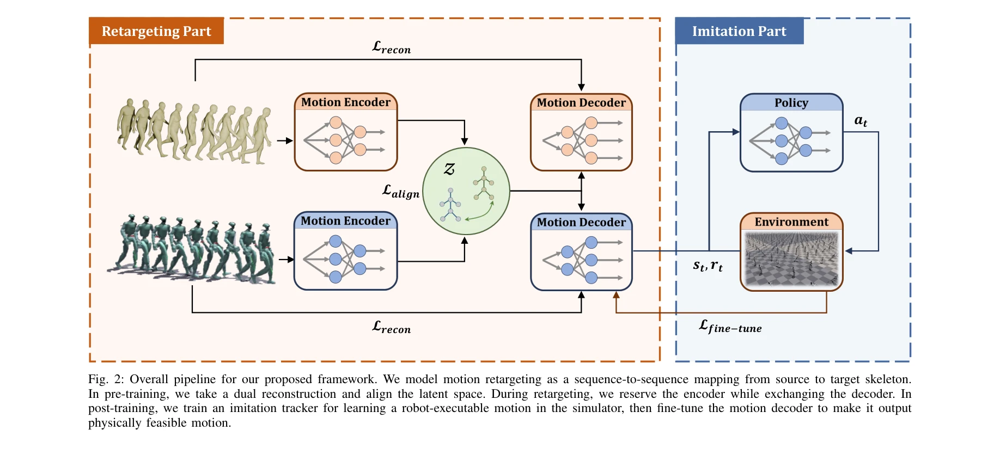

# Implicit Kinodynamic Motion Retargeting for Human-to-humanoid Imitation Learning

> **저자**: Xingyu Chen, Hanyu Wu, Sikai Wu, Mingliang Zhou, Diyun Xiang, Haodong Zhang | **날짜**: 2025-09-18 | **DOI**: [10.48550/arXiv.2509.15443](https://doi.org/10.48550/arXiv.2509.15443)

---

## Essence

*Fig. 2: Overall pipeline for our proposed framework. We model motion retargeting as a sequence-to-sequence mapping from *

본 논문은 인간의 모션을 휴머노이드 로봇이 실행 가능한 모션으로 변환하는 Implicit Kinodynamic Motion Retargeting (IKMR) 프레임워크를 제안하며, 기존 frame-by-frame 방식의 비효율성을 극복하고 대규모 모션을 실시간으로 처리한다.

## Motivation

- **Known**: 모션 retargeting은 human-to-humanoid imitation learning에서 reference trajectory 획득의 핵심 단계이며, 기존 방법들은 kinematics 기반 최적화 또는 dynamics 기반 제약을 개별적으로 처리해왔다.
- **Gap**: 현존하는 frame-by-frame 기반 retargeting 방식은 scalability가 부족하고, kinematics만 고려하는 방식은 physically infeasible한 모션을 생성하며, dynamics 기반 방식은 계산 복잡도가 높다.
- **Why**: 대규모 인간 모션 데이터를 휴머노이드 로봇에 효율적으로 전환할 수 있는 방법이 필요하며, 이는 로봇의 제한된 학습 데이터 문제를 해결하고 diverse motor skills 습득을 가능하게 한다.
- **Approach**: IKMR은 dual encoder-decoder 아키텍처를 통한 kinematics-aware pretraining과 imitation learning을 결합한 dynamics-aware fine-tuning의 두 단계 접근법으로, motion topology 표현 학습과 physically feasible trajectory 생성을 동시에 달성한다.

## Achievement

*Fig. 2: Overall pipeline for our proposed framework. We model motion retargeting as a sequence-to-sequence mapping from *

- **효율성 및 Scalability**: Neural network 기반 implicit retargeting으로 5000fps의 처리 속도 달성하여 기존 numeric 최적화 방식(21-64fps)을 획기적으로 상회
- **Kinematics-aware 전략**: Skeleton-based graph convolutional encoder를 통한 unified motion topology 표현 학습으로 diverse motion에 robust한 처리 가능
- **Dynamics-aware 전략**: Imitation learning과의 통합으로 simulation에서 학습한 physically feasible trajectory를 decoder에 반영, physically infeasible 문제 해결
- **실시간 배포**: Retargeting된 모션으로부터 whole-body controller를 직접 학습 및 배포 가능하며, 시뮬레이션과 실제 휴머노이드 로봇(Unitree G1)에서 효과성 검증

## How

*Fig. 2: Overall pipeline for our proposed framework. We model motion retargeting as a sequence-to-sequence mapping from *

- Skeleton tree의 hierarchical 구조를 graph로 모델링하고 graph convolutional encoder로 critical latent motion feature 추출
- Human과 humanoid robot의 paired motion sequence를 시간축 샘플링으로 학습하여 latent space alignment 수행
- Pretraining 시 dual reconstruction (human encoder + humanoid decoder, humanoid encoder + human decoder)으로 symmetric motion mapping 학습
- Retargeting 단계에서 human encoder를 고정하고 humanoid decoder를 교체하여 domain mapping 적용
- Fine-tuning을 위해 simulator에서 imitation tracker 학습으로 physically feasible trajectory 생성 후 motion decoder를 재학습
- Static branch (skeleton structure)와 dynamic branch (temporal motion)의 분리 설계로 구조적 안정성 확보

## Originality

- Motion retargeting에 implicit neural network 방식 도입으로 frame-by-frame 최적화의 scalability 문제 원천 해결
- Kinematics과 dynamics를 통합하는 two-stage 학습 전략 (pretraining + fine-tuning) 제시로 기존의 택일적 접근법 극복
- Dual encoder-decoder 아키텍처를 통한 대칭적 motion mapping 학습 방식이 기존 단방향 domain adaptation과 차별화
- Graph convolutional network을 skeleton topology 학습에 적용한 구조적 표현 학습 방식

## Limitation & Further Study

- Large-scale training data 의존성: Kinematics-aware pretraining에 paired human-humanoid motion sequence 필요로 데이터 수집 비용이 높을 수 있음
- Simulator-to-Real 간극: Dynamics-aware fine-tuning이 simulator 환경에서만 수행되어 실제 로봇과의 동역학 차이 완전히 해소되지 않을 가능성
- Architecture 확장성: Humanoid 구조 변화에 대한 generalization 능력 및 다양한 로봇 형태(bipedal 외 구조)로의 확장성 검토 필요
- 후속 연구: (1) Unsupervised learning으로 paired data 필요성 제거, (2) Domain randomization을 통한 robust sim-to-real transfer 강화, (3) Meta-learning으로 새로운 로봇 구조에 빠른 적응

## Evaluation

- Novelty: 4/5
- Technical Soundness: 3/5
- Significance: 4/5
- Clarity: 4/5
- Overall: 4/5

**총평**: 본 논문은 motion retargeting에 implicit neural network을 처음 도입하여 scalability 문제를 혁신적으로 해결하고, kinematics과 dynamics를 체계적으로 통합함으로써 physically feasible한 대규모 모션 자동 변환을 실현한 의미 있는 기여이며, 실제 휴머노이드 로봇 배포 검증으로 실용성을 입증했다.

## Related Papers

- 🧪 응용 사례: [[papers/1644_RoboCasa_Large-Scale_Simulation_of_Everyday_Tasks_for_Genera/review]] — 대규모 로봇 시뮬레이션 환경에서 IKMR 프레임워크를 통한 인간-휴머노이드 모션 변환 기술을 검증할 수 있는 플랫폼을 제공한다.
- 🔄 다른 접근: [[papers/2088_Make_Tracking_Easy_Neural_Motion_Retargeting_for_Humanoid_Wh/review]] — 인간 모션을 휴머노이드로 변환하는 문제에서 implicit kinodynamic 방식 대신 neural retargeting 접근법을 제시한다.
- 🏛 기반 연구: [[papers/1640_ResMimic_From_General_Motion_Tracking_to_Humanoid_Whole-body/review]] — 일반적인 모션 추적 기법을 제공하여 IKMR의 기본 추적 메커니즘에 대한 이론적 기반을 마련한다.
- 🏛 기반 연구: [[papers/1891_DynaRetarget_Dynamically-Feasible_Retargeting_using_Sampling/review]] — 동적 타당성을 고려한 모션 리타겟팅의 이론적 기반을 제공하는 샘플링 기반 방법론
- 🔄 다른 접근: [[papers/1775_A_Closed-Form_Geometric_Retargeting_Solver_for_Upper_Body_Hu/review]] — 둘 다 인간-휴머노이드 모션 리타게팅이지만 IKMR은 암시적 키노다이나믹, Closed-Form은 기하학적 접근
- 🏛 기반 연구: [[papers/2156_Towards_Motion_Turing_Test_Evaluating_Human-Likeness_in_Huma/review]] — 인간다운 동작 평가 메트릭이 IKMR의 모션 리타게팅 품질을 객관적으로 검증하는 기준 제공
- 🏛 기반 연구: [[papers/1775_A_Closed-Form_Geometric_Retargeting_Solver_for_Upper_Body_Hu/review]] — 인간-휴머노이드 간 암시적 운동 역학 리타겟팅의 이론적 기반을 SEW-Mimic의 기하학적 솔버에서 찾을 수 있습니다.
- 🔗 후속 연구: [[papers/1891_DynaRetarget_Dynamically-Feasible_Retargeting_using_Sampling/review]] — implicit kinodynamic motion retargeting이 DynaRetarget의 sampling-based 접근법을 암시적 표현으로 발전시켜 더 효율적인 변환을 가능하게 한다.
- 🔗 후속 연구: [[papers/2088_Make_Tracking_Easy_Neural_Motion_Retargeting_for_Humanoid_Wh/review]] — 인간-휴머노이드 운동학적 동작 리타겟팅의 확장된 구현을 보여준다.
