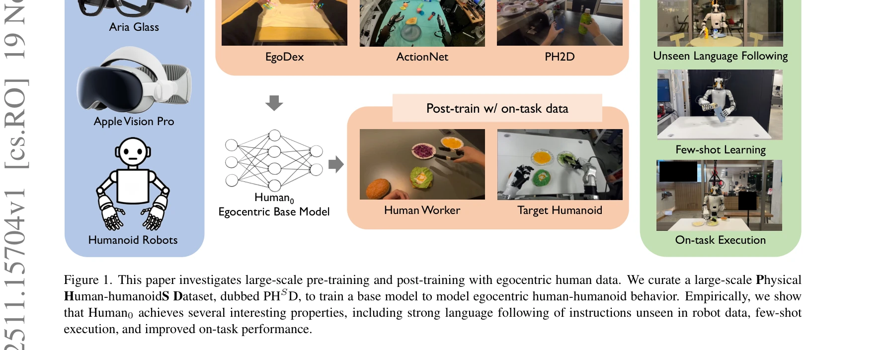
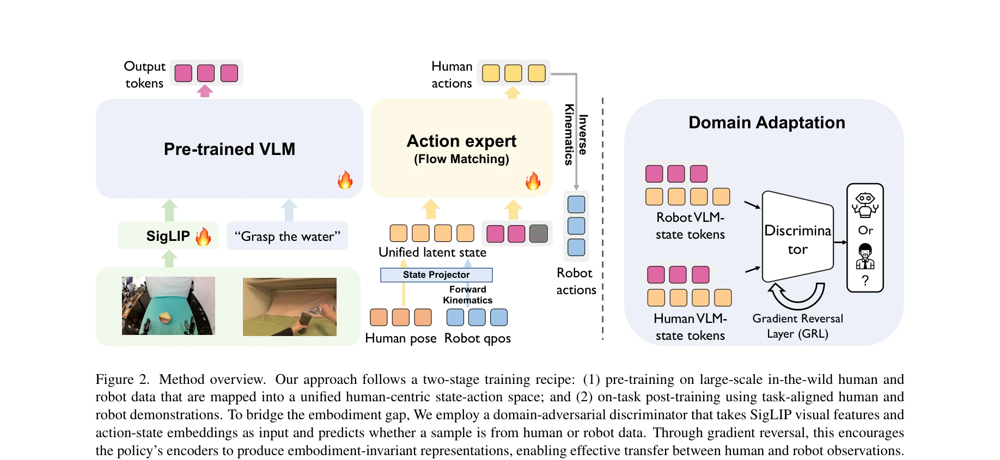

# In-N-On: Scaling Egocentric Manipulation with in-the-wild and on-task Data

> **저자**: Xiongyi Cai, Ri-Zhao Qiu, Geng Chen, Lai Wei, Isabella Liu, Tianshu Huang, Xuxin Cheng, Xiaolong Wang | **날짜**: 2025-11-19 | **URL**: [https://arxiv.org/abs/2511.15704](https://arxiv.org/abs/2511.15704)

---

## Essence

*Figure 1. This paper investigates large-scale pre-training and post-training with egocentric human data. We curate a lar*

이 논문은 1,000시간 이상의 in-the-wild 에고센트릭 데이터와 on-task 데이터를 결합하여 대규모 휴머노이드 조작 정책 Human0을 학습하고, domain adaptation을 통해 인간과 로봇 간의 도메인 갭을 최소화한다.

## Motivation

- **Known**: 기존 연구들은 인간 데이터의 pre-training 또는 on-task 데이터의 co-training을 단독으로 활용해왔으며, 에고센트릭 비디오는 조작 정책 학습을 위한 확장성 있는 데이터 소스이다.
- **Gap**: 기존 방법들은 in-the-wild 데이터와 on-task 데이터 중 하나만 활용하거나, 두 데이터를 함께 사용할 때 catastrophic forgetting 문제로 인한 성능 저하를 겪는다.
- **Why**: 로봇 조작은 데이터 부족으로 인해 LLM이나 자율주행에 비해 일반화 능력이 떨어지므로, 대규모 인간 데이터를 효과적으로 활용하는 방법이 필수적이다.
- **Approach**: unified human-centric state-action space를 정의하고 PHSD 데이터셋을 구성한 후, flow matching 기반의 language-conditioned 정책을 학습하며, domain adaptation 기법으로 인간-휴머노이드 간의 도메인 갭을 개선한다.

## Achievement

*Figure 1. This paper investigates large-scale pre-training and post-training with egocentric human data. We curate a lar*

- **PHSD 데이터셋 구축**: 1,000시간 이상의 diverse in-the-wild 데이터와 20시간 이상의 on-task 데이터를 통합한 대규모 physical human-humanoid 데이터셋 구성
- **Language Following**: 로봇 훈련 데이터에 없는 unseen instruction을 따르는 능력 획득
- **Few-shot Learning**: on-task 데이터로 post-training 후 적은 데이터로 새로운 작업 학습 가능
- **Robustness Improvement**: on-task 데이터 활용으로 실제 업무 환경(예: 패스트푸드 워커)에서 정책 성능 대폭 향상

## How

*Figure 2. Method overview. Our approach follows a two-stage training recipe: (1) pre-training on large-scale in-the-wild*

- Unified human-centric state-action space 설계: 머리(Thead), 양손(T_l_wrist, T_r_wrist), 손가락 keypoints를 포함하는 표준화된 상태-행동 공간
- IK/FK 및 hand retargeting 소프트웨어 스위트 개발로 다양한 로봇과 인간 데이터를 통일 공간으로 변환
- Pre-training과 post-training의 두 단계 학습: in-the-wild 데이터로 기본 모델을 학습하고 on-task 데이터로 미세조정
- Domain adaptation 기법 적용: naive data mixing이 hidden state에서 로봇과 인간 입력을 구분하는 문제를 개선
- Flow matching 기반의 egocentric language-conditioned 정책 학습
- 실제 Unitree H1, G1 휴머노이드 로봇에서 검증

## Originality

- In-the-wild와 on-task 데이터를 체계적으로 결합하는 data recipe 제시 — 기존 연구는 하나만 활용하거나 단순 fine-tuning으로 catastrophic forgetting 문제 야기
- Unified human-centric state-action space를 통한 이질적 데이터의 표준화 — 기존 cross-embodiment 학습과 달리 인간을 중심으로 설계
- Domain adaptation으로 hidden state의 embodiment 바이어스 제거 — naive mixing의 문제점을 체계적으로 분석하고 개선
- Language-conditioned flow matching 정책의 language generalization과 few-shot 학습 능력 입증

## Limitation & Further Study

- PHSD 데이터셋의 on-task 데이터가 20시간으로 제한적 — 더 다양한 작업에 대한 on-task 데이터 수집의 비용과 확장성 문제
- Unified state-action space 설계가 특정 휴머노이드(bimanual dexterous hand 기준)에 최적화되어 있어 다른 로봇 형태로의 일반화 가능성 불명확
- Domain adaptation 기법의 구체적인 메커니즘이 논문에서 충분히 상세히 설명되지 않음
- Real-world 평가가 제한적이며, 실제 산업 적용(패스트푸드 워커) 시나리오에서 더 광범위한 실험 필요
- Language understanding의 원리(VLM 기반인지, 별도 학습인지) 및 few-shot learning의 정확한 메커니즘에 대한 분석 부족

## Evaluation

- Novelty: 4/5
- Technical Soundness: 3/5
- Significance: 4/5
- Clarity: 4/5
- Overall: 4/5

**총평**: 이 논문은 in-the-wild와 on-task 인간 데이터를 체계적으로 결합하는 새로운 data recipe를 제시하고, 대규모 PHSD 데이터셋과 Human0 모델을 통해 실제 휴머노이드 로봇에서 language following, few-shot learning, robustness 개선을 달성함으로써 로봇 조작 학습의 확장성에 중요한 기여를 한다.
