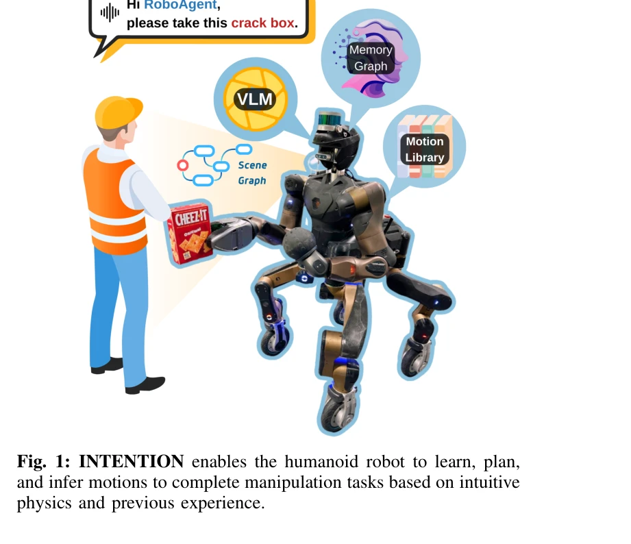
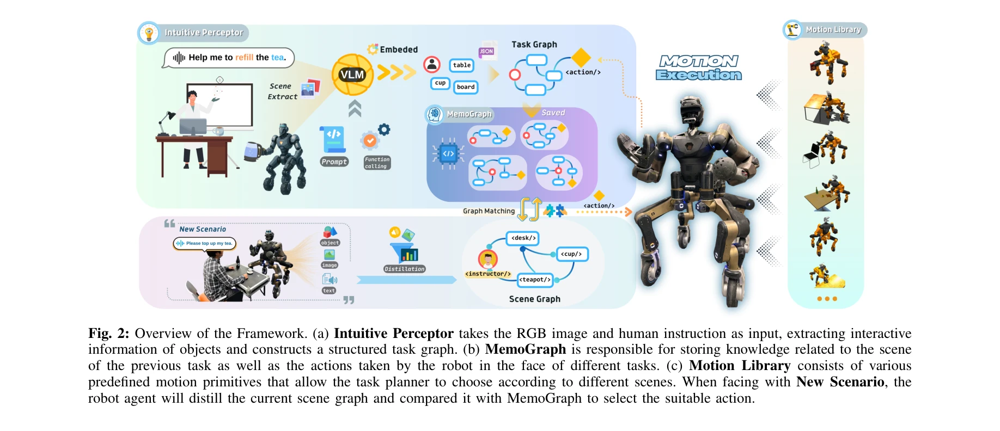
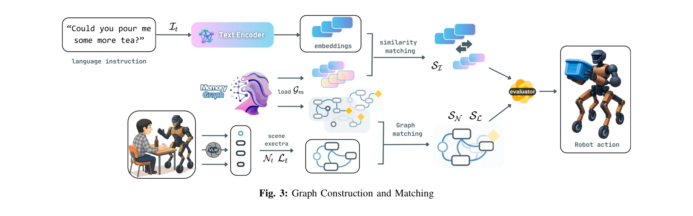

# INTENTION: Inferring Tendencies of Humanoid Robot Motion Through Interactive Intuition and Grounded VLM

> **저자**: Jin Wang, Weijie Wang, Boyuan Deng, Heng Zhang, Rui Dai, Nikos Tsagarakis | **날짜**: 2025-08-06 | **URL**: [https://arxiv.org/abs/2508.04931](https://arxiv.org/abs/2508.04931)

---

## Essence

*Fig. 1: INTENTION enables the humanoid robot to learn, plan,*

INTENTION은 Vision-Language Models 기반의 Intuitive Perceptor와 Memory Graph를 통합하여 휴머노이드 로봇이 상호작용 경험으로부터 직관적 물리 이해를 학습하고 새로운 조작 작업에 자율적으로 적응하는 프레임워크를 제안한다.

## Motivation

- **Known**: 전통적 로봇 제어는 정확한 물리 모델과 사전 정의된 동작에 의존하며 구조화된 환경에서 효과적이지만, 모델 기반 접근과 강화 학습은 일반화와 적응성이 제한적이다. 최근 LLM/VLM의 의미론적 이해 능력이 로봇 자율성 향상에 활용되고 있다.
- **Gap**: 기존 Vision-Language Action 방법들은 대규모 고품질 데이터셋 요구, 정적 이미지 이해 한계, 대화적 역학 및 상호작용 관계 모델링 부족으로 인해 휴머노이드 로봇의 실제 조작 작업에서 정확성과 적응 능력이 떨어진다. 또한 의미론적 출력과 저수준 모션 제어 간의 간격이 크다.
- **Why**: 휴머노이드 로봇이 비정형 환경에서 자율적으로 다양한 조작 작업을 수행하고 인간과 유사한 직관적 물리 이해를 축적하려면, 경험 기반 학습과 의미론적 추론을 결합한 적응형 프레임워크가 필수적이다.
- **Approach**: VLM 기반 Intuitive Perceptor로 시각 장면에서 공간-기하학적 정보와 의미론적 속성을 추출하고, 상호작용 이력을 저장하는 Memory Graph (MemoGraph) 구조를 구성하여, 새로운 작업 시나리오에서 과거 경험과의 유사성 기반 행동 선택을 수행한다.

## Achievement

*Fig. 2: Overview of the Framework. (a) Intuitive Perceptor takes the RGB image and human instruction as input, extractin*

- **VLM 기반 직관적 지각**: Intuitive Perceptor가 작업 시나리오에서 공간 기하학과 의미론적 관찰을 추출하여 그래프 구조 표현으로 변환
- **Memory Graph 구축**: 인간-로봇 상호작용 및 환경 상호작용으로부터 의미론적 정보를 누적하는 위상 그래프 구조로 어포던스 기반 행동 선택 지원
- **소수 샷 학습 배포**: 대규모 데이터셋 없이 휴머노이드 로봇에 효과적으로 적용 가능한 접근
- **실제 시스템 검증**: 다양한 작업 시나리오에서 로봇의 자율적 적응 능력 입증

## How

*Fig. 3: Graph Construction and Matching*

- Vision-Language Model을 통해 RGB 이미지로부터 3D 특징, 객체 관계, 의미론적 속성을 추출
- 그래프 구조화된 표현(semantic state attributes + geometric relationships)으로 장면 정보 인코딩
- 매 상호작용마다 MemoGraph에 의미론적 지시, 실제 상호작용 상태, 공간 기하학, 로봇 동작, 피드백 기록
- 새로운 작업 시나리오에서 현재 장면을 과거 경험과 비교하여 가장 관련 있는 상호작용 행동 선택
- 미리 정의된 스킬 라이브러리 Π = {π1, π2, ..., πn}에서 선택된 행동 실행

## Originality

- 휴머노이드 로봇을 위한 VLM 기반 대화적 직관 구성의 첫 시도 (기존 연구는 고정 베이스 로봇팔 중심)
- 상호작용 경험을 명시적 지시 없이 상황적 맥락만으로 행동 추론하도록 설계
- Memory Graph를 통한 누적적 학습으로 인간 수준의 직관적 물리학 구축

## Limitation & Further Study

- 실험 규모 및 다양성 부족: 논문에서 제시된 구체적인 실제 작업 성공률, 실패 사례, 성능 수치가 제한적
- VLM 의존성: 여전히 사전 훈련된 VLM의 성능에 크게 의존하며, 도메인 특화 장면에서의 성능 저하 가능성
- 확장성 검증 부족: 스킬 라이브러리 크기 증가, 장기 누적 학습, 메모리 그래프 크기 제약 등에 대한 분석 필요
- 후속 연구: (1) 대규모 다중 로봇 및 작업 시나리오에서의 검증, (2) 메모리 그래프 효율적 관리 및 쿼리 최적화, (3) 시뮬레이션-실제 간극(sim-to-real) 분석

## Evaluation

- Novelty: 4/5
- Technical Soundness: 3/5
- Significance: 4/5
- Clarity: 4/5
- Overall: 4/5

**총평**: INTENTION은 VLM 기반 지각과 상호작용 메모리를 결합하여 휴머노이드 로봇의 적응형 조작을 혁신적으로 제시하는 연구로, 개념과 설계는 우수하나 실험적 검증과 기술적 세부 구현의 엄밀성 강화가 필요하다.
