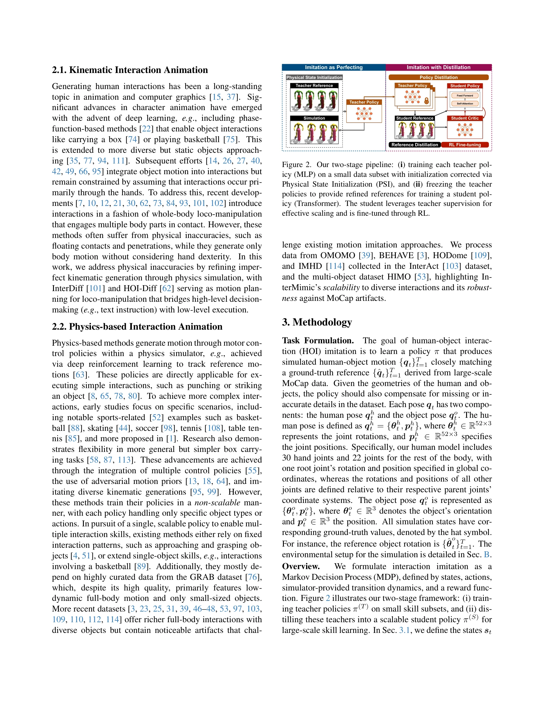
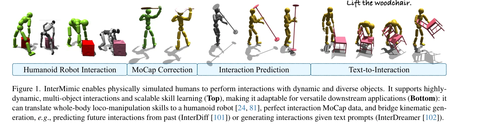

# InterMimic: Towards Universal Whole-Body Control for Physics-Based Human-Object Interactions

> **저자**: Sirui Xu, Hung Yu Ling, Yu-Xiong Wang, Liang-Yan Gui | **날짜**: 2025-02-27 | **URL**: [https://arxiv.org/abs/2502.20390](https://arxiv.org/abs/2502.20390)

---

## Essence

*Figure 2. Our two-stage pipeline: (i) training each teacher pol-*

InterMimic은 교사-학생 증류 및 RL 미세조정을 통해 불완전한 MoCap 데이터로부터 다양한 동적 객체와의 전신 상호작용을 학습할 수 있는 물리 기반 제어 정책 프레임워크이다.

## Motivation

- **Known**: Physics-based motion imitation은 MoCap 데이터를 따라하는 제어 정책을 학습하여 운동 충실도를 향상시키는 방법으로 알려져 있으나, 단순 운동에만 주로 적용되어 왔다. 기존 연구는 특정 객체나 행동에 제한되거나 고도로 선별된 데이터에 의존했다.
- **Gap**: 전신 loco-manipulation을 다양하고 동적인 객체와 함께 처리하는 확장 가능한 단일 정책이 부재하며, MoCap 데이터의 불완전성(부정확한 접촉, 제한된 손 세부사항)과 객체 기하학의 변동성 문제가 해결되지 않았다.
- **Why**: 현실적인 인간-객체 상호작용 시뮬레이션은 애니메이션, 로봇 제어, 모션 생성 등 다양한 응용 분야의 기초이며, 대규모 불완전 데이터로부터 견고하게 학습하는 능력은 실제 데이터 활용을 크게 확대할 수 있다.
- **Approach**: 먼저 소규모 데이터 부분집합에서 주제별 교사 정책을 훈련하여 MoCap을 보정하고, 이들을 단일 학생 정책으로 증류한 후 RL 미세조정으로 정책을 개선하는 curriculum 기반 두 단계 프레임워크를 제안한다.

## Achievement

*Figure 1. InterMimic enables physically simulated humans to perform interactions with dynamic and diverse objects. It su*

- **첫 번째 전신 loco-manipulation 프레임워크**: 다양하고 동적인 객체와의 복잡한 전신 상호작용을 물리 기반 시뮬레이션으로 구현한 첫 사례를 제시
- **교사-학생 증류 전략**: retargeting과 refining 문제를 통합적으로 해결하며 공간-시간 트레이드오프를 통한 확장 가능한 학습 방식 개발
- **MoCap 보정**: physics simulator의 접촉 역학을 활용하여 부정확한 MoCap 데이터를 자동으로 정제 및 개선
- **영점 샷 일반화 및 생성 능력**: 학습된 정책이 kinematic generators와 결합되어 상호작용 예측, 텍스트-상호작용 생성 등 다양한 downstream tasks 지원

## How

*Figure 2. Our two-stage pipeline: (i) training each teacher pol-*

- 여러 주제별 교사 정책을 병렬로 훈련하여 작은 데이터 부분집합에서 imitation과 retargeting 목표를 동시에 최적화
- Contact-guided reward를 도입하여 MoCap의 접촉 오류를 감지하고 보정하도록 유도
- 학생 정책 훈련에서 demonstration-based distillation으로 시작하여 PPO 업데이트의 효율성을 높이고 RL fine-tuning으로 점진적 전환
- Canonical human model로의 통합을 통해 다양한 인간 형태의 motion retargeting을 frame 내에서 직접 처리
- Teacher rollouts를 refined HOI references로 활용하여 원본 MoCap의 오류 영향을 감소

## Originality

- MoCap retargeting을 별도 전처리 대신 정책 학습의 일부로 통합한 혁신적 접근
- Physics simulator의 접촉 역학을 데이터 정제 메커니즘으로 활용하는 창의적 아이디어
- LLM의 demonstration-based pre-training과 RL fine-tuning 패러다임을 physics-based animation에 적용한 새로운 시도
- 단순 모방을 넘어 generative modeling 능력을 갖춘 물리 기반 상호작용 정책의 첫 구현

## Limitation & Further Study

- 교사 정책 훈련의 병렬화에도 불구하고 전체 계산 비용이 여전히 상당할 수 있으며, 최적의 데이터 부분집합 크기 선택에 대한 명확한 지침이 제시되지 않음
- 실제 세계의 로봇 제어에 대한 직접적인 평가는 제시되지 않았으며, 시뮬레이션 구현의 정확성이 실제 적용 성능을 결정하는 중요 요소인 점이 논의 부족
- 다양한 MoCap 데이터셋의 오류 특성에 대한 systematic 분석이 제한적이며, contact-guided reward의 하이퍼파라미터 민감도 분석 필요
- 손가락 수준의 정밀한 dexterity가 필요한 작업에 대한 성능 평가가 부족하고, 극도로 복잡한 multi-object manipulation 시나리오에 대한 검증 필요

## Evaluation

- Novelty: 4/5
- Technical Soundness: 3/5
- Significance: 4/5
- Clarity: 4/5
- Overall: 4/5

**총평**: InterMimic은 불완전한 대규모 MoCap 데이터로부터 다양한 동적 객체와의 전신 상호작용을 학습하는 첫 통합 프레임워크로, 교사-학생 증류와 RL 미세조정의 창의적 결합을 통해 물리 기반 상호작용 애니메이션의 새로운 기준을 제시한다.

## Related Papers

- 🔗 후속 연구: [[papers/2027_InterPrior_Scaling_Generative_Control_for_Physics-Based_Huma/review]] — InterMimic의 교사-학생 증류 방식을 InterPrior의 생성형 제어 프레임워크에 통합하여 더욱 발전된 물리 기반 제어를 구현한다.
- 🧪 응용 사례: [[papers/1676_SimGenHOI_Physically_Realistic_Whole-Body_Humanoid-Object_In/review]] — 물리적으로 현실적인 인간-객체 상호작용 생성을 위한 구체적인 시뮬레이션 환경과 검증 방법을 제공한다.
- 🏛 기반 연구: [[papers/1862_DeepMimic_Example-Guided_Deep_Reinforcement_Learning_of_Phys/review]] — 물리 기반 캐릭터 제어의 기본적인 강화학습 원리와 모방 학습 방법론의 이론적 토대를 제공한다.
- 🔄 다른 접근: [[papers/2092_MaskedMimic_Unified_Physics-Based_Character_Control_Through/review]] — 불완전한 데이터로부터 전신 제어를 학습하는 문제에서 MaskedMimic은 다른 masking 전략 사용
- 🏛 기반 연구: [[papers/1943_GBC_Generalized_Behavior-Cloning_Framework_for_Whole-Body_Hu/review]] — 행동 복제 기반의 전신 휴머노이드 제어에 대한 일반화된 프레임워크 제공
- 🏛 기반 연구: [[papers/1676_SimGenHOI_Physically_Realistic_Whole-Body_Humanoid-Object_In/review]] — 물리 기반 인간-객체 상호작용의 범용적인 제어 방법론을 제공한다.
- 🏛 기반 연구: [[papers/1614_Physically_Consistent_Humanoid_Loco-Manipulation_using_Laten/review]] — InterMimic의 universal whole-body control이 LDM으로 생성된 접촉 기반 조작 계획의 실행에 필요한 기반 기술이다
- 🔄 다른 접근: [[papers/1841_CLoSD_Closing_the_Loop_between_Simulation_and_Diffusion_for/review]] — diffusion-시뮬레이션 폐쇄루프와 InterMimic의 물리 기반 전신 제어는 다중 태스크 캐릭터 제어의 서로 다른 접근법
- 🔄 다른 접근: [[papers/1897_Ego-Vision_World_Model_for_Humanoid_Contact_Planning/review]] — InterMimic의 universal whole-body control이 world model 기반이 아닌 다른 방식으로 접촉 계획 문제를 해결하는 대안적 접근을 제시한다.
- 🏛 기반 연구: [[papers/2027_InterPrior_Scaling_Generative_Control_for_Physics-Based_Huma/review]] — InterMimic의 교사-학생 증류 메커니즘이 InterPrior의 모방 사전학습 단계에서 핵심적인 기술적 기반을 제공한다.
