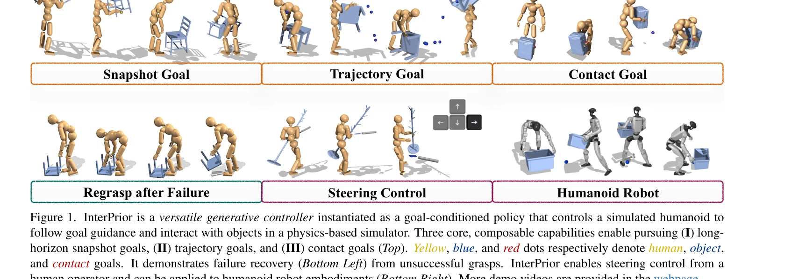
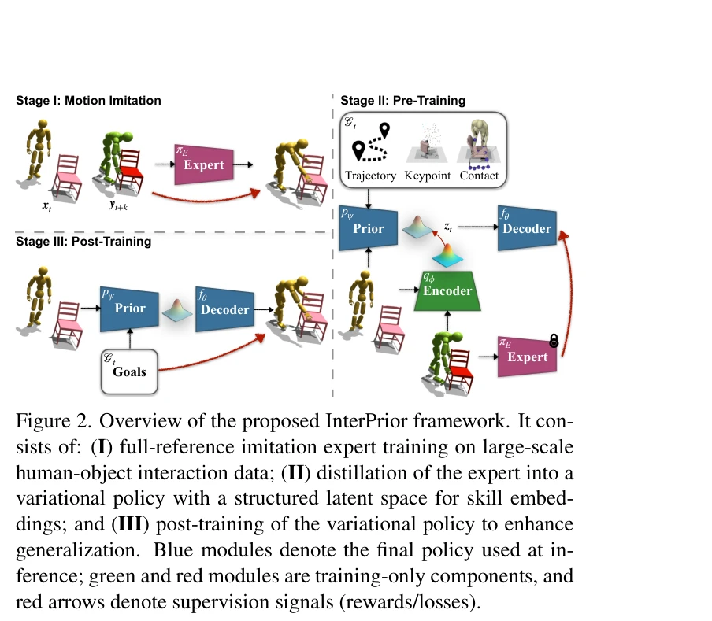

# InterPrior: Scaling Generative Control for Physics-Based Human-Object Interactions

> **저자**: Sirui Xu, Samuel Schulter, Morteza Ziyadi, Xialin He, Xiaohan Fei, Yu-Xiong Wang, Liangyan Gui | **날짜**: 2026-02-05 | **URL**: [https://arxiv.org/abs/2602.06035](https://arxiv.org/abs/2602.06035)

---

## Essence

*Figure 1. InterPrior is a versatile generative controller instantiated as a goal-conditioned policy that controls a simu*

InterPrior는 대규모 모방 사전학습과 강화학습 미세조정을 통해 물리 기반 인간-객체 상호작용을 위한 확장 가능한 생성형 제어기를 학습하는 프레임워크로, 고수준 의도로부터 자연스러운 전신 협응과 조작을 생성한다.

## Motivation

- **Known**: 기존 모션 모방 정책들은 명시적 전신 참고 궤적에 의존하며, 적대적 모방 학습은 대규모 데이터 확장이 어렵고 불안정한 문제가 있다. 최근 이미테이션 정책 증류 방법들이 제안되었으나 제한된 커버리지로 인해 일반화가 부족하다.
- **Gap**: 기존 방법들은 인간-객체 상호작용의 광대한 구성 공간에 대한 신뢰할 수 있는 일반화를 달성하지 못하며, 증류만으로는 미분포 상황에서의 견고성이 부족하다.
- **Why**: 휴머노이드 로봇이 다양한 맥락에서 로코-조작 기술을 구성하고 일반화하려면, 물리적으로 일관된 전신 협응을 유지하면서 확장 가능한 모터 프라이어가 필수적이다.
- **Approach**: 마스킹된 조건부 VAE 정책을 통해 참고 모방 전문가를 증류하여 고수준 의도로부터 모션을 재구성한 후, 물리적 교란을 이용한 데이터 증강 및 강화학습 미세조정으로 잠재 기술들을 유효한 다양체로 통합한다.

## Achievement

- **다중 목표 형식 지원**: 단일 정책이 스냅샷 목표, 궤적 목표, 접촉 목표 등 다양한 고수준 의도 표현을 처리하며, 이들의 조합도 가능
- **강력한 실패 회복**: 미세조정 과정에서 실패 상태를 활용하여 재접근 및 재파악과 같은 회복 행동을 자연스럽게 습득
- **미분포 일반화**: 학습 데이터를 벗어난 새로운 객체 및 상호작용으로 확장 가능한 재사용 가능한 프라이어 구성
- **물리 견고성**: 다양한 물리 속성 변화에 대해 작업 성공을 유지하는 안정적인 제어 수행
- **실시간 인터랙티브 제어**: 키보드 인터페이스를 통한 사용자 조작 및 실제 로봇 배포 가능성 입증

## How

*Figure 2. Overview of the proposed InterPrior framework. It con-*

- 참고 이미테이션 전문가로부터 목표 조건화 variational policy를 증류하여 다중양식 관찰 및 고수준 의도로부터 모션 복원
- 물리적 교란을 적용한 데이터 증강으로 배포 외 강건성 개선
- unseen 목표 및 초기화에 대한 성공률 향상과 사전학습 지식 보존 정규화라는 이중 목표로 강화학습 미세조정 수행
- masked conditional variational policy 아키텍처로 다양한 조건 입력을 유연하게 처리
- distillation 기반 강한 초기화로 자연스러운 모션 유지하면서 RL을 국소 최적화로 활용

## Originality

- distillation과 RL을 상호보완적으로 결합하는 원칙적 접근법: distillation은 자연스러움을 보장하고 RL은 일반화를 강화
- 물리적 교란 기반 데이터 증강을 통해 체계적으로 배포 외 견고성 개선
- masked conditional variational policy를 통해 스냅샷, 궤적, 접촉 등 다양한 목표 형식을 단일 모델로 처리
- failure state를 명시적으로 활용하여 회복 행동을 학습하는 강화학습 설계
- G1 humanoid에서 실제 로봇 적용 가능성을 시연한 구체적 구현

## Limitation & Further Study

- 대규모 모션 캡처 및 이미테이션 전문가 훈련에 대한 높은 계산 비용 및 데이터 요구사항
- 시뮬레이션-현실 간 차이(sim-to-real gap)에 대한 명시적 논의 부족—실제 로봇 배포는 제한적 평가만 제시
- 복잡한 다중 객체 상호작용이나 매우 높은 자유도의 구성 공간에 대한 확장성 한계 미분석
- RL 미세조정 과정에서 사전학습 정규화와 새로운 기술 습득 사이의 균형 조정 메커니즘에 대한 심층 분석 부족
- 후속 연구: 동적 환경에서의 적응 학습, 더 복잡한 다중 에이전트 상호작용, 실제 로봇에 대한 체계적 sim-to-real 전이 방법 개발 필요

## Evaluation

- Novelty: 4/5
- Technical Soundness: 3/5
- Significance: 4/5
- Clarity: 4/5
- Overall: 4/5

**총평**: InterPrior는 distillation과 RL의 시너지를 통해 물리 기반 인간-객체 상호작용의 확장 가능한 생성형 제어 문제를 우아하게 해결하며, 다양한 목표 형식 지원, 강력한 실패 회복, 미분포 일반화 능력으로 인해 휴머노이드 로봇 제어 분야의 실질적 진전을 이루었다.

## Related Papers

- 🏛 기반 연구: [[papers/2026_InterMimic_Towards_Universal_Whole-Body_Control_for_Physics-/review]] — InterMimic의 교사-학생 증류 메커니즘이 InterPrior의 모방 사전학습 단계에서 핵심적인 기술적 기반을 제공한다.
- 🔄 다른 접근: [[papers/1930_Flexible_Motion_In-betweening_with_Diffusion_Models/review]] — 인간-객체 상호작용 생성에서 RL 기반 접근법 대신 diffusion model을 사용한 모션 생성 방법을 제시한다.
- 🔗 후속 연구: [[papers/1949_Generative_World_Modelling_for_Humanoids_1X_World_Model_Chal/review]] — 생성형 제어 프레임워크를 휴머노이드 전용 world model과 결합하여 더 정교한 물리 기반 시뮬레이션을 구현할 수 있다.
- 🔗 후속 연구: [[papers/1995_Humanoid_Hanoi_Investigating_Shared_Whole-Body_Control_for_S/review]] — 물리 기반 인간-객체 상호작용에서 Humanoid Hanoi는 특정 조작 태스크로의 확장 사례
- 🧪 응용 사례: [[papers/1922_FALCON_Learning_Force-Adaptive_Humanoid_Loco-Manipulation/review]] — 생성형 제어기의 힘 적응 조작으로의 실제 적용 사례
- 🔄 다른 접근: [[papers/1943_GBC_Generalized_Behavior-Cloning_Framework_for_Whole-Body_Hu/review]] — 둘 다 생성형 전신 제어이지만 InterPrior는 모방학습-강화학습 결합, GBC는 행동 복제 프레임워크 기반
- 🧪 응용 사례: [[papers/1801_AMP_Adversarial_Motion_Priors_for_Stylized_Physics-Based_Cha/review]] — InterPrior의 physics-based humanoid control scaling이 AMP의 adversarial motion prior를 더 복잡한 상호작용 시나리오로 확장하는 데 적용될 수 있다.
- 🧪 응용 사례: [[papers/1799_AMO_Adaptive_Motion_Optimization_for_Hyper-Dexterous_Humanoi/review]] — InterPrior의 scaling generative control 접근법이 AMO의 hyper-dexterous humanoid control을 더 복잡한 물리 기반 상황으로 확장하는 데 적용될 수 있다.
- 🔗 후속 연구: [[papers/2026_InterMimic_Towards_Universal_Whole-Body_Control_for_Physics-/review]] — InterMimic의 교사-학생 증류 방식을 InterPrior의 생성형 제어 프레임워크에 통합하여 더욱 발전된 물리 기반 제어를 구현한다.
