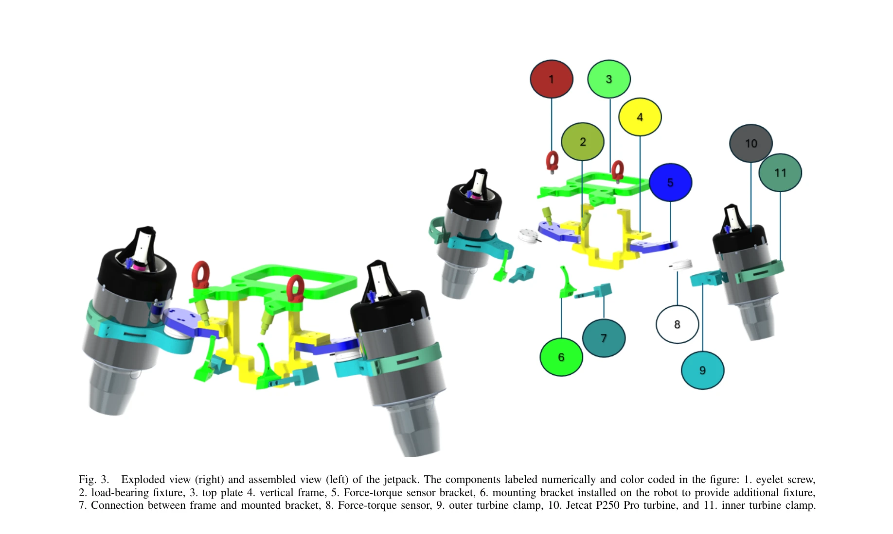

# iRonCub 3: The Jet-Powered Flying Humanoid Robot

> **저자**: Davide Gorbani, Hosameldin Awadalla Omer Mohamed, Giuseppe L'Erario, Gabriele Nava, Punith Reddy Vanteddu, Shabarish Purushothaman Pillai, Antonello Paolino, Fabio Bergonti, Saverio Taliani, Alessandro Croci, Nicholas James Tremaroli, Silvio Traversaro, Bruno Vittorio Trombetta, Daniele Pucci | **날짜**: 2025-06-01 | **URL**: [https://arxiv.org/abs/2506.01125](https://arxiv.org/abs/2506.01125)

---

## Essence

*Fig. 2.*

iRonCub 3는 제트 터빈 4개를 장착한 완전 인형형 비행 로봇으로, 시뮬레이션 검증 후 최초로 수직 이착륙에 성공했다.

## Motivation

- **Known**: 항공 로봇에 조작 팔이나 바퀴/다리를 추가하는 aerial manipulator와 hybrid quadrotor 같은 다중체 비행 로봇들이 연구되어 왔다. 기존 iRonCub-Mk1은 인형형 로봇에 제트 터빈을 탑재하는 개념을 제시했다.
- **Gap**: 인형형 비행 로봇의 비행 제어, 추정, 시스템 통합에 대한 구체적인 구현과 실제 비행 실증이 부족했다. 완전한 인형형 형태로 안정적인 비행을 달성하기 위한 기계-소프트웨어 통합 아키텍처가 미흡했다.
- **Why**: 비행 인형형 로봇은 인간 환경 접근성과 물리적 상호작용 능력을 결합하여 구조물 붕괴, 재난 대응, 고공 인프라 점검 등 복합 환경에서의 탐색·구조·조작 작업에 혁신을 가져올 수 있다.
- **Approach**: iCub3 플랫폼에 JetCat P250 Pro 터빈 4개(팔 2개, 제트팩 2개)를 통합하고, UKF 기반 추력 추정, Base Pose Estimator, Variable Sampling Linear Model Predictive Controller를 개발하여 시뮬레이션 검증 후 실제 이착륙을 시도했다.

## Achievement

*Fig. 3.*

- **기계 설계**: iCub3 기반으로 커스텀 제트팩과 개량 전완부를 설계하여 구조 무결성을 FEM 분석으로 검증 (750N 축방향 하중에 대해 3배 안전계수 확보)
- **소프트웨어 아키텍처**: Thrust Estimator, Base Pose Estimator, Flight Controller로 구성된 3계층 통합 제어 시스템 구현 (10 Hz 터빈 제어, 1000 Hz 관절 제어)
- **추력 추정**: Force-torque 센서와 UKF를 활용한 비선형 동적 모델 기반 실시간 추력 예측
- **실비행 성공**: 인형형 로봇의 최초 수직 이착륙(liftoff) 실증 - 완전 자동화된 비행 로봇으로의 초석 마련
- **실험 인프라**: 제트 엔진 운용의 복잡성을 고려한 야외 실험 영역 설계 방안 제시

## How

- iCub3 토르소 양측 숄더 피치 모터 블록에 로드 베어링 마운팅 브래킷 추가하여 제트팩 고정
- forearm 구조체에 JetCat P250 Pro 터빈 탑재 (이번 프로토타입은 손 제거하고 비행 제어에 집중)
- FEM 분석으로 제트팩과 forearm의 구조 강도 검증 (750N 축방향 하중 적용)
- Force-torque 센서를 arm과 jetpack에 장착하여 in-situ 캘리브레이션 수행
- Unscented Kalman Filter(UKF)로 throttle 입력과 추력 출력 간 비선형 동적 관계 모델링
- 제트 엔진 테스트 벤치에서 데이터셋 수집하여 thrust 예측 모델 개발
- Variable Sampling Linear Model Predictive Controller(MPC)로 터빈 throttle 명령 및 관절 목표 위치 생성
- YARP 미들웨어를 통해 Base Pose Estimator, Thrust Estimator, Flight Controller 간 통신 구현
- 시뮬레이션에서 이착륙 및 궤적 추적 검증 후 실물 비행 실험 수행

## Originality

- 인형형 로봇의 완전 비행형 구현 - 기존 terrestrial humanoid에 thrust 추가한 것과 달리 항공성을 위한 전체 시스템 재설계
- 제트 터빈 4개의 분산 배치(forearm 2개 + jetpack 2개)를 통한 안정성 강화 및 각운동량 제어 최적화
- Force-torque 센서 기반 실시간 추력 추정(UKF)으로 터빈 동작 모니터링 및 적응 제어
- 야외 고복잡도 실험 환경 설계 방안 제시 - 제트 엔진 운용의 안전성 고려
- Model Predictive Control을 인형형 비행 로봇에 최초 적용

## Limitation & Further Study

- 현재 prototype은 손 제거로 조작 능력 완전 제거 - 추후 버전에서 forearm 재통합 필요
- 수직 이착륙만 달성했으며 호버링, 전진 비행, 회전 등 고등 기동성은 미검증
- 제트팩의 배열 각도 최적화 과정 및 영향 분석 미흡
- 야외 실험 중심이므로 실내 환경에서의 적용 가능성 불명확
- 제어 및 추정 알고리즘의 루스트성(강풍, 센서 오류)에 대한 평가 부재
- 추후 완전 자율 비행, 기동 중 물체 조작, 시간 지속 비행 능력 개발 필요

## Evaluation

- Novelty: 4/5
- Technical Soundness: 3/5
- Significance: 4/5
- Clarity: 4/5
- Overall: 4/5

**총평**: iRonCub 3는 인형형 로봇 비행의 기술적 난제(제어, 추정, 기계 통합)를 체계적으로 해결하고 최초 비행 실증을 달성했으나, 고등 기동과 조작 능력 통합은 향후 과제다.
