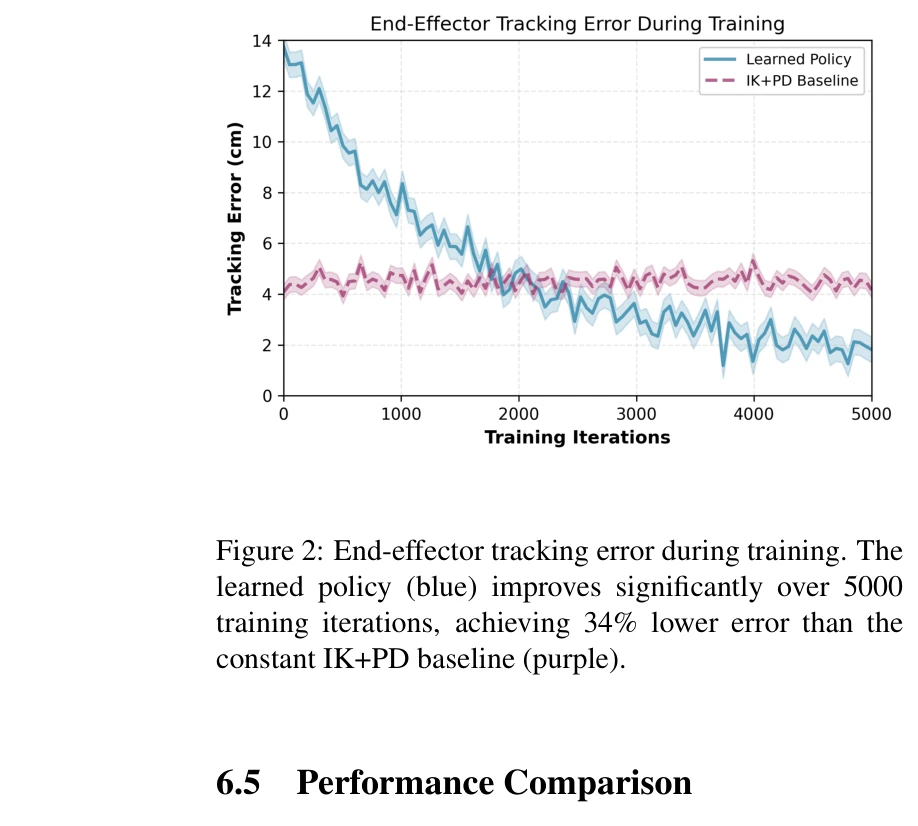

# Is imitation learning the route to humanoid robots?

> **저자**:  | **날짜**:  | **URL**: [https://www.cell.com/trends/cognitive-sciences/abstract/S1364-6613(99)01327-3](https://www.cell.com/trends/cognitive-sciences/abstract/S1364-6613(99)01327-3)

---

## Essence

*Figure 1: Neural teleoperation policy architecture. The network takes VR controller poses (14-dim), joint states (28-*

이 논문은 VR 텔레오퍼레이션 기반 휴머노이드 로봇 제어를 위해 기존 IK+PD 파이프라인을 reinforcement learning으로 학습된 neural policy로 대체하는 end-to-end learning 프레임워크를 제안한다.

## Motivation

- **Known**: VR 텔레오퍼레이션은 복잡한 조작 작업을 위한 유망한 접근법이며, 최근 RL은 로봇 제어에서 뛰어난 성과를 입증했다. 그러나 대부분의 기존 시스템은 IK 솔버와 손으로 조정한 PD 컨트롤러에 의존한다.
- **Gap**: 기존 IK+PD 기반 시스템은 외부 힘에 대한 반응 부족, 부자연스러운 움직임, 사용자 적응 불능 등의 근본적 한계가 있다. 실시간 텔레오퍼레이션을 위한 force-adaptive learning 기반 접근법이 부재하다.
- **Why**: 자연스럽고 robust한 휴머노이드 로봇 텔레오퍼레이션은 창고 물류, 재난 대응, 우주 탐사 등 다양한 실제 응용에서 필수적이다.
- **Approach**: behavioral cloning으로 IK 데모로부터 warm-start한 후, PPO를 이용해 tracking, smoothness, energy rewards와 force curriculum을 적용하여 end-to-end policy를 학습한다.

## Achievement

*Figure 3 provides a detailed breakdown of performance*

- **추적 정확도**: IK 기준선 대비 34% 낮은 추적 오차 달성
- **움직임 부드러움**: 45% 향상된 궤적 부드러움을 통해 관절 가속도 및 저크 감소
- **힘 적응**: proprioceptive feedback을 통한 implicit force compensation으로 외부 교란에 우수한 적응성
- **실시간 성능**: 50Hz 제어 주파수에서 실시간 처리 유지
- **작업 검증**: object pick-and-place, door opening, bimanual coordination 등 다양한 조작 작업에서 효과 입증

## How

*Figure 1: Neural teleoperation policy architecture. The network takes VR controller poses (14-dim), joint states (28-*

- VR controller pose를 상대적 변환(Δ T)으로 인코딩하여 좌표계 불변성 확보
- proprioception encoder로 robot state([q, q̇, a_{t-1}])를 5 timesteps 히스토리를 포함하여 처리
- LSTM policy head로 VR 입력과 proprioception을 융합하여 temporal consistency 달성
- Stage 1: behavioral cloning으로 IK 데모로부터 초기화 (L_{BC} loss)
- Stage 2: PPO with composite reward (tracking + smoothness + energy) 미세조정
- Stage 3: curriculum learning으로 external force magnitude를 0에서 1로 증가시키며 force robustness 학습
- domain randomization (link masses ±10% 등)을 통한 sim-to-real transfer

## Originality

- VR 기반 human-in-the-loop 텔레오퍼레이션을 위한 end-to-end learned policy 첫 적용
- IK 데모 imitation learning과 force curriculum을 결합한 3단계 training methodology 제안
- proprioceptive history를 활용한 implicit force compensation이 explicit force feedback 대신 operator burden 감소
- humanoid 플랫폼(Unitree G1)에서 실제 bimanual manipulation 작업으로 검증한 구체적 실험

## Limitation & Further Study

- 현재 접근법은 upper-body manipulation에 집중하며 full-body locomotion과 manipulation의 통합 제어는 미해결
- sim-to-real gap이 여전히 존재하며, 더 복잡한 contact dynamics와 센서 노이즈 처리 필요
- 사용자 선호도 적응 메커니즘이 초기 단계로, personalization을 위한 online adaptation 알고리즘 개발 필요
- force curriculum의 최적 스케줄 및 reward weight 선택이 manual tuning에 의존
- 긴 시간 VR 텔레오퍼레이션에서의 operator fatigue와 visual-proprioceptive feedback latency 영향 미분석

## Evaluation

- Novelty: 4/5
- Technical Soundness: 3/5
- Significance: 4/5
- Clarity: 4/5
- Overall: 4/5

**총평**: 이 논문은 learning-based 접근으로 VR 텔레오퍼레이션의 근본적 한계를 해결하며, 명확한 3단계 학습 파이프라인과 실제 humanoid 플랫폼에서의 강력한 실험 검증을 제공한다. 다만 더 복잡한 동역학과 full-body 제어로의 확장 가능성 및 사용자 적응 메커니즘의 고도화가 향후 과제이다.
