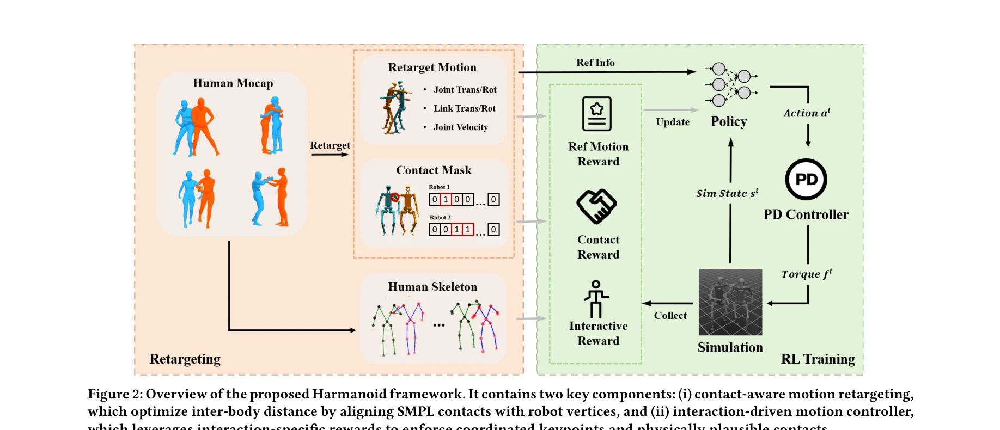
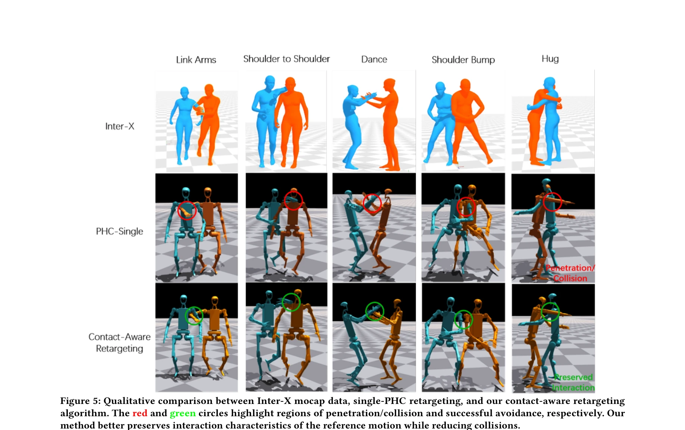

# It Takes Two: Learning Interactive Whole-Body Control Between Humanoid Robots

> **저자**: Zuhong Liu, Junhao Ge, Minhao Xiong, Jiahao Gu, Bowei Tang, Wei Jing, Siheng Chen | **날짜**: 2025-10-11 | **DOI**: [10.48550/arXiv.2510.10206](https://doi.org/10.48550/arXiv.2510.10206)

---

## Essence

*Figure 2: Overview of the proposed Harmanoid framework. It contains two key components: (i) contact-aware motion retarge*

Harmanoid는 두 개의 휴머노이드 로봇 간 상호작용 동작을 모방하는 프레임워크로, 접촉 인식 motion retargeting과 상호작용 기반 motion controller를 통해 키네마틱 충실도와 물리적 현실성을 동시에 보존한다.

## Motivation

- **Known**: 기존 humanoid motion imitation 연구는 단일 에이전트 시나리오에 초점을 맞추고 있으며, motion retargeting과 reinforcement learning 기반 motion control이 개별 로봇의 동작 학습에 효과적임이 알려져 있다.
- **Gap**: 단일 로봇 방법론들은 '고립 문제'를 무시하여 에이전트 간 역학을 고려하지 않음으로써 접촉 정렬 오류, interpenetration, 비현실적 동작을 야기한다. 다중 로봇 상호작용을 명시적으로 모델링하는 프레임워크가 부재하다.
- **Why**: 휴머노이드 로봇의 진정한 잠재력은 단순 자율성을 넘어 다중 로봇 간 물리적 기반의 사회적 상호작용에 있으며, 요양 보호, 재활 지원, 협력 제조 등 실제 응용에서 필수적이다.
- **Approach**: Harmanoid는 SMPL 접촉을 로봇 꼭짓점과 정렬하는 contact-aware motion retargeting과 상호작용 특화 보상을 활용하는 interaction-driven motion controller의 두 단계 파이프라인을 제시한다.

## Achievement

*Figure 5: Qualitative comparison between Inter-X mocap data, single-PHC retargeting, and our contact-aware retargeting*

- **Contact-aware motion retargeting**: SMPL 접촉 정보와 mesh 충돌 감지를 활용하여 inter-body 거리를 최적화하고 interpenetration을 약 25% 감소시킴
- **Interaction-driven motion controller**: 상호작용 특화 보상 설계와 curriculum learning을 통해 coordinated keypoint와 물리적으로 타당한 접촉을 강제함
- **성능 개선**: Inter-X Dataset에서 단일 motion imitation 프레임워크 대비 현저히 높은 성공률과 정확한 motion tracking 달성
- **새로운 벤치마크**: 쌍 로봇 상호작용 동작 모방의 첫 번째 포괄적 평가 제시

## How

*Figure 3: Overview of our motion retargeting pipeline that*

- Motion retargeting 단계: SMPL 모델에서 추출한 인간 접촉점과 로봇 메시 꼭짓점을 매칭하여 shape optimization 수행
- Contact detection: 고주파 mesh collision detection으로 inter-body 접촉 식별 및 거리 제약 조건 생성
- Interaction-driven rewards: 기본 pose tracking loss에 coordinated keypoint penalty와 contact-based reward 추가
- Curriculum learning: 초기에 단순 motion부터 학습하여 점진적으로 복잡한 상호작용 동작으로 확장
- Reinforcement learning: PPO 기반 motion controller 훈련으로 reference trajectory 추적 및 물리 제약 만족 동시 달성

## Originality

- 처음으로 dual-humanoid motion imitation의 '고립 문제'를 명시적으로 식별하고 해결하는 프레임워크 제시", 'Motion retargeting과 motion control을 연계하는 통합 pipeline으로 inter-agent dynamics를 모델링
- Contact-aware 최적화를 kinematic retargeting에 통합하여 상호작용 특화 제약 조건 처리
- 상호작용 특화 보상 설계로 기존 single-humanoid reward 구조 확장
- Inter-X Dataset 도입으로 다중 휴머노이드 상호작용 평가의 새로운 벤치마크 제공

## Limitation & Further Study

- 현재 framework는 dual-humanoid (2개 로봇)에만 초점을 맞추고 있으며, 3개 이상의 다중 로봇 시나리오로의 확장성 미검증
- Curriculum learning 설계가 수작업 기반이므로 새로운 상호작용 유형에 대한 자동화된 적응 방법 부재
- 실제 로봇 배포 결과가 논문에 미포함되었으며, sim-to-real gap에 대한 분석 필요
- motion capture 데이터 해상도 및 사람-로봇 형태 차이로 인한 오류 누적 가능성
- **후속연구**: (1) 다중 에이전트(3+)로 확장하는 hierarchical control framework 개발, (2) 자동화된 curriculum learning 정책 학습, (3) 실제 로봇 실험 및 transfer learning 검증, (4) 동적 상호작용 추가 (예: 밀기, 던지기) 포함

## Evaluation

- Novelty: 4/5
- Technical Soundness: 3/5
- Significance: 4/5
- Clarity: 4/5
- Overall: 4/5

**총평**: Harmanoid는 다중 휴머노이드 상호작용 동작 모방의 명확한 문제를 체계적으로 해결하며, contact-aware retargeting과 interaction-aware control의 결합으로 고립 문제를 효과적으로 극복하는 첫 프레임워크이다. 종합적인 실험과 우수한 성능으로 humanoid robotics 분야에 중요한 기여를 하나, sim-to-real 검증 부재와 2-agent 제한이 실제 적용의 완전성을 제약한다.

## Related Papers

- 🔗 후속 연구: [[papers/2076_Learning_Whole-Body_Human-Humanoid_Interaction_from_Human-Hu/review]] — It Takes Two의 두 휴머노이드 간 상호작용 학습을 Learning Whole-Body Human-Humanoid Interaction의 인간-휴머노이드 상호작용으로 확장할 수 있다.
- 🧪 응용 사례: [[papers/1991_Human-Robot_Collaboration_for_the_Remote_Control_of_Mobile_H/review]] — Harmanoid의 접촉 인식 motion retargeting 기술이 Human-Robot Collaboration의 모바일 휴머노이드 원격 제어에서 안전한 협업을 가능하게 한다.
- 🔄 다른 접근: [[papers/1844_Cognition_to_Control_-_Multi-Agent_Learning_for_Human-Humano/review]] — It Takes Two는 로봇-로봇 학습, Cognition to Control은 인간-휴머노이드 학습으로 서로 다른 주체 간 상호작용 학습을 다룬다.
- 🔗 후속 연구: [[papers/2052_Learning_Human-Humanoid_Coordination_for_Collaborative_Objec/review]] — Harmanoid의 두 휴머노이드 상호작용 프레임워크가 인간-휴머노이드 협업 객체 조작 학습에 직접 응용 가능
- 🔄 다른 접근: [[papers/2148_TokenHSI_Unified_Synthesis_of_Physical_Human-Scene_Interacti/review]] — 둘 다 다중 에이전트 상호작용이지만 Harmanoid는 로봇-로봇, TokenHSI는 인간-장면 상호작용 중심
- 🏛 기반 연구: [[papers/1990_Human-Level_Actuation_for_Humanoids/review]] — 인간 수준의 액추에이션 기술이 Harmanoid의 두 휴머노이드 간 자연스러운 상호작용 동작 구현에 필수적
- 🏛 기반 연구: [[papers/1844_Cognition_to_Control_-_Multi-Agent_Learning_for_Human-Humano/review]] — 인간-휴머노이드 상호작용 전신 제어가 3계층 Cognition-to-Control 협업 프레임워크의 기본 제어 구조
- 🔄 다른 접근: [[papers/1963_H2-COMPACT_Human-Humanoid_Co-Manipulation_via_Adaptive_Conta/review]] — 둘 다 인간-로봇 상호작용 제어를 다루지만 H2-COMPACT는 협력 운반에, It Takes Two는 일반적인 상호작용에 초점을 맞춘다.
- 🏛 기반 연구: [[papers/2052_Learning_Human-Humanoid_Coordination_for_Collaborative_Objec/review]] — 두 에이전트 간 상호작용 제어 학습의 기본 원리가 인간-휴머노이드 협력 시스템 구현에 대한 이론적 토대를 제공한다.
- 🔗 후속 연구: [[papers/2076_Learning_Whole-Body_Human-Humanoid_Interaction_from_Human-Hu/review]] — 두 에이전트 간 상호작용적 전신 제어 학습의 확장된 접근법을 보여준다.
