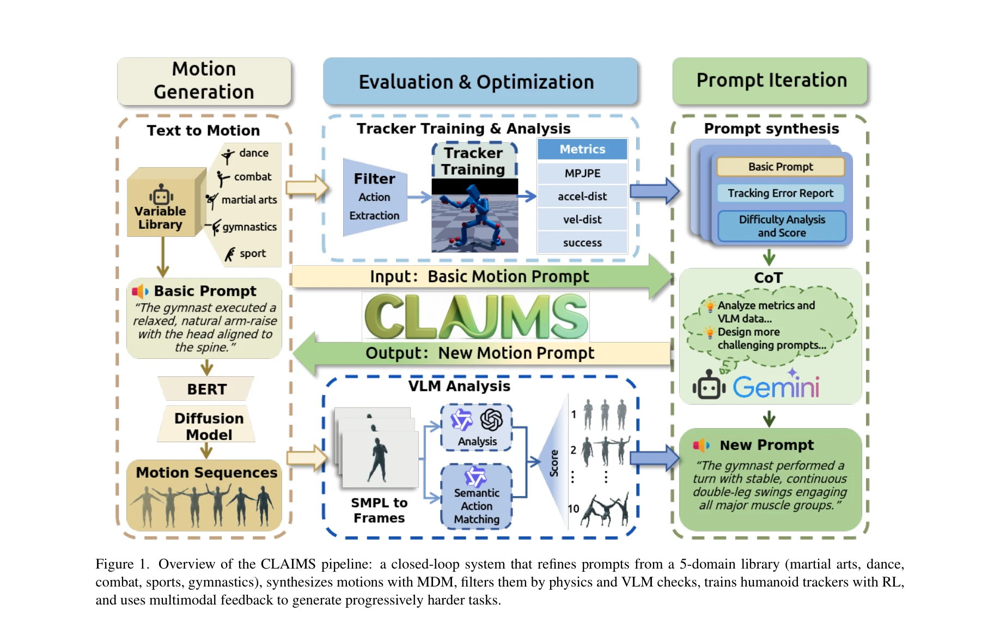

# Iterative Closed-Loop Motion Synthesis for Scaling the Capabilities of Humanoid Control

> **저자**: Weisheng Xu, Qiwei Wu, Jiaxi Zhang, Tan Jing, Yangfan Li, Yuetong Fang, Jiaqi Xiong, Kai Wu, Rong Ou, Renjing Xu | **날짜**: 2026-02-25 | **URL**: [https://arxiv.org/abs/2602.21599](https://arxiv.org/abs/2602.21599)

---

## Essence

*Figure 1. Overview of the CLAIMS pipeline: a closed-loop system that refines prompts from a 5-domain library (martial ar*

본 논문은 폐쇄 루프 자동화 모션 데이터 생성 및 반복 프레임워크(CLAIMS)를 제안하여 고정된 난이도 분포의 데이터셋 한계를 극복하고, 휴머노이드 제어 정책의 성능 상한을 향상시킨다.

## Motivation

- **Known**: Physics-based 휴머노이드 제어는 motion capture 데이터셋을 활용한 강화학습 기반 접근이 표준이며, DeepMimic, AMP, PHC 등의 방법이 개선되어왔다. 그러나 AMASS와 같은 대규모 데이터셋도 90% 이상이 저난이도 일상 활동으로 구성되어 있어 고난이도 동작에 대한 일반화가 제한된다.
- **Gap**: 기존 motion capture 데이터셋은 고정된 난이도 분포를 가지고 있으며, 전문적이고 고난이도 데이터 수집 비용이 높아 대규모 확장성을 달성하기 어렵다. 또한 학습된 제어 정책이 자신의 난이도 한계를 극복할 수 있는 동적 적응 메커니즘이 부재하다.
- **Why**: 고난이도 전문 동작(격투기, 체조, 댄스 등)에 대한 휴머노이드 제어 능력은 로봇 애니메이션, 대화형 VR, 복잡한 스포츠 모션 캡처 등 다양한 실제 응용에 필수적이다. 효율적인 데이터 생성 및 반복 학습 프레임워크는 전문가 mocap 데이터 수집의 비용 부담을 줄이면서도 제어 정책의 능력을 확장할 수 있다.
- **Approach**: 본 연구는 MDM(motion diffusion model)을 활용한 자동화된 motion 생성과 multimodal agent 기반 실패 분석을 결합한 폐쇄 루프 반복 프레임워크를 제안한다. 5개 도메인(격투기, 댄스, 전투, 스포츠, 체조)에 걸친 의미론적 분류 체계와 난이도 축(기본 동작, 조합 동작, 기술 세부사항, 속도/리듬)을 정의하여 난이도를 체계적으로 증가시킨다.

## Achievement

*Figure 1. Overview of the CLAIMS pipeline: a closed-loop system that refines prompts from a 5-domain library (martial ar*

- **데이터 효율성**: AMASS 데이터셋 크기의 약 1/10 수준(약 400개 학습 시퀀스)만으로도 테스트 셋(2201 클립)에서 기준선 대비 평균 실패율을 45% 감소시켰다.
- **폐쇄 루프 프레임워크**: 제어 정책의 현재 능력 수준에 따라 동적으로 데이터의 난이도를 조정하여 정책이 원래의 난이도 한계를 초과할 수 있도록 한다.
- **다중 도메인 커버리지**: 격투술, 댄스, 전투, 스포츠, 체조 5개 도메인에 걸친 의미론적 태그와 명시적 난이도 계층화를 갖춘 확장성 있는 데이터셋을 구축했다.
- **일반화 능력**: AIST++, Motion-X/Kungfu, EMDB, Video-Convert 등 다양한 벤치마크에서 기존 방법 대비 우수한 성능을 달성하며, 다양한 tracker에 대한 일관된 개선을 입증했다.

## How

- **의미론적 분류 체계 정의**: 5개 도메인과 4개 축(기본 동작, 조합 동작, 세부 기술, 속도/리듬)으로 전문적 난이도를 형식화하고 템플릿 기반 프롬프트 생성
- **MDM 기반 동작 생성**: 사전학습된 text-conditioned motion diffusion model을 활용하여 템플릿화된 액션 프롬프트로부터 고품질 동작 생성
- **다단계 필터링**: Physics-based 검증 및 VLM(vision language model) 피드백을 결합한 multimodal 검사로 생성 동작의 물리적 타당성과 의미론적 정합성 보장
- **반복적 정책 최적화**: 강화학습을 통해 생성된 동작으로 제어 정책 학습 후 실패 분석을 통해 다음 반복에서 더 어려운 동작 생성
- **경쟁적 반복 절차**: 제어 정책과 동작 합성 간의 게임형 경쟁 설정으로 난이도를 점진적으로 확대

## Originality

- **동적 난이도 적응**: 기존 정적 데이터셋 분포에서 벗어나 제어 정책의 능력 수준에 따라 실시간으로 데이터 난이도를 조정하는 폐쇄 루프 메커니즘은 이 분야에서 혁신적이다.
- **체계적 난이도 형식화**: 기본 동작, 조합 동작, 세부 기술, 시간 구조의 4축을 통한 난이도 정의는 이전 연구에서 보지 못한 형식적 프레임워크를 제공한다.
- **다모달 평가 루프**: Physics metric과 VLM 피드백을 결합하여 다차원적으로 동작의 품질과 난이도를 평가하는 접근은 기존 단일 평가 기준(PARC 등)을 넘어선다.
- **효율성과 확장성**: 학습 계산량은 제어 정책 최적화에만 필요하고 나머지 구성요소는 학습-무료(training-free)로 구성하여 다양한 tracker에 일반화 가능한 제어 독립적 프레임워크를 실현했다.

## Limitation & Further Study

- **MDM의 사전학습 분포 의존성**: 본 방법도 여전히 HumanML3D 기반 사전학습 MDM에 의존하므로, 생성 동작의 창의성은 원 학습 분포의 제약을 완전히 벗어날 수 없다.
- **물리적 타당성 평가의 한계**: Physics-based 검증과 VLM 피드백이 모든 고난이도 동작의 실제 실행 가능성을 완벽하게 보장하지 못할 수 있으며, 실제 mocap 데이터와의 자세한 비교 분석이 부족하다.
- **도메인 선택의 임의성**: 5개 도메인 선택 및 각 도메인 내 난이도 축의 정의가 전문가 의견에 기반하고 있어, 다른 도메인(예: 춤의 특정 스타일)으로의 확장성에 대한 논의 필요.
- **단일 원시 tracker 중심**: 본 연구는 PHC 단일-원시 tracker에 주로 집중하고 있으며, 더 복잡한 멀티-태스크 제어 정책이나 end-to-end 학습 기반 방법과의 비교가 제한적이다.
- **후속 연구 방향**: (1) 동적 prompting 전략으로 MDM 자체의 고난이도 동작 생성 능력 향상, (2) sim-to-real 전이 학습을 통한 실제 로봇 구현 검증, (3) 멀티-도메인 정책 통합 메커니즘 개발, (4) 인체 해부학적 제약 조건을 더욱 명시적으로 반영한 필터링 기준 강화

## Evaluation

- Novelty: 4/5
- Technical Soundness: 3/5
- Significance: 4/5
- Clarity: 4/5
- Overall: 4/5

**총평**: 본 논문은 동적 난이도 적응을 통해 휴머노이드 제어의 고질적인 문제(고정 데이터 분포, 높은 데이터 수집 비용)를 혁신적으로 해결하며, 폐쇄 루프 프레임워크의 개념과 실제 구현이 모두 우수하다. 특히 AMASS의 1/10 데이터로 45% 실패율 감소라는 실질적 성과와 다양한 벤치마크에서의 일반화 능력은 이 분야에 상당한 실용적 기여를 제공한다.

## Related Papers

- 🔄 다른 접근: [[papers/1652_Robot_Trains_Robot_Automatic_Real-World_Policy_Adaptation_an/review]] — 자동화된 모션 데이터 생성에서 폐쇄 루프 방식 대신 로봇 간 정책 적응을 통한 데이터 확장 접근법을 제시한다.
- 🏛 기반 연구: [[papers/2094_Mechanical_Intelligence-Aware_Curriculum_Reinforcement_Learn/review]] — 기계적 지능을 고려한 커리큘럼 학습이 CLAIMS의 반복적 난이도 조절 메커니즘에 대한 이론적 토대를 제공한다.
- 🧪 응용 사례: [[papers/1942_GaussGym_An_open-source_real-to-sim_framework_for_learning_l/review]] — 실제-시뮬레이션 변환 프레임워크에서 CLAIMS가 생성한 다양한 난이도의 데이터를 활용하여 더 강건한 정책 학습이 가능하다.
- 🏛 기반 연구: [[papers/1816_Benchmarking_Humanoid_Imitation_Learning_with_Motion_Difficu/review]] — 모션 난이도 평가와 커리큘럼 학습에 대한 벤치마킹 기반 제공
- 🔄 다른 접근: [[papers/1828_Booster_Gym_An_End-to-End_Reinforcement_Learning_Framework_f/review]] — 둘 다 강화학습 프레임워크이지만 CLAIMS는 반복적 데이터 생성, Booster Gym은 end-to-end 학습 환경 제공
- 🏛 기반 연구: [[papers/2151_Toward_Reliable_Sim-to-Real_Predictability_for_MoE-based_Rob/review]] — MoE 기반 로봇 제어의 신뢰성 있는 sim-to-real 전이가 CLAIMS의 반복적 능력 확장에 실세계 적용 기반 제공
- 🔄 다른 접근: [[papers/1869_DexMimicGen_Automated_Data_Generation_for_Bimanual_Dexterous/review]] — iterative closed-loop motion synthesis가 DexMimicGen과 다른 방식으로 대규모 조작 데이터를 생성하는 접근법을 제시한다.
