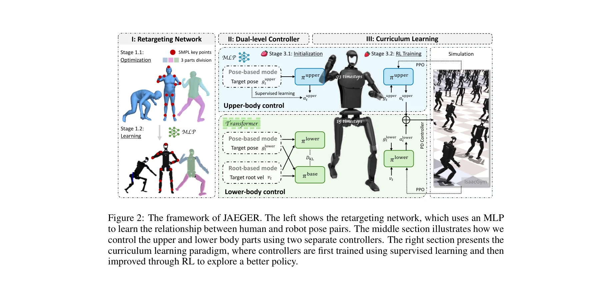
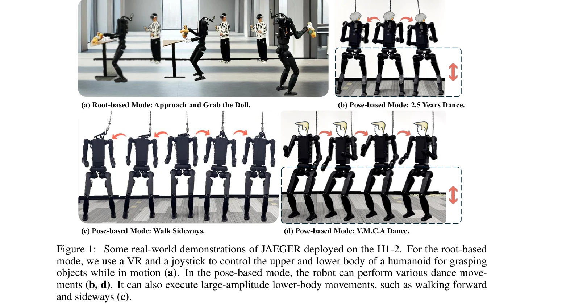

# JAEGER: Dual-Level Humanoid Whole-Body Controller

> **저자**: Ziluo Ding, Haobin Jiang, Yuxuan Wang, Zhenguo Sun, Yu Zhang, Xiaojie Niu, Ming Yang, Weishuai Zeng, Xinrun Xu, Zongqing Lu | **날짜**: 2025-05-10 | **URL**: [https://arxiv.org/abs/2505.06584](https://arxiv.org/abs/2505.06584)

---

## Essence

*Figure 2: The framework of JAEGER. The left shows the retargeting network, which uses an MLP*

JAEGER는 인간형 로봇의 상체와 하체를 독립적인 두 개의 컨트롤러로 분리하여 제어하는 dual-level whole-body controller를 제안하며, root velocity tracking(coarse-grained)과 local joint angle tracking(fine-grained) 제어를 모두 지원한다.

## Motivation

- **Known**: 기존의 whole-body control 방법들은 단일 컨트롤러로 상하체를 통합 제어하거나, 인간 모션 데이터(AMASS)를 기반으로 학습하는 방식을 사용해왔다. OmniH2O, HumanPlus 등의 방법들이 이 분야의 선행 연구로 알려져 있다.
- **Gap**: 기존 접근법은 상체의 추적 거동이 하체 안정성을 위해 과도하게 보수적이 되거나, coarse-grained 및 fine-grained 제어를 효과적으로 결합하지 못하는 문제가 있다. 또한 높은 차원의 행동 공간이 학습을 어렵게 한다.
- **Why**: 인간형 로봇의 whole-body control은 실제 응용을 위해 강건성과 다목적성이 필수적이며, 상체와 하체의 상이한 기능을 각각 최적화하는 것이 제어 성능을 크게 향상시킬 수 있다.
- **Approach**: 상체와 하체를 분리한 dual-level controller 아키텍처를 제안하고, MLP 기반의 retargeting network로 인간 자세를 인간형 로봇 자세로 변환한 후, supervised learning으로 초기화하고 RL로 최적화하는 curriculum learning 전략을 적용한다.

## Achievement

*Figure 1: Some real-world demonstrations of JAEGER deployed on the H1-2. For the root-based*

- **MLP 기반 Retargeting**: 최적화 기반 IK 방법보다 정확하고 부드러운 joint angle을 생성하며 1kHz의 높은 실행 빈도로 동작
- **Dual-level Controller**: 상하체 간 상호간섭을 감소시키고 각 컨트롤러가 고유 작업에 집중하게 함으로써 강건성 증대
- **구조화된 Curriculum Learning**: supervised initialization과 RL을 조합하여 수렴 속도 및 최적성 향상
- **실제 환경 검증**: 두 개의 인간형 로봇 플랫폼에서 simulation 및 real-world 환경 모두에서 state-of-the-art 방법들 대비 우월성 입증

## How

*Figure 2: The framework of JAEGER. The left shows the retargeting network, which uses an MLP*

- AMASS 인간 모션 데이터셋에서 human-humanoid pose pair를 생성하고 lightweight three-layer MLP로 mapping 학습
- 상체(upper-body) 컨트롤러 π_upper와 하체(lower-body) 컨트롤러 π_lower를 분리하여 독립적 학습
- Root-based mode(root velocity + upper body joint angle)와 pose-based mode(전체 body joint angle)의 두 가지 command 모드 지원
- Stage 1: 하체 컨트롤러 단독 학습 → Stage 2: 상체 컨트롤러 supervised initialization → Stage 3: PPO 기반 whole-body RL 학습
- 두 컨트롤러가 observations와 rewards를 공유하여 효과적인 조율 달성
- IsaacGym 시뮬레이션 환경에서 학습하고 실제 로봇 플랫폼으로 배포

## Originality

- 상하체 분리 설계를 통한 새로운 관점: 기존의 통합 컨트롤러 대신 multi-agent 시스템 관점에서 문제를 재구성
- MLP 기반 retargeting의 창의적 적용: 기존 최적화 기반 IK 방식 대신 deep learning 활용으로 실시간성과 안정성 동시 달성
- Coarse-grained과 fine-grained 제어의 통합: 두 개의 독립 정책을 distill하여 unified WBC 정책으로 통합하는 novel 접근
- 구조화된 curriculum learning: supervised learning으로 초기화한 후 RL로 탐색하는 staged training strategy의 체계적 설계

## Limitation & Further Study

- 상하체 분리 설계가 높은 상호작용이 필요한 특정 동작에서는 성능 제한 가능성
- 두 개의 독립 컨트롤러 유지로 인한 모델 복잡도 증가 및 동기화 문제 가능성
- AMASS 데이터셋 의존성: 인간형 로봇 체형과 다른 인간 데이터의 체계적 retargeting 오차 누적 가능
- Real-world 배포는 두 개의 humanoid 플랫폼에서만 검증되어 일반화 가능성 미지수
- **후속 연구**: 상하체 간 동적 상호작용이 큰 동작(점프, 복잡한 balancing)에 대한 개선 방안, 다양한 로봇 체형에 대한 자동 적응 메커니즘, end-to-end vision-based 제어로의 확장

## Evaluation

- Novelty: 4/5
- Technical Soundness: 4/5
- Significance: 4/5
- Clarity: 4/5
- Overall: 4/5

**총평**: JAEGER는 상하체 분리 설계와 MLP 기반 retargeting, 체계화된 curriculum learning을 통해 인간형 로봇의 whole-body control 문제에 대한 실질적이고 창의적인 해결책을 제시하며, 실제 환경에서의 검증을 통해 높은 실용성을 입증한다.

## Related Papers

- 🔄 다른 접근: [[papers/2054_Learning_Humanoid_Arm_Motion_via_Centroidal_Momentum_Regular/review]] — 휴머노이드 전신 제어에서 dual-level 방식 대신 centroidal momentum을 활용한 multi-agent 접근법을 비교할 수 있다.
- 🏛 기반 연구: [[papers/1759_WoCoCo_Learning_Whole-Body_Humanoid_Control_with_Sequential/review]] — 다중 접촉점을 가진 전신 모델 예측 제어의 이론적 기반을 JAEGER의 dual-level 제어 아키텍처에 적용할 수 있다.
- 🔗 후속 연구: [[papers/1975_Hierarchical_visuomotor_control_of_humanoids/review]] — 계층적 시각운동 제어를 JAEGER의 상/하체 분리 제어 구조와 통합하여 더 정교한 전신 협응을 구현할 수 있다.
- 🔄 다른 접근: [[papers/1665_Scalable_and_General_Whole-Body_Control_for_Cross-Humanoid_L/review]] — 둘 다 휴머노이드 전신 제어의 확장성을 다루지만 JAEGER는 dual-level 분리, Scalable은 cross-humanoid 일반화 중심
- 🔗 후속 연구: [[papers/1924_FARM_Frame-Accelerated_Augmentation_and_Residual_Mixture-of-/review]] — JAEGER의 dual-level 제어가 FARM의 frame-accelerated 증강과 결합되어 더 효율적인 상하체 협응 학습 가능
- 🏛 기반 연구: [[papers/2166_ULTRA_Unified_Multimodal_Control_for_Autonomous_Humanoid_Who/review]] — ULTRA의 통합 멀티모달 제어가 JAEGER의 dual-level 아키텍처에 상체-하체 통합 제어 프레임워크 제공
- 🔗 후속 연구: [[papers/1805_Architecture_Is_All_You_Need_Diversity-Enabled_Sweet_Spots_f/review]] — LCA의 이중 수준 제어가 JAEGER의 dual-level 컨트롤러와 유사한 구조적 확장 가능성을 보여준다
- 🏛 기반 연구: [[papers/1774_A_Behavior_Architecture_for_Fast_Humanoid_Robot_Door_Travers/review]] — 이중 레벨 전신 제어기 아키텍처가 빠른 도어 통과를 위한 행동 조정 시스템의 기반 기술을 제공합니다.
- 🔗 후속 연구: [[papers/1799_AMO_Adaptive_Motion_Optimization_for_Hyper-Dexterous_Humanoi/review]] — JAEGER의 dual-level control이 AMO의 sim-to-real RL과 trajectory optimization 결합 방식을 더욱 체계화합니다.
- 🔄 다른 접근: [[papers/2054_Learning_Humanoid_Arm_Motion_via_Centroidal_Momentum_Regular/review]] — 휴머노이드 전신 협응에서 centroidal momentum 기반 multi-agent 방식 대신 dual-level 제어 접근법을 비교할 수 있다.
- 🔄 다른 접근: [[papers/2165_ULC_A_Unified_and_Fine-Grained_Controller_for_Humanoid_Loco-/review]] — JAEGER의 dual-level control과 ULC의 unified single policy는 휴머노이드 전신 제어의 서로 다른 아키텍처 접근법임
