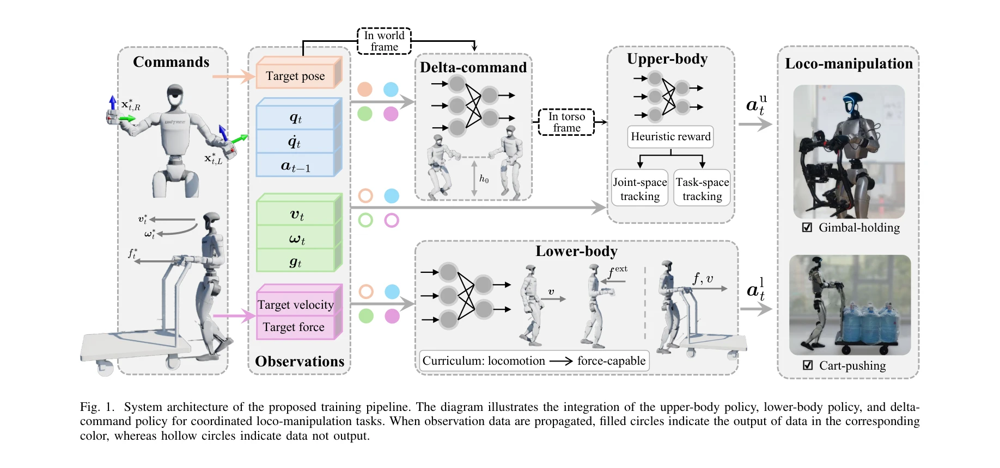
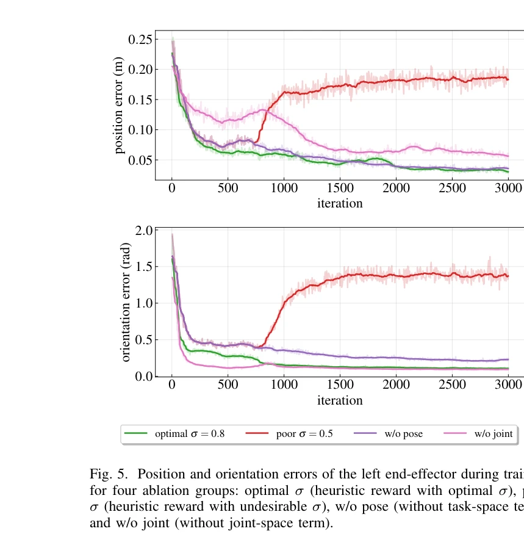

# Kinematics-Aware Multi-Policy Reinforcement Learning for Force-Capable Humanoid Loco-Manipulation

> **저자**: Kaiyan Xiao, Zihan Xu, Cheng Zhe, Chengju Liu, Qijun Chen | **날짜**: 2025-11-26 | **DOI**: [10.48550/arXiv.2511.21169](https://doi.org/10.48550/arXiv.2511.21169)

---

## Essence

*Fig. 1. System architecture of the proposed training pipeline. The diagram illustrates the integration of the upper-body*

본 논문은 휴머노이드 로봇의 고부하 산업 작업 수행을 위해 kinematics 사전 정보를 활용한 휴리스틱 보상함수, force-based curriculum learning, delta-command 정책을 통합한 3단계 RL 기반 loco-manipulation 프레임워크를 제안한다.

## Motivation

- **Known**: RL은 휴머노이드 로봇의 안정적인 보행과 조작을 가능하게 했으나, 기존 loco-manipulation 방법들은 주로 민첩한 조작에 초점을 맞추고 있으며 고부하 산업 환경에서 요구되는 능동적 힘 상호작용을 제대로 다루지 못하고 있다.
- **Gap**: 높은 자유도 휴머노이드에서 monolithic whole-body control은 탐색 효율성이 낮고, 기존 decoupled control은 역기구학 계산 부담, force interaction 학습 능력 부족, upper-body와 lower-body 간 조정 문제 등이 미해결 상태이다.
- **Why**: 고부하 산업 응용(4kg 물체 운반, 112.8kg 카트 푸시/풀링 등)에서 로봇은 안정적 보행과 능동적 힘 제어를 동시에 만족해야 하는데, 이는 기존 방법으로 달성하기 어렵기 때문이다.
- **Approach**: upper-body, lower-body, delta-command 정책으로 구성된 3단계 RL 파이프라인을 제안하며, forward kinematics를 암묵적으로 내장한 휴리스틱 보상함수로 상체 학습을 가속화하고, force-based curriculum learning으로 하체의 능동 힘 제어를 점진적으로 습득하게 한다.

## Achievement

*Fig. 5. Position and orientation errors of the left end-effector during training*

- **Kinematics-aware 휴리스틱 보상함수**: forward kinematics 사전 정보를 암묵적으로 활용하여 upper-body 정책의 수렴 속도 및 성능을 향상
- **Force-based curriculum learning**: 기본 보행에서 시작하여 목표 힘 추적으로 확대되는 순차적 학습으로 로봇의 능동 힘 제어 능력 획득
- **Delta-command 정책**: 하체 운동으로 인한 수직 end-effector 변위를 보상하여 상하체 조정 달성
- **고부하 작업 수행**: Unitree G1 로봇이 4kg 물체 운반 및 112.8kg 카트 푸시/풀링을 안정적으로 수행

## How

*Fig. 1. System architecture of the proposed training pipeline. The diagram illustrates the integration of the upper-body*

- Upper-body 정책: joint-space 추적과 task-space 추적을 결합한 휴리스틱 보상함수로 학습
- Lower-body 정책: curriculum learning 전략으로 먼저 안정적 보행 학습 후 외부 교란(목표 힘의 반대 방향)을 점진적으로 도입
- Delta-command 모듈: torso frame에서 end-effector 위치 오프셋을 계산하여 world frame 기준으로 보상
- Observation-Action 설계: end-effector pose, 보행 속도, 목표 힘을 command space로 정의하고 로봇 상태를 observation으로 구성
- Domain randomization 활용: 시뮬레이션에서 학습한 정책의 sim-to-real 전이

## Originality

- Forward kinematics 사전 정보를 보상함수에 암묵적으로 내장하는 novel한 휴리스틱 설계
- 능동 힘 제어를 위해 외부 교란을 이용한 force-based curriculum learning 방식의 새로운 제안
- Delta-command 정책을 통한 decoupled control에서의 상하체 조정 문제 해결 방법
- 3단계 modular RL 파이프라인으로 고부하 loco-manipulation 문제를 체계적으로 분해

## Limitation & Further Study

- 실험이 단일 로봇 플랫폼(Unitree G1)에 제한되어 다른 휴머노이드 로봇으로의 일반화 가능성 미검증
- 시뮬레이션 환경이 제한적이므로, 실제 복잡한 산업 환경(불규칙한 지면, 동적 장애물 등)에서의 robustness 미평가
- Delta-command 정책의 설계가 torso 운동의 영향에만 집중하므로, 더 복잡한 동역학 커플링에 대한 확장성 불명확
- Force curriculum의 최적 스케줄링 및 하이퍼파라미터 선택에 대한 상세한 가이드라인 부족
- 후속연구로 다양한 로봇 형태에 대한 프레임워크 적용, 실시간 적응 학습 메커니즘 추가, 더 복잡한 bimanual 협력 작업 탐구 필요

## Evaluation

- Novelty: 4/5
- Technical Soundness: 3/5
- Significance: 4/5
- Clarity: 4/5
- Overall: 4/5

**총평**: 본 논문은 휴머노이드 로봇의 고부하 loco-manipulation을 위해 kinematics 정보 활용, curriculum learning, modular 정책 조정을 결합한 체계적이고 실용적인 RL 프레임워크를 제시하며, 실제 로봇 실험으로 강력한 성능을 입증했다. 다만 단일 플랫폼 검증과 실제 산업 환경 적응성 평가 보강이 필요하다.
