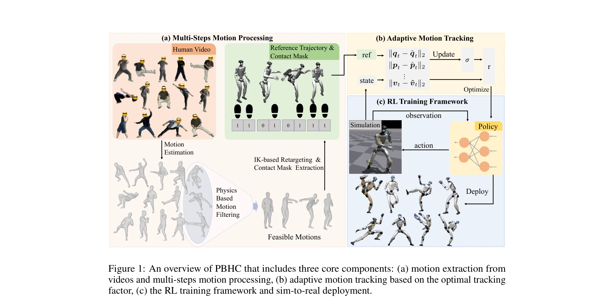

# KungfuBot: Physics-Based Humanoid Whole-Body Control for Learning Highly-Dynamic Skills

> **저자**: Weiji Xie, Jinrui Han, Jiakun Zheng, Huanyu Li, Xinzhe Liu, Jiyuan Shi, Weinan Zhang, Chenjia Bai, Xuelong Li | **날짜**: 2025-06-15 | **URL**: [https://arxiv.org/abs/2506.12851](https://arxiv.org/abs/2506.12851)

---

## Essence

*Figure 1: An overview of PBHC that includes three core components: (a) motion extraction from*

본 논문은 물리 기반 인간형 로봇 제어 프레임워크(PBHC)를 제안하여 쿵푸, 댄싱 등 고도로 동적인 인간 행동을 모방하도록 학습하는 방법을 제시한다. 다단계 모션 처리와 적응형 모션 추적을 통해 기존 방법보다 현저히 낮은 추적 오차를 달성하고 실제 로봇에 배포된다.

## Motivation

- **Known**: 인간형 로봇은 모션 캡처 데이터와 RL을 활용하여 인간 행동을 모방할 수 있으나, 기존 알고리즘은 부드럽고 저속의 모션 추적에만 제한된다. 물리적 제약 조건 위반과 고차원 제어 공간의 어려움이 주요 도전이다.
- **Gap**: 기존 방법들(H2O, OmniH2O, ExBody 등)은 낮은 속도의 부드러운 모션만 추적 가능하며, 동적이고 복잡한 모션에 대해 높은 추적 오차를 보인다. 어려운 모션에 대한 적절한 허용 메커니즘 부재로 고도로 동적인 행동 학습이 불가능하다.
- **Why**: 인간형 로봇의 실용적 적용성을 높이기 위해 고차원 제어 정책이 복잡하고 빠른 동작을 정확히 추적할 수 있어야 하며, 이는 로봇의 물리적 가능성을 보장하면서도 인간과 유사한 표현력 있는 행동 생성을 가능하게 한다.
- **Approach**: 두 단계 프레임워크를 도입한다: (1) 모션 처리 단계에서 HMR 모델로 SMPL 포맷 추출, 물리 기반 필터링(CoM-CoP 안정성), 접촉 마스크 기반 보정, IK 기반 리타겟팅을 수행하고 (2) 모션 모방 단계에서 bi-level optimization으로 추적 팩터를 동적 조정하는 적응형 커리큘럼을 구성하며, 비대칭 actor-critic 아키텍처로 정책을 훈련한다.

## Achievement

*Figure 1: An overview of PBHC that includes three core components: (a) motion extraction from*

- **물리 기반 모션 필터링**: CoM과 CoP의 거리 기반 안정성 판별과 접촉 마스크 추출을 통해 물리적으로 불가능한 모션을 사전에 제거하여 데이터셋 품질 향상
- **적응형 모션 추적 메커니즘**: Bi-level optimization 기반의 추적 팩터 σ를 동적으로 조정하여 어려운 모션에 대한 합리적인 허용도 설정 및 온라인 추정을 통한 폐루프 제어
- **비대칭 actor-critic 아키텍처**: 비평가가 reward vectorization과 특권 정보를 활용하여 가치 추정을 개선하면서 배우는 국소 관측만 사용하도록 설계
- **실제 배포 성공**: Unitree G1 로봇에서 쿵푸, 댄싱 등 고도로 동적인 모션을 안정적이고 표현력 있게 수행
- **낮은 추적 오차**: 기존 방법(ExBody, ExBody2, ASAP 등) 대비 현저히 낮은 추적 오차 달성

## How

*Figure 1: An overview of PBHC that includes three core components: (a) motion extraction from*

- GVHMR으로 단안 비디오로부터 SMPL 포맷 모션 추정 (중력 정렬 및 발 미끄럼 감소)
- CoM(center of mass)과 CoP(center of pressure)의 투영 거리를 계산하여 프레임별 안정성 평가 (Equation 1)
- 경계 프레임 안정성 조건과 최대 불안정 갭 조건으로 동적 안정성이 부족한 모션 시퀀스 제거
- 발목 변위의 영속도 가정(zero-velocity assumption) 기반 접촉 마스크 추정 (Equation 2)
- 접촉 마스크로부터 부동 아티팩트 보정
- 미분 역기구학(differential inverse kinematics)을 통한 G1 로봇으로의 모션 리타겟팅
- 추적 보상 함수를 추적 팩터 σ로 조정: r_track = σ · r_track^base
- 추적 오차에 기반한 bi-level optimization으로 최적 추적 팩터 σ*를 도출
- 온라인 추적 오차 추정을 통한 폐루프 팩터 업데이트 규칙 적용
- PPO 알고리즘으로 actor-critic 정책 최적화 (비평가는 특권 정보 활용, 배우는 국소 관측만 사용)

## Originality

- **물리 제약 기반 사전 필터링**: CoM-CoP 거리 및 동적 안정성 조건을 이용한 체계적인 모션 필터링은 기존 언어 라벨(ExBody) 또는 사후 필터링(H2O) 방식과 달리 물리 원리 기반의 사전 선별 방식으로 보다 근거 있는 접근
- **적응형 커리큘럼의 bi-level optimization 공식화**: 추적 팩터를 동적으로 조정하는 bi-level optimization 문제 설정은 어려운 모션에 대한 자동 허용도 조정을 가능하게 하는 새로운 메커니즘
- **온라인 폐루프 팩터 업데이트**: 훈련 중 실시간으로 추적 오차를 추정하여 팩터를 동적으로 정제하는 적응형 메커니즘은 고정 커리큘럼과 차별화
- **비대칭 actor-critic 구조의 특권 정보 활용**: 비평가는 참조 상태와 추가 정보를 활용하여 가치 추정을 강화하면서도 배우는 현실적 관측만 사용하여 sim-to-real 갭 감소
- **종합적 파이프라인**: 모션 추정부터 필터링, 보정, 리타겟팅, 적응형 추적, RL 훈련을 통합한 체계적인 프레임워크는 기존 단편적 접근 대비 보다 정교한 설계

## Limitation & Further Study

- **모션 추정 정확도에 의존**: GVHMR의 모션 복구 품질에 의존하며, 초기 추정 오류가 이후 단계에 전파될 수 있음
- **물리 필터링 임계값의 경험적 설정**: ϵ_stab, ϵ_N, ϵ_vel, ϵ_height 등 다수의 임계값이 경험적으로 선택되어 일반화성이 제한될 수 있음
- **단일 로봇 배포**: Unitree G1에만 배포되어 다양한 인간형 로봇으로의 확장성 미검증
- **정상 상태 가정의 한계**: zero-velocity assumption 기반 접촉 마스크 추정은 발이 완전히 정지할 때만 정확하여 빠른 동작에서 오류 가능
- **후속 연구 방향**: (1) 적응형 임계값 학습으로 자동 파라미터 조정, (2) 다양한 로봇 형태와 물리 제약에 일반화 가능한 프레임워크 개발, (3) Sim-to-real gap 추가 감소를 위한 도메인 적응 기법 적용, (4) 더 복잡한 다체 상호작용(예: 타격, 기술 조합) 학습 능력 강화

## Evaluation

- Novelty: 4/5
- Technical Soundness: 4/5
- Significance: 4/5
- Clarity: 4/5
- Overall: 4/5

**총평**: 본 논문은 물리 기반 모션 처리, 적응형 bi-level optimization 커리큘럼, 비대칭 actor-critic 구조를 결합한 포괄적 프레임워크로 고도로 동적인 인간형 로봇 제어 문제를 체계적으로 해결한다. 실제 로봇 배포 성공과 기존 방법 대비 현저한 성능 향상은 강력한 기술적 기여를 입증하며, 인간형 로봇의 동적 행동 학습 분야에서 중요한 진전을 이룬다.

## Related Papers

- 🔗 후속 연구: [[papers/2038_KungfuBot2_Learning_Versatile_Motion_Skills_for_Humanoid_Who/review]] — KungfuBot의 고도로 동적인 행동 학습을 다양한 모션 기술로 확장하여 더 범용적인 휴머노이드 제어 시스템을 구현한다.
- 🏛 기반 연구: [[papers/1862_DeepMimic_Example-Guided_Deep_Reinforcement_Learning_of_Phys/review]] — 물리 기반 캐릭터 제어를 위한 강화학습의 기본 원리가 쿵푸 동작 모방 학습의 이론적 토대를 제공한다.
- 🔄 다른 접근: [[papers/1999_Humanoid_Parkour_Learning/review]] — 고도로 동적인 인간 행동 모방에서 쿵푸/댄싱 대신 파쿠르 기술을 학습하는 다른 접근법을 제시한다.
- 🔄 다른 접근: [[papers/1649_Robot_Crash_Course_Learning_Soft_and_Stylized_Falling/review]] — 둘 다 동적 인간 동작 모방이지만 KungfuBot은 쿵푸 등 고동적 행동, Robot Crash Course는 낙하 기술 중심
- 🔗 후속 연구: [[papers/2047_Learning_Athletic_Humanoid_Tennis_Skills_from_Imperfect_Huma/review]] — KungfuBot의 물리 기반 고동적 행동 학습이 테니스 기술 학습의 운동 기반을 제공하여 더 정확한 스포츠 모션 구현 가능
- 🏛 기반 연구: [[papers/1800_AMOR_Adaptive_Character_Control_through_Multi-Objective_Rein/review]] — AMOR의 다목적 강화학습이 KungfuBot의 고동적 인간 행동 모방에서 스타일과 성능을 동시에 최적화하는 기반 제공
- 🧪 응용 사례: [[papers/2001_Humanoid_Robot_Acrobatics_Utilizing_Complete_Articulated_Rig/review]] — 완전한 articulated dynamics가 쿵푸 기반 전신 제어의 물리적 기반을 강화할 수 있다.
- 🏛 기반 연구: [[papers/2038_KungfuBot2_Learning_Versatile_Motion_Skills_for_Humanoid_Who/review]] — KungfuBot의 단일 동작 학습 방법론이 VMS의 다중 동작 통합 시스템을 위한 기본적인 물리 기반 제어 원리를 제공한다.
