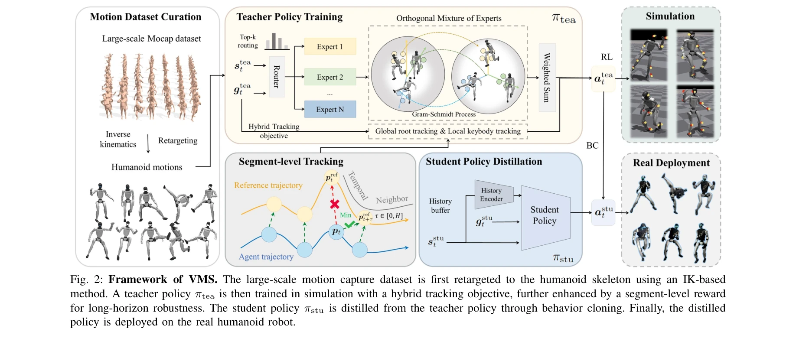
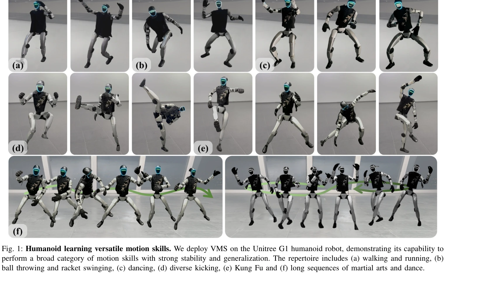

# KungfuBot2: Learning Versatile Motion Skills for Humanoid Whole-Body Control

> **저자**: Jinrui Han, Weiji Xie, Jiakun Zheng, Jiyuan Shi, Weinan Zhang, Ting Xiao, Chenjia Bai | **날짜**: 2025-09-20 | **DOI**: [10.48550/arXiv.2509.16638](https://doi.org/10.48550/arXiv.2509.16638)

---

## Essence

*Fig. 2: Framework of VMS. The large-scale motion capture dataset is first retargeted to the humanoid skeleton using an I*

VMS는 Orthogonal Mixture-of-Experts (OMoE) 아키텍처와 하이브리드 추적 목표를 결합하여 단일 정책으로 다양한 동작을 수행하는 휴머노이드 로봇 제어기를 제시한다. 장시간 시퀀스에서 안정적인 성능과 높은 동작 충실도를 달성한다.

## Motivation

- **Known**: 기존 연구에서는 개별 동작마다 별도의 정책을 학습하거나, 단일 MLP에 기반한 제한된 표현력의 정책으로 여러 동작을 학습했다. 로컬 추적과 글로벌 추적 사이의 트레이드오프 문제가 존재한다.
- **Gap**: 단일 정책으로 다양한 동작을 학습할 때 정책 표현력 부족과 로컬 동작 충실도 vs 글로벌 안정성 간의 충돌을 동시에 해결하는 방법이 부재했다. 특히 분 단위 길이의 장기 시퀀스에서 안정적인 추적이 어려웠다.
- **Why**: 범용 휴머노이드 로봇 구현을 위해서는 대규모 동작 레퍼토리를 하나의 제어기로 처리할 수 있어야 하며, 실시간 배포를 위해서는 안정성과 충실도를 동시에 만족해야 한다.
- **Approach**: OMoE 아키텍처로 스킬 표현을 분리하면서 동시에 하이브리드 추적 목표(글로벌 루트 + 로컬 키바디)를 도입했고, segment-level tracking reward로 장시간 로버스트성을 개선했다. Teacher-student 학습 패러다임을 통해 시뮬레이션에서 학습한 정책을 실로봇으로 배포했다.

## Achievement

*Fig. 1: Humanoid learning versatile motion skills. We deploy VMS on the Unitree G1 humanoid robot, demonstrating its cap*

- **OMoE 아키텍처**: 동작 표현의 분리로 정책 표현력을 증대시키고 스킬 간 간섭을 감소
- **하이브리드 추적 목표**: 글로벌 루트 추적과 로컬 키바디 추적을 결합하여 동작 충실도와 공간적 일관성을 동시 달성
- **Segment-level 보상**: 엄격한 단계별 매칭을 완화하여 전역 변위와 일시적 부정확성에 대한 로버스트성 개선
- **실증적 성능**: 시뮬레이션과 실로봇 모두에서 고충실도 동작 모방, 분 단위 길이의 장시간 시퀀스에서 안정적 성능, 미학습 동작으로의 강한 일반화 능력 입증

## How

*Fig. 2: Framework of VMS. The large-scale motion capture dataset is first retargeted to the humanoid skeleton using an I*

- AMASS 데이터셋에서 13,000개 이상의 모션을 역기구학(IK) 기반 retargeting으로 휴머노이드 스켈레톤에 변환
- Oracle 정책 학습을 통한 데이터 큐레이션으로 최종 9,770개의 고품질 모션(30.41시간) 확보
- PPO를 이용한 teacher policy 학습 (완전한 상태 정보 활용)
- Behavior cloning으로 student policy 학습 (배포 시 관찰 가능한 정보만 사용)
- 하이브리드 추적 목표: 글로벌 루트의 위치/회전과 키바디(머리, 손, 팔꿈치, 무릎, 발목)의 상대적 위치/방향 동시 추적
- Segment-level 보상 설계로 슬라이딩 윈도우 방식의 추적 오류 계산으로 장기 안정성 확보

## Originality

- OMoE 아키텍처의 직교성 제약으로 스킬 간 표현 공간 분리 - 기존 Mixture-of-Experts 확장
- 하이브리드 추적 목표와 segment-level 보상의 조합으로 로컬-글로벌 추적 딜레마 해결
- 대규모 동작 데이터셋(9,770개) 기반의 체계적인 데이터 큐레이션 프로세스
- 실로봇(Unitree G1) 배포를 통한 sim-to-real 검증 포함

## Limitation & Further Study

- 23 DoF 제어로 손목 3개 DoF 제외 - 손 조작 태스크 수행 불가
- 데이터 큐레이션 단계에서 oracle 정책 학습 필요로 초기 비용 소모
- OMoE의 직교성 제약이 전체 성능에 미치는 영향에 대한 상세 ablation study 부족
- 장기 시퀀스 학습에서 메모리 기반 구조 미도입 - 단기 마르코프 정책 사용
- 후속연구: 다양한 로봇 플랫폼으로의 일반화, 손 조작 포함 확장, 메모리 증강 정책 구조 탐색

## Evaluation

- Novelty: 4/5
- Technical Soundness: 3/5
- Significance: 4/5
- Clarity: 4/5
- Overall: 4/5

**총평**: VMS는 OMoE 아키텍처와 하이브리드 추적 목표의 조합으로 실용적 휴머노이드 제어의 주요 과제들을 효과적으로 해결하며, 대규모 데이터 기반의 체계적 방법론과 실로봇 검증을 통해 범용 휴머노이드 제어의 기초 플랫폼으로서 높은 가치를 보여준다.
