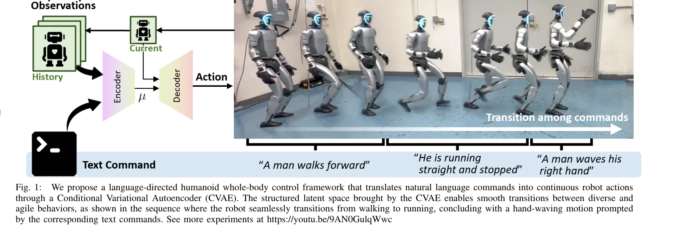

# LangWBC: Language-directed Humanoid Whole-Body Control via End-to-end Learning

> **저자**: Yiyang Shao, Xiaoyu Huang, Bike Zhang, Qiayuan Liao, Yuman Gao, Yufeng Chi, Zhongyu Li, Sophia Shao, Koushil Sreenath | **날짜**: 2025-04-30 | **URL**: [https://arxiv.org/abs/2504.21738](https://arxiv.org/abs/2504.21738)

---

## Essence

*Fig. 2.*

자연언어 명령을 humanoid robot의 전신 제어 동작으로 직접 변환하는 end-to-end 학습 프레임워크를 제시한다. Reinforcement learning으로 학습한 teacher policy와 CVAE 기반 student policy를 결합하여 언어-행동의 통합 latent space를 구성한다.

## Motivation

- **Known**: Hierarchical kinematics-based tracking 방식이 텍스트 조건 humanoid 제어에서 효과적이었으나, 생성된 동작의 물리적 부정확성(floating bodies, foot sliding)과 고정 지속시간의 한계가 존재한다.
- **Gap**: 기존의 hierarchical 접근법은 동작 생성과 물리적 실현가능성 사이의 근본적 충돌을 해결하지 못하며, end-to-end 생성 제어는 humanoid의 고차원 동적 제어에서 충분히 탐색되지 않았다.
- **Why**: Humanoid robot이 일상 환경에 통합되려면 기술적 지식이 없는 사용자도 자연언어로 직관적으로 상호작용할 수 있어야 하며, 이는 강건한 전신 제어의 필수 조건이다.
- **Approach**: 두 단계 학습 과정을 통해 먼저 reinforcement learning으로 MoCap 데이터를 추적하는 teacher policy를 학습하고, 이후 CVAE 기반 student policy를 behavior cloning으로 학습하여 언어 명령과 로봇 동작의 joint distribution을 unified latent space에서 구성한다.

## Achievement

*Fig. 1:*

- **End-to-end 언어-동작 매핑**: 자연언어 명령을 폐루프 제어 설정에서 직접 전신 로봇 동작으로 변환하여 현실 배포에 적합한 민첩하고 강건한 성능 달성
- **동작 다양성 및 부드러운 전환**: CVAE 구조를 통해 diverse motion 생성, smooth transitions, latent space interpolation을 통한 novel behavior 합성 가능
- **현실 로봇 검증**: 실제 humanoid robot에서 running, turning, waving, clapping 등 복잡한 전신 동작 실행, disturbance robustness 입증

## How

*Fig. 2.*

- **MoCap 데이터 전처리**: 기존 MoCap 데이터를 target robot geometry에 맞게 retarget하여 물리적 실현가능성 보장
- **Teacher Policy 학습**: Reinforcement learning을 통해 retargeted MoCap 데이터의 keypoint tracking을 학습, 다양한 동적 행동의 물리적 가능성 있는 저장소 구축
- **Student Policy 구조**: CVAE 기반 아키텍처로 CLIP encoder를 통한 텍스트 임베딩과 proprioceptive history를 입력받아 unified latent space 내에서 언어-행동의 joint distribution 학습
- **Behavior Cloning**: Teacher policy의 동작을 student policy가 모방하도록 학습, 폐루프 제어 능력 확보
- **Sim-to-real Transfer**: 물리 시뮬레이션에서 학습한 student policy를 실제 하드웨어에 직접 배포

## Originality

- **End-to-end 생성 제어의 확장**: 기존 diffusion-based policies (주로 manipulation/quadruped)와 달리 humanoid 전신 제어에서 완전히 기능하는 text-conditioned end-to-end generative controller 제시
- **Unified latent space 구성**: CVAE를 통해 언어와 저수준 제어 동작을 단일 latent space에서 명시적으로 결합, 이전의 hierarchical decoupling 방식과 구별됨
- **Flexible duration 지원**: 고정 지속시간 제한을 벗어나 동적 동작 길이 조절 가능, 연속 동작 전환 및 disturbance 적응 가능
- **Closed-loop 강건성**: 기존 open-loop 접근법(UH-1 등)과 달리 폐루프 제어로 현실 환경의 교란에 대응

## Limitation & Further Study

- **데이터셋 한계**: Retargeted MoCap 데이터의 다양성과 정확성이 전체 성능 천장으로 작용할 수 있으며, 학습 데이터에 없는 동작의 일반화 한계 존재
- **텍스트 다양성 평가 부족**: 언어 변동성에 대한 정량적 평가가 명시적으로 제시되지 않았으며, 보다 다양한 자연언어 변형에 대한 robust성 검증 필요
- **Sim-to-real gap 상세 분석 부재**: 물리 시뮬레이션과 실제 로봇 간의 차이에 대한 상세한 분석 및 극복 기법에 대한 설명이 제한적
- **다양한 로봇 플랫폼 검증 부족**: 특정 humanoid 로봇에 대한 검증으로 제한되어 있으며, 다양한 하드웨어 플랫폼에서의 일반화 가능성 불명확
- **후속 연구 방향**: (1) LLM과의 더 깊은 통합으로 고수준 태스크 계획 능력 확보, (2) Online learning을 통한 실시간 적응, (3) Multi-modal 입력 (이미지, 음성 등) 통합

## Evaluation

- Novelty: 4/5
- Technical Soundness: 3/5
- Significance: 4/5
- Clarity: 4/5
- Overall: 4/5

**총평**: 본 논문은 humanoid 전신 제어의 오랜 난제인 언어-행동 갭을 end-to-end learning으로 직접 해결하며, CVAE 기반의 unified latent space 구성으로 동작 다양성과 부드러운 전환을 동시에 달성한 점이 우수하다. 실제 로봇 검증과 강건성 입증을 통해 현실 적용 가능성을 보였으나, 데이터셋 의존성과 다양한 플랫폼 일반화에 대한 추가 검증이 필요하다.
