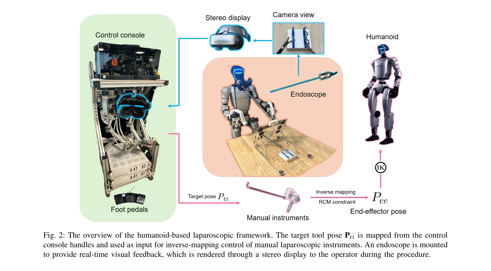
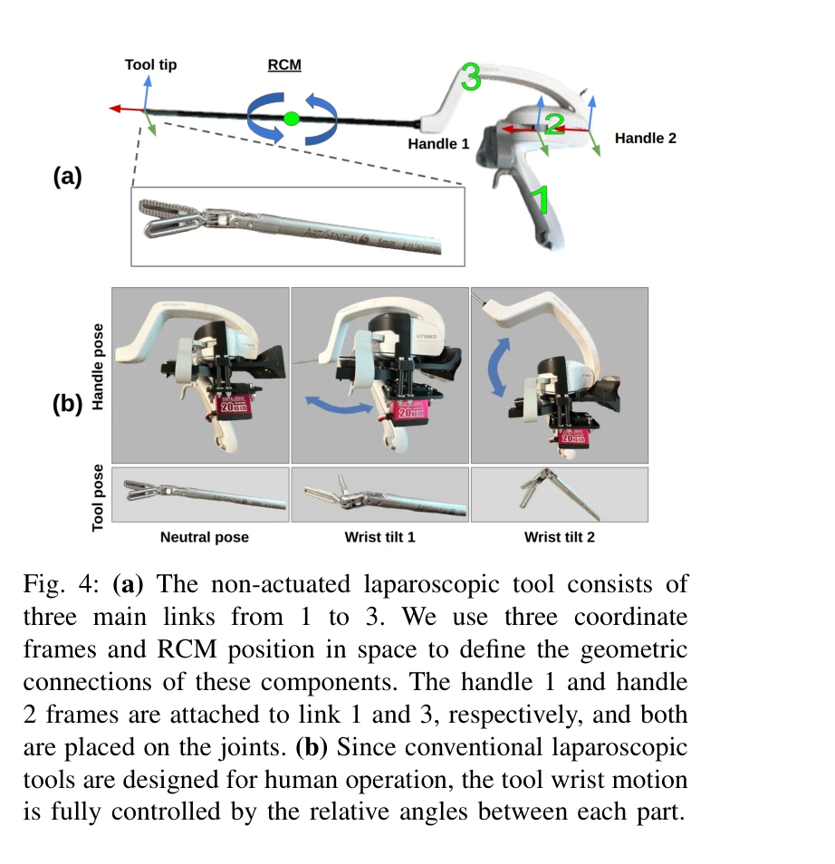

# LapSurgie: Humanoid Robots Performing Surgery via Teleoperated Handheld Laparoscopy

> **저자**: Zekai Liang, Xiao Liang, Soofiyan Atar, Sreyan Das, Zoe Chiu, Peihan Zhang, Calvin Joyce, Florian Richter, Shanglei Liu, Michael C. Yip | **날짜**: 2025-10-03 | **URL**: [https://arxiv.org/abs/2510.03529](https://arxiv.org/abs/2510.03529)

---

## Essence

*Fig. 2: The overview of the humanoid-based laparoscopic framework. The target tool pose Ptt is mapped from the control*

LapSurgie는 인문형 로봇이 원격 조종을 통해 상용 복강경 수술 도구를 직접 조작할 수 있게 하는 최초의 텔레오퍼레이션 프레임워크로, 원격 중심 운동(RCM) 제약을 만족하는 역매핑 전략과 스테레오 비전 피드백을 통합한다.

## Motivation

- **Known**: 로봇 복강경 수술은 정밀도와 효율성을 향상시켜 왔으나, da Vinci 같은 고비용 전문 시스템은 높은 진입장벽으로 인해 의료 자원이 부족한 지역에서 접근이 불가능하다. 인문형 로봇은 인간 설계 환경에 직접 통합될 수 있는 범용 플랫폼으로 주목받고 있다.
- **Gap**: 인문형 로봇이 복강경 수술에 적용된 사례가 없으며, 상용 수술 도구와의 호환성 및 직관적 제어 매핑이 미해결 문제로 남아 있다. 의료 자원이 부족한 지역에서의 실질적인 로봇 수술 시스템 배치 가능성이 탐구되지 않았다.
- **Why**: 복강경 수술의 접근성을 확대하고 의료 격차를 줄이며, 인문형 로봇의 다용성을 수술 영역으로 확장하여 기존 전문 로봇보다 저렴하고 유연한 배치를 가능하게 하는 것이 중요하다.
- **Approach**: G1 인문형 로봇이 상용 복강경 도구를 직접 파지하도록 커스텀 마운트를 개발하고, dVRK의 MTM(Master Tool Manipulator)을 제어 콘솔로 활용하여 역매핑 기반 텔레오퍼레이션을 구현하였다. RCM 제약을 적용하여 키홀 위치 유지와 도구 손목 제어를 동시에 달성한다.

## Achievement

*Fig. 3: A coupling mount for a non-robotic laparoscopic*

- **최초 인문형 로봇 기반 복강경 수술 프레임워크**: LapSurgie는 인문형 로봇이 실제 수술 도구를 조작하는 최초의 사례로, 전문 로봇 시스템과 달리 기존 병원 환경에 직접 통합 가능하다.
- **RCM 제약 기반 역매핑 제어 전략**: 수동 복강경 도구의 비직관적인 손목 자유도를 다루는 일반화된 역매핑 알고리즘을 개발하여 인간의 손-도구 운동 사이의 직관적 매핑을 실현했다.
- **다중 플랫폼 비교 사용자 연구**: 수동 복강경, dVRK, 인문형 로봇 세 조건에 걸친 포괄적 사용자 연구를 통해 인문형 로봇 기반 수술의 실행 가능성과 안전성을 입증했다.
- **기존 도구 호환성 및 확장성**: 상용 복강경 도구에 대한 수정 없이 작동하는 범용 마운트 설계로 다양한 복강경 도구 활용을 가능하게 한다.

## How

*Fig. 4: (a) The non-actuated laparoscopic tool consists of*

- 컨트롤 콘솔에 MTM 모듈 2개를 탑재하고 스테레오 비전(1920p 내시경 카메라 + GOOVIS G3 Max HMD) 피드백을 통합
- 복강경 도구의 3-링크 기구학을 정의하고 RCM 위치를 기준으로 핸들 좌표계와 RCM 제약을 수립
- MTM 입력으로부터 목표 도구 위치(Pt) 및 방향을 역매핑하는 알고리즘 개발 — 손가락 입력을 0-60° 도구 개구각으로 변환
- 원격 중심 운동 제약을 만족하면서 도구 손목 각도를 계산하는 기하학적 제어 법칙 적용
- G1 인문형 로봇의 양손에 동일한 마운트 설치하여 양손 도구 조작 지원
- 내시경 영상을 실시간으로 스트리밍하고 스테레오 디스플레이를 통해 원격 사용자에게 전달

## Originality

- 인문형 로봇을 실제 수술 시나리오에 처음 적용한 선도적 연구로, 기존의 텔레메토링이나 완전 원격 수술이 아닌 현장 배치 가능한 새로운 패러다임 제시
- 상용 비로봇 복강경 도구의 비직관적 손목 기구학을 해결하는 역매핑 기반 제어 전략은 기존 da Vinci 등 전문 수술 로봇이 아닌 범용 인문형 플랫폼 활용의 핵심 기술 혁신
- RCM 제약을 인문형 로봇의 일반적 운동학에 적용하여 정밀한 키홀 보전을 달성하는 방식은 기존 전문 로봇과 달리 범용 플랫폼에서의 새로운 문제 해결 방식
- 다중 플랫폼 비교 연구(수동 vs dVRK vs 인문형)를 통해 인문형 로봇의 수술 적용 가능성을 경험적으로 입증하는 첫 사례

## Limitation & Further Study

- 임상 수술이 아닌 실험실 환경에서의 사용자 연구만 수행되어 실제 병원 환경 및 임상 복잡도의 검증 부족
- G1 인문형 로봇의 손 안정성, 해상도, 응답 속도가 da Vinci 같은 전문 수술 로봇과 비교할 때 낮을 가능성이 있으나 상세 성능 비교 분석 미흡
- 네트워크 지연(latency) 환경에서의 성능, 안정성, 오류 복구 전략에 대한 평가 부재
- 텔레오퍼레이션 사용성 학습 곡선, 초보자 vs 숙련자 간 성능 차이에 대한 깊이 있는 분석 부족
- **후속 연구**: 실제 동물 모델 또는 시뮬레이터를 이용한 임상 수준의 복합 절차 평가; 네트워크 지연 및 고장 모드에 대한 견고성 검증; 다양한 인문형 플랫폼으로의 일반화 가능성 검토; 햅틱 피드백 통합을 통한 사용성 향상

## Evaluation

- Novelty: 4/5
- Technical Soundness: 3/5
- Significance: 4/5
- Clarity: 4/5
- Overall: 4/5

**총평**: LapSurgie는 인문형 로봇을 수술 영역에 처음 적용하고 RCM 제약 기반 역매핑 제어를 통해 상용 복강경 도구의 직관적 조작을 실현한 혁신적 연구로, 의료 자원 부족 지역에서의 로봇 수술 접근성 확대에 중요한 기여를 한다. 다만 임상 수준의 검증과 기술적 성숙도 향상이 필요하다.

## Related Papers

- 🏛 기반 연구: [[papers/1981_HMC_Learning_Heterogeneous_Meta-Control_for_Contact-Rich_Loc/review]] — LapSurgie의 원격 중심 운동 제약을 HMC의 heterogeneous meta-control이 접촉이 풍부한 환경에서 처리할 수 있는 이론적 기반을 제공한다.
- 🔄 다른 접근: [[papers/2124_Open-TeleVision_Teleoperation_with_Immersive_Active_Visual_F/review]] — LapSurgie는 의료용 특화 텔레오퍼레이션, Open-TeleVision은 범용 VR 기반으로 서로 다른 응용 분야와 인터페이스를 제공한다.
- 🔗 후속 연구: [[papers/1977_High-Speed_and_Impact_Resilient_Teleoperation_of_Humanoid_Ro/review]] — LapSurgie의 정밀 수술 텔레오퍼레이션을 High-Speed and Impact Resilient Teleoperation의 고속 충격 복원 기술과 결합하여 더 견고한 의료 로봇 시스템을 구현할 수 있다.
- 🔗 후속 연구: [[papers/1781_A_Rapid_Instrument_Exchange_System_for_Humanoid_Robots_in_Mi/review]] — 일반적인 복강경 수술 원격조작을 휴머노이드 로봇 플랫폼으로 확장하여 기구 교환 시스템을 통합한 연구입니다.
- 🔄 다른 접근: [[papers/2124_Open-TeleVision_Teleoperation_with_Immersive_Active_Visual_F/review]] — Open-TeleVision은 VR 기반 범용 시스템, LapSurgie는 의료 특화 텔레오퍼레이션으로 서로 다른 응용 분야와 특화 수준을 가진다.
