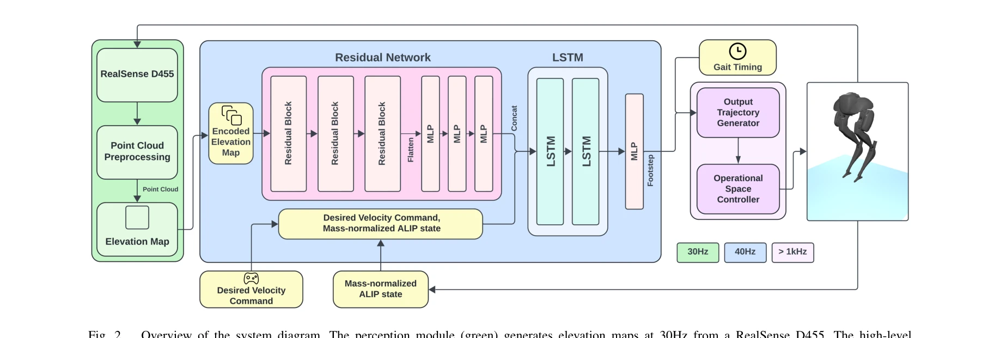

# Learning a Vision-Based Footstep Planner for Hierarchical Walking Control

> **저자**: Minku Kim, Brian Acosta, Pratik Chaudhari, Michael Posa | **날짜**: 2025-08-09 | **URL**: [https://arxiv.org/abs/2508.06779](https://arxiv.org/abs/2508.06779)

---

## Essence

*Fig. 2.*

본 논문은 단일 깊이 카메라와 reinforcement learning 기반의 계층적 제어 프레임워크를 통해 쌍족 로봇이 비정형 지형에서 실시간 발걸음 계획을 수행하도록 하는 시각 기반 발걸음 계획기를 제시한다. Angular Momentum Linear Inverted Pendulum 모델을 활용하여 저차원 상태 표현을 구성하고 상위 레벨의 RL 발걸음 계획기와 하위 레벨의 Operational Space Controller를 통합한다.

## Motivation

- **Known**: 쌍족 로봇의 보행 제어는 전통적으로 model-based optimal control과 reduced-order models (LIP, ALIP 등)을 활용해 왔으며, 최근 deep reinforcement learning이 시각 기반 보행 제어에서 우수한 성능을 보이고 있다. 계층적 제어 구조는 해석가능성과 샘플 효율을 향상시킬 수 있다.
- **Gap**: 기존 시각 기반 보행 제어 프레임워크는 수동으로 설계된 시각 파이프라인에 의존하거나 순수 proprioception만 사용하여 실제 환경에서 취약하며, 비정형 지형에서의 실시간 발걸음 계획에 어려움이 있다. 또한 시뮬레이션에서 실제 하드웨어로의 전이 시 robustness 검증이 부족하다.
- **Why**: 쌍족 로봇의 탐색 및 구조 요청 등 실제 응용 분야에서 비정형 지형 네비게이션이 필수적이며, RL 기반 계층적 제어와 vision의 통합은 강건성과 일반화 성능을 동시에 달성할 수 있는 유망한 접근이다.
- **Approach**: 본 논문은 Intel RealSense D455로부터 elevation map을 생성하고, 이를 ALIP 상태와 함께 RL 정책의 입력으로 사용하여 3D 발걸음 명령을 생성한다. 생성된 발걸음으로부터 spline 궤적을 구성하고 저수준 OSC가 이를 추적하도록 하는 계층적 구조를 채택한다.

## Achievement

*Fig. 1.*

- **Vision-based hierarchical controller**: 단일 깊이 카메라와 ALIP reduced-order model을 활용하여 효율적이고 해석 가능한 3D 발걸음 계획을 RL을 통해 실현
- **Hardware validation**: Cassie 로봇으로 정형 및 비정형 지형에서 전체 파이프라인을 검증하고 Model Predictive Control 베이스라인과 비교
- **Sim-to-real 분석**: ALIP 모델을 정책 입력으로 사용할 때의 한계와 복잡한 지형에서의 성능 저하, 그리고 전이 과정에서의 영향을 체계적으로 분석

## How

*Fig. 2.*

- Intel RealSense D455 깊이 카메라로부터 point cloud를 획득하고 elevation mapping framework으로 로봇 중심 elevation map 생성 (30Hz 업데이트)
- 로봇의 다리를 마스킹하여 전처리한 point cloud를 elevation map에 입력하고 nearest-value interpolation과 median filter로 처리
- 64×64 격자 elevation map을 XY 발걸음 위치 격자와 함께 concatenate하여 RL 정책에 입력
- Contact-aided invariant EKF로 로봇 상태 추정 및 ALIP 상태 계산
- Mass-normalized ALIP 모델 ẋ = Ax + Bu를 이용한 주기적 궤적 생성으로 원하는 발걸음 위치(u_dx, u_dy) 계산
- RL 정책이 elevation map과 ALIP 상태로부터 3D 발걸음 명령 생성 (40Hz)
- 생성된 발걸음으로부터 spline 궤적 구성 후 저수준 Operational Space Controller가 추적
- Domain randomization을 통한 sim-to-real 전이

## Originality

- **ALIP 기반 RL 정책**: ALIP reduced-order model을 직접 RL 정책의 상태 입력으로 통합하여 저차원 표현과 동적 특성을 동시에 활용
- **계층적 vision-learning-control 통합**: 깊이 카메라 기반 elevation mapping을 ALIP와 결합한 RL 정책, 그리고 OSC 추적기를 하나의 통합 프레임워크로 구성
- **정형-비정형 지형 실제 검증**: 단순 시뮬레이션이 아닌 실제 Cassie 로봇에서 구조화된 환경과 비정형 지형 모두에서 성능을 입증
- **Sim-to-real 한계 분석**: ALIP 모델의 표현력 한계와 복잡한 지형에서의 성능 저하를 명시적으로 분석하여 향후 연구 방향 제시

## Limitation & Further Study

- **ALIP 모델의 제한**: ALIP는 비정형 지형에서 2D 선형 모델 가정이 깨져 성능이 저하되며, 더 복잡한 동적 특성을 캡처할 수 없음
- **Sim-to-real gap**: Domain randomization에도 불구하고 시뮬레이션과 실제 환경의 차이로 인한 전이 문제 존재
- **카메라 시야 제한**: 좁은 시야각의 깊이 카메라로 인해 원거리 지형 정보 획득 불가능하여 먼 거리 계획 어려움
- **실시간 성능**: 40Hz 발걸음 계획 빈도가 높은 동적 성능 요구 환경에서 충분한지 검증 부족
- **후속 연구**: 더 복잡한 reduced-order model 또는 hybrid 접근법 탐색, 다중 카메라 기반 시야 확대, 더 나은 domain randomization 전략 개발, 실제 환경에서의 일반화 성능 강화

## Evaluation

- Novelty: 4/5
- Technical Soundness: 3/5
- Significance: 4/5
- Clarity: 4/5
- Overall: 4/5

**총평**: 본 논문은 RL 기반 발걸음 계획을 ALIP 모델과 깊이 카메라 vision으로 통합한 실질적인 계층적 제어 프레임워크를 제시하며, 실제 로봇 하드웨어에서의 검증을 통해 실용성을 입증한다. 다만 ALIP 모델의 표현력 한계와 복잡한 지형에서의 성능 저하가 명확하게 드러나 향후 더 정교한 모델이나 end-to-end 학습 접근의 필요성을 시사한다.
