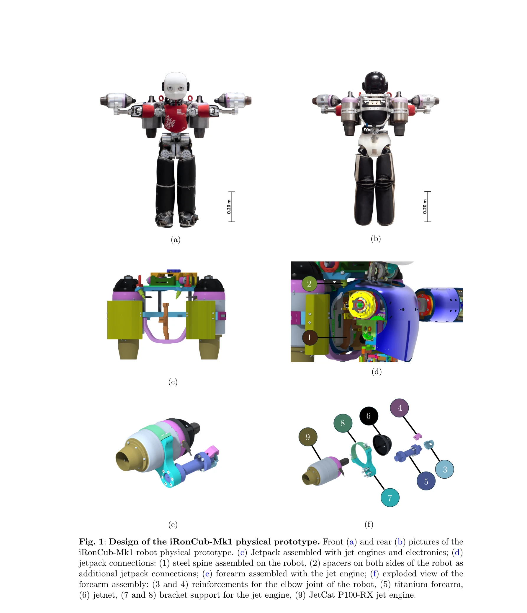
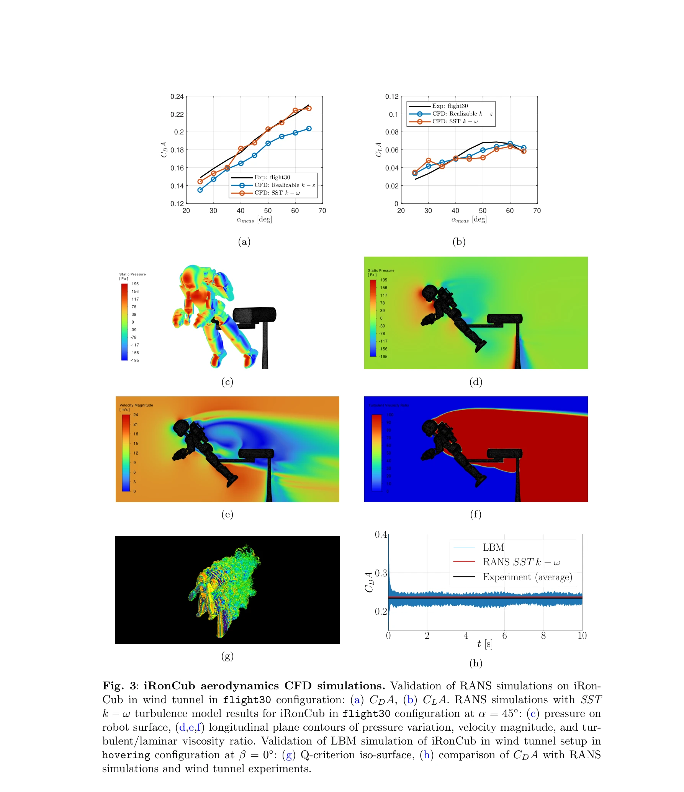

# Learning Aerodynamics for the Control of Flying Humanoid Robots

> **저자**: Antonello Paolino, Gabriele Nava, Fabio Di Natale, Fabio Bergonti, Punith Reddy Vanteddu, Donato Grassi, Luca Riccobene, Alex Zanotti, Renato Tognaccini, Gianluca Iaccarino, Daniele Pucci | **날짜**: 2025-05-30 | **URL**: [https://arxiv.org/abs/2506.00305](https://arxiv.org/abs/2506.00305)

---

## Essence

*Fig. 1: Design of the iRonCub-Mk1 physical prototype. Front (a) and rear (b) pictures of the*

비행 인간형 로봇의 공기역학 모델링을 위해 CFD 시뮬레이션, 풍동 실험, 딥러닝을 결합한 포괄적 접근 방식을 제시하고, 제트 엔진을 장착한 iRonCub-Mk1 로봇을 설계·제작하여 비행 제어를 구현한다.

## Motivation

- **Known**: 다중 이동 모드 로봇과 VTOL 시스템에 대한 연구가 진행 중이며, 저속 조건에서는 공기역학 영향을 무시할 수 있지만 고속 비행 시에는 공기역학 모델링이 필수적이다.
- **Gap**: 인간형 로봇과 같은 복잡한 비공기역학 형태의 물체에 대한 공기역학 모델링 및 제어 방법론이 부족하며, 특히 링크 간 비선형 간섭 효과를 포함한 통합적 접근이 제한적이다.
- **Why**: 인간형 로봇에 비행 능력을 부여하면 고유의 조작 능력과 비행 이동성을 결합하여 다목적 로봇의 작업 다양성과 환경 적응성을 크게 향상시킬 수 있다.
- **Approach**: RANS 기반 CFD 시뮬레이션으로 공기역학 힘을 계산하고 풍동 실험으로 검증한 후, 자동화된 CFD 프레임워크를 통해 데이터셋을 확대하여 Deep Neural Network과 선형 회귀 모델을 학습한다.

## Achievement

*Fig. 4: Aerodynamic models for simulation and control. Deep Neural Network (DNN): (a)*

- **iRonCub-Mk1 설계 및 제작**: 제트 엔진 통합에 최적화된 40 kg급 인간형 로봇의 기계 설계 및 풍동 실험을 위한 하드웨어 수정을 완료
- **CFD 검증 및 데이터셋 확장**: Politecnico di Milano 풍동에서 수집한 실험 데이터로 RANS 시뮬레이션 검증 및 자동화 CFD 프레임워크를 통해 포괄적 공기역학 데이터셋 구축
- **학습 기반 공기역학 모델**: Deep Neural Network과 선형 회귀 모델을 훈련하여 CFD보다 빠른 공기역학 력 예측 가능
- **공기역학 인식 제어 설계**: 학습된 모델을 시뮬레이터에 통합하여 비행 시뮬레이션 및 물리 로봇 프로토타입의 균형 실험으로 제어 검증

## How

*Fig. 3: iRonCub aerodynamics CFD simulations. Validation of RANS simulations on iRon-*

- RANS k-ω SST 및 Realizable k-ε 난류 모델을 활용한 3차원 CFD 시뮬레이션
- Politecnico di Milano의 대규모 풍동(GVPM)에서 다양한 자세 및 속도 조건에서 공기역학 력 및 표면 압력 측정
- 자동화된 CFD 프레임워크를 통해 로봇의 다양한 포즈에 대한 대규모 공기역학 데이터셋 생성
- 수집된 데이터로 Deep Neural Network(다층 신경망) 및 선형 회귀 모델 학습
- iDynTree 기반 시뮬레이터에 학습된 공기역학 모델 통합
- 시뮬레이션 및 실제 로봇 프로토타입에서 비행 시뮬레이션, 균형 실험, 제어 검증 수행

## Originality

- 비행 인간형 로봇의 공기역학을 종합적으로 다루는 첫 시도로, CFD, 풍동 실험, 머신러닝을 통합한 체계적 접근
- 제트 엔진 기반의 고추력-무게비 비행 플랫폼으로 기존의 저추력 프로펠러 기반 멀티로봇과 차별화
- 비공기역학 형태의 복잡한 링크 구조에서 링크 간 간섭 효과를 포함한 공기역학 모델링
- 풍동 실험을 통한 실시간 분산 압력 데이터 획득 및 검증 방법론 제시

## Limitation & Further Study

- CFD 시뮬레이션 계산 비용으로 인해 RANS 기반 모델 사용으로 LES 대비 정확도 제한 (실제 비선형 난류 효과 부분 손실)
- 학습 모델의 일반화 능력: 훈련 데이터 범위(자세, 속도, 풍향) 외의 조건에서 예측 성능 미검증
- 실제 비행 실험 부재: 시뮬레이션 및 정적 균형 실험만 수행되어 동적 비행 조건에서의 제어 성능 미확인
- 센서 측정 오차 및 풍동 설정의 물리적 제약(Reynolds 수 재현성 등)에 대한 상세 논의 부족
- 후속 연구: 실제 비행 시험으로 제어 성능 검증, 다양한 환경 조건(외부 바람, 난기류 등)에서의 강건성 평가, 학습 모델의 전이 학습(transfer learning) 활용으로 일반화 성능 향상

## Evaluation

- Novelty: 4/5
- Technical Soundness: 3/5
- Significance: 4/5
- Clarity: 4/5
- Overall: 4/5

**총평**: 인간형 로봇의 비행 능력 확보를 위해 공기역학 모델링과 제어를 종합적으로 다룬 기술적·과학적으로 의미 있는 연구이며, 다중 모드 로봇의 미래 설계에 중요한 기여를 제시한다. 다만 실제 비행 실험 검증과 학습 모델의 일반화 성능 평가가 후속 과제이다.

## Related Papers

- 🧪 응용 사례: [[papers/2028_iRonCub_3_The_Jet-Powered_Flying_Humanoid_Robot/review]] — 공기역학 학습 방법론이 iRonCub-Mk1의 제트 엔진 비행 제어에 직접 적용된다.
- 🔄 다른 접근: [[papers/2072_Learning_to_Walk_and_Fly_with_Adversarial_Motion_Priors/review]] — 비행 제어를 위해 공기역학 학습과 적대적 모션 프라이어로 접근법이 다르다.
- 🧪 응용 사례: [[papers/1897_Ego-Vision_World_Model_for_Humanoid_Contact_Planning/review]] — Learning Aerodynamics의 공기역학 모델이 Ego-Vision World Model의 휴머노이드 접촉 계획에서 공중 단계 예측 정확도를 향상시킬 수 있다.
- 🔄 다른 접근: [[papers/1832_CAD-Driven_Co-Design_for_Flight-Ready_Jet-Powered_Humanoids/review]] — Learning Aerodynamics는 실험적 접근, CAD-Driven Co-Design은 설계 최적화 접근으로 비행 휴머노이드 개발에 서로 다른 방법론을 사용한다.
- 🔄 다른 접근: [[papers/2019_iCub3_Avatar_System_Enabling_Remote_Fully-Immersive_Embodime/review]] — 둘 다 비행 휴머노이드이지만 Learning Aerodynamics는 공기역학 학습, iCub3 Avatar는 원격 몰입형 구현 중심
- 🔄 다른 접근: [[papers/1832_CAD-Driven_Co-Design_for_Flight-Ready_Jet-Powered_Humanoids/review]] — 제트 추진 휴머노이드를 위해 CAD 기반 형태 최적화와 공기역학 제어 학습이라는 서로 다른 설계 접근법을 제시한다
- 🔗 후속 연구: [[papers/2028_iRonCub_3_The_Jet-Powered_Flying_Humanoid_Robot/review]] — iRonCub 3의 제트 추진 비행이 공기역학 학습과 결합되어 더 정교한 비행 제어를 실현할 수 있다.
- 🔄 다른 접근: [[papers/2072_Learning_to_Walk_and_Fly_with_Adversarial_Motion_Priors/review]] — 비행 휴머노이드 로봇을 위한 공기역학 학습이라는 다른 접근법으로 항공 제어를 다룬다.
